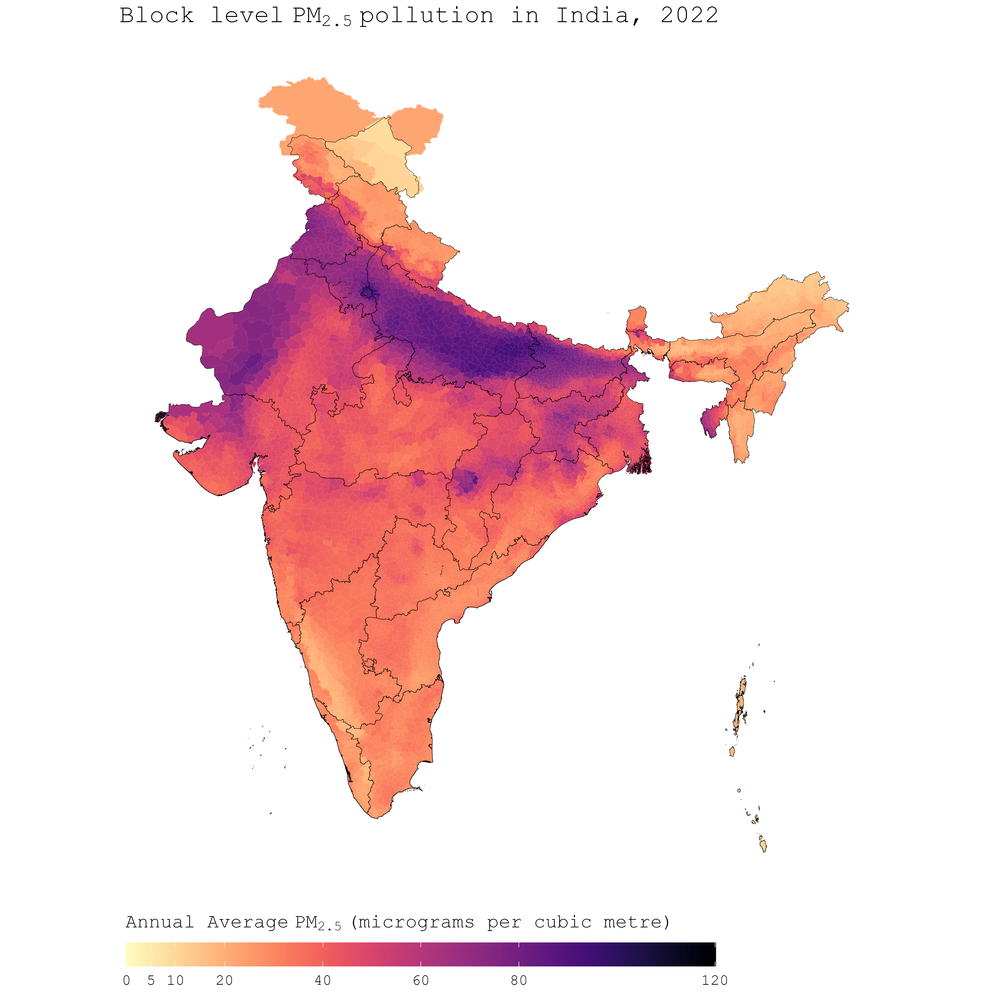

<!-- README.md is generated from README.Rmd. Please edit that file -->

```{r, include = FALSE}
knitr::opts_chunk$set(
  collapse = TRUE,
  comment = "#>",
  fig.path = "man/figures/README-",
  out.width = "100%"
)
```

<!-- badges: start -->
<!-- badges: end -->

# AQ Satellite Data Processing Pipeline

This repository contains a pipeline for processing satellite data to analyze air pollution levels in India. The pipeline reads pollution and population raster data, processes it, and outputs summarized India block level (for all 5969 blocks) pollution data weighted by population. The annual average pollution data extends from 1998 to 2022. As an example plot from the dataset, below I have plotted annual average PM2.5 in 2022 at block level (block boundaries are very light so as to make it easier to see the colors).




## Table of Contents

1. [Introduction](#introduction)
2. [Processed Data and Shapefiles](#processed-data-and-shapefiles)
3. [Data Dictionary](#data-dictionary)
4. [Data Sources and description](#data-sources-and-description)
5. [Why use SHRUG shapefiles for India?](#why-use-shrug-shapefiles-for-india?)
6. [Prerequisites for running the pipeline](#prerequisites-for-running-the-pipeline)
7. [Pipeline Overview](#pipeline-overview)
    - [Load and Crop Pollution Data](#load-and-crop-pollution-data)
    - [Load and Process Population Data](#load-and-process-population-data)
    - [Match Resolutions](#match-resolutions)
    - [Rasterize Shapefile and Create Raster Brick](#rasterize-shapefile-and-create-raster-brick)
    - [Create Data Frame and Collapse](#create-data-frame-and-collapse)
    - [Handling Unprocessed IDs](#handling-unprocessed-ids)
    - [Output](#output)
    - [Important notes and current limitations](#important-notes-and-current-limitations)
8. [License and Reuse](#license-and-reuse)
9. [Citations](#citations)    

## Introduction

The administrative region structure of India is a multi-tiered system comprising states, districts, and subdistricts, each delineated by distinct geographical boundaries. At the subdistrict level, commonly referred to as blocks, administrative units are smaller in scale, allowing for more localized governance and decision-making. This granular structure serves as the foundation for various governmental and developmental initiatives, facilitating targeted interventions and resource allocation tailored to the specific needs of communities within each block. By operating at the block level, datasets can capture nuanced variations in demographic, environmental, and socioeconomic factors, enabling comprehensive analyses and informed policy decisions at a finer spatial resolution.


## Processed Data and Shapefiles
The processed dataset resulting from this pipeline can be downloaded from [this link](https://drive.google.com/file/d/1DOoz2ULDX1paIZsFu3vLJKgpG-FejYoJ/view?usp=sharing). It can also be found under `data/processed/1.ind.block.pm2.5.sat.data.processing`. The SHRUG shapefiles used in the process and code, can be downloaded either directly from the [SHRUG website](https://www.devdatalab.org/shrug_download/). To use the exact version, used in code and files in this repo, download shapefiles from [here](https://drive.google.com/drive/folders/1g3mrYWvVtIZ4Vdd5Vo51WFNb1AqiaPrb?usp=sharing). The latter contains a modified versions with additional columns that are needed if the processing pipeline is used. In both cases, please make sure to properly cite the datasets used (see citations sections below for more info on this).


If you are interested in reading more about the pipeline, continue reading the sections below. Otherwise, you can directly start analyzing the data. Do check out the data dictionary section before starting analysis.

## Data Dictionary
Below listed is a data dictionary for the processed block level dataset:

```{r data-dictionary, echo=FALSE, message=FALSE}
# Load necessary libraries
library(knitr)
library(kableExtra)

# Define the column names and their descriptions
col_names <- c("pc11_state_id", "pc11_district_id", "pc11_subdistrict_id",
               "state_name", "district_name", "subdistrict_name",
               "subdistrict_population", "avg_pm2.5_1998", "avg_pm2.5_1999",
               "avg_pm2.5_2000", "avg_pm2.5_2001", "avg_pm2.5_2002",
               "avg_pm2.5_2003", "avg_pm2.5_2004", "avg_pm2.5_2005",
               "avg_pm2.5_2006", "avg_pm2.5_2007", "avg_pm2.5_2008",
               "avg_pm2.5_2009", "avg_pm2.5_2010", "avg_pm2.5_2011",
               "avg_pm2.5_2012", "avg_pm2.5_2013", "avg_pm2.5_2014",
               "avg_pm2.5_2015", "avg_pm2.5_2016", "avg_pm2.5_2017",
               "avg_pm2.5_2018", "avg_pm2.5_2019", "avg_pm2.5_2020",
               "avg_pm2.5_2021", "avg_pm2.5_2022")

descriptions <- c("shrug state id", "shrug district id", "shrug subdistrict id",
                  "shrug name of the state", "shrug name of the district", "shrug name of the subdistrict",
                  "population of the subdistrict", "annual average pm2.5 in 1998 (micrograms per cubic meter)",
                  "annual average pm2.5 in 1999 (micrograms per cubic meter)",
                  "annual average pm2.5 in 2000 (micrograms per cubic meter)",
                  "annual average pm2.5 in 2001 (micrograms per cubic meter)",
                  "annual average pm2.5 in 2002 (micrograms per cubic meter)",
                  "annual average pm2.5 in 2003 (micrograms per cubic meter)",
                  "annual average pm2.5 in 2004 (micrograms per cubic meter)",
                  "annual average pm2.5 in 2005 (micrograms per cubic meter)",
                  "annual average pm2.5 in 2006 (micrograms per cubic meter)",
                  "annual average pm2.5 in 2007 (micrograms per cubic meter)",
                  "annual average pm2.5 in 2008 (micrograms per cubic meter)",
                  "annual average pm2.5 in 2009 (micrograms per cubic meter)",
                  "annual average pm2.5 in 2010 (micrograms per cubic meter)",
                  "annual average pm2.5 in 2011 (micrograms per cubic meter)",
                  "annual average pm2.5 in 2012 (micrograms per cubic meter)",
                  "annual average pm2.5 in 2013 (micrograms per cubic meter)",
                  "annual average pm2.5 in 2014 (micrograms per cubic meter)",
                  "annual average pm2.5 in 2015 (micrograms per cubic meter)",
                  "annual average pm2.5 in 2016 (micrograms per cubic meter)",
                  "annual average pm2.5 in 2017 (micrograms per cubic meter)",
                  "annual average pm2.5 in 2018 (micrograms per cubic meter)",
                  "annual average pm2.5 in 2019 (micrograms per cubic meter)",
                  "annual average pm2.5 in 2020 (micrograms per cubic meter)",
                  "annual average pm2.5 in 2021 (micrograms per cubic meter)",
                  "annual average pm2.5 in 2022 (micrograms per cubic meter)")


# Create a data frame
data_dict <- data.frame(Column_Name = col_names, Description = descriptions)

# Output markdown table
kable(data_dict, format = "markdown")
```


## Data Sources and description

This project utilizes the following public data sources:

1. **SHRUG Platform Developed by Data Development Lab**: This dataset provides block (subdistrict) level shapefiles essential for detailed geographic analysis. We

2. **Atmospheric Composition Analysis Group (V6.GL.02 Version)**: This dataset includes global fine particulate matter (PM2.5) concentration estimates at a 0.01 x 0.01 degree resolution from the latest satellite derived data by the ACAG group. Note that: this data also includes particulate pollution resulting from mineral dust and seasalt, which may or may not be coming from anthropogenic sources.

3. **LandScan Population Data**: This dataset offers high-resolution global population data, critical for population-weighted analysis of pollution metrics.

Please refer to the citation section for instructions on proper citing of these data sources.

## Why use SHRUG shapefiles for India?

Prior to the SHRUG, linking different Indian datasets was a hassle. The common geographic frame of SHRUG now makes it easy to share information and link data. Researchers can immediately tap into SHRUG to mine a wealth of previously unavailable socioeconomic data for the geographies that they are working on, and can then publish their own data back to SHRUG, making it available to researchers working on other topics. Read more on [SHRUG website](https://www.devdatalab.org/shrug).

## Prerequisites for running the pipeline

To run this pipeline, I recommend using latest R version and the following main R libraries will be needed for the pipeline:

- `raster`
- `dplyr`
- `purrr`
- `fasterize`
- `arrow`
- `data.table`
- `foster`
- `rgdal`
- `sf`
- `tidyverse`

## Pipeline Overview

### Load and Crop Pollution Data

The pipeline starts by loading pollution data files and cropping them to the boundaries of India using a reference shapefile. Each pollution raster file is processed for a specific year and the pipeline loops through all years from 1998 to 2022.

1. **Load Pollution Data**: The pollution raster files are loaded from a specified directory.
2. **Extract Year**: The year is extracted from the file names.
3. **Crop Raster**: Each pollution raster is cropped to the boundary of India using a reference shapefile.
4. **Mask Raster**: The cropped pollution raster is then masked using the same shapefile to ensure it aligns with the region of interest.

### Load and Process Population Data

The population data is processed in a similar manner:

1. **Load Population Raster**: The population raster file is loaded.
2. **Crop and Mask Raster**: The population raster is cropped and masked using the reference shapefile.


### Match Resolutions

The resolutions of the pollution and population rasters are matched to ensure they can be processed together seamlessly.


### Rasterize Shapefile and Create Raster Brick

1. **Rasterize Shapefile**: A reference shapefile is rasterized to the same resolution as the pollution and population rasters.
2. **Create Raster Brick**: A raster brick is created by combining the pollution, population, and rasterized shapefile layers.


### Create Data Frame and Collapse

1. **Convert to Data Frame**: The raster brick is converted into a data frame.
2. **Filter Data**: The data frame is filtered to remove any rows with missing values in the pollution or population columns.
3. **Arrow Table**: The data frame is converted into an Arrow table for efficient processing.
4. **Collapse Data**: The Arrow table is grouped by the shapefile IDs, and population-weighted pollution levels are calculated.

### Handling Unprocessed IDs

Some IDs may not be processed in the initial round due to various reasons such as zero population or missing data. The pipeline handles these unprocessed IDs by:

1. **Identifying Unprocessed IDs**: IDs not captured in the first round are identified.
2. **Resampling and Reprocessing**: The unprocessed IDs are resampled at a finer resolution and processed again to capture the data accurately.


### Output

The final output is a summarized data frame containing population-weighted pollution levels for each region. The data includes:

- Total population for each region
- Average PM2.5 pollution level weighted by population for each region and year

### Important notes and current limitations

- We use SHRUG boundaries to enhance the geographic interoperability of our datasets. However, it's important to note that boundaries may change over time. If you prefer using more updated boundaries, the pipeline can be adapted accordingly.

- Satellite-derived pollution data serves as a supplementary tool to ground-level monitors. While it may not always match the numbers from ground-level monitors, it helps fill gaps in areas where ground monitoring coverage is limited. Always corroborate with other ground-level monitoring datasets for accuracy.

- Similarly, satellite-derived population data has its limitations. It's crucial to understand that this data is derived from satellite imagery and may not reflect the exact population figures. 

- When capturing extremely tiny regions, smaller than the resolution of the satellite data (1km x 1km in our case), satellite-derived data comes with higher uncertainty. In such cases, it's advisable to treat the estimates as broad reference points rather than precise figures.

- If in your version of R, certain packages are not compatible, ,many alternatives exist for doing similar tasks (e.g. rasterizing, resampling, etc).


### License and Reuse

The block level pollution dataset processed by me is licensed under the Creative Commons Attribution 4.0 International (CC BY 4.0) license. This means you are welcome to reuse the data in your reports or news stories as long as you abide the terms of the license, which means you have to give credit and link back to the original work.

For more details, see the LICENSE file.

If you use this dataset in your work, please cite this repository as follows:

[Aarsh Batra, 2024, biteSizedAQ, https://github.com/AarshBatra/biteSizedAQ]

### Citations

When using this data/pipeline, please also cite the following data sources, without which the producing the above block level pollution data would not be possible:

1. [SHRUG platform](https://www.devdatalab.org/shrug_download/) developed by Data Development Lab. The block (subdist) level shapefile comes from SHRUG.
   - Asher, Sam, Tobias Lunt, Ryu Matsuura, and Paul Novosad. "Development research at high geographic resolution: an analysis of night-lights, firms, and poverty in India using the SHRUG open data platform." The World Bank Economic Review 35, no. 4 (2021). Oxford University Press.

2. Atmospheric Composition Analysis Group (V6.GL.02 version) 0.01 x 0.01 [data](https://sites.wustl.edu/acag/datasets/surface-pm2-5/#V6.GL.02):
   - Shen, S., Li, C., van Donkelaar, A., Jacobs, N., Wang, C., Martin, R. V. "Enhancing Global Estimation of Fine Particulate Matter Concentrations by Including Geophysical a Priori Information in Deep Learning." (2024) ACS ES&T Air. DOI: 10.1021/acsestair.3c00054

3. [LandScan population data](https://landscan.ornl.gov/):
   - Sims, K., Reith, A., Bright, E., Kaufman, J., Pyle, J., Epting, J., Gonzales, J., Adams, D., Powell, E., Urban, M., & Rose, A. (2023). LandScan Global 2022 [Data set]. Oak Ridge National Laboratory. https://doi.org/10.48690/1529167
   
### Contact
If you find any errors in the data or processing code, please report them to `aarshbatra.in@gmail.com`. 

