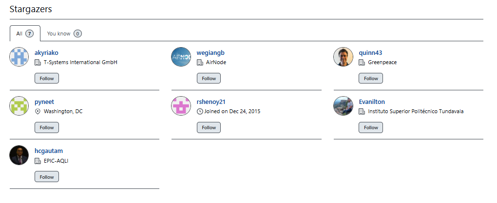

# biteSizedVisuals Series: Tackling Air Pollution One Plot at a Time!

Welcome to the biteSizedVisuals Series: Tackling Air Pollution One Plot
at a Time!

In this series, I’ll break down air quality and pollution data into
easily digestible compelling visualizations. Each post will highlight a
key aspect of air pollution, using simple yet powerful plots to uncover
insights and trends. Whether you’re a data enthusiast, policy maker, or
environmental advocate, these bite-sized visuals will help you grasp
important air quality issues without the complexity.

Moreover, you are free to share this on social media, as all content
under biteSizedAQ is provided under Creative Commons Attribution 4.0
International (CC BY 4.0) license. If you do, the only request is to
please link back to the original post.

Let’s dive into the data—one plot at a time!

## biteSizedVisual \#3: Air Quality Data Deficit: 45% of Nations Either Don’t Monitor or Monitor but Don’t Share Any Data

------------------------------------------------------------------------

## **The Global Air Quality Crisis: Why Fully Open and Transparent Data is the First Step Toward Clean Air**

Air pollution is one of the world’s deadliest threats, responsible for
over seven million premature deaths annually. Despite its critical
importance, the availability of air quality data—the very foundation for
combating air pollution—is alarmingly limited. According to the [OpenAQ
Open Air Quality Data Global Landscape 2024
report](https://documents.openaq.org/reports/Open+Air+Quality+Data-The+Global+Landscape+2024.pdf),
**45% of nations either do not monitor air quality or monitor but do not
share any data, 28% share data only partially. This means nearly**
**three quarters of the world’s population lack access to vital
information about the air they breathe**.

## The Data Deficit: A Global View

The map starkly illustrates the air quality data-sharing landscape
across 198 countries. The findings are alarming:

- **36% of countries do not monitor air quality at all.**

- **9% monitor but do not share their data.**

- **28% share data partially.**

- Only **27% of countries share air quality data fully openly,
  transparently and in a maximally useful way.**

As the map shows, the global south faces the most significant data gaps.
Many countries in Africa, South Asia, and parts of Latin America either
lack monitoring systems or share data in a very limited capacity.
Without access to air quality information, communities in these regions
cannot effectively advocate for cleaner air, leaving them vulnerable to
the silent killer of air pollution.

## What Does “Fully Open Air Quality Data” Mean?

The OpenAQ report sets a clear standard for what constitutes fully open
air quality data. To qualify, data must:

1.  **Be shared in physical units**: Data should be provided in
    measurable units like micrograms per cubic meter (μg/m³) rather than
    generalized indices.

2.  **Include station-specific coordinates**: Data must be linked to
    precise geographic locations, ideally to five decimal places.

3.  **Be timely and granular**: Data should be updated daily or
    sub-daily, ideally in near-real-time.

4.  **Offer programmatic access**: Data should be machine-readable and
    accessible via APIs or standardized formats like JSON or CSV files.

Countries that meet all of these criteria enable scientists,
policymakers, and citizens to take fast actionable steps to improve air
quality. However, as the data reveals, only 27% of nations currently
achieve this level of transparency.

## The Global South: A Call to Action

The disparity between the global north and south in air quality data
sharing is striking. While countries in the global north, such as those
in Europe and North America, have made significant strides, the global
south lags far behind. **In many parts of the global south, the fight
against air pollution cannot even begin because there is no data to
identify the problem.**

For example:

- In sub-Saharan Africa, the majority of countries do not monitor air
  quality at all.

- In South Asia, while some nations monitor air quality, the data is
  often incomplete or inaccessible.

Data is the oxygen of air pollution advocacy. Without it, governments
cannot craft effective policies, and communities cannot hold polluters
accountable.

## Recommendations: Bridging the Data Gap

To address these urgent gaps, the OpenAQ report makes the following
recommendations:

1.  **All governments must measure and track air quality.**

    - Acknowledging the constraints on resources, a government embarking
      on air quality monitoring should prioritize the installation of a
      reference-grade PM2.5 monitor, as outlined in Our Common Air’s
      2024 report, “[*Accelerating Country-led Air Quality Reporting to
      Achieve Clean
      Air*](https://ourcommonair.org/accelerating-country-led-air-quality-reporting-to-achieve-clean-air/1668/).

2.  **Governments must share air quality data fully and transparently.**

    - This includes sharing in physical units, with station-specific
      coordinates, timely updates, and programmatic access.

3.  **Funders must prioritize the global south.**

    - Philanthropies and development banks should invest in building
      monitoring systems and data-sharing platforms in less-resourced
      countries. A relatively small investment can close critical data
      gaps as highlighted in EPIC report, “[*The Case for Closing Global
      Air Quality Data Gaps with Local Actors: A Golden Opportunity for
      the Philanthropic
      Community.*](https://epic.uchicago.edu/research/the-case-for-closing-global-air-quality-data-gaps-with-local-actors-a-golden-opportunity-for-the-philanthropic-community/)”

4.  **Transparency conditions must be tied to funding agreements.**

    - Funders should require governments to share air quality data
      openly as part of grant or loan agreements. One example of an open
      data sharing requirement is the [*EPIC Air Quality
      Fund*](https://docs.google.com/document/d/1YT_nsqWNj87dB1mzfo8u_RowLl3cRLjADAbO24fw2MI/edit?tab=t.0). 

## Why This Matters: The Daily Threat of Air Pollution

Air pollution is not only a long-term problem; it is a daily,
accumulating threat and should be viewed as such. **Every day without
action means more people breathing polluted air, more hospitalizations
overtime, and more preventable unexpected premature deaths.**
Transparent air quality data is the foundation for combating this
crisis. It empowers policymakers to implement effective solutions,
enables researchers to measure progress, and gives communities the tools
to demand cleaner air.

As the global south grapples with some of the worst air pollution levels
in the world, the lack of data represents a double burden. These nations
must fight not only to reduce pollution but also to establish the
systems needed to track it. Meanwhile, although the global north has
made significant progress in cleaning its air, it still has a long way
to go to get to a state where their air quality is in line with the WHO
air quality guidelines.

## Takeaways: A Shared Responsibility

Air pollution knows no borders. While the burden of action falls heavily
on governments and funders, each of us has a role to play in advocating
for cleaner air. Whether it’s supporting organizations like OpenAQ,
raising awareness in your community, or calling on leaders to prioritize
air quality, the time to act is now.

Clean air should not be a luxury; it’s a human right. Let’s ensure that
every breath we take moves us closer to a world where that right is
realized for all.

## **Share This Visual!**

Here is a link to download the PNG file for the above plot: Link to PNG.

Help raise awareness about the severity of air pollution in India by
sharing this and other visuals in the biteSizedVisuals series. By
spreading the message, we can collectively push for urgent actions to
address the crisis and create a healthier future for all. Share this
visual with your network to highlight the air quality challenges faced
by millions across the country.

## References

- *Open Air Quality Data, the Global Landscape Report 2024, OpenAQ
  \[[Link](https://documents.openaq.org/reports/Open+Air+Quality+Data-The+Global+Landscape+2024.pdf)\]*

- *Accelerating Country-led Air Quality Reporting to Achieve Clean Air,
  Our Common Air
  \[[Link](https://ourcommonair.org/accelerating-country-led-air-quality-reporting-to-achieve-clean-air/1668/)\]*

- *The Case for Closing Global Air Quality Data Gaps with Local Actors:
  A Golden Opportunity for the Philanthropic Community, EPIC UChicago
  \[[Link](https://epic.uchicago.edu/research/the-case-for-closing-global-air-quality-data-gaps-with-local-actors-a-golden-opportunity-for-the-philanthropic-community/)\]*

- *Guidance-for-EPIC-AQ-Applicants, EPIC Air Quality Fund
  \[[Link](https://docs.google.com/document/d/1YT_nsqWNj87dB1mzfo8u_RowLl3cRLjADAbO24fw2MI/edit?tab=t.0)\]*

## Rmd for this blog

This visualization was produced using R programming language. Code can
be found in the corresponding Rmd file. Here is a quick link to access
it. The underlying Rmd for this blog post can be found here.

## Support This Work: Give It a Star

Thank you for reading! If you found this project helpful or interesting,
please consider starring it on GitHub. Your stars help others discover
and benefit from this fully open and free repository. Click [here to
star the
repository](https://github.com/AarshBatra/biteSizedAQ/stargazers) and
join other folks who follow biteSizedAQ.

## Get in touch

Get in touch about related topics/report any errors. Reach out to me at
<aarshbatra.in@gmail.com>.

## License and Reuse

All content is shared under the Creative Commons Attribution 4.0
International (CC BY 4.0) license. You are welcome to use this material
in your reports or news stories. Just remember to give appropriate
credit and include a link back to the original work. Thank you for
respecting these terms!

For more details, see the LICENSE file.

If you use this in your work, please cite this repository as follows:  
*\[Aarsh Batra, biteSizedAQ,
<https://github.com/AarshBatra/biteSizedAQ>\]*
