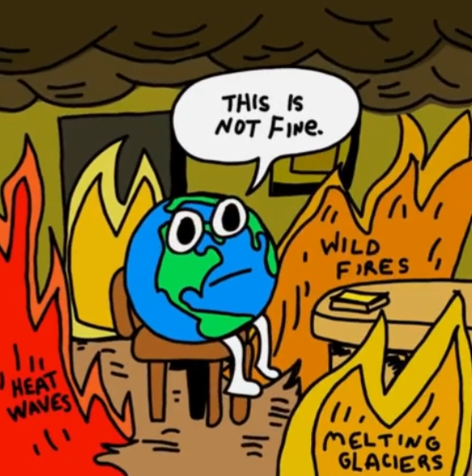
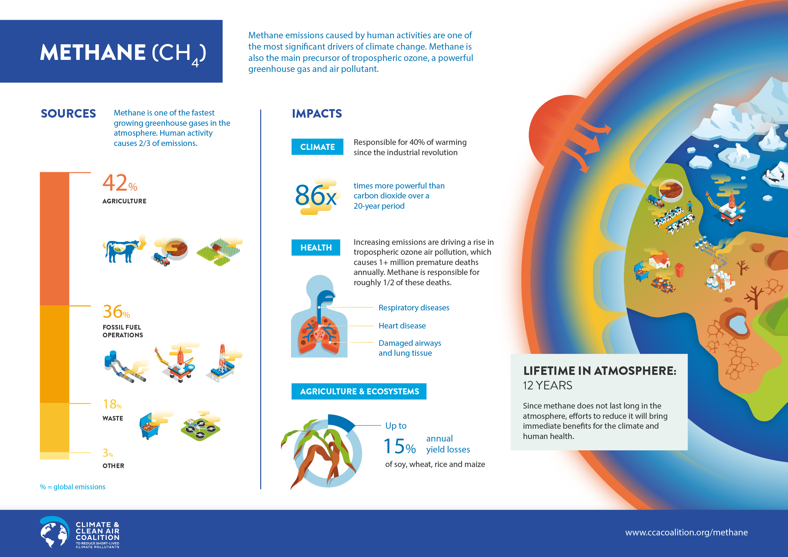
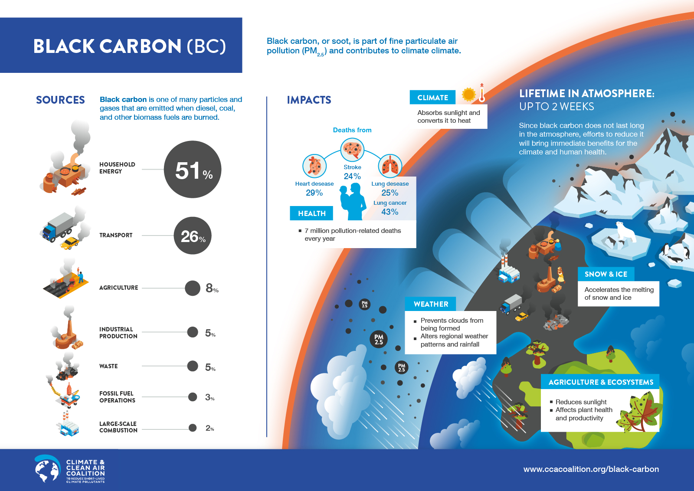
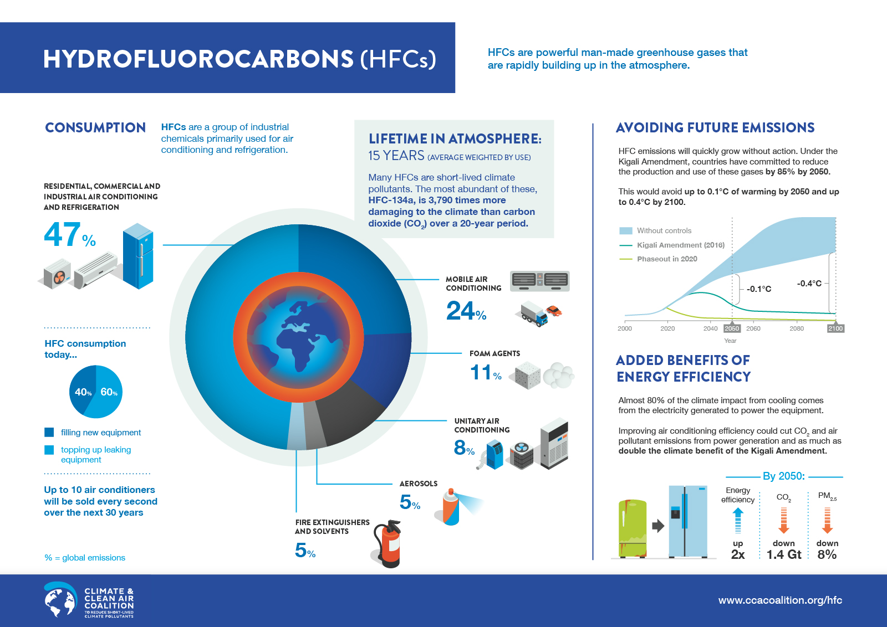
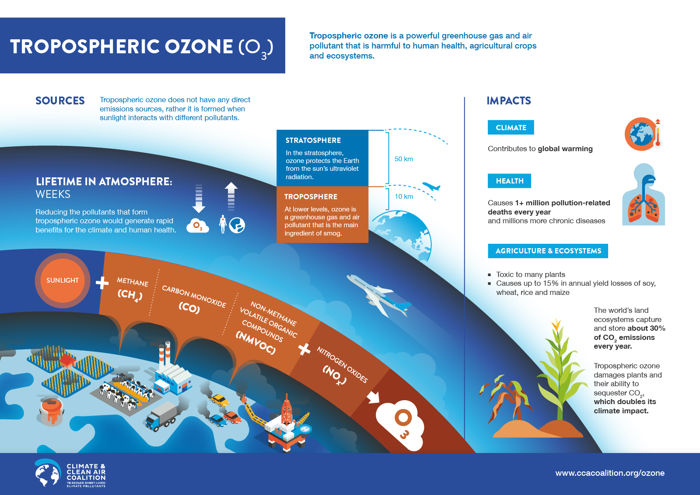
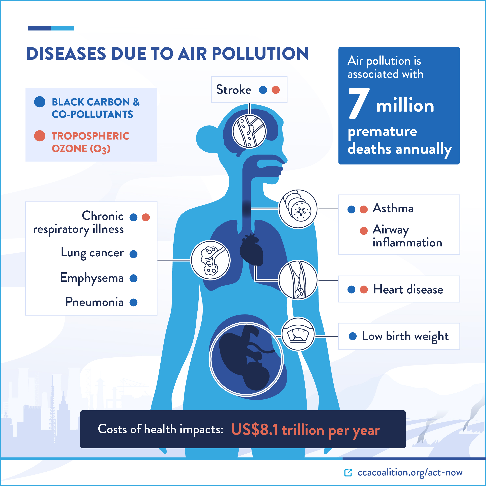
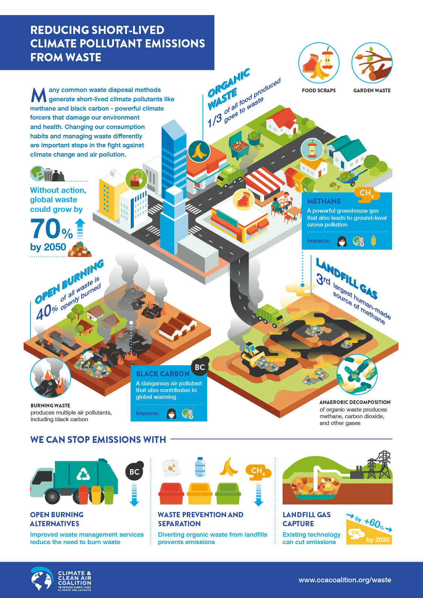
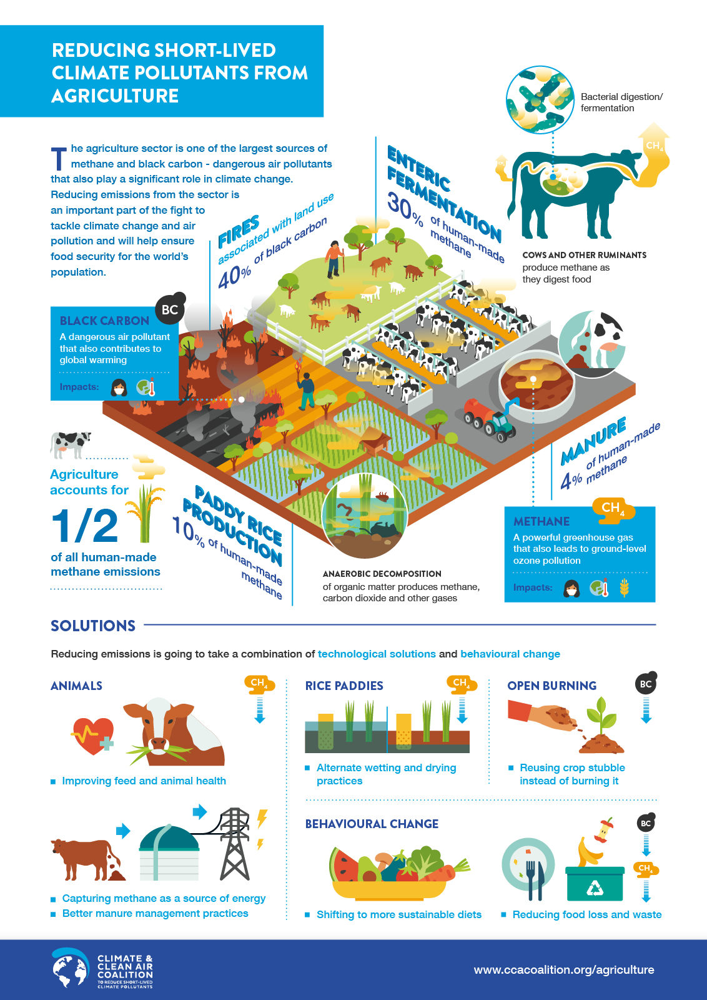
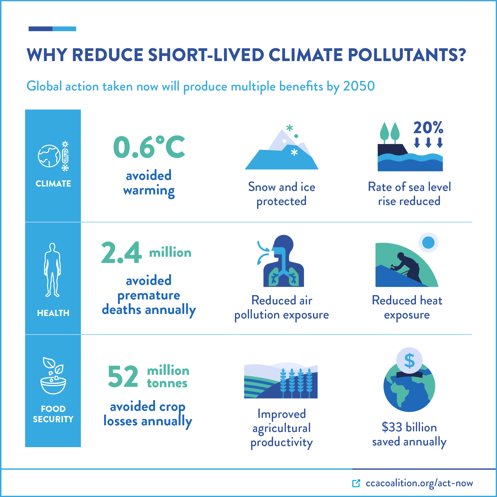
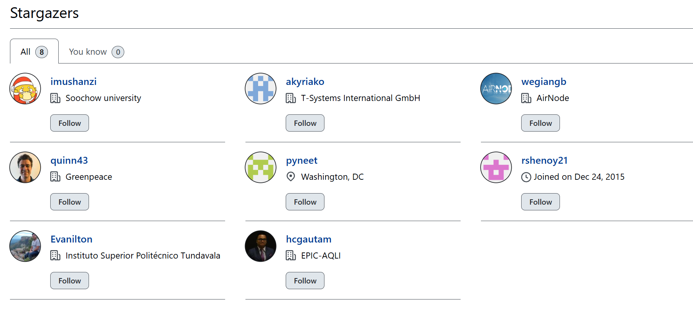

```{r setup, include=FALSE}
knitr::opts_chunk$set(echo = TRUE)
```

# Super Pollutants: The Double-Edged Sword of Air Pollution and Climate Change

<br>

{width="965" height="744"}

> *Image Source: <https://in.pinterest.com/pin/5981412000211089/>*

<br>

Air pollution isn’t a distant or abstract problem—it’s a daily,
life-threatening assault on millions of people and our planet’s climate.
In mega-cities like New Delhi, toxic air laden with dangerous chemicals
fuels diseases and accelerates global warming. The World Health
Organization estimates that nearly **7 million premature deaths** each
year are linked to polluted air. At the heart of this crisis lie **super
pollutants, many of which are short lived climate pollutants (SLCPs)**
—substances that warm the planet and degrade air quality far faster than
conventional emissions. Because these pollutants act intensely over a
short period, swift action can yield almost immediate benefits for both
our climate and public health.

<br>

## What Are Super Pollutants and How Do They Affect Us?

Unlike traditional greenhouse gases like carbon dioxide (CO₂), which
slowly accumulate over centuries, **super pollutants** deliver a rapid
and intense warming effect in just a few decades. They include:

-   **Methane (CH₄):**

    <br>

    

    > *Image: CCAC, Open Source Media Resources:
    > [Link](https://www.ccacoalition.org/sites/default/files/resources//Methane-SingleLogo-SCREEN.jpg)*

    <br>

    -   **What It Is:** Emitted from livestock, landfills, fossil fuel
        extraction, and wetlands.\

    -   **How It Works**: Methane has a Global Warming Potential (GWP)
        roughly 86 times greater than CO₂ over 20 years. Imagine CO₂ as
        a slow-burning ember and methane as a roaring furnace that heats
        up the atmosphere quickly.\

    -   **Impacts**: Though not directly toxic, methane fuels the
        creation of ground-level ozone, worsening respiratory
        conditions.

    <br>

<!-- -->

-   **Black Carbon:**

    <br>

    

    > *Image: CCAC, Open Source Media Resources:
    > [Link](https://www.ccacoalition.org/sites/default/files/resources//Blackcarbon-SingleLogo-SCREEN.jpg)*

    <br>

    -   **What It Is:** Tiny soot particles produced by the incomplete
        burning of fossil fuels, biomass, and waste.

    -   **How It Works:** Acting like a dark blanket, black carbon soaks
        up sunlight and heats the air. When it settles on snow or ice,
        it darkens the surface, accelerating melting.

    -   **Impacts:** Inhaling these fine particles damages the lungs,
        leading to respiratory illnesses, heart problems, and even lung
        cancer.\
        <br>

-   **Hydrofluorocarbons (HFCs):**

    <br>

    

    > *Image: CCAC, Open Source Media Resources:
    > [Link](https://www.ccacoalition.org/sites/default/files/resources//HFCs-SingleLogo-SCREEN.jpg)*

    <br>

    -   **What They Are:** Synthetic chemicals used in refrigeration,
        air conditioning, and aerosols.

    -   **How They Work:** Initially created to replace ozone-depleting
        substances, HFCs now have extremely high GWP values—sometimes
        hundreds or thousands of times that of CO₂.

    -   **Impacts:** Although they don’t directly harm human health,
        their massive warming effect increases the risk of heatwaves and
        extreme weather.

    <br>

<!-- -->

-   **Tropospheric Ozone:**

    <br>

    

    > *Image: CCAC, Open Source Media Resources:
    > [Link](https://www.ccacoalition.org/sites/default/files/resources//Ozone-SingleLogo-SCREEN.jpg)*

    <br>

    -   **What It Is:** Unlike the protective ozone layer in the
        stratosphere, tropospheric ozone forms near the ground when
        pollutants like nitrogen oxides (NOₓ) and volatile organic
        compounds (VOCs) react under sunlight.

    -   **How It Works:** This ozone is a powerful greenhouse gas and a
        key component of urban smog.

    -   **Impacts:** It irritates the lungs, triggers asthma attacks,
        and reduces crop yields, while also contributing directly to
        warming.

<br>

## How Do We Measure Super Pollutants?

Accurate measurement is essential to understand and curb super
pollutants. Scientists use a combination of techniques:

-   **For Black Carbon:**
    -   ***In-Situ Sensors:*** Devices called aethalometers measure how
        much light is absorbed by particles in the air—like judging how
        dark a stain is on fabric.\

    -   ***Filter Sampling:*** Air is pulled through a filter that traps
        particles, and later, scientists analyze the filter’s residue,
        much like checking the grounds left in a coffee filter.\

    -   ***Mobile Platforms:*** Vehicles with sensors drive through
        cities to create real-time maps of black carbon hotspots.

<!-- -->

-   **For Methane:**

    -   ***Ground-Based Sensors:*** Fixed stations continuously record
        methane levels, similar to weather stations monitoring
        temperature.

    -   ***Satellite Remote Sensing:*** Satellites (e.g., TROPOMI and
        the upcoming MethaneSAT) capture global images to reveal methane
        “hotspots” from space.

    -   ***Mobile Laboratories:*** Drones and vehicles with advanced
        detectors help pinpoint leaks from pipelines and industrial
        sites.

-   **For HFCs:**

    -   ***Gas Chromatography:*** Laboratory techniques separate and
        measure different gases in air samples—like sorting beads by
        color and size—to detect HFC levels.

    -   ***Spectroscopic Techniques:*** Instruments use infrared light
        to identify HFCs based on the specific wavelengths they absorb,
        detecting even trace amounts.

    -   ***Emission Inventories:*** Detailed data and modeling estimate
        total HFC emissions from industries, informing policy and
        regulation.

-   **For Tropospheric Ozone:**

    -   ***UV Photometry:*** Instruments measure the amount of
        ultraviolet light absorbed by ozone. A decrease in UV light
        indicates higher ozone levels.\

    -   ***Satellite Data:*** Satellites provide broad, real-time maps
        of ozone distribution over cities and regions.\

    -   ***Lidar Systems:*** These systems use laser beams to create
        vertical profiles of ozone, showing its concentration at various
        altitudes.

Together, these tools give us a clear, comprehensive picture of super
pollutant emissions, empowering scientists and policymakers to target
reduction strategies effectively.

<br>

## The Health Toll of Super Pollutants

<br>\
\


> *Image: CCAC, Open Source Media Resources:*
> <https://www.ccacoalition.org/sites/default/files/2023-07/Diseases-air-pollution.jpg>

<br>

Super pollutants not only drive climate change but also exact a heavy
toll on human health. Here’s how each affects us:

-   **Methane:**\
    Although not directly toxic, methane contributes to the formation of
    ground-level ozone. Elevated ozone levels can trigger asthma
    attacks, reduce lung function, and exacerbate chronic respiratory
    diseases, impacting millions—especially in urban areas.

-   **Black Carbon:**\
    Inhaled black carbon particles can penetrate deep into the lungs,
    causing inflammation and damage. This leads to a higher incidence of
    respiratory illnesses, heart disease, and lung cancer. Vulnerable
    groups like children and the elderly are most at risk, leading to
    increased hospital admissions and premature deaths.

-   **HFCs:**\
    While HFCs themselves do not harm health directly, their
    contribution to rapid warming results in more extreme heatwaves and
    severe weather events. These conditions increase heat stress and
    other climate-related health risks, disproportionately affecting
    those in under-resourced communities.

-   **Tropospheric Ozone:**\
    High levels of ground-level ozone irritate the respiratory system,
    leading to asthma, reduced lung capacity, and chronic respiratory
    conditions. Long-term exposure can also impair lung development in
    children and increase the risk of cardiovascular diseases.

<br>

> ## Case Study: From Ozone Crisis to Climate Action
>
> A shining example of global environmental collaboration is the
> response to the ozone crisis. In the 1980s, scientists discovered that
> chlorofluorocarbons (CFCs) were depleting the ozone layer—our natural
> shield against harmful ultraviolet rays. The world responded with the
> **Montreal Protocol** in 1987, a treaty that successfully phased out
> CFCs and allowed the ozone layer to recover gradually.
>
> However, replacing CFCs with HFCs led to a new challenge. Although
> HFCs did not harm the ozone, their extremely high GWP turned them into
> potent greenhouse gases. In response, the international community
> adopted the **Kigali Amendment** in 2016, committing to a gradual
> phase-down of HFCs. This two-step process shows that when nations
> unite behind scientific evidence, even daunting challenges can be
> overcome. The same spirit of collaboration must now be applied to
> combat today’s super pollutants.

<br>

## **Global Initiatives to Tackle Super Pollutants**

Addressing super pollutant emissions requires **coordinated global
action**, as these pollutants contribute significantly to both **climate
change** and **air pollution-related health impacts**. Several
international efforts have emerged to curb emissions, focusing on SLCPs
like **methane, black carbon, hydrofluorocarbons (HFCs), and
tropospheric ozone**, which are among the most potent climate forcers.
Below are some of the most impactful initiatives:

#### **Global Methane Pledge**

Launched at **COP26 in 2021** by the **United States and the European
Union**, the **Global Methane Pledge** is an ambitious international
agreement aimed at **reducing methane emissions by 30% by 2030**
(relative to 2020 levels). As of 2023, over **150 countries** have
joined, committing to targeted reductions across key methane-emitting
sectors:

-    **Agriculture**: Cutting emissions from livestock and rice paddies
    through improved manure management, feed additives, and sustainable
    farming practices.

-   **Waste Management**: Reducing methane leaks from landfills and
    wastewater treatment plants by improving waste separation,
    composting, and methane capture for energy use.

-   **Energy Production**: Implementing stricter regulations to minimize
    methane leaks from oil and gas infrastructure, including leak
    detection and well-plugging.

If fully implemented, the pledge could **prevent 0.2°C of warming by
2050**. However, it is a **voluntary** commitment, and its success
depends on national enforcement and implementation strategies.

In support of the pledge, the **EU Methane Strategy (2020)** introduced
Europe's **first regulatory framework** for methane monitoring and
reduction, while private initiatives like the **Oil and Gas Methane
Partnership (OGMP 2.0)** are driving industry action to curb emissions.

#### **Kigali Amendment to the Montreal Protocol**

Adopted in **2016**, the **Kigali Amendment** to the **Montreal
Protocol** is a legally binding international agreement aimed at phasing
down **hydrofluorocarbons (HFCs)**—potent greenhouse gases used in
refrigeration, air conditioning, and aerosol propellants.

-   The agreement requires participating nations to **reduce HFC
    consumption by 80–85% by 2047**, with developed nations phasing down
    first, followed by developing countries in a staggered timeline.

-    If fully implemented, it is expected to **prevent up to 0.5°C of
    global warming by 2100**.

-    It encourages the adoption of **climate-friendly alternatives**,
    including **natural refrigerants** (CO₂, ammonia, hydrocarbons) and
    next-generation **low-GWP refrigerants**.

-   The Kigali Amendment builds on the success of the **Montreal
    Protocol**, which effectively phased out **chlorofluorocarbons
    (CFCs)**, helping restore the **ozone layer** while delivering major
    climate benefits.

#### **Clean Air Fund**

The **Clean Air Fund** is a **philanthropic initiative** dedicated to
tackling air pollution by supporting **data-driven policies,
technological innovation, and advocacy**. Unlike governmental
initiatives, the Clean Air Fund focuses on:

-    **Investing in low- and middle-income countries**, where air
    pollution levels are often highest.

-    **Funding air pollution research** and real-time monitoring
    technologies, such as AI-driven air quality modeling.

-    **Mobilizing private-sector engagement** in air quality improvement
    efforts.

-    The fund collaborates with organizations like the **World Health
    Organization (WHO)**, **United Nations Environment Programme
    (UNEP)**, and **Bloomberg Philanthropies** to advance clean air
    policies globally.

#### **Climate and Clean Air Coalition (CCAC)**

Founded in **2012**, the **Climate and Clean Air Coalition (CCAC)** is a
voluntary international partnership focused on reducing **short-lived
climate pollutants (SLCPs)**, including **methane, black carbon, and
HFCs**. It unites governments, businesses, and scientific institutions
to:

-   **Support national policies** that integrate SLCP reduction into
    climate action plans.

-   **Provide technical and financial assistance** for clean
    transportation, waste management, and low-emission agriculture.

-   **Promote best practices and innovations** for reducing emissions in
    high-impact sectors.

-   The CCAC has played a critical role in helping countries incorporate
    **methane reduction into their Nationally Determined Contributions
    (NDCs)** under the **Paris Agreement**, ensuring alignment between
    climate and air quality policies.

#### **Additional Global and Regional Efforts**

Beyond these major initiatives, several other programs contribute to
**reducing super pollutant emissions**:

-   **MethaneSAT (2024 launch):** A dedicated satellite by the
    **Environmental Defense Fund (EDF)** designed to **track global
    methane emissions in real time**, improving accountability and
    enforcement.

-   **WHO Global Air Quality Guidelines (2021):** Establishes stricter
    limits for **PM2.5 and NO₂** to improve air quality and reduce
    climate-forcing emissions.

-   **UNEP’s Integrated Assessment of Air Pollution and Climate
    Change:** Highlights synergies between **climate action and air
    pollution mitigation**.

-   **India’s National Clean Air Programme (NCAP):** Aims for a **20-30%
    reduction in PM2.5 levels** by 2024, indirectly reducing black
    carbon and methane emissions.

-   **China’s Blue Sky Action Plan (2018):** Focuses on reducing **black
    carbon, NO₂, and particulate pollution** through clean energy
    policies and industrial controls.

<br>

## Recommendations by UNEP and CCAC on How to Tackle Super Pollutants

Building on robust science and practical, common-sense solutions, UNEP
and CCAC recommend several strategies to rapidly reduce super pollutant
emissions:

-   **Modernize Household Energy:**\
    Transition the 2.5 billion households still using outdated,
    inefficient energy sources to modern alternatives. This change can
    drastically reduce black carbon emissions and improve public health.

-   **Enhance Building Design and Insulation:**\
    Use advanced insulation materials and smart architectural designs to
    reduce the need for energy-intensive air conditioning—one of the
    largest sources of HFC emissions—keeping buildings cool naturally.

-   **Innovative Waste Management:**\
    Embrace creative solutions like Black Soldier Fly farms to process
    food waste, which not only reduces methane emissions from landfills
    but also produces valuable byproducts.

    <br>



> *Image: CCAC, Open Source Media Resources:
> [Link](https://www.ccacoalition.org/sites/default/files/resources//WasteSector-SingleLogo-SCREEN.jpg)*

<br>

-   **Revamp Agricultural Practices:**\
    In rice paddies, apply intermittent aeration—allowing fields time to
    drain, much like intermittent fasting helps the body reset—to reduce
    methane production. When rice paddies are continuously flooded, the
    soil becomes oxygen-deprived (anaerobic). \
    \
    In these conditions, specialized microorganisms called methanogens
    thrive and produce methane as they break down organic matter.
    Intermittent aeration involves temporarily draining the paddy fields
    at strategic times during the growing season. This introduces oxygen
    into the soil, which:\

    1.   Disrupts the activity of methane-producing microbes
        (methanogens)

    2.   Promotes the growth of methane-consuming microbes
        (methanotrophs)

    3.   Changes the soil chemistry to favor less methane production

    \
    Other techniques include: Improving livestock management through
    better animal health, optimized feeding, and selective breeding.

    Also, promoting anaerobic digestion for manure to capture methane
    for energy. These are like artificial stomachs that capture the gas
    from decomposing food. They are sealed containers where organic
    waste breaks down without oxygen (that's what "anaerobic" means).
    Inside these tanks, specialized microorganisms consume the organic
    material in this oxygen-free environment. The captured gas can then
    power homes or vehicles instead of escaping into the atmosphere.
    It's basically a controlled environment that mimics what happens in
    a landfill, but with the crucial difference that we capture the
    methane instead of letting it escape as a greenhouse gas.

<br>

> ***The key is giving food waste a chance to break down with oxygen or
> in controlled environments where we can capture the gases, rather than
> burying it where it rots and releases methane into our atmosphere.***

<br>



> *Image: CCAC, Open Source Media Resources:
> [Link](https://www.ccacoalition.org/sites/default/files/resources//Agriculture-SingleLogo-SCREEN.jpg)*

<br>

-   **Sector-Specific Strategies:**

    -   **Fossil Fuels:** Implement pre-mining degasification to capture
        methane, reduce pipeline leaks, and improve recovery during oil
        and gas extraction. Enhance flaring efficiency to reduce black
        carbon emissions. When oil and gas operations can't capture or
        use associated gas, they burn (flare) it instead of releasing it
        directly. However, traditional flares often burn incompletely,
        producing black carbon along with other pollutants. Improved
        flaring efficiency means getting closer to complete combustion,
        and hence less black carbon emissions.

    -   **Waste Management:** Divert organic waste from landfills to
        composting or insect-based processing, upgrade wastewater
        treatment, and install biocovers on landfills to absorb methane.

    -   **Transportation:** Enforce ultra-low sulfur diesel standards,
        adopt strict emission norms (such as Euro 6/VI), and transition
        heavy-duty vehicles to zero-emission alternatives by 2050.
        Regulate emissions from ships and off-road machinery to cut
        black carbon.

    -   **Cooling & Refrigeration:** Follow the Kigali Amendment by
        switching to low- or zero-GWP refrigerants and improving
        building energy efficiency to lower cooling demands.

For an interactive look at these recommendations, visit the [UNEP Super
Pollutants](https://www.unep.org/interactives/super-pollutants/).

<br>

## Lack of Political Will: The Biggest Obstacle in Addressing Super Pollutants

Despite overwhelming scientific evidence and viable solutions,
**political inertia remains one of the single biggest barrier to
tackling super pollutants.** Governments often delay action due to
economic and industry pressures, prioritizing short-term gains over
long-term sustainability. Some key challenges include:

-   **Industry Influence:**\
    Fossil fuel, chemical, and industrial lobbies wield enormous power,
    pushing back against regulations that would reduce emissions.
    Methane leaks from oil and gas infrastructure are a well-documented
    issue, yet regulations remain weak due to lobbying pressure.

-   **Short-Term Political Cycles:**\
    Most governments operate on election cycles of 4-5 years, making it
    difficult to implement long-term climate policies. Leaders favor
    policies with immediate economic benefits rather than those with
    long-term environmental payoffs.

-   **Weak Enforcement Mechanisms:**\
    While international agreements like the **Global Methane Pledge**
    and the **Kigali Amendment** exist, many countries fail to meet
    their commitments due to weak monitoring and enforcement.

-   **Deliberate Misinformation:**\
    Some industries and political groups actively spread doubt about
    climate science, delaying regulations. Methane, for example, has
    been framed as a "natural" byproduct of agriculture rather than a
    major climate pollutant.

-   **Failure to Act on Low-Hanging Fruit:**\
    Many solutions to super pollutants are cost-effective and
    feasible—such as capturing methane from landfills or switching to
    cleaner refrigerants—yet remain under-implemented.

This lack of urgency is inexcusable. Every year of inaction locks in
more warming, more pollution, and more public health crises.

<br>

## Tackling Reckless Precedents, Confronting Anti-Science Policies and some Global Recommendations

Recent anti-science policies—most notably those under the Trump
administration—have set a dangerous global precedent. By dismantling
essential environmental regulations and dismissing robust scientific
evidence, these policies not only stall progress at home but also
embolden **dormant actors** worldwide. When powerful nations shirk their
environmental responsibilities, they send a dangerous message that
inaction is acceptable, undermining global efforts to combat climate
change.

### Global Recommendations:

-   **Uphold Scientific Integrity:**\
    Ensure that policymaking is driven by independent, reliable science
    rather than short-term political gain. Each one of yours voice
    matters, no matter who you are, so raise that voice as passionately
    as you can to defend and uphold scientific intergrity.

-   **Strengthen International Regulations:**\
    Reinforce global treaties like the Kigali Amendment and Global
    Methane Pledge with binding commitments and strict monitoring.

-   **Foster Global Accountability:**\
    International institutions, such as the United Nations, must hold
    nations accountable for undermining environmental progress.

-   **Promote Public Awareness:**\
    Empower citizens with clear, accessible information about the
    impacts of super pollutants to drive grassroots demand for effective
    policies.

-   **Encourage Transparent Governance:**\
    Open access to environmental data and clear decision-making
    processes build trust and enable precise, impactful action.

It’s time to stop "selectively" accepting science. Anti-science
governments readily celebrate scientific breakthroughs in areas like
military and space exploration when it aligns with their interests, yet
dismiss scientific warnings that call for long-term thinking over
short-term gains. This hypocrisy isn’t just frustrating, it should not
be tolerated at any level. This is DELIBERATE IGNORANCE!

<br>

## **The Benefits of Reducing Super Pollutants**

<br>



> *Image: CCAC, Open Source Media Resources:*
> <https://www.ccacoalition.org/sites/default/files/2024-03/Mitigation%20Benefits.jpg>

<br>

Tackling **super pollutants**—methane, black carbon, hydrofluorocarbons
(HFCs), and tropospheric ozone—offers some of the **fastest, most
effective** ways to slow climate change while dramatically improving
human well-being. Because these pollutants have a **short atmospheric
lifespan** (ranging from days to decades), cutting their emissions can
yield **immediate benefits** for the climate, public health, food
security, and economies worldwide.

### **1. Rapid Climate Stabilization**

Super pollutants **trap heat more intensely than carbon dioxide**, with
methane being over 80 times more potent in the short term. Reducing them
can:

-   **Significantly slow global temperature rise** within decades,
    helping to meet the **Paris Agreement** goal of limiting warming to
    **below 2°C**.

-   **Reduce the risk of climate tipping points**, such as ice sheet
    collapse and extreme weather intensification.

-   **Prevent irreversible climate consequences**, including rising sea
    levels, extreme droughts, and intensifying natural disasters.

### **2. Public Health Improvements**

Many super pollutants double as harmful air pollutants. Reducing them
can:

-   **Prevent millions of premature deaths** annually by improving air
    quality.

-   **Lower rates of respiratory diseases**, asthma, and cardiovascular
    illnesses linked to fine particulate matter (PM2.5) and ground-level
    ozone.

-   **Reduce heat-related illnesses** by slowing global warming,
    decreasing the severity of heatwaves.

-   **Improve access to clean air**, particularly in heavily polluted
    regions like South and Southeast Asia, where air pollution is a
    leading cause of death.

### **3. Enhanced Food Security**

Tropospheric ozone damages crops, leading to food shortages and economic
losses. Reducing super pollutants can:

-   **Prevent up to 110 million tonnes of staple crop losses** annually
    (wheat, rice, maize, soybeans).

-   **Stabilize agricultural yields**, reducing drought, pest outbreaks,
    and extreme weather-related crop failures.

-   **Save between \$4 billion and \$33 billion annually** in food
    losses, benefiting farmers and global markets.

### **4. Economic and Social Gains**

Reducing super pollutants isn’t just good for the environment—it’s
**economically smart**. Benefits include:

-   **Job creation** in clean energy, air pollution control, and
    sustainable agriculture

-   **Higher household incomes** as cleaner technologies reduce fuel and
    healthcare costs.

-   **Lower poverty and inequality** by reducing the disproportionate
    health and economic burdens on vulnerable populations.

-   **Cost-effective solutions**—many SLCP mitigation strategies are
    available today, practical, and financially viable.

### **5. Advancing Sustainable Development Goals (SDGs)**

Many climate actions align with global development priorities. Cutting
super pollutants will:

-   **Support clean energy transitions**, improving energy efficiency
    and innovation.

-   **Enhance climate resilience**, reducing vulnerability to extreme
    weather.

-   **Improve public health**, ensuring cleaner air and water for
    communities.

-   **Reduce poverty and economic insecurity** by stabilizing food
    production and lowering healthcare costs.

### **The Bottom Line: A Win-Win for the Planet and People**

Unlike carbon dioxide, which lingers in the atmosphere for centuries,
reducing super pollutants delivers **immediate benefits**—within years,
not generations. By acting now, we can **protect lives, secure food
supplies, boost economies, and give ourselves a fighting chance at
slowing climate change**. The solutions exist.

<br>

## **Key Distinction: SLCPs vs. Super Pollutants**

The terms **super pollutants** and **short-lived climate pollutants
(SLCPs)** are often used interchangeably, but they have important
differences.

#### **All SLCPs Are Super Pollutants**

SLCPs are a subset of super pollutants characterized by their **high
climate-warming potential and short atmospheric lifetime** (ranging from
days to a few decades). They significantly impact both **climate
change** and **air quality**, making them a priority for immediate
mitigation efforts.

The major SLCPs include:

-    **Methane (CH₄):** Lasts about **12 years** in the atmosphere but
    has **over 80 times** the warming potential of CO₂ over a 20-year
    period.

-    **Black Carbon (soot):** Remains in the air for **days to weeks**,
    absorbs heat efficiently, and contributes to glacier and ice melt.

-    **Hydrofluorocarbons (HFCs):** Can persist for **a few years to
    decades**, depending on the specific type, and have **thousands of
    times the warming potential of CO₂**.

-    **Tropospheric Ozone (O₃):** A short-lived pollutant that
    contributes to warming and harms respiratory health.

Because of their **short atmospheric lifetime**, reducing SLCP emissions
leads to **rapid improvements** in both air quality and climate
stability.

#### **Not All Super Pollutants Are SLCPs**

While SLCPs are always considered **super pollutants**, some super
pollutants have **longer atmospheric lifetimes** and are not classified
as SLCPs.

For example:

-    **Nitrous Oxide (N₂O):** A powerful greenhouse gas primarily
    emitted from **agriculture and industrial activities**. It remains
    in the atmosphere for **over 100 years**, making it a **long-lived
    climate pollutant (LLCP)** rather than an SLCP.

-    **Sulfur Hexafluoride (SF₆):** Used in electrical insulation, SF₆
    has a **lifetime of over 1,000 years** and a **warming potential
    25,000 times higher than CO₂** over a century.

These pollutants still contribute significantly to global warming but
are not classified as SLCPs because they persist **far longer** in the
atmosphere.

### **Why This Distinction Matters**

-    **SLCP mitigation offers near-term benefits:** Because SLCPs
    disappear quickly from the atmosphere, reducing their emissions
    leads to **immediate climate and air quality improvements**—helping
    slow warming in the coming decades.

-    **Super pollutant strategies must include both SLCPs and long-lived
    pollutants:** While focusing on SLCPs can deliver rapid results,
    long-term climate stability requires also addressing CO₂, N₂O, and
    other persistent greenhouse gases.

In short, **all SLCPs are super pollutants, but not all super pollutants
are SLCPs** due to differences in their atmospheric lifetime.

<br>

## Final Note: The Time to Act Is Now

The threat of super pollutants is immediate and monumental. Every day,
these substances worsen air quality and accelerate climate change,
closing the window for effective intervention. We have the science, the
technology, and a proven history of global collaboration—from the
Montreal Protocol to the Kigali Amendment—that shows what can be
achieved when nations unite behind evidence. Yet, anti-science rhetoric
and reckless policies continue to imperil our future.

**This is not acceptable.**

\
Every moment of delay puts more lives at risk and brings our planet
closer to irreversible damage. The global community must unite, embrace
scientific truth, and implement bold, decisive measures to phase down
super pollutants.

<br>

> ***Our planet’s future is in our hands. The science is clear, the
> solutions are proven, and history shows what’s possible when nations
> unite behind evidence. Now is the time for bold, decisive action to
> phase down super pollutants and secure a livable future for
> generations to come.***

<br>

## References

1.  Meet the Super Pollutants, UNEP and CCAC
    *[[Link](https://www.unep.org/interactives/super-pollutants/)]*

2.  Climate and Clean Air Coalition, SLCP, Methane
    *[[Link](https://www.ccacoalition.org/short-lived-climate-pollutants/methane)]*

3.  Climate and Clean Air Coalition, SLCP, Black Carbon
    *[[Link](https://www.ccacoalition.org/short-lived-climate-pollutants/black-carbon)]*

4.  Climate and Clean Air Coalition, SLCP, Tropospheric Ozone
    *[[Link](https://www.ccacoalition.org/short-lived-climate-pollutants/tropospheric-ozone)]*

5.  Climate and Clean Air Coalition, SLCP, HFCs
    [*[[Link](#0)]*]{.underline}

6.  Why we need to act now, CCAC
    *[[Link](https://www.ccacoalition.org/content/why-we-need-act-now)]*

7.  BreatheLife Campaign
    *[[Link](https://www.ccacoalition.org/content/breathelife)]*

8.  Global Methane Pledge
    *[[Link](https://www.ccacoalition.org/content/global-methane-pledge)]*

9.  Media Resources, CCAC
    *[[Link](https://www.ccacoalition.org/content/media-resources)]*

10. *IPCC Sixth Assessment Report
    [[Link](https://www.ipcc.ch/assessment-report/ar6/)]*

11. *Montreal Protocol, UNEP
    [[Link](https://www.unep.org/ozonaction/who-we-are/about-montreal-protocol)]*

12. *Kigali Amendment to Montreal Protocol, UN Treaty Collection
    [[Link](https://treaties.un.org/Pages/ViewDetails.aspx?src=IND&mtdsg_no=XXVII-2-f&chapter=27&clang=_en)]*

13. *Why reducing super pollutants isn’t just good for the climate,
    Clean Air Fund
    [[Link](https://www.cleanairfund.org/news-item/reducing-super-pollutants/)]*

## Rmd for this blog

The underlying Rmd for this blog post can be found here.

<br>

## Support This Work: Give It a Star

Thank you for reading! If you found this project helpful or interesting,
please consider starring it on GitHub. Your stars help others discover
and benefit from this fully open and free repository. Click [here to
star the
repository](https://github.com/AarshBatra/biteSizedAQ/stargazers) and
join other folks who follow biteSizedAQ.

<br>\
\


<br>

## Get in touch

Get in touch about related topics/report any errors. Reach out to me at
[aarshbatra.in\@gmail.com](mailto:aarshbatra.in@gmail.com){.email}.

<br>

## License and Reuse

All content is shared under the Creative Commons Attribution 4.0
International (CC BY 4.0) license. You are welcome to use this material
in your reports or news stories. Just remember to give appropriate
credit and include a link back to the original work. Thank you for
respecting these terms!

For more details, see the LICENSE file.

If you use this in your work, please cite this repository as follows:\
*[Aarsh Batra, biteSizedAQ,
<https://github.com/AarshBatra/biteSizedAQ>]*
