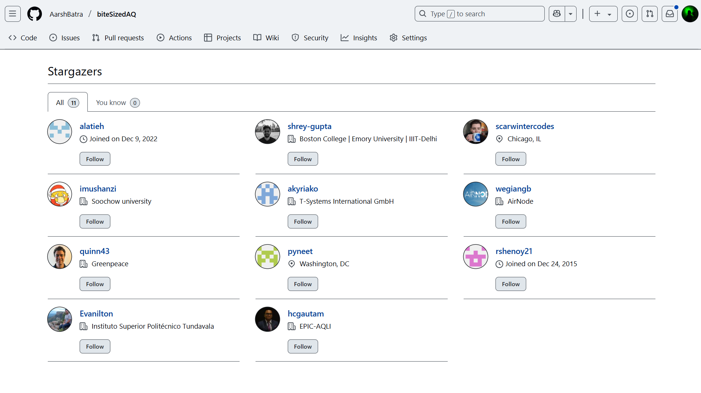

<!-- README.md is generated from README.Rmd. Please edit that file -->

```{r, include = FALSE}
knitr::opts_chunk$set(
  collapse = TRUE,
  comment = "#>",
  fig.path = "man/figures/README-",
  out.width = "100%"
)
```

<!-- badges: start -->

<!-- badges: end -->

# Nepal PM2.5 Satellite Data Processing Pipeline, Local Government Unit Level (1998-2023)

This repository contains a pipeline for processing satellite data to analyze air pollution levels in Nepal. The pipeline reads pollution and population raster data, processes it, and outputs population weighted annual average PM2.5 at Nepal's local government unit level, i.e. lgu, (read more about how admin regions are structured in the Introduction section below). The annual average PM2.5 pollution data extends from 1998 to 2023. As an example plot from the dataset, below I have plotted annual average PM2.5 in 2023 for all local government units in Nepal level (boundaries are very light so as to make it easier to see the colors).


## Table of Contents

1.  [Introduction](#introduction)
2.  [Processed Data and Shapefiles](#processed-data-and-shapefiles)
3.  [Data Dictionary](#data-dictionary)
4.  [Data Sources and description](#data-sources-and-description)
5.  [Why use SHRUG shapefiles for India?](#why-use-shrug-shapefiles-for-india?)
6.  [Prerequisites for running the pipeline](#prerequisites-for-running-the-pipeline)
7.  [Pipeline Overview](#pipeline-overview)
    -   [Load and Crop Pollution Data](#load-and-crop-pollution-data)
    -   [Load and Process Population Data](#load-and-process-population-data)
    -   [Match Resolutions](#match-resolutions)
    -   [Rasterize Shapefile and Create Raster Brick](#rasterize-shapefile-and-create-raster-brick)
    -   [Create Data Frame and Collapse](#create-data-frame-and-collapse)
    -   [Handling Unprocessed IDs](#handling-unprocessed-ids)
    -   [Output](#output)
    -   [Important notes and current limitations](#important-notes-and-current-limitations)
8.  [License and Reuse](#license-and-reuse)
9.  [Citations](#citations)

## Introduction {#introduction}

Nepal’s administrative structure is commonly organized into three levels below federal government: province, district, and local government unit. In this hierarchy, districts are nested within provinces, and local governments are nested within districts. This dataset corresponds to the local government level—the most granular administrative tier—situated within the broader provincial and district framework.

Local government units (LGUs) include metropolitan cities, sub-metropolitan cities, municipalities, and rural municipalities. They serve as the primary units of local administration and are responsible for planning and service delivery at the community level.

By operating at the local government unit level, datasets can capture nuanced variations in demographic, environmental, and socioeconomic factors, enabling comprehensive analyses and informed policy decisions at a finer spatial resolution.

***In this dataset we have data for 7 provinces, which contain 77 districts and those districts contain 775 local government units.***

> ***Note:*** Nepal transitioned to a federal structure following the 2015 Constitution, which reorganized local governance and replaced the earlier system of zones, development regions, and village development committees (VDCs). If you're analyzing data from before this period, you may need to refer to the older administrative boundaries for accurate comparisons.

## Processed Data and Shapefiles {#processed-data-and-shapefiles}

The processed dataset resulting from this pipeline can be [downloaded from this link](https://drive.google.com/drive/folders/1zD2V5aGkY-YyRZMlVcPPNQMMMX7Ml2po?usp=drive_link). It can also be found under `data/processed/14.nep.lgu.pm2.5.sat.data.processing.1998.2023`. The shapefiles used in the process, can be downloaded either directly from [The Humanitarian Data Exchange](https://data.humdata.org/dataset/cod-ab-npl), or if you want to use the exact version, used in code and files in this repo, download shapefiles [from here](https://drive.google.com/drive/folders/1IK8PJ2NRb7a-r_NvQ6rhYna-gDgZLVIZ?usp=drive_link). The latter is a cleaned version of the former. Also, the drive link has shapefiles at 4 levels. I use lgu level shapefile in this project.

In both cases, please make sure to properly cite the datasets used using their original source (see citations sections below for more info on how to properly cite these datasets).

If you are interested in reading more about the pipeline, continue reading the sections below, or [access the full pipeline code here](https://github.com/AarshBatra/biteSizedAQ/blob/main/14.nep.lgu.pm2.5.sat.data.processing.1998.2023.Rmd). Otherwise, you can directly start analyzing the data. Do check out the data dictionary section before starting analysis.

## Data Dictionary {#data-dictionary}

Below listed is a data dictionary for the processed block level dataset:

```{r data-dictionary, echo=FALSE, message=FALSE}
# Load necessary libraries
library(knitr)
library(kableExtra)

# Define the column names and their descriptions
col_names <- c("province_name", "district_name", "loc_gov_unit_name",
               "loc_gov_unit_population", "avg_pm2.5_1998", "avg_pm2.5_1999",
               "avg_pm2.5_2000", "avg_pm2.5_2001", "avg_pm2.5_2002",
               "avg_pm2.5_2003", "avg_pm2.5_2004", "avg_pm2.5_2005",
               "avg_pm2.5_2006", "avg_pm2.5_2007", "avg_pm2.5_2008",
               "avg_pm2.5_2009", "avg_pm2.5_2010", "avg_pm2.5_2011",
               "avg_pm2.5_2012", "avg_pm2.5_2013", "avg_pm2.5_2014",
               "avg_pm2.5_2015", "avg_pm2.5_2016", "avg_pm2.5_2017",
               "avg_pm2.5_2018", "avg_pm2.5_2019", "avg_pm2.5_2020",
               "avg_pm2.5_2021", "avg_pm2.5_2022", "avg_pm2.5_2023")

descriptions <- c("province name", "district name", "local government unit name",
                  "local government unit population",
                  "annual average pm2.5 in 1998 (micrograms per cubic meter)",
                  "annual average pm2.5 in 1999 (micrograms per cubic meter)",
                  "annual average pm2.5 in 2000 (micrograms per cubic meter)",
                  "annual average pm2.5 in 2001 (micrograms per cubic meter)",
                  "annual average pm2.5 in 2002 (micrograms per cubic meter)",
                  "annual average pm2.5 in 2003 (micrograms per cubic meter)",
                  "annual average pm2.5 in 2004 (micrograms per cubic meter)",
                  "annual average pm2.5 in 2005 (micrograms per cubic meter)",
                  "annual average pm2.5 in 2006 (micrograms per cubic meter)",
                  "annual average pm2.5 in 2007 (micrograms per cubic meter)",
                  "annual average pm2.5 in 2008 (micrograms per cubic meter)",
                  "annual average pm2.5 in 2009 (micrograms per cubic meter)",
                  "annual average pm2.5 in 2010 (micrograms per cubic meter)",
                  "annual average pm2.5 in 2011 (micrograms per cubic meter)",
                  "annual average pm2.5 in 2012 (micrograms per cubic meter)",
                  "annual average pm2.5 in 2013 (micrograms per cubic meter)",
                  "annual average pm2.5 in 2014 (micrograms per cubic meter)",
                  "annual average pm2.5 in 2015 (micrograms per cubic meter)",
                  "annual average pm2.5 in 2016 (micrograms per cubic meter)",
                  "annual average pm2.5 in 2017 (micrograms per cubic meter)",
                  "annual average pm2.5 in 2018 (micrograms per cubic meter)",
                  "annual average pm2.5 in 2019 (micrograms per cubic meter)",
                  "annual average pm2.5 in 2020 (micrograms per cubic meter)",
                  "annual average pm2.5 in 2021 (micrograms per cubic meter)",
                  "annual average pm2.5 in 2022 (micrograms per cubic meter)", 
                  "annual average pm2.5 in 2023 (micrograms per cubic meter)")


# Create a data frame
data_dict <- data.frame(Column_Name = col_names, Description = descriptions)

# Output markdown table
kable(data_dict, format = "markdown")
```

## Data Sources and description {#data-sources-and-description}

This project utilizes the following public data sources:

1.  Humanitarian Data Exchange - [Nepal Sub-national Administrative Boundaries](https://data.humdata.org/dataset/cod-ab-npl)

2.  **Atmospheric Composition Analysis Group (V5.GL.05.02 Version)**: This public version of the dataset is downloaded from the ACAG website. They describe it as follows: Annual and monthly estimates of ground-level fine particulate matter (PM2.5) from 1998 to 2023 are generated by integrating Aerosol Optical Depth (AOD) retrievals—Dark Target, Deep Blue, and MAIAC—derived from multiple satellite-based NASA instruments, including MODIS/Terra, MODIS/Aqua, MISR/Terra, SeaWiFS/SeaStar, VIIRS/SNPP, and VIIRS/NOAA20. These satellite observations are combined with outputs from the GEOS-Chem chemical transport model (<http://geos-chem.org>) and calibrated against global ground-based measurements using Geographically Weighted Regression (GWR). The V5.GL.05.02 dataset builds upon the methodology of V5.GL.01 by updating the ground-based calibration data across the full time series, incorporating newer satellite retrieval versions, extending coverage through 2023, and including retrievals from the SNPP/NOAA VIIRS instruments. Note: ACAG keeps releasing newer improved versions of their datasets from time to time, so in case you are viewing this post April 2025, do check the ACAG webiste to verify if a newer version exists. The current version in this post is recommended for users requiring our traditional global algorithm and is available for 1998-2023. If you prefer using a more up to date version, you can download that and process it using the pipeline available in this post.

3.  **LandScan Population Data**: This dataset offers high-resolution global population data, critical for population-weighted analysis of pollution metrics. I used LandScan 2023 data for this post, which was the latest year for which LandScan was available.

Please refer to the citation section for instructions on proper citing of these data sources.

## Prerequisites for running the pipeline {#prerequisites-for-running-the-pipeline}

This blog post uses `renv` to ensure that all the R packages used are easy to install and match the versions I used while writing the post.

To set up the same environment on your system:

1.  Install `renv` (if not already installed):

```         
`install.packages("renv")`
```

2.  Restore the environment in this folder:

```         
`renv::restore()`

This will automatically install all the packages used in the post with the correct versions. (This doesn't load them — it just installs them.)
```

3.  Run the code as-is:

```         
All necessary packages are loaded in the code chunks using `library()`, so you don’t need to load them manually.
```

Tip: If you're using RStudio, make sure your working directory is set to the blog folder before running `renv::restore()`.

## Pipeline Overview {#pipeline-overview}

### Load and Crop Pollution Data {#load-and-crop-pollution-data}

The pipeline starts by loading pollution data files and cropping them to the boundaries of India using a reference shapefile. Each pollution raster file is processed for a specific year and the pipeline loops through all years from 1998 to 2023.

1.  **Load Pollution Data**: The pollution raster files are loaded from a specified directory.
2.  **Extract Year**: The year is extracted from the file names.
3.  **Crop Raster**: Each pollution raster is cropped to the boundary of India using a reference shapefile.
4.  **Mask Raster**: The cropped pollution raster is then masked using the same shapefile to ensure it aligns with the region of interest.

### Load and Process Population Data {#load-and-process-population-data}

The population data is processed in a similar manner:

1.  **Load Population Raster**: The population raster file is loaded.
2.  **Crop and Mask Raster**: The population raster is cropped and masked using the reference shapefile.

### Match Resolutions {#match-resolutions}

The resolutions of the pollution and population rasters are matched to ensure they can be processed together seamlessly.

### Rasterize Shapefile and Create Raster Brick {#rasterize-shapefile-and-create-raster-brick}

1.  **Rasterize Shapefile**: A reference shapefile is rasterized to the same resolution as the pollution and population rasters.
2.  **Create Raster Brick**: A raster brick is created by combining the pollution, population, and rasterized shapefile layers.

### Create Data Frame and Collapse {#create-data-frame-and-collapse}

1.  **Convert to Data Frame**: The raster brick is converted into a data frame.
2.  **Filter Data**: The data frame is filtered to remove any rows with missing values in the pollution or population columns.
3.  **Arrow Table**: The data frame is converted into an Arrow table for efficient processing.
4.  **Collapse Data**: The Arrow table is grouped by the shapefile IDs, and population-weighted pollution levels are calculated.

### Handling Unprocessed IDs {#handling-unprocessed-ids}

Some IDs may not be processed in the initial round due to various reasons such as zero population or missing data. If such IDs are present, the pipeline handles these unprocessed IDs by:

1.  **Identifying Unprocessed IDs**: IDs not captured in the first round are identified.
2.  **Resampling and Reprocessing**: The unprocessed IDs are resampled at a finer resolution and processed again to capture the data accurately.

### Output {#output}

The final output is a summarized data frame containing population-weighted pollution levels for each region. The data includes:

-   Total population for each region
-   Average PM2.5 pollution level weighted by population for each region and year

### Important notes and current limitations {#important-notes-and-current-limitations}

-   I use [HDX boundaries for Nepal](Note:%20Nepal%20transitioned%20to%20a%20federal%20structure%20following%20the%202015%20Constitution,%20which%20reorganized%20local%20governance%20and%20replaced%20the%20earlier%20system%20of%20zones,%20development%20regions,%20and%20village%20development%20committees%20(VDCs).%20If%20you're%20analyzing%20data%20from%20before%20this%20period,%20you%20may%20need%20to%20refer%20to%20the%20older%20administrative%20boundaries%20for%20accurate%20comparisons.) If you prefer using more updated boundaries (e.g pre-2015 ones), the pipeline can be adapted accordingly.

-   Satellite-derived pollution data serves as a supplementary tool to ground-level monitors. While it may not always match the numbers from ground-level monitors, it helps fill gaps in areas where ground monitoring coverage is limited. Always corroborate with other ground-level monitoring datasets for accuracy.

-   Similarly, satellite-derived population data has its limitations. It's crucial to understand that this data is derived from satellite imagery and may not reflect the exact population figures (but the figures are still pretty accurate for calculating population weighted pollution numbers).

-   While weighting pollution by population, the satellite derived population data remains the same, i.e. 2023 population is used for weighting all year's pollution data. More accurate estimates can be created by weighting the pollution data by yearly population datasets, rather than a static one. Also, note that this blog uses LandScan 2023 Global data. Other satellite derived pollution data may use other sources and their population weighted numbers may vary slightly accordingly.

-   When capturing extremely tiny regions, smaller than the resolution of the satellite data (1km x 1km in our case), satellite-derived data comes with higher uncertainty. In such cases, it's advisable to treat the estimates as broad reference points rather than precise figures.

-   There is one LGU in Parsa district, named Parsa Wildlife Reserve. Here there is no discenrnable/recorded human population as per the satellite derived population data. So here, you will see that pollution number is not reported (NA).

-   In the processing pipeline Rmd, you may notice that in the end we coalesce the actual local government unit name column with an alternate loc government unit name column. This is important because the alternate column, although is a lgu itself, but sometimes contains the detailed area name, which is needed to uniquely identify LGUs, within districts.

-   If in your version of R, certain packages are not compatible, many alternatives exist for doing similar tasks (e.g. rasterizing, resampling, etc).

### Support This Work: Give It a Star

Thank you for reading! If you found this project helpful or interesting, please consider starring it on GitHub. Your stars help others discover and benefit from this fully open and free repository. Click [here to star the repository](https://github.com/AarshBatra/biteSizedAQ/stargazers) and join other folks who follow biteSizedAQ.



### License and Reuse {#license-and-reuse}

The local government unit level pollution dataset for Nepal processed is licensed under the Creative Commons Attribution 4.0 International (CC BY 4.0) license. This means you are welcome to reuse the data in your reports or news stories as long as you abide the terms of the license, which means you have to give credit and link back to the original work.

For more details, see the LICENSE file.

If you use this dataset in your work, please cite this repository as follows:

[Aarsh Batra, biteSizedAQ, <https://github.com/AarshBatra/biteSizedAQ>]

### Citations {#citations}

When using this data/pipeline, please also cite the following foundational data sources, without which the producing the above block level pollution data would not be possible:

1.  [Humanitarian Data Exchange: Nepal Sub-national Boundaries](https://data.humdata.org/dataset/cod-ab-npl)
    -   Sourced from Survey Department of Nepal (<http://ngiip.gov.np/index.php>), UN Resident Coordinators Office in Nepal (<https://un.org.np/>)
2.  Atmospheric Composition Analysis Group (V5.GL.05.02 version) 0.01 x 0.01 [data](https://sites.wustl.edu/acag/datasets/surface-pm2-5/#V5.GL.05.02):
    -   Aaron van Donkelaar, Melanie S. Hammer, Liam Bindle, Michael Brauer, Jeffery R. Brook, Michael J. Garay, N. Christina Hsu, Olga V. Kalashnikova, Ralph A. Kahn, Colin Lee, Robert C. Levy, Alexei Lyapustin, Andrew M. Sayer and Randall V. Martin (2021). Monthly Global Estimates of Fine Particulate Matter and Their Uncertainty Environmental Science & Technology, 2021, <doi:10.1021/acs.est.1c05309>.
    -   Hammer, M. S., van Donkelaar, A., Bindle, L., Sayer, A. M., Lee, J., Hsu, N. C., Levy, R.C., Sawyer, V., Garay, M. J., Kalashnikova, O. V., Kahn, R. A., Lyapustin, A., and Martin, R. V.: Assessment of the impact of discontinuity in satellite instruments and retrievals on global PM2.5 estimates. Remote Sensing of Environment, Volume 294, 2023, 113624, ISSN 0034-4257, <https://doi.org/10.1016/j.rse.2023.113624>.
3.  [LandScan Global Population Data](https://landscan.ornl.gov/):
    -   Lebakula, V., Epting, J., Moehl, J., Stipek, C., Adams, D., Reith, A., Kaufman, J., Gonzales, J., Reynolds, B., Basford, S., Martin, A., Buck, W., Faxon, A., Cunningham, A., Roy, A., Barbose, Z., Massaro, J., Walters, S., Woody, C., … Urban, M. (2024). LandScan Silver Edition [Data set]. Oak Ridge National Laboratory. <https://doi.org/10.48690/1531770>

### Contact

If you find any errors in the data or processing code, please report them to `aarshbatra.in@gmail.com`.
