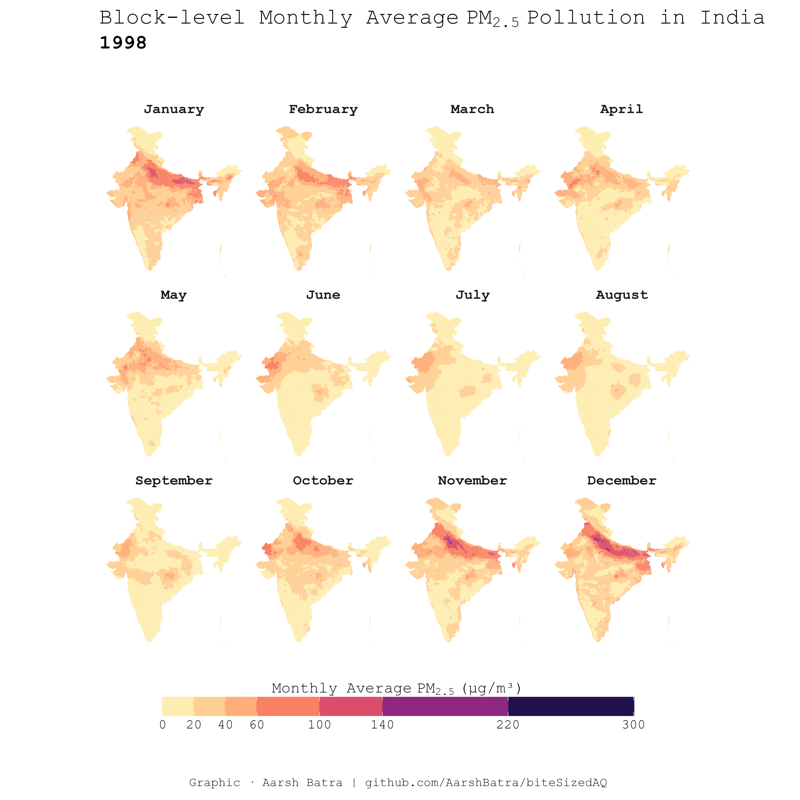
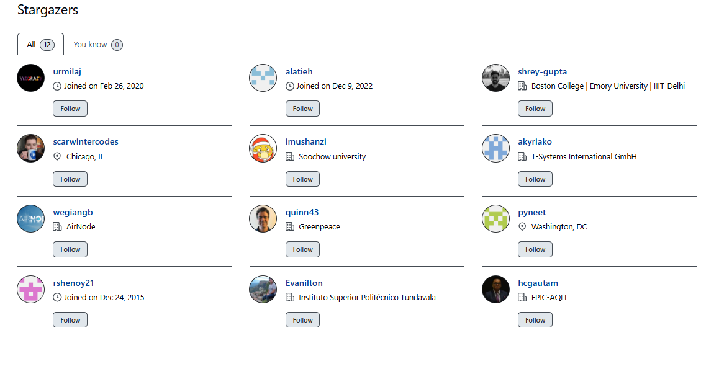

<!-- README.md is generated from README.Rmd. Please edit that file -->
<!-- badges: start -->
<!-- badges: end -->

# India PM2.5 Satellite Data Processing Pipeline, Population Weighted Monthly PM2.5 mean for all blocks (1998-2023)

This repository contains a pipeline for processing satellite data to
analyze air pollution levels in India. The pipeline reads pollution and
population raster data, processes it, and outputs summarized India block
level pollution data weighted by population. The monthly average
pollution data extends from 1998 to 2023. As an example plot from the
dataset, below I have plotted monthly average PM2.5 snapshot for 2023
and 1998 for all months at block level (block boundaries are very light
so as to make it easier to see the colors). Other similar snapshots for
other years are stored in this folder of the repo.

The deterioration in terms of general increase in pollution, across all
months of the year in the past 2+ decades can be seen in the 2 snapshots
below:

## 2023

## **1998**

## Table of Contents

1.  [Introduction](#introduction)
2.  [Processed Data and Shapefiles](#processed-data-and-shapefiles)
3.  [Data Dictionary](#data-dictionary)
4.  [Data Sources and description](#data-sources-and-description)
5.  [Why use SHRUG shapefiles for
    India?](#why-use-shrug-shapefiles-for-india?)
6.  [Prerequisites for running the
    pipeline](#prerequisites-for-running-the-pipeline)
7.  [Pipeline Overview](#pipeline-overview)
    - [Load and Crop Pollution Data](#load-and-crop-pollution-data)
    - [Load and Process Population
      Data](#load-and-process-population-data)
    - [Match Resolutions](#match-resolutions)
    - [Rasterize Shapefile and Create Raster
      Brick](#rasterize-shapefile-and-create-raster-brick)
    - [Create Data Frame and Collapse](#create-data-frame-and-collapse)
    - [Handling Unprocessed IDs](#handling-unprocessed-ids)
    - [Output](#output)
    - [Important notes and current
      limitations](#important-notes-and-current-limitations)
8.  [License and Reuse](#license-and-reuse)
9.  [Citations](#citations)

## Introduction

The administrative region structure of India is a multi-tiered system
comprising states, districts, and subdistricts, each delineated by
distinct geographical boundaries. At the subdistrict level, commonly
referred to as blocks, administrative units are smaller in scale,
allowing for more localized governance and decision-making. This
granular structure serves as the foundation for various governmental and
developmental initiatives, facilitating targeted interventions and
resource allocation tailored to the specific needs of communities within
each block. By operating at the block level, datasets can capture
nuanced variations in demographic, environmental, and socioeconomic
factors, enabling comprehensive analyses and informed policy decisions
at a finer spatial resolution.

In previous blogs, I have processed and released annual average PM2.5
data. This blog gives us monthly average PM2.5, which give us a more
granular temporal resolution to do both intra-year and inter-year
analysis of block level pollution trends.

## Processed Data, Shapefiles and High Resolution Snapshots

The processed dataset resulting from this pipeline can be downloaded
from [this
link](https://drive.google.com/drive/folders/1OPraUtyrL-WOhdfa_972D3l3RUFtalgy?usp=drive_link).
It can also be found under
`data/processed/15.ind.block.mth.pm2.5.sat.data.processing.1998.2023`.
The dataset is available in both long and wide form.

The SHRUG shapefiles used in the process and code, can be downloaded
either directly from the [SHRUG
website](https://www.devdatalab.org/shrug_download/). To use the exact
version, used in code and files in this repo, download shapefiles from
[here](https://drive.google.com/drive/folders/1aGl8rvRUbbHf3tURDI6BdBMEnYBmWGYO?usp=drive_link).
The latter contains a modified versions with additional columns that are
needed if the processing pipeline is used. In both cases, please make
sure to properly cite the datasets used (see citations sections below
for more info on this).

If you are interested in reading more about the pipeline, continue
reading the sections below, or access the full pipeline code
[here](https://github.com/AarshBatra/biteSizedAQ/blob/main/15.ind.block.mth.pm2.5.sat.data.processing.1998.2023.Rmd).
Otherwise, you can directly start analyzing the data. Do check out the
data dictionary section before starting analysis.

High resolution snapshots for all years, similar to the ones shown in
the blog post can be found in [this folder of the
repo](https://github.com/AarshBatra/biteSizedAQ/tree/main/15.ind.block.mth.pm2.5.sat.data.processing.1998.2023/monthly.india.pm2.5.snapshot.all.yrs).
Feel free to share this further for outreach or awareness purposes.

## Data Dictionary

The data dictionary of the processed block-month level PM2.5 dataset is
available [on this
link](https://docs.google.com/spreadsheets/d/1YyGe_gtmKB-FyWhD7XKY7cDpFcS23lcVWnQpbca2jr0/edit?gid=912722240#gid=912722240)
in 2 different tabs (for wide and long versions).

## Data Sources and description

This project utilizes the following public data sources:

1.  **SHRUG Platform Developed by Data Development Lab**: This dataset
    provides block (subdistrict) level shapefiles essential for detailed
    geographic analysis.

2.  **Atmospheric Composition Analysis Group (V5.GL.05.02 Version)**:
    This public version of the dataset is downloaded from the ACAG
    website. They describe it as follows: Annual and monthly estimates
    of ground-level fine particulate matter (PM2.5) from 1998 to 2023
    are generated by integrating Aerosol Optical Depth (AOD)
    retrievals—Dark Target, Deep Blue, and MAIAC—derived from multiple
    satellite-based NASA instruments, including MODIS/Terra, MODIS/Aqua,
    MISR/Terra, SeaWiFS/SeaStar, VIIRS/SNPP, and VIIRS/NOAA20. These
    satellite observations are combined with outputs from the GEOS-Chem
    chemical transport model (<http://geos-chem.org>) and calibrated
    against global ground-based measurements using Geographically
    Weighted Regression (GWR).

    The V5.GL.05.02 dataset builds upon the methodology of V5.GL.01 by
    updating the ground-based calibration data across the full time
    series, incorporating newer satellite retrieval versions, extending
    coverage through 2023, and including retrievals from the SNPP/NOAA
    VIIRS instruments. Note: ACAG keeps releasing newer improved
    versions of their datasets from time to time, so in case you are
    viewing this post April 2025, do check the ACAG webiste to verify if
    a newer version exists. The current version in this post is
    recommended for users requiring our traditional global algorithm and
    is available for 1998-2023. If you prefer using a more up to date
    version, you can download that and process it using the pipeline
    available in this post.

3.  **LandScan Population Data**: This dataset offers high-resolution
    global population data, critical for population-weighted analysis of
    pollution metrics. I used LandScan 2023 data for this post, which
    was the latest year for which LandScan was available.

Please refer to the citation section for instructions on proper citing
of these data sources.

## Why use SHRUG shapefiles for India?

Prior to the SHRUG, linking different Indian datasets was a hassle. The
common geographic frame of SHRUG now makes it easy to share information
and link data. Researchers can immediately tap into SHRUG to mine a
wealth of previously unavailable socioeconomic data for the geographies
that they are working on, and can then publish their own data back to
SHRUG, making it available to researchers working on other topics. Read
more on [SHRUG website](https://www.devdatalab.org/shrug).

## Prerequisites for running the pipeline

This blog post uses `renv` to ensure that all the R packages used are
easy to install and match the versions I used while writing the post.

To set up the same environment on your system:

1.  Install `renv` (if not already installed):

<!-- -->

    `install.packages("renv")`

2.  Restore the environment in this folder:

<!-- -->

    `renv::restore()`

    This will automatically install all the packages used in the post with the correct versions. (This doesn't load them — it just installs them.)

3.  Run the code as is:

<!-- -->

    All necessary packages are loaded in the code chunks using `library()`, so you don’t need to load them manually.

Tip: If you’re using RStudio, make sure your working directory is set to
the blog folder before running `renv::restore()`.

## Pipeline Overview

### Load and Crop Pollution Data

The pipeline starts by loading pollution data files and cropping them to
the boundaries of India using a reference shapefile. Each pollution
raster file is processed for a specific year and the pipeline loops
through all years from 1998 to 2023.

1.  **Load Pollution Data**: The monthly average raw PM2.5 pollution
    raster files are loaded from a specified directory.
2.  **Extract Year**: The year is extracted from the file metadata.
3.  **Extract Month**: The month is extracted from the file metadata.
4.  **Crop Raster**: Each monthly pollution raster is cropped to the
    boundary of India using a reference shapefile.
5.  **Mask Raster**: The cropped monthly pollution raster is then masked
    using the same shapefile to ensure it aligns with the region of
    interest.

### Load and Process Population Data

The population data is processed in a similar manner:

1.  **Load Population Raster**: The population raster file is loaded.
2.  **Crop and Mask Raster**: The population raster is cropped and
    masked using the reference shapefile.

### Match Resolutions

The resolutions of the pollution and population rasters are matched to
ensure they can be processed together seamlessly.

### Rasterize Shapefile and Create Raster Brick

1.  **Rasterize Shapefile**: The block level shapefile is rasterized to
    the same resolution as the pollution and population rasters.
2.  **Create Raster Brick**: A raster brick is created by mapping the
    pollution, population, and rasterized shapefile layers onto each
    other.

### Create Data Frame and Collapse

1.  **Convert to Data Frame**: The raster brick is converted into a data
    frame.
2.  **Filter Data**: The data frame is filtered to remove any rows with
    missing values in the pollution or population columns.
3.  **Arrow Table**: The data frame is converted into an Arrow table for
    efficient processing.
4.  **Collapse Data**: The Arrow table is grouped by the shapefile IDs,
    and population-weighted pollution levels are calculated.

### Handling Unprocessed IDs

Some IDs may not be processed in the initial round due to various
reasons such as zero population or missing data. The pipeline handles
these unprocessed IDs by:

1.  **Identifying Unprocessed IDs**: IDs not captured in the first round
    are identified.
2.  **Resampling and Reprocessing**: The unprocessed IDs are resampled
    at a finer resolution and processed again to capture the data
    accurately.

### Output

The final output is a summarized data frame containing
population-weighted monthly mean PM2.5 pollution levels for each block
in India, for all months from 1998 to 2023. The data includes:

- Total population for each region
- Monthly Average PM2.5 pollution level weighted by population for each
  region.

### Important notes and current limitations

- We use SHRUG boundaries to enhance the geographic interoperability of
  our datasets. However, it’s important to note that boundaries may
  change over time. If you prefer using more updated boundaries, the
  pipeline can be adapted accordingly.

- The Atmospheric Composition Analysis Group (ACAG) releases multiple
  versions of their satellite-derived pollution datasets. For this
  project, I used **V5.GL.05.02**, one of their global products that has
  been released consistently over several years. Other versions of the
  dataset may be available and could differ in how they process
  satellite observations or in the inputs they use. You can explore the
  full list of available datasets and related documentation here:
  <https://sites.wustl.edu/acag/datasets/surface-pm2-5/>

- Satellite-derived pollution data serves as a supplementary tool to
  ground-level monitors. While it may not always match the numbers from
  ground-level monitors, it helps fill gaps in areas where ground
  monitoring coverage is limited. Always corroborate with other
  ground-level monitoring datasets for accuracy.

- Similarly, satellite-derived population data has its limitations. It’s
  crucial to understand that this data is derived from satellite imagery
  and may not reflect the exact population figures (but the figures are
  still pretty accurate for calculating population weighted pollution
  numbers).

- While weighting pollution by population, the satellite derived
  population data remains the same, i.e. 2023 population is used for
  weighting all year’s pollution data. More accurate estimates can be
  created by weighting the pollution data by yearly population datasets,
  rather than a static one. Also, note that this blog uses LandScan 2023
  Global data. Other satellite derived pollution data may use other
  sources and their population weighted numbers may vary slightly
  accordingly.

- When capturing extremely tiny regions, smaller than the resolution of
  the satellite data (1km x 1km in our case), satellite-derived data
  comes with higher uncertainty. In such cases, it’s advisable to treat
  the estimates as broad reference points rather than precise figures.

- If in your version of R, certain packages are not compatible, many
  alternatives exist for doing similar tasks (e.g. rasterizing,
  resampling, etc).

### Support This Work: Give It a Star

Thank you for reading! If you found this project helpful or interesting,
please consider starring it on GitHub. Your stars help others discover
and benefit from this fully open and free repository. Click [here to
star the
repository](https://github.com/AarshBatra/biteSizedAQ/stargazers) and
join other folks who follow biteSizedAQ.

### License and Reuse

The block level pollution dataset processed by me is licensed under the
Creative Commons Attribution 4.0 International (CC BY 4.0) license. This
means you are welcome to reuse the data in your reports or news stories
as long as you abide the terms of the license, which means you have to
give credit and link back to the original work.

For more details, see the LICENSE file.

If you use this dataset in your work, please cite this repository as
follows:

\[Aarsh Batra, biteSizedAQ,
<https://github.com/AarshBatra/biteSizedAQ>\]

### Citations

When using this data/pipeline, please also cite the following data
sources, without which the producing the above block level pollution
data would not be possible:

1.  [SHRUG platform](https://www.devdatalab.org/shrug_download/)
    developed by Data Development Lab. The block (subdist) level
    shapefile comes from SHRUG.
    - Asher, Sam, Tobias Lunt, Ryu Matsuura, and Paul Novosad.
      “Development research at high geographic resolution: an analysis
      of night-lights, firms, and poverty in India using the SHRUG open
      data platform.” The World Bank Economic Review 35, no. 4 (2021).
      Oxford University Press.
2.  Atmospheric Composition Analysis Group (V5.GL.05.02 version) 0.01 x
    0.01
    [data](https://sites.wustl.edu/acag/datasets/surface-pm2-5/#V5.GL.05.02):
    - Aaron van Donkelaar, Melanie S. Hammer, Liam Bindle, Michael
      Brauer, Jeffery R. Brook, Michael J. Garay, N. Christina Hsu,
      Olga V. Kalashnikova, Ralph A. Kahn, Colin Lee, Robert C. Levy,
      Alexei Lyapustin, Andrew M. Sayer and Randall V. Martin (2021).
      Monthly Global Estimates of Fine Particulate Matter and Their
      Uncertainty Environmental Science & Technology, 2021,
      <doi:10.1021/acs.est.1c05309>.
    - Hammer, M. S., van Donkelaar, A., Bindle, L., Sayer, A. M., Lee,
      J., Hsu, N. C., Levy, R.C., Sawyer, V., Garay, M. J.,
      Kalashnikova, O. V., Kahn, R. A., Lyapustin, A., and Martin, R.
      V.: Assessment of the impact of discontinuity in satellite
      instruments and retrievals on global PM2.5 estimates. Remote
      Sensing of Environment, Volume 294, 2023, 113624, ISSN 0034-4257,
      <https://doi.org/10.1016/j.rse.2023.113624>.
3.  [LandScan 2023 Global Population Data](https://landscan.ornl.gov/):
    - Lebakula, V., Epting, J., Moehl, J., Stipek, C., Adams, D., Reith,
      A., Kaufman, J., Gonzales, J., Reynolds, B., Basford, S., Martin,
      A., Buck, W., Faxon, A., Cunningham, A., Roy, A., Barbose, Z.,
      Massaro, J., Walters, S., Woody, C., … Urban, M. (2024). LandScan
      Silver Edition \[Data set\]. Oak Ridge National Laboratory.
      <https://doi.org/10.48690/1531770>

### Contact

If you find any errors in the data or processing code, please report
them to `aarshbatra.in@gmail.com`.
