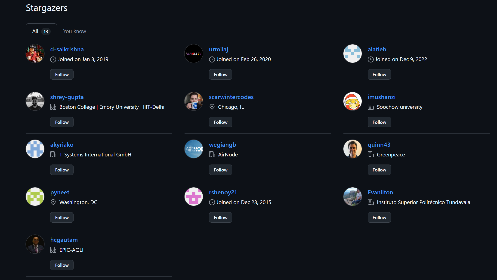

<!-- README.md is generated from README.Rmd. Please edit that file -->

# 🎉 biteSizedAQ Turns One! Celebrating with AirGradient Monitors Giveaway + New Logo Reveal

Hello air quality enthusiasts!

I’m excited to announce a special milestone — **biteSizedAQ just turned
one year old!** biteSizedAQ now has 15 projects under it’s belt and it’s
growing! All content is provided fully openly. You can explore all
projects here: <https://github.com/AarshBatra/biteSizedAQ/tree/main>.

To celebrate this journey of making air quality data accessible, open,
and easy to understand, I’m thrilled to launch a **global giveaway** of
two outdoor air quality monitors, thanks to the generous support from
**AirGradient**, plus a brand new biteSizedAQ logo reveal!

## 🎁 Giveaway: Win One of Two Outdoor AirGradient Monitors

AirGradient, a leader in affordable and open-source air quality
monitoring technology, has kindly provided **two [AirGradient Open Air
Outdoor O1-PST](https://www.airgradient.com/outdoor/#comparison)
monitors (fully assembled and tested)** to be given away — completely
free of cost! These monitors are perfect for anyone passionate about
clean air, open data, and community-driven environmental action.

Whether you’re a student, educator, researcher, maker, activist, or just
curious about air pollution, this is your chance to join the global
effort to measure, visualize, and share air quality data openly.

### Who Can Apply?

**Anyone, anywhere in the world!**

**Fill in this survey:** <https://forms.gle/PMf3dH2iwoq7ebrBA>

While the giveaway is open globally, preference will be given to
applicants from regions with limited or no existing air quality
monitoring infrastructure. However, this is not a requirement to
participate.

### Important Dates

🗓️ **Deadline for submissions:** June 22 (Sunday), 11:59 pm IST (Indian
Standard Time, GMT+5:30)

Winners will be announced soon after the deadline.

## 🌍 Why This Matters: Building Cleaner, More Informed Communities

Air pollution can often feel overwhelming, but the biteSizedAQ
philosophy reminds us that even the largest challenges can be tackled
with small, manageable steps. By breaking down the complex issue of air
quality into digestible pieces — or “bite-sized” chunks — we empower
individuals and communities to take meaningful action.

This giveaway is about supporting that movement: putting tools into the
hands of those who want to learn, share, and build a healthier
environment together.

## 🔍 About biteSizedAQ

biteSizedAQ is a fully open source project focused on democratizing air
quality data by making it accessible, understandable, and actionable for
everyone. All resources and projects under this repository are shared
freely under the **Creative Commons BY 4.0 International License**,
meaning anyone can use, share, or build on the work.

Want to explore? Check out the biteSizedAQ projects and star the repo
here:  
👉 <https://github.com/AarshBatra/biteSizedAQ>

## 💡 About AirGradient

AirGradient is at the forefront of creating affordable, open-source air
quality monitors used in over 70 countries worldwide. Their mission is
to empower communities with tools to understand and advocate for cleaner
air.

Key principles AirGradient stands by:

- 🔥 **Positive Disruption**: Boldly tackling critical air quality
  challenges

- 🧑🏽‍🤝‍🧑🏻 **Community Building**: Supporting education and environmental
  justice

- ♻️ **Sustainability**: Durable, repairable, and reusable products

- 💚 **Impact Over Profit**: Prioritizing mission-driven goals

- 🧪 **Open Science**: Sharing designs, data, and algorithms openly

- 🔍 **Equity & Accessibility**: Focusing on underserved communities

Their vision closely aligns with biteSizedAQ’s — making air quality data
open, inclusive, and actionable for all.

Learn more about AirGradient’s impactful work here:  
👉 <https://www.airgradient.com/>

## Ready to Join?

I can’t wait to read your applications and learn how you plan to use an
AirGradient monitor to make a difference in your community or research!
Together, let’s take one step at a time toward cleaner air and a
healthier planet.

Thank you for being part of the biteSizedAQ journey!

— **Aarsh Batra, Founder, biteSizedAQ**

*Feel free to share this post with anyone interested in air quality and
open data.*

## Support This Work: Give It a Star

Thank you for reading! If you found this project helpful or interesting,
please consider starring it on GitHub. Your stars help others discover
and benefit from this fully open and free repository. Click [here to
star the
repository](https://github.com/AarshBatra/biteSizedAQ/stargazers) and
join other folks who follow biteSizedAQ.

## License and Reuse

All content under biteSizedAQ is shared under the Creative Commons
Attribution 4.0 International (CC BY 4.0) license. You are welcome to
use this material in your reports or news stories. Just remember to give
appropriate credit and include a link back to the original work. Thank
you for respecting these terms!

## Get in touch

Get in touch about related topics/report any errors. Reach out to me at
aarshbatra.in@gmail.com.
