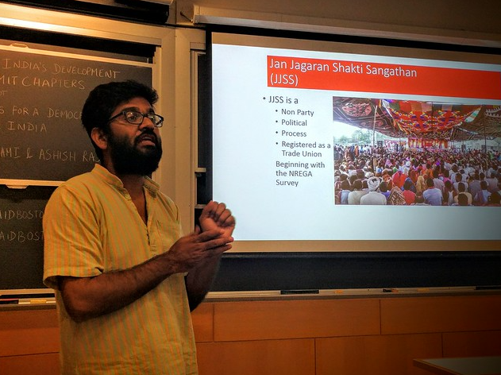
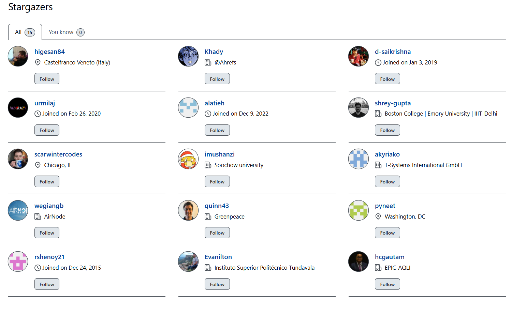

<!-- README.md is generated from README.Rmd. Please edit that file -->

# 🎉 biteSizedAQ x AirGradient AQ Monitors Giveaway Results!

Quick Recap: In June 2025, as biteSizedAQ turned one, I partnered with
[AirGradient](https://www.airgradient.com/) to do a monitor giveaway and
they graciously offered **two free outdoor air quality monitors** to
individuals who are willing to step up and drive air pollution
mitigation efforts in their communities.

The goal? Empower communities with affordable, real-time data to see and
act on the air they breathe.

Over the course of 2 weeks, we received 34 thoughtful applications from
14 countries — including ***India, Peru, Spain, the US, France, Italy,
Canada, Colombia, Nigeria, Rwanda, South Africa, The Gambia, Bangladesh,
and Pakistan***. Each one reflected a deep and inspiring commitment to
cleaner air and community action.

We have now selected 2 candidates from this list. Thanks to the generous
support of AirGradient, the monitors are on their way to these
changemakers!

## 🎉 The Winners

After reviewing 34 applications from 14 countries, I’m thrilled to
announce the 2 winners of this give away:

### Sebastián Guillén Chávez (Lima, Peru)

Sebastián is an environmental engineer from Peru whose commitment to
protecting fragile ecosystems stems from personal experience. In 2019,
the coastal hills near his home did not turn green as expected - a
seasonal shift that failed to arrive, disrupting both the environment
and the local economy that depends on nature-based tourism.  
  
Witnessing this, Sebastián began volunteering in community-led
environmental initiatives, gradually deepening his involvement in
efforts to understand and protect his surroundings. That experience
continues to shape his work today as he leads efforts to bring air
quality monitoring to one of Peru’s unique coastal hill ecosystems.  
  
Sebastián is planning to install the community-based air quality monitor
at the Interpretation Center of the Lomas de Lúcumo, a natural area
increasingly threatened by urban expansion and human activity. The
monitor will collect data on various pollutants, filling a critical gap
in environmental information for this ecosystem and complementing
existing meteorological records.  
  
With its placement in a visible, publicly accessible location, the
device will also serve as an educational tool. Local volunteers and
students will be trained to participate in the monitoring, fostering
environmental education and engagement.  
  
Sebastián’s work is supported by Evelyn Melgar, CEO of Mangle Consultora
an Environmental Consultancy firm in Peru. Together, they plan to raise
awareness and involve a broader audience through interviews, outreach,
and ongoing collaboration with the community.

### Ashish Ranjan (Araria, Bihar, India)

Ashish is a grassroots activist based in Araria, Bihar, where he works
with Jan Jagran Shakti Sangathan, a trade union of unorganized rural
workers. Trained as an engineer, he now devotes himself fully to
community organizing and advocacy. His interest in air quality took
shape during a local protest against a meat processing factory, where
foul odours had made daily life difficult for nearby residents. The
agitation drew strong public participation, and while no formal action
was taken, the factory eventually made some improvements. The experience
left a lasting impression on Ashish, reinforcing how deeply
environmental issues affect people’s lives and how collective action can
push for change, even in small ways.  
  
Ashish has since become more aware of the poor air quality in Araria—a
rural town without major industries, yet still burdened by dust and
pollution. He plans to install an air quality monitor in a location that
will have the most impact, with the aim of identifying sources of
pollution and opening up conversations around mitigation.  
  
In this effort, Ashish is working in collaboration with Rashmi Krishnan,
a PhD candidate in Environmental Health Sciences at UC Berkeley, who is
offering support to Ashish as the project takes shape. Together, they
hope to bridge the gap between data and lived experience, making air
quality a visible and actionable issue for communities often left out of
the conversation.

  
Both Ashish and Sebastien, alongside their teams will install and
maintain these monitors to generate low cost sensor based AQ monitoring
awareness in their respective communities.  
  
Furthermore, in line with the Open Source ideals of biteSizedAQ and
AirGradient - both candidates aim to share this data fully openly with
everyone.

By doing so they not only help raise awareness of the issue in their
local community, but also allow others interested in tackling air
pollution in those regions to use that data for the greater good.

I thank you all for your efforts and all the time you have and will put
into raising awareness via this initiative in the near future!

## 🌍 To those Who Applied but did not get a Monitor

Given the limited number of monitors available in this round, we had to
make some very difficult choices. Many strong and deserving applications
couldn’t be selected - not because their applications weren’t
compelling, but simply because of the limited resources available.

We want you to know that even though your application wasn’t selected,
your effort and vision are seen and valued.

If we’re able to offer more monitors or run similar opportunities in the
future, we would be thrilled to consider your application again.

Below is the list of all applicants who applied (and consented to share
their stories), alongside a little bit about their ambitions, plans and
motivation to tackle air pollution. All of these candidates stepped up
to apply for the give away and in doing so they took the first most
important step - realizing and accepting that we have a serious problem
that needs serious citizen level engagement.

We applaud your efforts and encourage you to not get discouraged, but
rather continue your efforts to tackle air pollution in your respective
communities. Your voice needs to be heard!

Below are the **21 individuals** (excluding winners) who gave permission
to share their plans:  

| Name                               | Country       | Plans to tackle Air Pollution                                                                                                                                                                                                                                                                                                                                                                                                                                                                                                                                                                                                                                      |
|------------------------------------|---------------|--------------------------------------------------------------------------------------------------------------------------------------------------------------------------------------------------------------------------------------------------------------------------------------------------------------------------------------------------------------------------------------------------------------------------------------------------------------------------------------------------------------------------------------------------------------------------------------------------------------------------------------------------------------------|
| Alexis Pelhâte                     | France        | Linux System Administrator from Buxerolles, France, working at Datacampus. Lives in an area with generally minor pollution but wants to share data widely through applications like AirVisual to increase public interest and awareness about air quality monitoring.                                                                                                                                                                                                                                                                                                                                                                                              |
| Aniket Chavan                      | India         | Research scholar from Nagpur, Maharashtra, India, at VNIT studying Environmental Engineering. Experiences seasonal pollution and wants to use the monitor as supplementary data for PhD research on seasonal and spatial air pollution trends in areas without CAAQMS coverage.                                                                                                                                                                                                                                                                                                                                                                                    |
| Boudewijn Sterk                    | Bangladesh    | General Manager from Dhaka, Bangladesh, at Smart Air Bangladesh. Deals with persistent air pollution and wants to highlight that air pollution affects areas beyond Dhaka, specifically monitoring industrial sites and making pollution data visible to the public.                                                                                                                                                                                                                                                                                                                                                                                               |
| Dr Chantelle Howlett-Downing       | South Africa  | Senior Scientist from Pretoria, South Africa, at South African Medical Research Council. Faces persistent air pollution and plans to use the monitor in unmonitored areas affected by coal mining and power stations for health exposure studies and complex statistical analysis.                                                                                                                                                                                                                                                                                                                                                                                 |
| Dr. Muhammad Ibrahim               | Pakistan      | Teaching professional from Faisalabad, Punjab, Pakistan, at Government College University Faisalabad. Faces persistent air pollution and plans to use the monitor for student/faculty data provision, research projects, and policy advisory support.                                                                                                                                                                                                                                                                                                                                                                                                              |
| Gunta Paparao                      | India         | Senior Meteorologist from Hyderabad, India, affiliated with Andhra University. Faces growing but not yet severe air pollution concerns. Plans to use the sensor for air quality modeling validation and community awareness about pollution changes over time and weather patterns.                                                                                                                                                                                                                                                                                                                                                                                |
| Ibeh, Gabriel Friday (PhD)         | Nigeria       | Lecturer from Asaba, Delta, Nigeria, at Dennis Osadebay University. Deals with persistent air pollution and plans to use the monitor for household and community benefit, organizing educational workshops and advocating for cleaner air initiatives.                                                                                                                                                                                                                                                                                                                                                                                                             |
| Jean Jules Cyubahiro               | Rwanda        | Warden guide at Museum of Environment from Karongi, Rwanda, working for Rwanda Cultural Heritage Academy and studying at University of Lay Adventist of Kigali. Faces growing air pollution concerns and plans to use the monitor for providing data to authorities and enhancing museum services.                                                                                                                                                                                                                                                                                                                                                                 |
| Jennyfer Magdalia Garzón Gutiérrez | Colombia      | Environmental consultant from Villavicencio, Colombia, affiliated with Universidad Nacional de Colombia Sede Bogotá. Deals with growing pollution concerns and plans to install the monitor at university properties to assess environmental pollution levels and impacts on local species.                                                                                                                                                                                                                                                                                                                                                                        |
| Juan Camilo Cely Garzón            | Colombia      | Full-time university lecturer and doctoral student from Bogotá, Colombia, at Universidad de América. Deals with persistent air pollution and plans to install the monitor at the university for academic, research, and outreach purposes, complementing it with meteorological station data. Plans to install the monitor on a secure, well-equipped rooftop for teaching, research, and outreach in environmental programs. Located near a major traffic corridor and supported by a new meteorological station, the site is ideal for studying urban air quality. As a GICA member and doctoral student, he is committed to open science and public engagement. |
| Manoura Begum                      | India         | Waste worker from Madhubani, Bihar, India, affiliated with Warrior Moms/Safai Sena. Deals with persistent pollution from waste and biomass burning. Plans to use data for community advocacy with local government and education initiatives, particularly focusing on vulnerable populations.                                                                                                                                                                                                                                                                                                                                                                     |
| Marcomattia Mocellin               | Italy         | Software Development Tech Lead from Castelfranco Veneto, Italy. Experiences seasonal pollution issues and wants to monitor air quality changes around his garden location, which sits between a wild patch and a heavily trafficked road, to study correlations with his forced ventilation system.                                                                                                                                                                                                                                                                                                                                                                |
| Muawiya Sani                       | Nigeria       | Scientific Research Officer from Kano, Nigeria, at Center for Atmospheric Research. Faces persistent air pollution and plans to use the monitor for research and community engagement on air pollution in Nigeria, focusing on underserved urban or semi-urban areas like Kano or Katsina. As a coordinator at the Centre for Atmospheric Research, I will use the device to collect local PM2.5 and PM10 data, support satellite validation, and train machine learning models. The data will also be shared through schools, public dashboards, and outreach sessions to build air quality awareness and inform policy in affected communities.                  |
| Najib Yusuf Galadanci              | Nigeria       | Public Service worker from Anyigba, Kogi State, Nigeria, at Centre for Atmospheric Research. Faces persistent air pollution problems and plans to install the monitor alongside existing meteorological stations as part of the TRODAN network for scientific community data dissemination.                                                                                                                                                                                                                                                                                                                                                                        |
| Ryan Kmetz                         | United States | Environmental Consultant and stay-at-home dad from Baltimore, MD, affiliated with AGU and IQSpatial. Deals with persistent air pollution issues and plans to provide open community data on air quality and extreme heat, integrating it into free GIS resources for interactive mapping.                                                                                                                                                                                                                                                                                                                                                                          |
| Saheen Tarannum                    | India         | Housewife and concerned mother from Cuttack, Odisha, India, affiliated with Warriormom Odisha. Deals with persistent air pollution from coal gypsum dumping and wants to use the monitor to provide evidence to state pollution board officials who currently conduct biased inspections.                                                                                                                                                                                                                                                                                                                                                                          |
| Saif Shahrukh                      | Bangladesh    | Lecturer from Dhaka, Bangladesh, at University of Dhaka. Deals with persistent air pollution and plans to use the monitor for research on air quality variations and health outcomes, while publicly sharing real-time data with the campus community through digital displays and online dashboards.                                                                                                                                                                                                                                                                                                                                                              |
| Saurabh Mendiratta                 | India         | Technical Lead - Environment from Delhi, India, working with United Way of Delhi. Faces persistent year-round air pollution problems. Plans to use monitor for personal residential mounting and official use to check reliability against government monitors in Gurugram.                                                                                                                                                                                                                                                                                                                                                                                        |
| Saúl Martínez Molina               | Colombia      | Chemical Engineer from Villavicencio, Colombia, at Universidad de los Llanos. Experiences growing air pollution concerns and plans to use the monitor for student learning and community information in an area with scarce air quality data.                                                                                                                                                                                                                                                                                                                                                                                                                      |
| Shaik Darga Saheb                  | India         | Founder of Center for Sustainable Environment and Education in Hyderabad, India. Faces persistent air pollution problems and runs a non-profit lacking funds for monitoring instruments. Plans to study air quality and health impacts across different urban zones in Hyderabad.                                                                                                                                                                                                                                                                                                                                                                                  |
| Sotirios Papathanasiou             | Spain         | Lead Author from Granada, Spain, affiliated with Global Open Air Quality Standards. Faces seasonal air pollution issues and wants to contrast measurements with local stations that frequently malfunction. Plans to make data open to raise community awareness in Granada, which has few low-cost sensors.                                                                                                                                                                                                                                                                                                                                                       |

***Eleven other applicants applied but chose anonymity. They came from
Canada, the USA, India, Nigeria, and Pakistan, proposing everything from
rural pilots to health-focused workshops, each very compelling.***

I thank you all for your time and effort and I hope you continue to
engage in the AQ space.

## Why Low‑Cost Sensors Matter?

Imagine living in a city or village and not knowing the quality of the
air you breathe each day. In many parts of the world—especially
low-income, rural, or marginalized areas—this is still the case.
Reference grade air quality stations (usually govt based) are few and
far between, very expensive to set up and in some places, they don’t
exist at all. Even where stations exist, their data is often outdated,
inaccessible, or not trusted by communities.

Low-cost air quality monitors offer a path forward. These small,
affordable tools give communities the ability to collect real-time,
hyperlocal data. They make pollution visible—turning invisible threats
into concrete information. This empowers ordinary people: students,
activists, teachers, parents, journalists. It allows them to understand
the scale of the problem, advocate for cleaner air, and take
data-informed steps to protect public health.

***You might think - what would a single AQ sensor do?***

Of course, a single sensor won’t solve everything and is not as accurate
as it’s 100x costly reference grade counterpart, ***but in a place where
no awareness exists, a single monitor is the difference between nothing
and something and it can spark awareness, build momentum, and create
pressure for action - which can overtime lead to larger
interventions.***

Concerned citizen just like the applicants of this give away have done
this in different parts of the world and as a result their communities
are much more aware about the issue at hand and accordingly are raising
awareness and taking action to tackle air pollution in their respective
communities.

A recent great example is the EPIC Air Quality Fund Awardee, WASARU,
launched a particulate pollution monitoring network—providing the only
open, real-time air quality data in the DRC. Read more about them
[here](https://aqfund.epic.uchicago.edu/news/democratic-republic-of-the-congo-gains-access-to-air-pollution-data/).
There are numerous other examples of community led initiatives and you
can read more about them
[here](https://aqfund.epic.uchicago.edu/global-reach/).

> ***That’s why even one monitor counts! and that’s why getting these
> useful tools into more hands (especially in resource constrained
> settings disproportionately hit by air pollution) matters so much.***

## Why More Funding Is Crucial?

Reading the applications for this giveaway was both inspiring and
difficult. People across 14 countries came forward with creative,
thoughtful, and highly needed ideas, everything from student-led school
campaigns and open-data dashboards to village monitoring pilots,
concerned parents and health impact research.

But in the end, I only had two monitors to give away - selecting 2 from
the incredible pool of 34 applicants was very difficult.

***This points to a deeper issue. While passion, skills, and ideas exist
in abundance, what’s missing is funding.*** Philanthropic support for
grassroots air quality initiatives is still far too limited. We need
donors, organizations, and institutions to step in and help scale
efforts like these so that anyone who wants to raise awareness about AQ
and related issues, isn’t constrained by the lack of available
resources.

***According to the State of Global Air Quality Funding 2024 report by
Clean Air Fund - between 2018 and 2022 - only 1% of the international
development funding went to clean air projects and only 3% of global
public climate finance went to clean air projects. This is extremely
low.***

Investing and funding Air Pollution mitigation work is ultimately about
investing in building a healthy community. It’s not just about saving
lives, with cleaner air we can live fuller the best of our potential.

The need is clear. The people are ready. With the right backing, we can
move from isolated pilots to global networks of citizen-led,
sensor-powered air monitoring, which will spark the discussions, bring
out the data and will be used as the foundation for encouraging
governments of the respective nations to invest in national air
pollution mitigation plans, by bringing them into legislation.

Read more about the state of funding in this space in the following blog
by Clean Air Fund
[here](https://www.cleanairfund.org/resource/air-quality-funding-2024/).

## Finally, a Suggestion: Collaborate Locally!

If you applied, or even if you’re just following this work—and know
someone nearby doing something similar, get in touch with them, maybe
they’ll be interested in collaborating with you! One of the most
powerful things we can do is join forces.

Collaboration doesn’t need to be formal right away. You can start by
sharing your readings, comparing notes, and discussing what you’re
seeing, or what your concerns are. Over time, you might co-host a
community workshop, present together to local leaders, or create a
shared dashboard. ***This can be done at your own pace, but what matters
is that it “should be done”.***

Some of the applicants in this giveaway may live in the same city or
region without knowing each other. Finding and supporting one another
can make efforts more visible, more credible, and more sustainable.
Change is always stronger when it’s collective.

***If you work in the AQ space and even if you didn’t apply for this
giveaway but you’d like to collaborate with some of the candidates
above. I encourage you to get in touch, have a chat and maybe something
will come out of that.***

## What’s Next?

Keep going!

- Raise awareness about AQ and related issues

- Find fellow like minded folks to collaborate with in your community

- Explore funding opportunities from organizations like EPIC AQ Fund,
  Clean Air Fund, among others.

- Apply for funding where available

- Network with local leaders and politicians and raise awareness about
  these topics

- Reach out to me, I’m always up for a chat and further to find ways to
  potentially collaborate on projects

- Star the [biteSizedAQ GitHub
  repo](https://github.com/AarshBatra/biteSizedAQ) to keep track of
  upcoming future opportunities

Again, a huge thanks to **AirGradient** for their generous donation, and
to everyone who applied, I appreciate the time you took to engage in
this and I hope you continue your efforts in your respective
communities!

Clean air starts with knowing what’s in the air. Let’s keep making it
visible for all!

## Support This Work: Give It a Star

Thank you for reading! If you found this project helpful or interesting,
please consider starring it on GitHub. Your stars help others discover
and benefit from this fully open and free repository. Click [here to
star the
repository](https://github.com/AarshBatra/biteSizedAQ/stargazers) and
join other folks who follow biteSizedAQ.

## License and Reuse

All content under biteSizedAQ is shared under the Creative Commons
Attribution 4.0 International (CC BY 4.0) license. You are welcome to
use this material in your reports or news stories. Just remember to give
appropriate credit and include a link back to the original work. Thank
you for respecting these terms!

## Get in touch

Get in touch about related topics/report any errors. Reach out to me at
aarshbatra.in@gmail.com.
