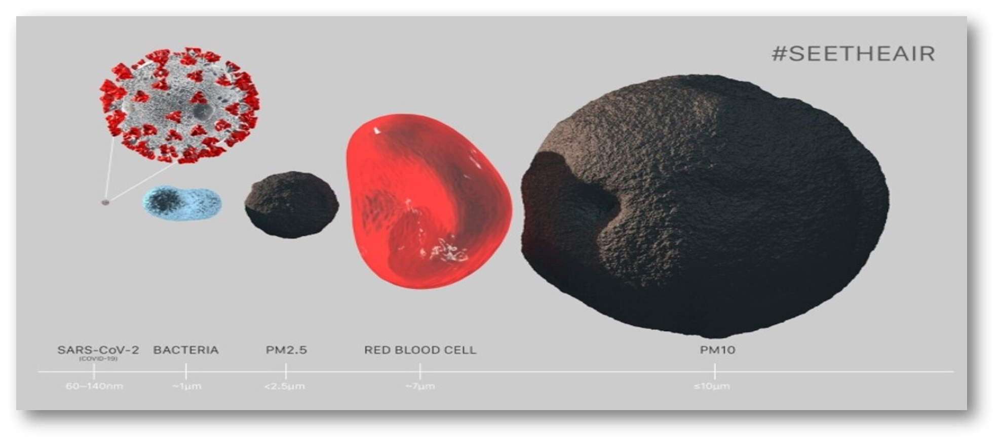

<!-- README.md is generated from README.Rmd. Please edit that file -->

```{r, include = FALSE}
knitr::opts_chunk$set(
  collapse = TRUE,
  comment = "#>",
  fig.path = "man/figures/README-",
  out.width = "100%"
)
```

<!-- badges: start -->

<!-- badges: end -->

# Deciphering Air Pollution Units: Essential Insights for Informed Action

## Table of Contents

-   [Introduction]
-   [Units of measurement](#units-of-measurement)
-   [Particulate Matter \| micrograms per cubic meter](#sec-particulate-matter--micrograms-per-cubic-meter)
    -   [Understanding Variations in Health Impacts Due to Particle Size]
-   [Pollutants Measured in Parts Per Billion (ppb)](#pollutants-measured-in-parts-per-billion-ppb)
    -   [Why Different Pollutants at the Same ppb Can Have Varying Impacts?]
-   [Pollutants Measured in Parts Per Million (ppm)](#pollutants-measured-in-parts-per-million-ppm)
    -   [Understanding ppm and Health Impacts]
    -   [Vulnerable Populations and Health Effects]
    -   [Parts per million v/s Parts per billion]
-   [Additional Pollutants and Their Units and health impacts]
    -   [Lead (Pb)](#lead-pb)
    -   [Ammonia (NH3)](#ammonia-nh3)
    -   [Benzene (C6H6)](#benzene-c6h6)
    -   [Formaldehyde (CH2O)](#formaldehyde-ch2o)
    -   [Polycyclic Aromatic Hydrocarbons (PAHs)](#polycyclic-aromatic-hydrocarbons-pahs)
    -   [Heavy Metals (Arsenic, Cadmium, Mercury)](#heavy-metals-arsenic-cadmium-mercury)
    -   [Black Carbon (BC)](#black-carbon-bc)
    -   [Hydrogen Sulfide (H2S)](#hydrogen-sulfide-h2s)
    -   [Radon (Rn)](#radon-rn)
    -   [Chlorine (Cl2)](#chlorine-cl2)
-   [Conclusion (an urgent need for action!)](#conclusion-an-urgent-need-for-action)
-   [Image citations]
-   [Rmd for this blog]
-   [Support This Repository: Give It a Star]
-   [Get in touch]
-   [License and Reuse](#license-and-reuse)

## Introduction

According to the [State of Global Air 2024 report](https://www.stateofglobalair.org/resources/report/state-global-air-report-2024), air pollution contributed to 8.1 million deaths — more than 1 in 8 deaths worldwide. It was the second leading risk factor for death among children under 5 in 2021, after malnutrition. 99% of the world’s population lives in places with unhealthy levels of PM2.5 pollution. 34% lives in areas that exceed even the least stringent WHO interim air quality targets.


## Units of measurement {#units-of-measurement}

There are various types of pollutants out there and each pollutant is measured and reported in specific units that best captures its nature and concentration in the air. Similar to how you measure length in meters or centimeters, air pollution can be measured in different types of units, e.g. micrograms per cubic meter, ppm (parts per million), ppb (parts per billion), etc. Understanding these units of measurement for air pollution is important because it helps us know how much of a pollutant is in the air. These units tell us if the air is safe to breathe or if it might harm our health. It's especially important because there are many different units for different pollutants, and individual particles or molecules are so tiny that they are not visible to the naked eye.

Furthermore, these numbers are reported in volumes or mass concentrations which can make it difficult to get a good intuition of what the numbers mean. For e.g. what does it mean for a region to have an annual average of 20 micrograms per cubic meter of PM2.5 mean? Why does such a seemingly small amount of PM2.5 can be so much harmful?

Getting an intuitive sense of these units in context of different pollutants can help us better understand and appreciate how to properly interpret these numbers and the grave health concerns attached to them. It also helps us compare air quality in different places and at different times. This helps us understand how serious the pollution problem is in different parts of the world and track improvements or worsening conditions. When we understand these measurements, we can make better choices to protect our health and push for cleaner air policies.

I'll go through examples of different pollutants and the units in which they are measured and unpack what each of these mean. No prior background in air pollution is necessary to understand the text ahead.

## Particulate Matter \| micrograms per cubic meter {#sec-particulate-matter--micrograms-per-cubic-meter}

Particulate matter (PM) consists of tiny particles or droplets in the air, classified based on their diameter. PM10 includes particles 10 micrometers or smaller, while PM2.5 encompasses particles 2.5 micrometers or smaller. If you put 30 PM2.5 particles stacked adjacent to each other, that width will equal the width of an average human hair. That's how small these PM2.5 particles are. They pose significant health risks. Below is another reference image (source: <https://seetheair.org/>) that shows how small these particles are.

[](https://seetheair.org/)

Ultrafine particles also exist, also known as nanoparticles. They represent another category of particulcate matter characterized by their exceptionally small size, typically less than 0.1 micrometers in diameter. These particles are significantly smaller than both PM2.5 (particulate matter with diameters less than 2.5 micrometers) and PM10 (particulate matter with diameters less than 10 micrometers), allowing them to penetrate even deeper into the body.

Generally speaking, the smaller the size of the particle the more harmful it is to our health.

Imagine the air around us has these tiny particles of dust and dirt that are so small you can't see them without a microscope. So, for example, when we say there are 10 micrograms per cubic meter of PM2.5, it means in every cubic meter of air (which is about the size of a very small car), there are 10 micrograms (which is a very, very tiny amount) of these particles floating around. It's like having a few grains of sand spread out in a very small car.

The word "concentration" in 10 micrograms per cubic meter of concentration of PM2.5, means that there is a certain number of PM2.5 particles in a given space (e.g. a small car, which is roughly a cubic meter), those particles combined weight is 10 micrograms, which is a millionth of a gram, which is roughly equal to the weight of 10 tiny grains of sands.

### Understanding Variations in Health Impacts Due to Particle Size

The same concentration of particulate matter (PM10 and PM2.5), such as 10 micrograms per cubic meter, can lead to vastly different health impacts due to their size and composition.

As an example, if one room has 10 micrograms per cubic meter of PM2.5 and another has 10 micrograms per cubic meter of PM10, the implications are different. Despite both rooms having the same total weight of particles (10 micrograms), the 10 micrograms of PM2.5 is much more harmful than the 10 micrograms of PM10. This is because for the same concentration, PM2.5 corresponds to a much larger number of tiny, harmful particles compared to PM10.

For instance, roughly speaking, 1 microgram per cubic meter of PM2.5 can contain tens of millions of particles, 10 micrograms has hundreds of millions, and 100 micrograms means billions of these tiny particles.

In contrast, PM10 particles are relatively larger than PM2.5, but still very harmful; 1 microgram per cubic meter can contain hundreds of thousands of particles, 10 micrograms means millions, and 100 micrograms has tens of millions of particles, causing irritation and respiratory problems.

This is why even in small quantities, these particles can be extremely harmful. For instance, WHO's definition of safe level of PM2.5 is an annual average of 5 micrograms per cubic meter. This means that in any given region if you average out pollution numbers over the year, it should be less than or equal to 5 micrograms per cubic meter. But, almost every region in the world is out of compliance with this guideline.

PM2.5 and ultrafine particles can deeply penetrate the lungs and enter the bloodstream, causing severe respiratory issues such as aggravated asthma, bronchitis, and reduced lung function. These fine particles are also associated with increased risk of heart attacks, strokes, and premature death due to their ability to carry toxic compounds deep into the body.

On the other hand, PM10 particles, which are larger (up to 10 micrometers), primarily affect the upper respiratory tract, leading to irritation of the nose and throat, as well as exacerbation of respiratory conditions like asthma and chronic bronchitis. While PM10 particles are less likely to reach the deepest parts of the lungs compared to PM2.5, they still contribute to respiratory and cardiovascular problems, particularly in vulnerable populations such as children, the elderly, and individuals with pre-existing health conditions.

Technically no level of PM is good for us, which is why WHO overtime reevaluates it's official guidelines and updates these guidelines, as new research in areas with low PM2.5/PM10 concentrations surfaces.

## Pollutants Measured in Parts Per Billion (ppb) {#pollutants-measured-in-parts-per-billion-ppb}

Ozone (O3), Nitrogen Dioxide (NO2), Sulfur Dioxide (SO2), and Carbon Monoxide (CO) are some of the pollutants that are all usually measured in parts per billion (ppb), indicating the number of pollutant molecules per billion air molecules. For instance, a measurement of 50 ppb means there are 50 molecules of the pollutant for every billion air molecules.

Don't be fooled by the seemingly insignificant 50 molecules of these pollutants per billion air molecules! Even at this low concentration, they can have serious health implications. Each pollutant at 50 ppb can cause different levels of harm, just as the same concentration of PM10 and PM2.5 have different health impacts, with PM2.5 being much more harmful.

### Why Different Pollutants at the Same ppb Can Have Varying Impacts?

The health impacts of pollutants at the same parts per billion (ppb) concentration can vary significantly due to several key factors:

-   **Chemical Properties:**

    -   Ozone (O3): Ozone is a highly reactive gas that can directly damage lung tissue when inhaled. Even at low concentrations like 50 ppb, ozone can cause oxidative stress, which means it generates harmful molecules that can damage cells. This can lead to inflammation in the respiratory system, causing symptoms such as coughing, chest tightness, and shortness of breath.

    -   Nitrogen Dioxide (NO2): NO2 is a respiratory irritant that can exacerbate asthma and reduce lung function. At 50 ppb, NO2 can cause respiratory symptoms and increase susceptibility to respiratory infections, particularly in children and the elderly.

    -   Sulfur Dioxide (SO2): SO2 is also a respiratory irritant but acts differently from NO2. It can directly irritate the airways and exacerbate conditions like asthma and bronchitis. Exposure to 50 ppb of SO2 can lead to acute respiratory symptoms and contribute to long-term respiratory health issues.

    -   Carbon Monoxide (CO): CO interferes with the body's ability to transport oxygen in the bloodstream. At 50 ppb, CO can impair cognitive function, cause headaches, and lead to cardiovascular complications, especially in individuals with pre-existing heart conditions.

-   **Toxicity and Mechanisms of Action:**

    -   Direct vs. Indirect Effects: Pollutants like ozone and nitrogen dioxide directly affect the respiratory system by causing oxidative stress, which generates harmful molecules that can damage cells, and inflammation, which can lead to breathing problems. On the other hand, carbon monoxide is toxic because it binds to hemoglobin in the blood, reducing the amount of oxygen that can be delivered to tissues throughout the body.

    -   Systemic vs. Local Effects: Ozone and nitrogen dioxide primarily affect respiratory health by causing oxidative stress and inflammation, leading to respiratory problems. In contrast, carbon monoxide's effects are systemic, meaning they affect the entire body. It interferes with oxygen delivery by binding to hemoglobin in the blood, which can reduce oxygen levels in tissues and potentially affect neurological function.

-   **Health Effects and Vulnerable Populations:**

    -   Immediate and Long-term Health Impacts: Some pollutants, like nitrogen dioxide and sulfur dioxide, cause immediate respiratory symptoms and exacerbate chronic conditions over time. Carbon monoxide, while also harmful, may lead to acute symptoms and affect neurological function.

    -   Impact on Vulnerable Populations: Vulnerable populations such as children, the elderly, and individuals with pre-existing respiratory or cardiovascular conditions may experience heightened sensitivity to specific pollutants at the same ppb concentration.

## Pollutants Measured in Parts Per Million (ppm) {#pollutants-measured-in-parts-per-million-ppm}

Pollutants such as Carbon Dioxide (CO2), Methane (CH4), and certain Volatile Organic Compounds (VOCs) are typically measured in parts per million (ppm). This unit indicates the number of pollutant molecules per million air molecules, providing a measure of concentration that helps assess the impact on air quality and health. For example, a concentration of 1 ppm means there is one molecule of the pollutant for every million air molecules, which is equivalent to 1000 parts per billion (ppb).

### Understanding ppm and Health Impacts

Similar to ppb, the health effects of pollutants measured in ppm vary significantly based on their chemical properties and mechanisms of action. Each pollutant's unique characteristics determine its potential to cause harm, even at the same concentration.

#### **Carbon Dioxide (CO2):**

-   CO2 is naturally present in the atmosphere and essential for life. However, elevated levels (above 1000 ppm) can cause adverse health effects. High concentrations can lead to symptoms like headaches, dizziness, shortness of breath, and impaired cognitive function. Prolonged exposure to elevated CO2 in poorly ventilated areas can exacerbate respiratory conditions and negatively affect indoor air quality.

#### **Methane (CH4):**

-   Methane itself is not highly toxic, but it plays a significant role in air pollution by contributing to the formation of ground-level ozone, a major component of smog. Elevated ozone levels can lead to respiratory problems, including coughing, throat irritation, and worsening of asthma and other chronic respiratory diseases.

#### **Volatile Organic Compounds (VOCs):**

-   VOCs encompass a wide range of organic chemicals, such as benzene, formaldehyde, and toluene. Even at low ppm concentrations, VOCs can cause significant health impacts. Short-term exposure to high levels of VOCs can result in eye, nose, and throat irritation, headaches, dizziness, and nausea. Long-term exposure can lead to more severe health issues, such as liver and kidney damage, central nervous system damage, and an increased risk of cancer.

### Vulnerable Populations and Health Effects

Certain populations are particularly vulnerable to the health effects of pollutants measured in ppm. These include children, the elderly, and individuals with pre-existing health conditions.

-   **Immediate vs. Long-term Impacts:** Pollutants like CO2 can cause immediate symptoms such as headaches and dizziness when levels are elevated. VOCs, however, can lead to both short-term irritation and long-term health issues like organ damage and cancer. Methane's role in forming ground-level ozone poses long-term respiratory risks.

-   **Susceptible Groups:** Children are more affected by VOC exposure due to their developing bodies and higher breathing rates. The elderly and those with respiratory or cardiovascular conditions are at higher risk from elevated CO2 and ground-level ozone levels, which can exacerbate their health issues.

### Parts per million v/s Parts per billion

Understanding why certain pollutants are measured in parts per billion (ppb) and others in parts per million (ppm) is crucial. The choice of units is based on the typical concentrations of these pollutants in the atmosphere and the sensitivity required for accurate measurement.

-   **Parts Per Billion (ppb):** This unit is used for pollutants that are harmful even at very low concentrations. For example, ozone (O3), nitrogen dioxide (NO2), and sulfur dioxide (SO2) can have significant health impacts at concentrations in the ppb range. Measuring in ppb allows for more precise monitoring and regulation of these pollutants to protect public health.

-   **Parts Per Million (ppm):** This unit is suitable for pollutants that are typically present in higher concentrations in the atmosphere. Carbon dioxide (CO2) and methane (CH4) are examples of such pollutants. Using ppm for these pollutants makes it easier to represent and manage their levels, as they are usually found in much higher quantities compared to pollutants measured in ppb.

The choice between ppb and ppm depends on the typical concentration range of the pollutant and the level of sensitivity needed to assess its impact on air quality and health. Measuring pollutants in appropriate units ensures accurate monitoring and effective regulation, ultimately aiding in the protection of public health and the environment.

## Additional Pollutants and Their Units and health impacts

While PM2.5, PM10, ultrafine particles and gases measured in micrograms per cubic meter, ppb and ppm are some of the most common pollutants, there are several other pollutants with unique measurement units that are important to consider. Here's a brief overview of these additional pollutants and their units of measurement:

#### Lead (Pb) {#lead-pb}

Lead is a toxic metal that can be found in the air as particulate matter. It is typically measured in micrograms per cubic meter (µg/m³). Lead exposure can cause serious health issues, particularly in children, including neurological damage and developmental delays.

#### Ammonia (NH3) {#ammonia-nh3}

Ammonia is a compound often associated with agricultural activities and industrial processes. It is usually measured in parts per million (ppm). High levels of ammonia can cause respiratory irritation and other health problems.

#### Benzene (C6H6) {#benzene-c6h6}

Benzene is a volatile organic compound (VOC) commonly found in industrial emissions and vehicle exhaust. It is measured in micrograms per cubic meter (µg/m³) or sometimes in parts per billion (ppb). Benzene exposure is linked to various health issues, including leukemia and other blood disorders.

#### Formaldehyde (CH2O) {#formaldehyde-ch2o}

Formaldehyde, another VOC, is often present in building materials and industrial emissions. It is measured in parts per billion (ppb). Long-term exposure to formaldehyde can lead to respiratory problems and has been classified as a carcinogen.

#### Polycyclic Aromatic Hydrocarbons (PAHs) {#polycyclic-aromatic-hydrocarbons-pahs}

PAHs are a group of organic compounds that are released from burning coal, oil, gas, wood, and other organic substances. They are typically measured in nanograms per cubic meter (ng/m³). PAHs can cause respiratory issues and have been linked to cancer.

#### Heavy Metals (Arsenic, Cadmium, Mercury) {#heavy-metals-arsenic-cadmium-mercury}

Various heavy metals can be present in the air, often as particulate matter. These are typically measured in nanograms per cubic meter (ng/m³) or micrograms per cubic meter (µg/m³). Exposure to heavy metals can cause a range of health issues, including neurological damage and cancer.

#### Black Carbon (BC) {#black-carbon-bc}

Black carbon, a component of particulate matter, is produced by incomplete combustion of fossil fuels, biofuel, and biomass. It is often measured in micrograms per cubic meter (µg/m³). Black carbon is linked to respiratory and cardiovascular diseases.

#### Hydrogen Sulfide (H2S) {#hydrogen-sulfide-h2s}

Hydrogen sulfide is a gas with a characteristic foul odor, often associated with industrial activities and natural sources like volcanic eruptions. It is measured in parts per million (ppm). High concentrations can be toxic, causing respiratory and neurological effects.

#### Radon (Rn) {#radon-rn}

Radon is a radioactive gas that is naturally occurring and can accumulate in buildings. It is measured in becquerels per cubic meter (Bq/m³). Long-term exposure to radon is a significant risk factor for lung cancer.

#### Chlorine (Cl2) {#chlorine-cl2}

Chlorine, used in various industrial processes, is measured in parts per million (ppm). Inhalation of chlorine gas can cause respiratory irritation and other serious health effects.

## Conclusion (an urgent need for action!) {#conclusion-an-urgent-need-for-action}

Air pollution poses a critical threat to global health, contributing to millions of deaths annually. Understanding the units used to measure pollutants—micrograms per cubic meter for particulate matter (PM), parts per million (ppm) and parts per billion (ppb) for gases—provides insight into their pervasive impact. Regulatory agencies worldwide set standards based on these measurements to safeguard public health, highlighting the need for stringent policies and continuous monitoring.

Individual action is equally pivotal. From reducing personal vehicle use to supporting renewable energy initiatives, simple lifestyle changes can significantly mitigate pollution. Grassroots organizations play a crucial role too, spearheading local initiatives like tree planting drives, community education programs, and advocating for cleaner industrial practices. These efforts demonstrate the power of collective action in combating air pollution.

Innovative solutions are emerging globally, showcasing a shift towards sustainability. Cities are implementing low-emission zones, while industries are adopting cleaner technologies. International collaborations are also pivotal; initiatives like the Paris Agreement underscore the global commitment to reducing emissions and mitigating climate change.

As individuals, communities, and governments unite in the fight against air pollution, awareness, advocacy, and policy implementation remain crucial. By fostering a deeper understanding of pollutant units and their implications, we empower ourselves to make informed decisions and drive positive change.

This knowledge equips professionals to make informed decisions in crafting regulations that effectively reduce the impact of air pollution on public health. It also enables them to recognize when these regulations need updating. Air pollution is dynamic and constantly evolving, requiring policies and regulations that are flexible enough to adapt and evolve accordingly. Together, we can forge a path towards cleaner air and a healthier future for all.

## Image Citations

-   Image 1, introduction section: generated via [openart.ai](https://openart.ai/home)

-   Image 2, PM section: <https://seetheair.org/>

## Rmd for this blog

Underlying Rmd file can be found at the root of the biteSizedAQ repo home page and here is a [quick link to access it](https://github.com/AarshBatra/biteSizedAQ/blob/main/2.air.pol.units.explainer/README.Rmd).

## Support This Repository: Give It a Star

Thank you for reading! If you found this project helpful or interesting, please consider starring it on GitHub. Your stars help others discover and benefit from this repository. Click [here to star the repository](https://github.com/AarshBatra/biteSizedAQ/stargazers).

## Get in touch

Get in touch about related topics, reach out to me at bitesizedaq@gmail.com.

## License and Reuse {#license-and-reuse}

All content is provided under Creative Commons Attribution 4.0 International (CC BY 4.0) license. This means you are welcome to reuse the data in your reports or news stories as long as you abide the terms of the license, which means you have to give credit and link back to the original work.

For more details, see the LICENSE file.

If you use this in your work, please cite this repository as follows:

[Aarsh Batra, 2024, biteSizedAQ, <https://github.com/AarshBatra/biteSizedAQ>]
