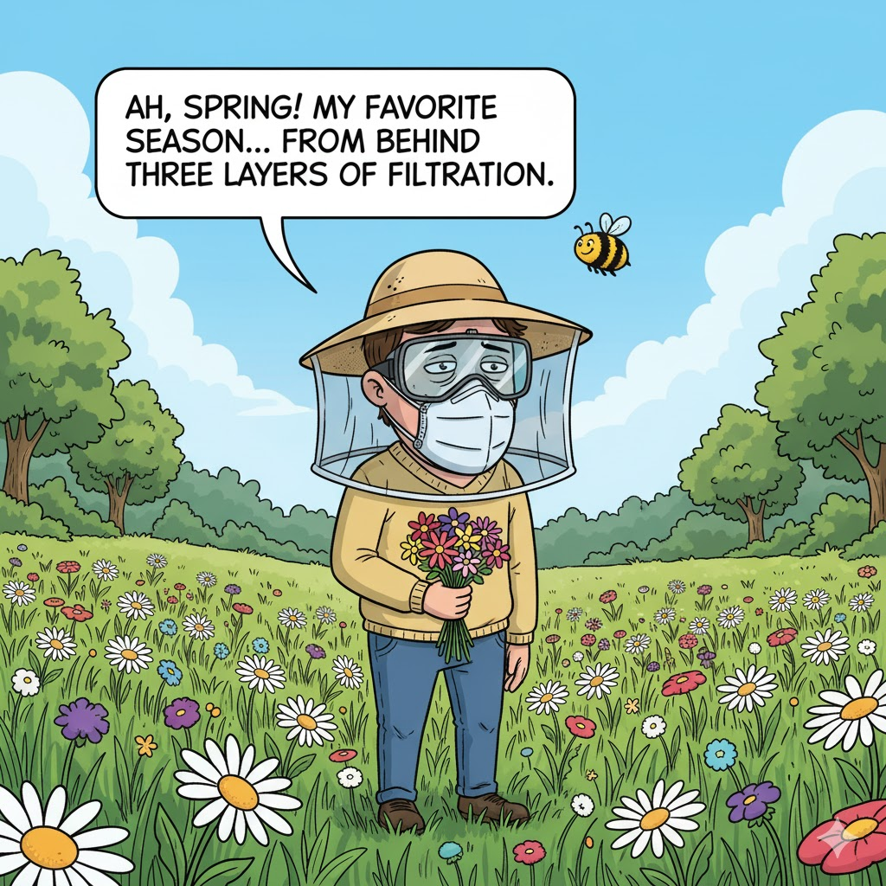
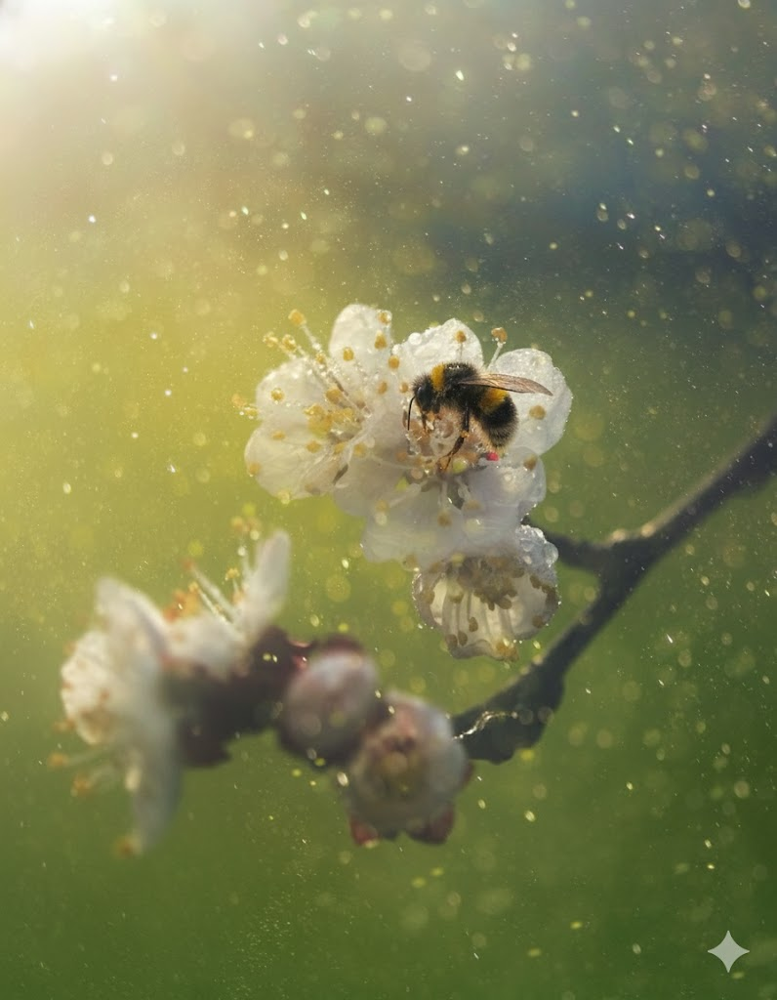
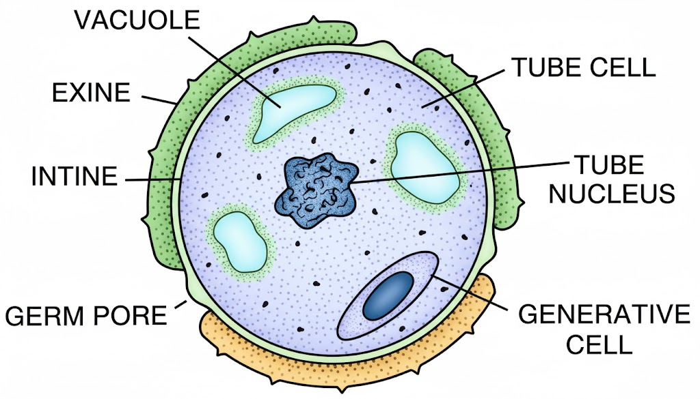
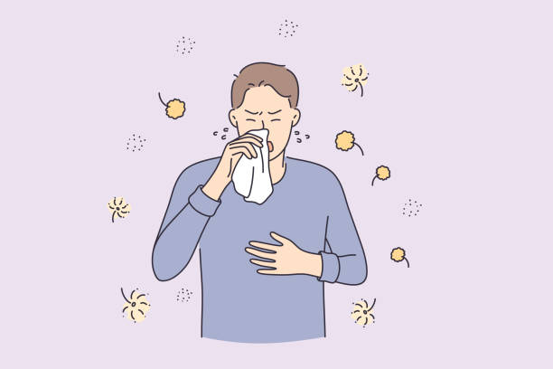
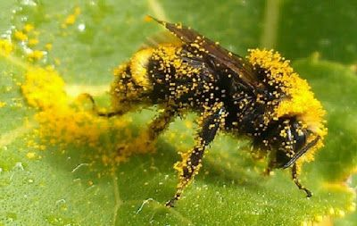
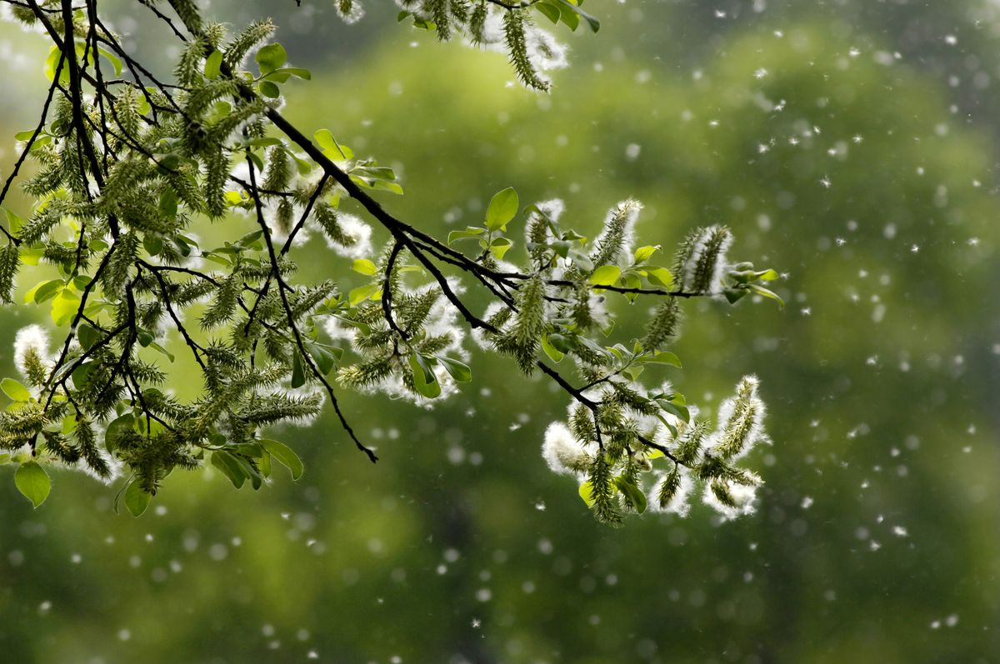
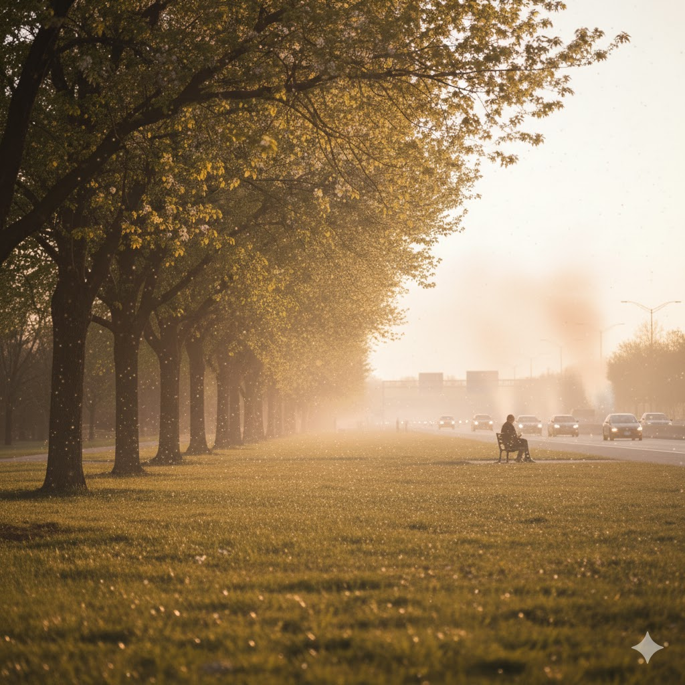
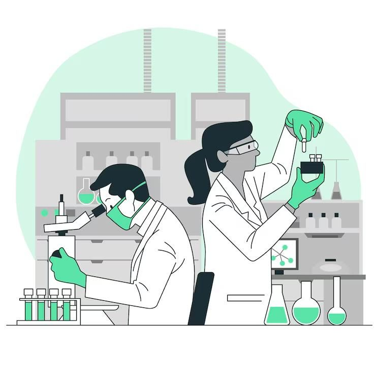
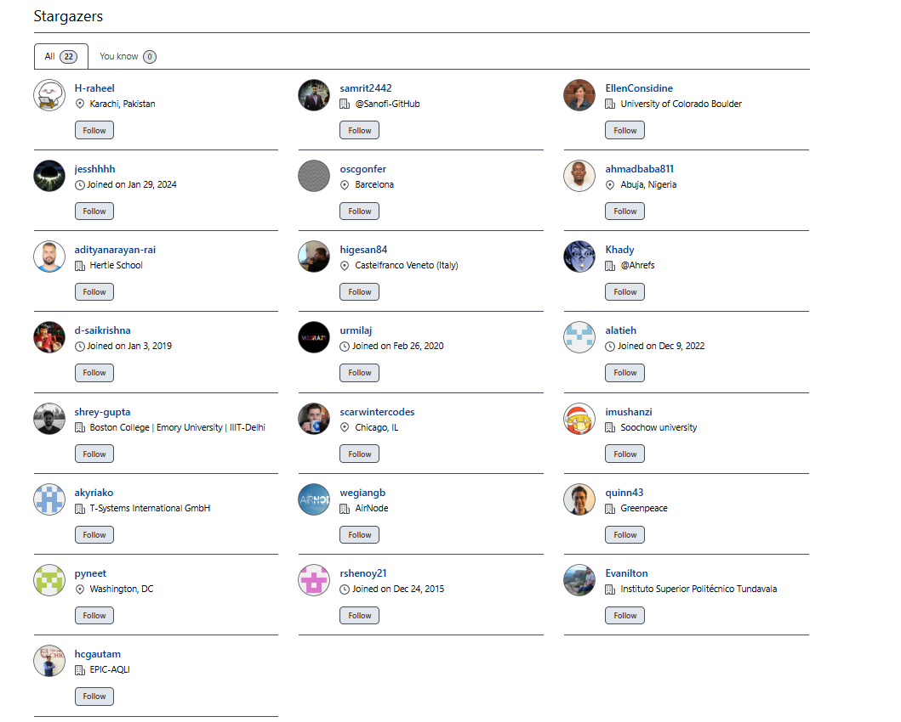

# The Often Overlooked Air Pollutant: Understanding Pollen and Its Impact

| ***Image Credit: Generated using Nano Banana, Gemini***

 

When you think of "air pollution," you likely picture car exhaust,
factory smoke, or dust. Yet, another particle drifts through the air—one
that comes directly from nature: **pollen**. Although it is entirely
natural and seasonal, for many people, it’s a serious trigger for
sneezing, coughing, and wheezing.

Despite being everywhere in the air we breathe, pollen rarely makes it
into air-quality discussions. Because it comes from plants — something
“natural” — it’s often dismissed as a seasonal nuisance rather than an
environmental health concern. Yet, for millions of people, pollen
exposure can trigger asthma attacks, allergic rhinitis, or other
respiratory problems as serious as those caused by industrial
pollutants. Unlike PM₂.₅ or NO₂, pollen isn’t tracked in most air
quality indices, meaning it quietly affects our health without ever
showing up on pollution charts. This blind spot has kept pollen out of
mainstream air policy — even though it’s a vital piece of the
air-quality puzzle.

What’s worse is that when this natural particle mixes with man-made
pollution, it can become even more harmful. If you’ve ever suddenly
started sneezing uncontrollably on a clear, sunny spring day, or felt
your eyes itch just after the monsoon when a specific roadside weed is
blooming, **you’ve experienced the power of this microscopic particle**.
We're going to dive into the fascinating science behind why a natural,
tiny grain can sometimes feel like a massive threat to your breathing.

In this post, we’ll move beyond the mild annoyance of "hay fever" to
explore the surprising science behind this mostly invisible threat, how
it behaves in our atmosphere, and the simple steps you can take to
protect your health.

## 1. What Exactly Is Pollen? 🔬

Pollen is essentially the **tiny grain** that many plants, from majestic
trees, flowers to simple weeds, release when they reproduce. Imagine
trees, grasses, flowers or weeds as factories producing this fine,
yellowish dust. Each microscopic grain carries the plant's male genetic
material, which is destined to land on a female part of another flower
of the same species. You could say pollen is a vital piece of plant dust
on a mission. This reproductive process, while essential for plant life,
is what inadvertently makes the air thick with particles that we then
inhale.

| ***Image: A bee pollinating a flower Credit: Generated using Nano Banana, Gemini***

 

To help you visualize it, a typical airborne pollen grain is only about
**20–40 micrometers (**$\mu\text{m}$) across—that’s about the diameter
of a single spider silk thread. It is **far tinier than a speck of dust
you can see** but large enough to get caught in our nose and throat. The
structure itself is fascinating: each grain is protected by a tough,
armor-like outer shell called the **exine**. This remarkable shell is
chemically one of the most resistant biological materials known.

 

| ***Image: Parts of a Pollen Grain: Generated using Nano Banana, Gemini***

**Interesting Fact:** Pollen is so durable that scientists who study
ancient environments, in a field called **palynology**, can often
identify plant species from **10,000-year-old** fossilized pollen grains
found in mud or peat moss!

Though its origin is purely botanical, once it's released into the air,
this resilient particle starts to behave much like any other foreign
**pollutant**.

## 2. Types of Pollen and Why Their Differences Matter 💨

Not all pollen is created equal, and understanding the differences is
key to managing allergies. We can broadly categorize pollen based on its
source and how it travels. **Tree pollen** tends to be the first to
arrive, dominating late winter and spring. **Grass pollen** is typically
the dominant allergen in late spring and summer. Finally, **weed
pollen** (like *Parthenium* or ragweed) peaks later in the year, often
post-monsoon, and is infamous for being highly allergenic.

These differences affect two critical factors: travel distance and
allergenicity. **Lighter, wind-pollinated** grains—the ones responsible
for most large-scale, regional allergies—can remain airborne for a much
longer time and travel across entire cities or even countries.
Conversely, some plants rely on insects for transfer, producing heavier,
stickier pollen (like most brightly colored flowers) that rarely becomes
airborne.

**Interesting Fact:** Many flowers that look vibrant and smell sweet—the
ones people commonly blame for allergies—actually produce the type of
pollen that drops quickly and rarely triggers outdoor hay fever!

Crucially, **fragmentation** is a serious issue. Smaller grains, or
pieces that have broken off larger grains, can penetrate deeper into the
lungs. This fracturing of pollen is what can make even a moderate pollen
count dangerous.

**Interesting Fact:** A single ragweed plant can produce up to **a
billion pollen grains** in one season, and because these grains are so
small, their fragments can easily bypass the nose's filters and trigger
severe asthma. This is why knowing *what* is blooming in your area
matters just as much as knowing the total count.

### 🌳 Pollen Summary Table (Global & Indian Examples)

This table breaks down the many common types of wind-borne pollen,
detailing their release period and specific impact. This is in no way an
exhaustive list.

|                  |                                                                                 |                                                               |                                                                                                                             |                                                                                                             |
|------------------|---------------------------------------------------------------------------------|---------------------------------------------------------------|-----------------------------------------------------------------------------------------------------------------------------|-------------------------------------------------------------------------------------------------------------|
| **Pollen Type**  | **Example Sources**                                                             | **Typical Season/Timing**                                     | **Travel Distance & Impact**                                                                                                | **Key Allergenic Feature**                                                                                  |
| **Tree Pollen**  | Oak, Birch, Cedar (**Global**); **Neem**, **Mango**, **Acacia** (**India**)     | **Late Winter** $\to$ Spring (earliest type in many areas)    | **Very Far:** Grains are small and light, carried easily by winds for hundreds of kilometers.                               | Major cause of the first seasonal allergy wave (spring allergies).                                          |
| **Grass Pollen** | Timothy, Rye (**Global**); **Bermuda Grass**, **Cynodon**, **Rice** (**India**) | **Late Spring** $\to$ Summer (peak warmth and humidity)       | **Widespread:** Extremely abundant and produced across large areas. Affects the largest percentage of allergic individuals. | Highly consistent allergen proteins; extremely high volume of release.                                      |
| **Weed Pollen**  | Ragweed, Pigweed (**Global**); **Parthenium**, **Chenopodium** (**India**)      | **Late Summer** $\to$ Autumn (Post-monsoon in tropical areas) | **Moderate to Far:** Can travel significant distances. Often thrives on disturbed or vacant land.                           | **Very High Allergenicity:** Contains highly potent proteins that cause severe symptoms even at low counts. |

## 3. How and Why Pollen Affects Health: The Immune System's Response 🛡️

{width="823"}

 

| ***Image: Sneezing Person: Generated using Nano Banana, Gemini***

When pollen enters your airway, your immune system sometimes
misidentifies its proteins as a threat. Instead of treating it as
harmless plant dust, the immune system mistakenly views it as an
invading virus or bacteria. In response, it launches a defense
mechanism: a barrage of sneezing, a runny nose, itchy eyes, or wheezing.
This reaction is what doctors call **allergic rhinitis**, commonly known
as "hay fever."

The difference between those who suffer and those who don't comes down
to **immune sensitivity**. Sensitive individuals produce a specific type
of antibody, called **Immunoglobulin E (IgE)**. When IgE antibodies
encounter specific pollen proteins, they trigger immune cells (like mast
cells) to release chemicals, most famously **histamine**, which causes
all those familiar allergy symptoms.

**Think of it this way:** your body’s immune system is like a fortress,
and for allergy sufferers, the alarm system is simply set too high,
triggering a full-scale defense (the sneezing and wheezing) against a
tiny, non-threatening visitor (the pollen). It can lead to irritation in
the nose, sneezing, redness and eye irritation, scratchy throat, chest
tightening among other effects.

This excessive reaction has real-world consequences. High pollen
exposure is directly linked to an increase in severe respiratory events.

If scientists state the **odds ratio** is 1.5 for a specific health
event, it simply means an exposed person is **50% more likely** to
experience that symptom compared to someone not exposed. Understanding
this risk is vital, especially for individuals with pre-existing
conditions like asthma.

## 4. 🌬️ The Pollen Journey: How Tiny Grains Travel Far

The journey of a pollen grain is a spectacular example of natural
travel. How far and how fast it goes depends on its own basic physics:
the **smaller and lighter** a grain is, the longer it can float in the
air, while heavier ones settle quickly.

### Two Ways Pollen Moves

Pollen moves from plant to plant using two very different strategies:

|                     |                    |                                                                 |                                                                   |                                                                        |
|---------------------|--------------------|-----------------------------------------------------------------|-------------------------------------------------------------------|------------------------------------------------------------------------|
| **Travel Strategy** | **Carrier**        | **What the Plant Looks Like**                                   | **Pollen Characteristics**                                        | **Allergy Risk**                                                       |
| **Wind Traveler**   | **Wind**           | Plain, non-showy flowers (like grasses and many trees).         | **Light, dry, and super abundant** (they release billions).       | **HIGH.** This is the main cause of seasonal allergies.                |
| **Insect Taxi**     | **Bees & Insects** | Brightly colored, fragrant flowers (like roses and sunflowers). | **Heavy, sticky, and less numerous.** Designed to stick to a bug. | **LOW.** It falls straight to the ground and doesn't float in the air. |

**The plants that cause your allergies are almost always the "Wind
Travelers."** They rely on the air to carry their light, dry pollen far
and wide. The colorful flowers that attract bees have heavy, sticky
pollen that is too heavy to cause problems unless you put your nose
right up to the flower.

{width="655"}

 

| ***Image: Bee covered in Pollen: Generated using Nano Banana, Gemini***

### The Air as the Highway

The air is the biggest transportation system for the allergy-causing,
wind-borne pollen.

-   **Going Up:** **Warm, rising air (called updrafts)** acts like a
    massive elevator, lifting pollen high into the sky. Strong winds up
    there can carry it for **hundreds of kilometers**. This is why your
    high pollen count today could be caused by trees blooming two states
    away!

-   **Coming Down:** Eventually, **cooler, sinking air (downdrafts)**
    brings all that accumulated pollen back down to the ground, leading
    to a spike in exposure right where you breathe.

 

| ***Image: Wind blowing Pollen off a tree: Generated using Nano Banana, Gemini***

This entire process means that while some of the pollen you inhale is
from local plants, the total amount is a complex mix of local blooms and
air masses that have traveled long distances.

## 5. Daily Rhythms and the Impact of Weather 🌦️

Pollen release is highly dependent on the daily weather and time of day,
following a predictable rhythm. In the **morning**, warmth and drying
conditions signal the plants to open up and release their pollen,
causing air concentrations to spike quickly. As the day heats up,
usually by the **afternoon**, rising air mixes the pollen vertically,
distributing it higher. Then, in the **evening or night**, the air cools
and descends, often bringing accumulated pollen back down to ground
level right when people are settling in for the night—which is why
nighttime allergies are so common.

Weather also plays a critical dual role, acting as both a cleanser and a
threat. **Heat** and dry conditions promote the release of whole, intact
pollen grains. Conversely, **moisture**, or high humidity, can cause
pollen grains already in the air to swell or even **rupture** like a
tiny balloon. This rupturing process releases those dangerous, tiny
fragments that penetrate deeper into the lungs.

**Interesting Fact:** The phenomenon known as "thunderstorm asthma"
occurs because the strong winds and cold rain associated with a storm
can sweep up ground pollen, cause the grains to burst into tiny
fragments, and concentrate that cloud of super-irritants at ground
level.

## 6. Pollen's Dangerous Partnership with Air Pollution 🏭

| ***Image: City Pollution interacting and Mixing with Nearby Tree and Grass Pollen: Generated using Nano Banana, Gemini***

 

When pollen travels through air thick with man-made pollution, a
chemical and physical interaction occurs that significantly raises the
health risk, creating a "double burden" on the lungs.

The first interaction is physical: **chemical pollutants stick to the
pollen**. Tiny particles, like **PM\$\_{2.5}\$** (Particulate Matter
$2.5$ micrometers or less), are attracted to the pollen's surface. This
effectively turns the pollen grain into a **super-allergen**—a larger,
more irritating carrier particle that delivers both the natural allergen
and the toxic chemical deep into the respiratory system simultaneously.
**Imagine a sticky bus:** the pollen is the bus, and the pollutants are
toxic passengers it carries directly into your lungs.

The second interaction is chemical: pollutant gases like ozone ($O_3$)
and nitrogen dioxide ($NO_2$) chemically **alter the proteins** on the
pollen grain itself. This alteration can make the pollen much more
aggressive, intensifying the immune system's allergic response. The
takeaway is clear: the *same pollen count* is far more harmful in
polluted air than in clean air. This is a critical issue in places like
the **Indo-Gangetic Plain (IGP)**, which not only experiences some of
the world's highest chemical pollution levels but also has dense
agriculture and varied flowering seasons. To truly understand "air
quality" here, both chemical and biological particles must be
considered.

## 7. Monitoring Pollen: A Global Challenge 📊

For decades, the standard for accurate pollen monitoring has relied on
manual counting. This involves devices called **Hirst samplers**, which
use a rotor to suck air onto a sticky tape for 24 hours. A scientist
then takes the tape and laboriously counts and identifies the different
pollen grains under a microscope. This is accurate but slow, offering
only yesterday's data.

The future of monitoring lies in technology. Emerging AI-enabled
**optical sensors** use lasers and cameras to rapidly scan and identify
pollen particles in real-time, providing instant data.

**Interesting Fact:** These new optical systems can identify and count
particles in minutes, rather than the 24 hours required for the manual
method, offering true real-time alerts and more accurate predictive
models.

Unfortunately, consistent, large-scale monitoring remains a challenge
globally, with most of the Global South lacking a comprehensive network.
In **India**, only a few city-based stations exist, and there is **no
unified national pollen network**. Researchers are working hard to
develop predictive models using advanced data, including satellite
measurements of greenness (NDVI) and weather patterns. The ultimate goal
is to integrate these accurate pollen forecasts into India’s existing
air-quality alert systems.

## 8. 🔬 The Pollen Hunters: Certified Pollen Counters (The Human Gold Standard)

 

| ***Image: A Pollen Counter at Work. Generated using Nano Banana, Gemini***

At the heart of reliable allergy data stands a highly specialized
scientist: the **Certified Pollen Counter** (or Pollen Analyst). Their
work is the indispensable foundation of all accurate pollen reporting.
Far from being replaced by technology, these experts set the benchmark
for accuracy and actively train the AI systems of the future.

### What is a Certified Pollen Counter?

A Certified Pollen Counter is a professional who holds specialized
training and certification, often through bodies like the National
Allergy Bureau (NAB). Their crucial role demands a blend of rigorous
scientific methodology and an encyclopedic knowledge of botany and
palynology. Their core task is not merely to count, but to **identify
and quantify** the microscopic airborne biological particles (pollen and
mold spores) with absolute certainty.

### The Meticulous Craft of Palynology

The manual counting method, which remains the **Gold Standard**,
requires extreme patience and precision:

-   **Sample Collection:** They manage the Hirst-type spore traps, which
    draw a precise volume of air over 24 hours onto a sticky slide or
    tape.

-   **Preparation and Staining:** The counter prepares the sample, often
    using stains (like Calberla’s stain) to make the particles distinct
    and visible.

-   **The Count:** The analyst spends considerable time at a high-power
    microscope. They must identify hundreds of distinct pollen and spore
    types based on their minute and often subtle differences in size,
    shape, and surface texture. Their expertise is paramount, ensuring
    that similar-looking, but ecologically different, particles are
    never confused.

-   **Final Data:** The raw count is meticulously converted into the
    final, critical number: the concentration of pollen grains per cubic
    meter of air ($grains/m^{3}$).

This level of detailed, verified species identification is a highly
refined skill honed over years, which is why their data is trusted
implicitly by allergists worldwide.

### 🤖 The Next Evolution: AI as a Certified Assistant

The role of human counters is now shifting to one of supervision,
training, and ultimate verification as Artificial Intelligence (AI)
enters the field.

#### The Role of AI Today

Automated systems using AI are being deployed primarily for **speed**.
They utilize advanced optical methods, such as laser light and
holographic imaging, to rapidly analyze particles flying by, providing
counts in minutes instead of days.

#### Human Oversight is Critical

While AI excels at speed and quantity, human Certified Pollen Counters
remain vital because:

-   **They Train the AI:** Every successful automated system relies on
    massive, verified databases—data that was painstakingly collected,
    classified, and identified by human palynologists.

-   **They Verify Accuracy:** The AI's real-time counts are constantly
    validated against the human-derived "Gold Standard" data. Where the
    AI falters or the identification is questionable, the human counter
    steps in to manually verify and correct the findings, thereby
    fundamentally improving the AI's future accuracy.

In short, the Certified Pollen Counter is evolving from the sole source
of data to the **ultimate authority on data quality**, ensuring that the
new, faster systems remain medically reliable and scientifically
accurate. They are the essential quality control mechanism for the
future of allergy forecasting.

## 9. Your Action Plan: The "POLLEN SAFE" Mnemonic ✅

Knowledge is your first line of defense. Because recognizing and
avoiding pollen can be challenging, here is a memorable tool to help you
take action.

|            |                     |                                                                                                                      |
|------------|---------------------|----------------------------------------------------------------------------------------------------------------------|
| **Letter** | **Reminder**        | **Action**                                                                                                           |
| **P**      | Peak times          | Avoid outdoor activity in early mornings and on dry, windy days when pollen release is highest.                      |
| **O**      | Observe weather     | Note that warm, windy days and the period *right after* a storm can be high risk for fragmentation.                  |
| **L**      | Limit exposure      | Keep windows closed, especially in the early morning; use air conditioners rather than fresh air.                    |
| **L**      | Layer clothing      | Change your outerwear immediately after being outdoors to avoid bringing accumulated pollen inside.                  |
| **E**      | Environment check   | Know which weeds, trees, or grasses are actively blooming nearby.                                                    |
| **N**      | Note symptoms       | Track when your symptoms flare up to identify your personal triggers and seasonal patterns.                          |
| **S**      | Support indoor air  | Use **HEPA filters** on air purifiers to trap tiny particles; avoid drying clothes outside.                          |
| **A**      | Allergy kit ready   | Have necessary medications (like antihistamines) and your doctor-approved action plan handy.                         |
| **F**      | Follow forecasts    | Check local air and pollen alerts when available to plan outdoor strenuous activity. When outdoors wear a N-95 mask. |
| **E**      | Extra caution zones | On high-pollution and high-pollen days, significantly reduce strenuous outdoor activity to protect your lungs.       |

For those looking to dive deeper and stay informed about environmental
allergy risks, two excellent official resources are available.
**Allerma.com** offers detailed insights into allergy management,
including specific information on allergens, symptoms, and treatment
options, often presenting data in an accessible format for the general
public. Another invaluable resource is the **National Allergy Bureau
(NAB)**. Run by the American Academy of Allergy, Asthma & Immunology
(AAAAI), the NAB provides accurate, current pollen and mold spore counts
for regions across the United States. This service is crucial for
individuals who need real-time data to manage their daily activities and
medication based on local allergen levels, making it a go-to source for
reliable environmental allergy information.

**However, modern technology allows for even more personalized
protection.** Users can utilize popular **plant identification apps**
(like PictureThis or PlantNet) to instantly identify specific trees and
weeds they encounter, then cross-reference those species against their
known allergies. This allows them to avoid specific high-risk plants.

Furthermore, many official pollen data sources and weather organizations
now integrate this information into **dedicated mobile tracking apps**
that provide hyperlocal, daily forecasts and alerts right on a user’s
phone. **By combining authoritative data from sources like the NAB with
real-time identification and app-based alerts, individuals can move from
reactive treatment to proactive, informed protection against seasonal
allergies.**

## **10. Conclusion: Why This Should Matter to Everyone 🌍**

 

Pollen isn't just a seasonal nuisance — it's a fundamental and
increasingly important part of the air we breathe. With climate change,
pollen seasons are becoming longer and more intense. Rising temperatures
and higher carbon dioxide (\$CO_2\$) levels are prompting many
allergenic plants to bloom earlier, release more pollen, and remain
active later in the year.

In some regions, scientists have found that pollen seasons are now
lasting nearly **three weeks longer** than they did just a few decades
ago — meaning the window of exposure and respiratory risk is growing for
everyone.

At the same time, high air pollution levels can amplify pollen’s impact,
creating a **“double burden”** on our lungs. To truly work toward
cleaner, healthier air, we must look at the full picture — not only
chemical pollutants from vehicles and industries but also biological
ones like pollen.

That said, **don’t panic** or feel like you need to shut yourself
indoors. Taking a breath of fresh air, stepping outside, and connecting
with nature are still among the healthiest things you can do. The goal
isn’t to fear pollen — it’s to understand it. When you know how pollen
behaves, when it peaks, and how it interacts with pollution, you can
stay alert and take small, effective steps to reduce its impact.

So go out, enjoy your morning walk or your time in the garden — just
stay pollen-smart. Awareness is protection. 🌿

## 11. Bibliography

-   Johns Hopkins Medicine. [Allergens:
    Pollen.](https://www.hopkinsmedicine.org/health/conditions-and-diseases/seasonal-allergies/allergens-pollen)

-   American College of Allergy, Asthma & Immunology (ACAAI). [Pollen
    Allergy \| Causes, Symptoms &
    Treatment.](https://acaai.org/allergies/allergic-conditions/pollen-allergies/)

-   Cleveland Clinic. [Pollen Allergy: Causes, Symptoms &
    Treatment.](https://my.clevelandclinic.org/health/diseases/pollen-allergy)

-   Asthma and Allergy Foundation of America (AAFA). [Pollen
    Allergies.](https://aafa.org/allergies/types-of-allergies/pollen-allergy/)

-   Vedantu. [Pollen Grains: Definition, Structure, and
    Diagram.](https://www.vedantu.com/biology/pollen-grains)

-   Physics Wallah. [Pollen Grain, Diagram, Structure, Types, Function
    and Formation.](https://www.pw.live/neet/exams/pollen-grain)

-   National Institutes of Health (NIH) / PubMed Central. [Interaction
    Between Air Pollutants and Pollen Grains: The Role on the Rising
    Trend in
    Allergy.](https://pmc.ncbi.nlm.nih.gov/articles/PMC5941124/)

-   NIH / PubMed Central. [The influence of air pollution on pollen
    allergy
    sufferers.](https://pmc.ncbi.nlm.nih.gov/articles/PMC8638356/)

-   MDPI. [Interaction between Air Pollutants and Pollen Grains: Effects
    on Public and Occupational
    Health.](https://www.mdpi.com/2073-4433/14/10/1544)

-   ResearchGate. [Aerial pollen diversity in India and their clinical
    significance in allergic
    diseases.](https://www.researchgate.net/publication/232721887_Aerial_pollen_diversity_in_India_and_their_clinical_significance_in_allergic_diseases)

-   ResearchGate. [The Occurrence and allergising potential of airborne
    pollen in West Bengal,
    India.](https://www.researchgate.net/publication/8471509_The_Occurrence_and_allergising_potential_of_airborne_pollen_in_West_Bengal_India)

-   ResearchGate. [Multi-decade changes in pollen season onset,
    duration, and intensity: A concern for public
    health?](https://www.researchgate.net/publication/350137996_Multi-decade_changes_in_pollen_season_onset_duration_and_intensity_A_concern_for_public_health)

-   ClimaHealth. [The impact of climate change on pollen season and
    allergic sensitization to
    pollens.](https://climahealth.info/resource-library/the-impact-of-climate-change-on-pollen-season-and-allergic-sensitization-to-pollens/)

-   Allerma (Pollen Pictures) :
    <https://allerma.com/education/pollen-pictures/>

-   Allerma (Allergy Trees):
    <https://allerma.com/category/allergy-trees/>

-   Prana Air, What is Pollen?:
    <https://www.pranaair.com/what-is-pollen/>

-   National Allergy Bureau (see tools for Public section):
    <https://pollen.aaaai.org/#/>

## Support This Work: Give It a Star

Thank you for reading! If you found this project helpful or interesting,
please consider starring it on GitHub. Your stars help others discover
and benefit from this fully open and free repository. Click [here to
star the
repository](https://github.com/AarshBatra/biteSizedAQ/stargazers) and
join other folks who follow biteSizedAQ.

## License and Reuse {#license-and-reuse}

All content under **biteSizedAQ** is shared under the **Creative Commons
Attribution 4.0 International (CC BY 4.0) license**. You are welcome to
use this material in your reports or news stories—just remember to give
appropriate credit and include a link back to the original work.

Every effort is made to ensure that only original or appropriately
licensed material is shared. If any copyrighted content has been used
inadvertently, please note that this is unintentional, and I will
promptly address it upon notification.

Thank you for respecting these terms!

## Get in touch {data-link="Get in touch"}

Get in touch about related topics/report any errors. Reach out to me at
aarshbatra.in\@gmail.com.

