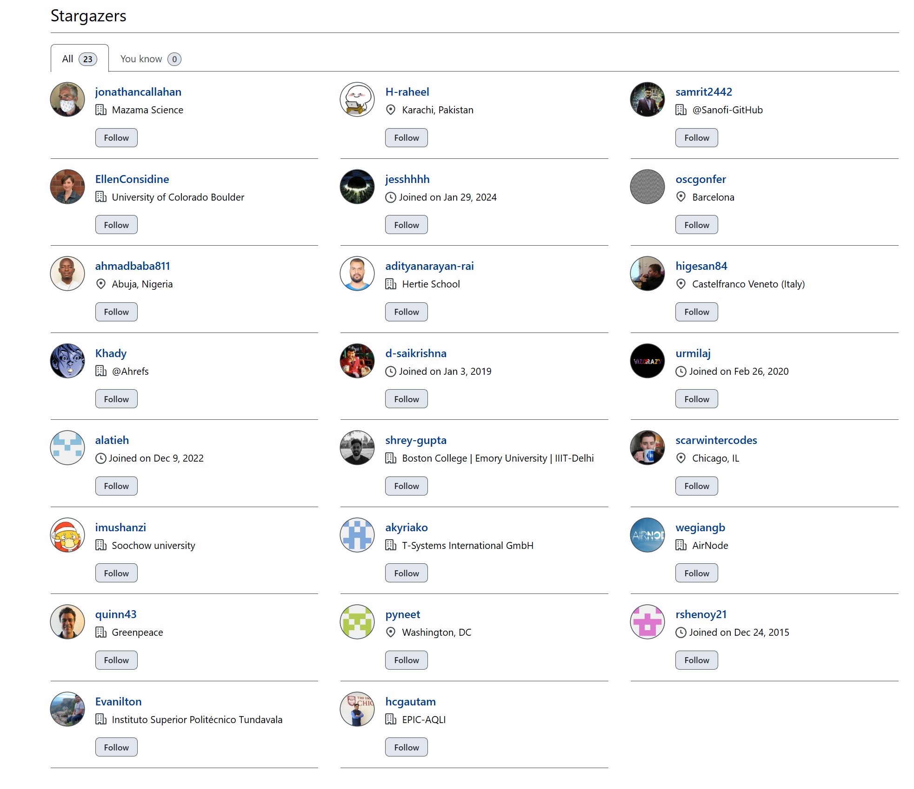

# 💔 The Air is Burning Our Futures: Why Our Fight for Clean Air is Drowning in Silence

## It’s Not Just Your Lungs. It’s Your Wallet, Your Willpower, and Your Voice.

Air pollution is not a seasonal annoyance that suddenly appears; it is a
relentless, **year-round, toxic companion** suffocating major cities
across the world. Despite decades of data and countless health warnings,
the air quality in most urban centres remains fundamentally poisoned.

Why? Because the conversation has been hijacked by shallow, repetitive
advice. We focus on the *symptom* (the cough, the $\text{PM}_{2.5}$
number) while ignoring the **deep, systemic chains** that bind us to
this toxic reality. Clean air is not just a health issue. It is an
**economic justice issue**, a **political accountability issue**, and a
**fundamental human rights issue**. It’s time we shifted our
communication from gentle warning to righteous, detailed demand.

## The Nineteen Chains (not exhaustive): Why Our Air Comms Fail ⛓️

### 1. The Survival Trap: Where Bread Trumps Breath

This is the central, heartbreaking conflict our current messaging
ignores. For millions of daily wage earners, the source of their
pollution is the source of their income. They are forced into a cruel
choice: **guaranteed hunger today versus possible illness tomorrow**.

- **Example: The Street Vendor:** She must cook using cheap, polluting
  charcoal and sell her goods in the open, dusty air. Her entire
  business model relies on being visible in the open, polluted air,
  meaning she can’t avoid exposure. Cleaning up means facing
  **unbearable upfront costs** for clean equipment.

- **Example: The Auto-Rickshaw Driver:** The cost of a new, cleaner
  engine or an electric model is **an entire year’s savings**. Any
  communication that doesn’t offer a subsidized, economically viable
  alternative is a patronizing insult.

### 2. The Urgency Queue: Air Pollution is Number 20

We cannot expect people fighting immediate poverty to prioritize a
long-term chronic threat. In contexts like India, air pollution often
sinks to **Priority 20**, overshadowed by basic existential threats like
eviction, job loss, or overwhelming debt.

- **The Link:** We fail to connect the immediate acute battles (like a
  child’s constant illness) to the long-term benefits. We must
  communicate that less pollution means **less immediate illness, fewer
  trips to the clinic, and less money wasted**—money that can then be
  used to fight those immediate, acute battles for survival.

### 3. The Free Rider Fatigue & The Individual vs. System Battle

Citizens are asked to make endless small sacrifices. Yet, this effort
feels **meaningless** when juxtaposed against the colossal, unmoving
machinery of major polluters.

- **The Crisis of Efficacy:** Why should a person switch to expensive
  cooking fuel when the state-owned power plant across the river runs on
  outdated, toxic coal, or when a politically connected builder ignores
  dust control norms?

- **The Adjustment:** Individual actions are valuable, but our comms
  must validate them by showing they are the **moral authority**
  required to demand that big players—like major factories or
  politically connected builders—are finally held accountable and forced
  to act.

### 4. The Cognitive and Sensory Disconnect & The Action Void

The deadliest pollution—$\text{PM}_{2.5}$, the tiny, toxic particles—is
invisible and odorless. Our brains are hardwired to react to visible
threats, but not to the slow, unseen poison.

- **The Energy Drain Analogy:** High pollution isn’t just about lung
  disease; it’s about **daily mental occupancy**. The constant stress
  and oxygen deprivation make your brain consume **x% more energy** just
  to perform basic tasks. This fatigue affects much more than our
  capacity to earn; it reduces our patience, shortens our temper, and
  makes complex decision-making exhausting.

- **The Action Void:** Even when people are aware, they don’t know
  **where to go to start acting**. (They can shop on Amazon, but where
  is the equivalent, tangible place to organize against pollution?)

### 5. The Policy-Language Gutter and The AC Room Disconnect 🪟

Policies are created in purified, air-conditioned rooms, using jargon
and imposing rules *upon* people, instead of creating them *with* the
people who suffer the most.

- **The Crucial Missing Link:** The **voice of the street** must be a
  necessary, **statutory part of the law-making process**. When a law is
  passed that affects auto-rickshaw licensing fees or street vendor
  locations, the people directly impacted must have a mandatory seat at
  the table to detail the ground reality, ensuring funds aren’t wasted.
  Furthermore, **policymakers must have a mandatory job responsibility**
  to meet with those affected the most on the ground every few months.

### 6. The Psychological Distance: It’s Always “Someone Else’s” Problem

Air pollution is a victim of both **temporal distance** (the worst
health impacts are years away) and **social distance** (the heaviest
burden falls on low-income, marginalized communities). This allows the
affluent and powerful to view the crisis as something happening *over
there* or *later*, justifying their lack of political urgency.

### 7. The Hidden Mental Health Tax: Pollution Saps Your Will to Fight

High pollution levels are directly linked to increased anxiety,
depression, and cognitive fatigue. **The air is making us too tired,
stressed, and mentally drained to organize, protest, or even demand
change.** The air is not just a health hazard; it is a **tool of
oppression** that weakens the political capacity of the population.

### 8. The Political Blame Game: Lost in the Fog of War

Citizens get lost in the political party battles, where parties spend
their energy publicly **blaming each other**—the State blames the
Centre—all to score votes by misguiding people. The political spectacle
becomes more urgent than the actual solution.

### 9. The Unscientific Rush: Wasted Funds

Policies are often implemented in a rush—before proper testing or
consultation—simply to create a political message for the voter base.

- **Example: The Smog Towers:** Governments rush to spend hundreds of
  crores on massive, static **Smog Towers** that offer negligible air
  cleaning benefits to the population, ignoring proven solutions like
  controlling source emissions. This hasty culture of untested theory
  implementation is a deep comms failure that wastes funds, frustrates
  the middle class, and fails to solve the actual problem.

### 10. The Motivation Failure: No Visible Feedback Loop (The Marathon Trap)

Progress is invisible and often slow. Fighting pollution is like trying
to climb a waterfall—it requires immense, continuous effort. If citizens
cannot see the immediate, open-source benefits of their actions, the
motivation dies. The problem is not the effort; it’s the lack of
visible, persistent progress. Without a continuous positive feedback
loop of action to resolution, the fight for clean air is a battle nobody
believes they can win.

### 11. The Civic Disconnection: The Isolation Trap & The Gamification Gap

Neighbors are disconnected and don’t care about each other’s exposure,
leading to the **Isolation Trap**. We rely on individual action, but air
pollution is inherently a collective problem. There is no easy,
**behavioral mechanism (like gamification or incentives)** to increase
**collective caring** and community effort outside of formal
bureaucracy.

### 12. The Comfort Zone of Suffering & The Right to Revolt/Innovation

The fight is stuck because people are comfortable in their rut, and
those who profit from pollution are unchallenged. We lack the civic
infrastructure to **quickly organize, campaign, and innovate**. We need
to continuously think of new and better solutions, cross-collaborating
between engineers, policy people, and citizens through ***regular***
***campaigns***, ***solution*** **hackathons** and other tools. **No
real long standing change has come without a fight.**

### **Addressing Funding, Research, and Data Gaps (Chains 13-16)**

### 13. The Funding Chasm: Short-Term Fixes vs. Long-Term Investment

A big chunk of international and governmental funding for air pollution
is allocated to **quick, visible, short-term fixes** (like purchasing
air purifiers for schools or temporary road cleaning) designed to
appease voters or satisfy immediate grant requirements.

- **The Gap:** A critical failure of **national governments** to make
  substantial, dedicated budgetary commitments to clean air projects at
  scale. Funds from **global philanthropic organizations and
  foundations** like the **Clean Air Fund** and the **EPIC AQ Fund**
  come to the rescue and exist precisely because domestic government
  investment is grossly inadequate and unsustainable, wasting funds in
  perpetuating crisis management instead of proactive prevention.

### 14. The Research Dependency Chain: Worse Findings, Not Just Different Ones

The vast majority of large-scale, long-term epidemiological research is
concentrated in the **Global North**. This creates a dangerous knowledge
dependency, but the core failure is the refusal to pursue local data
that would likely reveal **significantly worse health impacts** in the
Global South.

- **The Gap:** Global South populations often face unique compounding
  factors (**higher baseline disease burdens, malnutrition, co-exposure
  to poverty, and poorly regulated industrial emissions**). Local
  research would not just provide context; it would likely expose a
  **much steeper and more severe dose-response curve** for pollution
  damage, making the current Global North data a conservative
  *underestimate* of the true local health and economic toll.

### 15. The Data Sovereignty and Transparency Trap 🔒

Air quality data, even when collected, is rarely utilized effectively
for public benefit due to two main failures: lack of transparency and
lack of government funding for country-level networks.

- **The Gap:** Data is frequently owned by private entities or
  government bodies, making it **non-open-source, non-transparent**, or
  released under embargoes, which stops citizen-led action. Critically,
  there is **no substantial government investment in building and
  maintaining high-quality, dense, open-source monitoring networks and
  open-source** integrated data management systems at the country level,
  relying instead on scattered, easily disputed sources, file formats
  and getting lost in unnecessary detail.

### 16. The Capacity and Training Deficit Chain 🧑‍🔬

This is a profoundly serious chain that undermines the entire clean air
effort. It is the failure of **“soft infrastructure”**. Without trained
local experts, even perfect funding and research mandates are useless.

- **The Gap:** There is a critical deficit in local capacity for
  managing complex air quality models, conducting high-quality cohort
  studies, operating and calibrating advanced monitoring equipment, and
  effectively translating complex climate/health data into accessible
  public policy.

- **The Result:** Governments and civil society are forced to rely
  heavily on expensive, often temporary **international consultants** or
  research teams, creating a costly and unstable cycle of external
  dependence rather than building permanent, internal expertise that can
  sustain the fight long-term and is also easier on the pocket.

### **The Final Ghost Chains (Chains 17-19)**

### 17. The Medical Silence (The Diagnostic Gap)

**The Aspect:** The medical establishment fails to record air pollution
as the primary cause of death or illness, treating only the symptoms
(asthma, heart disease).

- **The Chain:** Doctors treat the biological outcome (e.g., COPD)
  rather than the environmental cause. Because death certificates and
  patient files do not explicitly list **“Air Pollution Exposure”** as a
  diagnosis, the illness remains a statistical concept, not a personal,
  validated tragedy. This lack of explicit clinical linkage prevents the
  **personal radicalization** necessary for widespread outrage and legal
  action.

### 18. The “Development First” Fallacy (The GDP Trap)

**The Aspect:** An entrenched ideological belief among policymakers that
clean air is a luxury that must be postponed until after a nation
achieves a certain level of GDP.

- **The Chain:** This narrative frames environmental regulation as an
  **obstacle to economic growth**, forcing politicians to choose between
  **“jobs”** (polluting factories) and **“clean air”**. This gives the
  public pause in demanding strict laws, as they fear economic
  stagnation more than chronic illness. The solution (clean air *as* an
  economic engine) is obscured by the old, toxic idea of “develop first,
  clean up later.”

### 19. The Indoor Blindspot (The False Sanctuary)

**The Aspect:** Public attention is mostly entirely focused on outdoor,
industrial, or vehicular pollution, ignoring the indoor air where people
spend 90% of their lives.

- **The Chain:** This creates a **false sense of security**. Citizens
  assume that closing the window or entering a building makes them safe.
  However, indoor air quality is often worse due to concentrated
  infiltration, lack of proper ventilation, and internal sources
  (cookstoves, cleaning products). The failure to regulate and
  communicate indoor air quality allows people to mentally “escape” the
  crisis, lowering the collective urgency to demand fundamental change.

## 🔑 The Comm-Adjustment: Reframing Barriers into Battle Cries (Detailed Demands)

We must stop talking about clean air as a “nice-to-have” and start
talking about it as **reclaiming our immediate profit, productivity, and
political power.**

### 1. Reframe Survival: Clean Air is Debt Reduction

- **Actionable Demand:** Institute a **National Clean Appliance
  Financing Program (NCAFP)**. This program must offer **subsidized,
  zero-interest loans** for clean cooking fuels (LPG, Induction) and
  electric vehicles (e-rickshaws).

- **Ready-to-Use Comm:** **“Clean Air is your Debt Reduction Plan.”**
  “Stop focusing on the cost of a clean stove. The government must
  bridge the initial gap with subsidized, interest-free loans because
  the clean choice is cheaper when **hospital costs and lost wages** are
  factored in.”

### 2. Force Corporate Accountability: Demand Pollution Sick Leave

- **Actionable Demand:** Campaign for **Pollution Sick Leave (PSL)**
  legislation, mandating that private and public employers pay for all
  days lost due to pollution-related respiratory or cardiac illness
  based on AQI levels.

- **Ready-to-Use Comm:** “This is not charity; it’s a financial lever.
  Mandating PSL directly forces every large company to become an
  **advocate for cleaner city air**, as the financial impact of sick
  days immediately hits their bottom line.”

### 3. Validate Action: Shift Authority to the Individual

- **Actionable Demand:** Mandate that **real-time, 24/7 emission data**
  from the five largest stationary industrial polluters in any airshed
  be made public via a single, easily accessible online dashboard.

- **Ready-to-Use Comm:** **“Don’t Change Your Life, Change the Law.”**
  “Your small clean action gives you the **moral authority** to demand
  system change. We need to stop policing rickshaws and start demanding
  data from the big five. **Name the polluters. Shame the polluters.
  Fine the polluters.**”

### 4. Make the Invisible Tangible: Restore Cognitive Power

- **Actionable Demand:** Create public service campaigns that use a
  tangible visual language (like the “Dimmer Switch” analogy) to link
  high AQI to **quantifiable losses in student test scores, worker
  productivity, and public patience levels. Make compelling visuals and
  interactive stories to engage people meaningfully and make the
  invisible feel within reach.**

- **Ready-to-Use Comm:** **“The Air is Robbing Your Focus and
  Patience.”** “Instead of just ‘AQI 450,’ the data display must show
  the caption: **‘This air is reducing your effective mental energy by
  x%.’** Clean air restores your immediate mental power.”

### 5. Mandate Reality: Policy Must Be Dictated by the Street

- **Actionable Demand:** Pass legislation mandating a **statutory Clean
  Air Committee (CAC)** for every major city, where **50% of the
  members** are non-governmental representatives (daily wage workers,
  community health advocates, street vendors).

- **Ready-to-Use Comm (Political Infrastructure):** **“Policy Must Be
  Dictated by the Street.”** “The law must be dictated by the **lung
  capacity of the street vendor**, not the laptop of the bureaucrat.
  Policymakers must have a mandatory job responsibility to meet with
  those affected the most on the ground every few months and be held
  publicly accountable if they fail to do so.”

### 6. End Denial: Force the Affluent to See the Burden

- **Actionable Demand:** Demand a **National Citizen Plight Website
  (NCPW)** where citizens can share geo-tagged accounts of
  pollution-related suffering. This map must be linked to policy
  advocacy groups, creating the **tangible place to act** that forces
  the affluent and powerful to confront the marginalized burden as
  inescapable reality.

### 7. Reclaim Willpower: Organize at the Speed of E-Commerce

- **Actionable Demand:** Fund and promote civic tech tools that use
  mobile authentication (like OTP) to allow citizens to **legally
  organize and register protests and campaigns instantly** with their
  neighbors, reducing the administrative burden of civic action.

- **Ready-to-Use Comm (Civic Infrastructure):** “The fight for justice
  should not be harder than ordering a product online. **Organize at the
  Speed of E-Commerce.**”

### 8. Demand Unity: Stop the Political Blame Game

- **Actionable Demand:** Establish a **constitutionally mandated,
  non-partisan Environmental Enforcement Agency (EEA)** with the sole
  power to levy and collect fines from major polluters, ensuring
  enforcement is insulated from political party battles.

- **Ready-to-Use Comm (Accountability):** “Stop the political blame game
  and enforce the law together! We demand **non-partisan, public
  enforcement** regardless of political affiliation.”

### 9. Demand Oversight: Implement the Lived Experience Impact Assessment (LEIA)

- **Actionable Demand:** Mandate a **“Lived Experience Impact
  Assessment” (LEIA)** process, requiring independent citizen groups to
  audit the feasibility and real-world impact of any major pollution
  policy *before* hundreds of crores are spent (e.g., on Smog Towers).

- **Policy Focus (Innovation/Rush):** This halts the culture of the
  unscientific, hurried political rush and prevents wasted funds on
  cosmetic projects.

### 10. Create Feedback: Make Progress Open-Source and Visible

- **Actionable Demand:** Mandate the installation of **open-source,
  transparent digital boards** in high-traffic community centers,
  showing **local pollution reduction progress metrics** (e.g., tonnage
  of clean waste collected, factory emission compliance) and not just
  the AQI.

- **Ready-to-Use Comms (Visibility):** “This ensures persistent
  visibility and provides the crucial **positive feedback loop** that
  fuels long-term commitment. Show me the progress, not just the
  problem.”

### 11. Gamify Collective Caring: The Highest Score Wins

- **Actionable Demand:** Introduce a **Civic Clean Air Score (CCAS)** at
  the neighborhood/ward level. The highest scores (based on collective
  pollution-reducing actions) are tied directly to **tangible, immediate
  benefits** like larger tax rebates, preferential civic funding for
  local projects, and public acknowledgement.

- **Ready-to-Use Comms (Gamification/Feedback):** **“Clean Air is a
  Community Sport: The Highest Score Wins.”** “Transform civic duty into
  a local competition motivated by visible progress and financial
  reward.”

### 12. Prioritize Solutions: Never Stop Hacking the Air

- **Actionable Demand:** Mandate that municipal governments support
  solution-oriented hackathons and simplify the legal pathway for
  organizing public campaigns, enabling engineers, policy experts, and
  local residents to collaborate, crowdsource, and pilot hyper-local
  innovations while raising community awareness.

- **Policy Focus (Innovation/Rush):** “We need to continuously think of
  new and better solutions, making innovation a **mandated civic
  infrastructure**.”

### 13. Focus on Foundations: Demand Sustainable Investment

- **Actionable Demand:** Demand legislation requiring that **80% of all
  dedicated clean air budgetary commitments** be ring-fenced for
  **permanent infrastructure** (e.g., public transport electrification,
  industrial emission scrubbers) and **not** temporary fixes.

- **Ready-to-Use Comm:** **“Stop Buying Band-Aids. Fund the
  Foundation.”** “We demand that our government match or exceed the
  funds provided by **global philanthropic organizations** like the
  **Clean Air Fund** to scale up permanent, hyper-local monitoring.”

### 14. Close the Knowledge Gap: Local Data Will Reveal the Worse Truth

- **Actionable Demand:** Require mandatory, **government-funded, 20-year
  cohort studies** in the top 10 most affected cities, explicitly
  designed to measure the correlation between air pollution and unique
  local disease burdens (e.g., local heart disease variants).

- **Ready-to-Use Comm:** **“Stop Hiding Behind Conservative Data. Our
  Reality is Worse.”** “We need to know and tell the world about the
  **precise, worse local truth**. **Local Data is Non-Negotiable.**”

### 15. Unlock the Truth: Make All Air Data Open Source

- **Actionable Demand:** Mandate a **Data Sovereignty Law** that
  declares all air quality monitoring data (government and private) to
  be **open-source, real-time, and auditable**, with stiff penalties for
  non-compliance or data withholding.

- **Ready-to-Use Comm:** **“Data is the People’s Property. Open the
  Source and Fund Our Network.”** “We demand substantial government
  budgetary investment in building a high-density, reliable,
  country-level monitoring network and corresponding open source data
  management and access systems.”

### 16. Build Local Power: Fund the Next Generation of Scientists

- **Actionable Demand:** Introduce **targeted, multi-year funding
  programs and scholarships** at national universities focused on
  atmospheric science, environmental engineering, and public health
  epidemiology, specifically tied to local policy roles.

- **Ready-to-Use Comm:** **“Stop Hiring Foreign Consultants. Invest in
  Our Experts.”** “This investment must create a permanent, specialized
  local workforce capable of sustaining the fight long-term.”

### 17. Prescribe the Truth: Force the Health System to Validate the Cause

- **Actionable Demand:** Demand mandatory, recurring training for all
  national physicians to attribute sickness to air pollution where
  clinically relevant, and introduce a **new, legally recognized ICD
  (International Classification of Diseases) diagnostic code** for
  pollution-induced illness.

- **Ready-to-Use Comm:** **“Don’t Just Treat the Lungs, Prescribe the
  Cause.”** “The only way to create political urgency is to quantify the
  human cost on every **prescription pad and death certificate**.”

### 18. Shatter the Lie: Clean Air is the Engine of GDP

- **Actionable Demand:** Require that the national and state budgets
  publish an **“Air Pollution Economic Impact Statement” (APEIS)**
  alongside annual spending reports, explicitly calculating the massive
  GDP loss from pollution (sick days, reduced cognitive power).

- **Ready-to-Use Comm:** **“Clean Air Isn’t an Obstacle to Development;
  It IS Development.”** “We must shatter the **Development First
  Fallacy**. Clean air is one of the **fastest engine for economic
  growth**.”

### 19. Clear the Sanctuary: Don’t Poison Yourself Indoors

- **Actionable Demand:** Mandate public, easily accessible **Indoor Air
  Quality (IAQ) guidelines and enforceable standards** for residential,
  commercial, and school buildings, requiring proper ventilation and
  filtration standards.

- **Ready-to-Use Comm:** **“Stop Believing You Are Safe Inside.”** “We
  demand IAQ standards to stop people from poisoning themselves in the
  supposed ‘sanctuary’ of their homes and offices.”

## 🛠️ From Reading to Action: The Community Solution Repository

This post isn’t just a diagnosis; it is a call to build a living
roadmap. We cannot wait for slow bureaucracy to catch up to these
chains.

I have created a **public Google Doc** that lists these 19 chains and
their corresponding improvements as per me. This is where we move from
reading to acting. I invite every engineer, policymaker, student,
politician and any concerned citizen to come in and **add your specific
solution items** under each chain. If you identify new chains, please
feel free to add those. Let’s build a repository of tactics we can pick
and test quickly as a community.

**Link to Google Doc: [Community Solution Repository (The Google
Doc)](https://docs.google.com/document/d/1oe6AMwiSRmhZHvvU_88P34nT4EbBW6CCmzEjMEbZ028/edit?tab=t.0#heading=h.9agtkc3b30lh)**

## Conclusion: The Fight for Our Breath is the Fight for Our Rights

We can no longer accept the lie that air pollution is **only** a complex
health problem. It is a severe health crisis, but the failure to solve
it is rooted in economic disparity and political silence. The chronic
illness we face is compounded by a calculated injustice.

The solution is not just better technology, more data, more funding,
more research; it is radically better communication—a language that is
honest, passionate, and tailored to the realities of survival. In this
blog I identified 19 chains rooted in **Economic Survival, Psychological
Denial, Political Impunity, Data and Research Inequality, and
Institutional Silence.**

While this framework provides a starting point for collective action, we
recognize it is **not exhaustive**. This is precisely where our
[**Community Solution Repository (The Google
Doc)**](https://docs.google.com/document/d/1oe6AMwiSRmhZHvvU_88P34nT4EbBW6CCmzEjMEbZ028/edit?tab=t.0#heading=h.9agtkc3b30lh)
comes in. We must continue to evolve this list, identifying and tackling
the chains we haven’t yet captured.

It is time to organize not just around the $\text{PM}_{2.5}$ number, but
around the demand for **economic justice and political accountability**.
By reframing clean air as the foundation of a prosperous, productive,
and stable life, we move it from Priority 20 to Priority 1.

**Demand the breath you deserve. Demand the system change you deserve.**

## Support This Work: Give It a Star

Thank you for reading! If you found this project helpful or interesting,
please consider starring it on GitHub. Your stars help others discover
and benefit from this fully open and free repository. Click [here to
star the
repository](https://github.com/AarshBatra/biteSizedAQ/stargazers) and
join other folks who follow biteSizedAQ.

## License and Reuse

All content under **biteSizedAQ** is shared under the **Creative Commons
Attribution 4.0 International (CC BY 4.0) license**. You are welcome to
use this material in your reports or news stories—just remember to give
appropriate credit and include a link back to the original work.

Every effort is made to ensure that only original or appropriately
licensed material is shared. If any copyrighted content has been used
inadvertently, please note that this is unintentional, and I will
promptly address it upon notification.

Thank you for respecting these terms!

## Get in touch

Get in touch about related topics/report any errors. Reach out to me at
aarshbatra.in@gmail.com.
