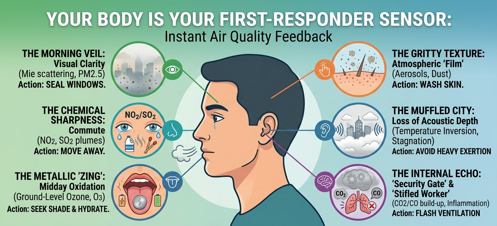

# **The First-Responder Sensor: Why Your Body is Your Most Localized Air Quality Tool**

I’ve noticed an interesting shift in how we relate to our environment.
We’ve become increasingly reliant on air quality indexes and smartphone
apps to tell us if the air is fit to breathe. While these digital tools
are essential, they work best when paired with our own biological
feedback.

Your senses are your **"first-responder" sensors**. Consumer monitors
are brilliant bits of kit; they are incredibly useful for tracking both
short and long-term pollutant trends in your home and for even
identifying "silent" pollutants that have no smell at all. However,
while an app provides a snapshot from a station that might be kilometres
away, your body provides almost instant information on a live-stream of
the air hitting your face right now.

By the time a localized pollution spike—like a passing truck or a nearby
construction cloud—is processed, averaged, and pushed to your screen,
your body has already been reacting to the environment for several
minutes.

To understand how this works in practice, I’ve laid out a few common
daily scenarios that demonstrate how your biology "reads" the atmosphere
alongside your digital tools. When you notice these signals—**and can
reasonably rule out other, more obvious causes**—you can take immediate
action to mitigate your exposure.

## **1. The Morning Veil: Visual Clarity**

Looking out from a balcony at 7:00 AM, you might notice the skyline
isn’t gone, but the buildings look "soft." It’s as if someone has rubbed
a bit of grease over a camera lens; the sharp architectural edges have
been replaced by a fuzzy, blue-grey blur.

-   **The Concept:** This visual softening is **frequently associated
    with Mie scattering**. Imagine shining a torch through a thick fog.
    The light doesn’t go straight through; it hits the water droplets
    and bounces in every direction, creating a glow.

-   **The Signature:** In the city, microscopic particles like
    $PM_{2.5}$ (dust, soot, and smoke) do the same thing to sunlight.
    Because these particles are roughly the same size as the wavelength
    of visible light, they deflect the rays, making the horizon look
    "milky" or out of focus.

-   **The Action:** If the horizon lacks "crispness," and **you can rule
    out natural weather conditions like localized ground fog**, it’s a
    sign that particulate matter is high. It’s a sensible time to keep
    the windows shut. **Next time you’re on your balcony, look at a
    distant landmark—is it sharp, or does it look like it's behind a
    veil?**

## **2. The Chemical Sharpness: The Commute**

Standing by a busy junction an hour later, you might notice a "sting" in
your eyes and a tickle in your throat. This is often described as the
**lacrimation response**.

-   **The Concept:** This is simply the body's "emergency wash" system.
    When the delicate membranes of your eyes or throat detect an
    irritant, they produce extra fluid to dilute and flush the intruder
    out.

-   **The Signature:** This response is frequently observed in
    environments with high levels of **Nitrogen Dioxide (**$NO_2$) or
    **Sulfur Dioxide (**$SO_2$).

    -   $NO_2$ often carries a scent resembling **strong bleach or a
        clinical swimming pool**.

    -   $SO_2$ (often from low-quality fuel combustion or industrial
        exhaust) carries a sharp, pungent aroma like a **recently struck
        matchstick**.

-   **The Action:** If you have this reaction **and aren't near a
    cleaning facility, a swimming pool, or someone actually lighting
    matches**, your senses have identified a hyper-local plume. Move a
    few dozen metres away from the curb or step into a side street. Once
    you reach a cleaner area, you can always verify by using a portable
    monitor to confirm if your hunch was correct.

## **3. The Metallic "Zing": Midday Oxidation**

By 2:00 PM in a park, the sun is intense. The air might smell strangely
"sweet" or clinical. You might notice a **dry, metallic taste** at the
back of your tongue.

-   **The Concept:** A "metallic taste" is a sharp, sour "zing" similar
    to the sensation of touching a copper coin to your tongue.

-   **The Signature:** This sensation is **frequently linked to
    Ground-Level Ozone (**$O_3$). In high heat, pollutants "cook" in the
    sun to form this gas, which can react with the moisture and pH
    levels of your saliva, causing a form of **oxidative stress**.

-   **The Action:** If you notice that "copper" taste, **and you haven't
    been eating or drinking anything that might come close to that
    metallic or acidic taste**, your respiratory system is signaling a
    need for rest. Find deep shade and stay well-hydrated with cool
    water. This helps maintain the moisture in your throat and
    encourages you to slow your breathing.

## **4. The Gritty Texture: Atmospheric "Film"**

Near a construction site in the evening, your skin might feel "prickly"
or "sticky," and if you run a finger across your forehead, it feels
**"gritty."**

-   **The Concept:** This is the physical accumulation of **Aerosols**
    and larger dust particles. Unlike gases, these have actual mass and
    weight.

-   **The Signature:** If your glasses seem to get "dirty" unusually
    fast, or if your skin feels like there’s a fine film of sand on it,
    the air is saturated with physical debris.

-   **The Action:** If **you haven't been doing manual labour or working
    in a dusty environment**, your skin is signaling that it's covered
    in irritants. When you get home, a simple wash with soap and water
    is the most effective way to remove these particles from your skin.

## **5. The Muffled City: Loss of Acoustic Depth**

Later, you might notice that the usual "crispness" of the city sounds is
gone. Distant traffic doesn't hum; it sounds dull, as if you're
listening through a layer of cotton wool.

-   **The "Blanket" Analogy:** This is **Acoustic Attenuation**. In
    clear air, sound waves travel with high-frequency details intact.
    When the air is saturated with **Aerosols**, these particles act
    like acoustic foam (a blanket of sorts), absorbing and scattering
    sound energy.

-   **The Signature:** This "muffled" effect is **frequently associated
    with a temperature inversion**—where a layer of warm air traps a
    "lid" of cold, dirty air near the ground. Because the air is
    stagnant, the "acoustic depth" of your environment shrinks.

-   **The Action:** If the world sounds "closed-in," **and you are not
    in an acoustically dampened indoor space**, it is a signal that the
    air is stagnant and pollutants are not dispersing. Avoid heavy
    outdoor exertion.

## **6. The Internal Echo: The "Security Gate" and the "Stifled Worker"**

While your other senses act as scouts for the environment outside, your
"sixth sense" (**interoception**) monitors the metabolic cost of the air
you have already inhaled.

-   **The Physical Defense (The Security Gate):** Imagine your lungs are
    a high-security building. When the air is thick with external
    irritants like **dust or sulfur (**$SO_2$), the building slams its
    gates shut to keep the intruders out. This is
    **bronchoconstriction**, where your airways physically narrow.

    -   **The Signature:** You feel this as a sudden **"tightness"** in
        your chest or a strange resistance when trying to take a full,
        deep breath. It is the physical effort of your body trying to
        force air through a shrinking opening.

-   **The Internal Crisis (The Stifled Worker):** Now, imagine your
    **Autonomic Nervous System** is a worker deep inside that building.
    If the "Security Gates" stay shut for too long, or if you are in a
    sealed room with no airflow, the oxygen going to the **Autonomic
    Nervous System** is slowly replaced.

    -   **The Build-up:** As you breathe, you exhaled $CO_2$, which acts
        as a sedative in high concentrations. If there is incomplete
        combustion nearby (like a gas stove or a heater), **Carbon
        Monoxide (**$CO$)—the "silent" intruder—might also be competing
        for the Nervous System's attention.

    -   **The Signature:** This manifests as a sudden **brain fog**, a
        "heavy" forehead, or a racing pulse. If these feelings are
        **unexplained by your workload or lack of sleep**, your internal
        worker is being "stifled." Your brain is diverting energy away
        from thinking and toward managing the stress of rising $CO_2$
        and falling oxygen levels.

-   **The Action: The "Flash Reset":** If you feel this mental friction,
    your internal engine is stalling. But what if the outdoor air is
    just as bad?

    1.  **The Tactical Opening:** Do not leave windows open
        indefinitely. Instead, perform a **"Flash Ventilation"**—open
        two windows for a few minutes to create a cross-breeze. This
        flushes out the $CO_2$ and $CO$ "stagnation" without allowing a
        massive volume of outdoor $PM_{2.5}$ to settle.

    2.  **The Micro-Move:** If you are outdoors near traffic, pivot away
        into a side street or step into a shop temporarily.

    3.  **Nasal Recovery:** Switch to slow, calm nasal breathing. Your
        nose is your primary "pre-filter" that helps calm the nervous
        system.

## **The Biological Early Warning Checklist**

|                       |                        |                                   |                         |
|-----------------------|------------------------|-----------------------------------|-------------------------|
| **The Signal**        | **Signature**          | **What it likely represents**     | **Sustainable Action**  |
| **Blurry horizon**    | Loss of crispness      | High $PM_{2.5}$ (Mie scattering). | Seal windows / Filter.  |
| **Watering eyes**     | Bleach or Matchstick   | $NO_2$ or $SO_2$ plumes.          | Step away from source.  |
| **Metallic taste**    | Battery-like tang      | Ground-level Ozone ($O_3$).       | Seek shade and hydrate. |
| **Gritty skin**       | Fine film of debris    | Physical Aerosol/dust loading.    | Wash skin with soap.    |
| **Muffled sounds**    | Loss of acoustic depth | Atmospheric stagnation.           | Avoid heavy exertion.   |
| **Tight chest / Fog** | The Stifled Worker     | $CO_2$ build-up / Inflammation.   | **Flash Ventilation.**  |

## **Conclusion**

The most alarming part of air pollution is how quickly we "normalize"
it. We stay in a stagnant room until we become **"nose blind,"** or we
accept a daily headache as "work stress" when it is actually a
biological reaction to $CO_2$ or $CO$ increasing.

There is a massive opportunity for the us to raise awareness and
especially teach the next generation (from early on) about the internal
sensors that our body possesses.

By being simply aware and raising awareness about the full spectrum of
our senses—Sight, Smell, Taste, Touch, Hearing, and our Internal
Interoception — and its link to air pollution — we give ourselves and
the next generation a survival kit that doesn't require a battery. If we
as a community learn to recognize the "Morning Veil" or the "Metallic
Zing", which are easy to recognize cues - then we won't have to wait for
an app to tell us when to act. We will already be one step ahead into
safeguarding our health and future.

## Support This Work: Give It a Star

Thank you for reading! If you found this project helpful or interesting,
please consider starring it on GitHub. Your stars help others discover
and benefit from this fully open and free repository. Click [here to
star the
repository](https://github.com/AarshBatra/biteSizedAQ/stargazers) and
join the growing community of folks who follow biteSizedAQ.

## Get in touch

Get in touch about related topics/report any errors. Reach out to me at
bitesizedaq\@gmail.com.

## License and Reuse

All content under **biteSizedAQ** is shared under the **Creative Commons
Attribution 4.0 International (CC BY 4.0) license**. You are welcome to
use this material in your reports or news stories—just remember to give
appropriate credit and include a link back to the original work.

Every effort is made to ensure that only original or appropriately
licensed material is shared. If any copyrighted content has been used
inadvertently, please note that this is unintentional, and I will
promptly address it upon notification.

Thank you for respecting these terms!
