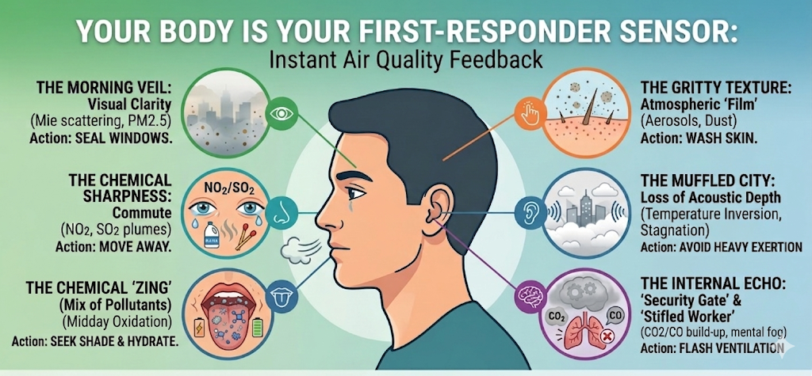

# **The First-Responder Sensor: Why Your Body is Your Most Localized Air Quality Tool**

I've noticed an interesting shift in how we relate to our environment.
We've become increasingly reliant on air quality indexes and smartphone
apps to tell us if the air is fit to breathe. While these digital tools
are essential, they work best when understood alongside our own
biological feedback — not as a replacement for it, but as a partner to
it.

Your senses are your "first-responder" sensors. When a localized
pollution spike hits — a passing truck, a nearby construction cloud, a
sudden chemical plume — your body reacts in real time. By the time that
same event is processed, averaged, and pushed to your screen from a
monitoring station that might be kilometres away, several minutes have
already passed. Your body was already there.

Consumer monitors are brilliant bits of kit for tracking short and
long-term pollutant trends or even identifying "silent" pollutants that
have no smell or sensation at all. For chronic, background pollution
that your nose has long since stopped noticing, your device is
indispensable. Think of your biological senses and your monitor as a
team — your body catches the sharp, sudden, hyper-local spikes and
informs you so that you can act; your device tracks the slow, invisible,
long-term trends that neither of you can feel.

To understand how this works in practice, I've laid out a few common
daily scenarios that demonstrate how your biology "reads" the atmosphere
alongside your digital tools. When you notice these signals — and can
reasonably rule out other, more obvious causes — you can take immediate
action to mitigate your exposure. Your AQ monitor can then help you
confirm and quantify what your body first detected.

## **1. The Morning Veil: Visual Clarity**

Looking out from a balcony at 7:00 AM, you might notice the skyline
isn’t gone, but the buildings look "soft." It’s as if someone has rubbed
a bit of grease over a camera lens; the sharp architectural edges have
been replaced by a fuzzy, blue-grey blur.

-   **The Concept:** This visual softening is **frequently associated
    with Mie scattering**. Imagine shining a torch through a thick fog.
    The light doesn’t go straight through; it hits the water droplets
    and bounces in every direction, creating a glow.

-   **The Signature:** In the city, microscopic particles like
    $PM_{2.5}$ (dust, soot, and smoke) do the same thing to sunlight.
    Because these particles are roughly the same size as the wavelength
    of visible light, they deflect the rays, making the horizon look
    "milky" or out of focus.

-   **The Action:** If the horizon lacks "crispness," and **you can rule
    out natural weather conditions like localized ground fog**, it’s a
    sign that particulate matter is high. It’s a sensible time to keep
    the windows shut. **Next time you’re on your balcony, look at a
    distant landmark—is it sharp, or does it look like it's behind a
    veil?**

## **2. The Chemical Sharpness: The Commute**

Standing by a busy junction an hour later, you might notice a "sting" in
your eyes and a tickle in your throat. This is often described as the
**lacrimation response**.

-   **The Concept:** This is simply the body's "emergency wash" system.
    When the delicate membranes of your eyes or throat detect an
    irritant, they produce extra fluid to dilute and flush the intruder
    out.

-   **The Signature:** This response is frequently observed in
    environments with high levels of **Nitrogen Dioxide (**$NO_2$) or
    **Sulfur Dioxide (**$SO_2$).

    -   $NO_2$ often carries a scent resembling **strong bleach or a
        clinical swimming pool**.

    -   $SO_2$ (often from low-quality fuel combustion or industrial
        exhaust) carries a sharp, pungent aroma like a **recently struck
        matchstick**.

-   **The Action:** If you have this reaction **and aren't near a
    cleaning facility, a swimming pool, or someone actually lighting
    matches**, your senses have identified a hyper-local plume. Move a
    few dozen metres away from the curb or step into a side street. Once
    you reach a cleaner area, you can always verify by using a portable
    monitor to confirm if your hunch was correct.

## 3. The Chemical "Zing": Midday Oxidation

By 2:00 PM in a park, the sun is intense. The air might smell strangely
"sweet" or clinical. You might notice what feels like an unusual taste
at the back of your tongue—metallic, bitter, or chemically sharp.

**The Concept:** During peak sun hours, nitrogen oxides (NO₂) from
traffic, volatile organic compounds (VOCs) from industry, and
ground-level ozone (O₃) formed by photochemical reactions create a
complex atmospheric cocktail. What feels like "taste" is actually your
nose and irritation sensors working together.

**The Signature:** This sensation combines two biological responses:

-   **Olfactory detection**: Chemical odors traveling from your nose to
    the back of your throat

-   **Trigeminal irritation**: Sharp, burning sensations from gases like
    SO₂ and NO₂ stimulating nerve endings

The result is a sensation the brain registers as taste — metallic,
chemical, or acrid. This happens because three separate chemical
detection systems fire at once: your olfactory receptors pick up the
chemical signature of the pollutant; your trigeminal nerve endings in
the nasal cavity and throat respond to the irritant quality of gases
like SO₂ and NO₂; and in some cases, volatile chemicals travelling from
the back of your throat through the nasal passage during exhalation — a
process called retronasal airflow — can activate taste receptors in the
throat and soft palate directly. Your brain receives all three signals
simultaneously and integrates them into a single sensation it labels as
taste. It is not a confusion or a misfire — it is the chemosensory
system working exactly as designed.

**The Action:** If you detect this chemical "taste-smell" sensation
combined with throat irritation on a hot day—your upper respiratory
sensors are detecting elevated pollution levels. Reduce outdoor
exertion, seek shade, and stay hydrated.

## **4. The Gritty Texture: Atmospheric "Film"**

Near a construction site in the evening, your skin might feel "prickly"
or "sticky," and if you run a finger across your forehead, it feels
**"gritty."**

-   **The Concept:** This is the physical accumulation of **Aerosols**
    and larger dust particles. Unlike gases, these have actual mass and
    weight.

-   **The Signature:** If your glasses seem to get "dirty" unusually
    fast, or if your skin feels like there’s a fine film of sand on it,
    the air is saturated with physical debris.

-   **The Action:** If you haven't been doing manual labour or working
    in a dusty environment, your skin is telling you that particles are
    settling on it. Think of this signal as a surface alert — it
    confirms something is in the air, but it cannot tell you how much,
    or what is happening beneath the surface. The gritty feeling you
    notice on your forehead is the visible tip; beneath it, repeated
    PM2.5 exposure has been shown to degrade filaggrin — a structural
    protein that holds your skin cells together and keeps your skin
    barrier intact — with no sensation to warn you it is happening. Wash
    when you get home. And if you live or work somewhere with persistent
    particle loading, your monitor is the tool that catches what your
    fingertips cannot.

## **5. The Muffled City: Loss of Acoustic Depth**

Later, you might notice that the usual "crispness" of the city sounds is
gone. Distant traffic doesn't hum; it sounds dull, as if you're
listening through a layer of cotton wool.

-   **The "Blanket" Analogy:** This is Acoustic Attenuation. In clear
    air, sound waves travel with high-frequency details intact. Dense,
    stagnant, aerosol-laden air absorbs and scatters that sound energy —
    particularly the higher frequencies that give distant sounds their
    sharpness and definition.

-   **The Signature:** The muffled effect on its own is subtle — too
    subtle to rely on in isolation. But it becomes a meaningful clue
    when paired with what you can already see: a hazy horizon, a milky
    sky, or the visual "veil" described in Signal 1. When your ears and
    eyes are both telling you the same story, the air is likely stagnant
    and pollutants are not dispersing. This stagnation is frequently
    associated with a temperature inversion — where a layer of warm air
    acts as a "lid," trapping cooler, dirtier air close to the ground.

-   **The Action:** Don't act on this signal alone. But if the world
    sounds closed-in *and* looks closed-in, treat it as confirmation
    rather than a first alert. Avoid heavy outdoor exertion, and check
    your monitor if you have one.

## **6. The Internal Echo: The "Security Gate" and the "Stifled Worker"**

While your other senses act as scouts for the environment outside, your
"sixth sense" (**interoception**) monitors the metabolic cost of the air
you have already inhaled.

-   **The Physical Defense (The Security Gate):** Imagine your lungs are
    a high-security building. When the air is thick with external
    irritants like **dust or sulfur (**$SO_2$), the building slams its
    gates shut to keep the intruders out. This is
    **bronchoconstriction**, where your airways physically narrow.

    -   **The Signature:** You feel this as a sudden **"tightness"** in
        your chest or a strange resistance when trying to take a full,
        deep breath. It is the physical effort of your body trying to
        force air through a shrinking opening.

-   **The Internal Crisis (The Stifled Worker):** Now, imagine your
    **Autonomic Nervous System** is a worker deep inside that building.
    If the "Security Gates" stay shut for too long, or if you are in a
    sealed room with no airflow, the oxygen going to the **Autonomic
    Nervous System** is slowly replaced.

    -   **The Build-up:** As you breathe, you exhaled $CO_2$, which acts
        as a sedative in high concentrations. If there is incomplete
        combustion nearby (like a gas stove or a heater), **Carbon
        Monoxide (**$CO$)—the "silent" intruder—might also be competing
        for the Nervous System's attention.

    -   **The Signature:** This manifests as a sudden brain fog or a
        'heavy' forehead — and in poorly ventilated spaces, an elevated
        pulse. If these feelings are **unexplained by your workload or
        lack of sleep**, your internal worker is being "stifled." Your
        brain is diverting energy away from thinking and toward managing
        the stress of rising $CO_2$ and falling oxygen

-   **The Action: The "Flash Reset":** If you feel this mental friction,
    your internal engine is stalling. But what if the outdoor air is
    just as bad?

    1.  **The Tactical Opening:** Do not leave windows open
        indefinitely. Instead, perform a **"Flash Ventilation"**—open
        two windows for a few minutes to create a cross-breeze. This
        flushes out the $CO_2$ and $CO$ "stagnation" without allowing a
        massive volume of outdoor $PM_{2.5}$ to settle.

    2.  **The Micro-Move:** If you are outdoors near traffic, pivot away
        into a side street or step into a shop temporarily.

    3.  **Nasal Recovery:** Switch to slow, calm nasal breathing. Your
        nose is your primary "pre-filter" that helps calm the nervous
        system.

## **The Biological Early Warning Checklist**

| The Signal                     | Signature                                                | What it likely represents                                                                                          | Sustainable Action                                                        |
|----------------|-----------------|-----------------|----------------------|
| Blurry horizon                 | Loss of crispness                                        | High PM2.5 (Mie scattering)                                                                                        | Seal windows / Filter                                                     |
| Watering eyes                  | Bleach or Matchstick smell                               | NO2 or SO2 plumes                                                                                                  | Step away from source                                                     |
| Chemical taste/smell sensation | Chemical sharpness                                       | Mix of pollutants                                                                                                  | Move away, hydrate, minimise exertion                                     |
| Gritty skin ⚠️                 | Fine film of debris on skin surface                      | Physical Aerosol/dust loading — surface signal only; silent deeper effects on skin barrier not detectable by touch | Wash skin with soap; monitor long-term exposure                           |
| Muffled sounds ⚠️              | Loss of acoustic depth — best used alongside visual haze | Atmospheric stagnation (confirming signal, not standalone)                                                         | Combine with Signal 1 before acting; avoid heavy exertion if both present |
| Tight chest / Fog              | The Stifled Worker                                       | CO2 build-up / Inflammation                                                                                        | Flash Ventilation                                                         |

## **A Note on Using These Signals Well**

Your biological senses are genuinely powerful — but like any instrument,
they work best when you know how to read them.

**Look for clusters, not single signals.** One watering eye on a windy
day is probably just wind. But watering eyes combined with a chemical
sharpness in your throat, near a busy junction, during rush hour? That
combination makes it considerably more likely that something in the air
is worth acting on. The more signals that appear together, in the same
place, at the same time, the more probable it becomes that air quality —
rather than an unrelated cause — is the common thread.

**Not every signal will apply to you — and that is expected.** Which of
these six responses you notice depends on where you live, what
pollutants dominate your local environment, and how your own biology
responds to them. You may go years without experiencing some of these
signals, and encounter others regularly. The value of knowing all six is
not that you will experience all of them — it is that when you find
yourself somewhere new, you have a fuller vocabulary for what your body
might be telling you. Think of them less as a daily checklist and more
as a navigational toolkit: the wider your awareness, the better equipped
you are to read any environment you move through.

**Context is your best filter.** Your body cannot tell you *why* it is
reacting — only that it is. So the most useful question to ask is not
"what is wrong with me?" but "where and when does this happen?" If your
eyes sting at a particular junction every morning and clear up when you
turn onto a quieter street, that is a meaningful pattern. If your throat
feels scratchy every afternoon near a construction site but not at home,
that place-dependence raises the likelihood that something locally
elevated is the more probable cause.

Allergies and tiredness tend to follow you everywhere — they are present
when you wake up, when you are indoors, when you are away from traffic.
A spike in pollution is different. Even in cities where the air is
heavily loaded across the board, there is still a meaningful difference
between the background and a local peak. A symptom that noticeably
worsens when you arrive somewhere and eases when you step away suggests
you have moved into a zone of higher exposure. In heavily polluted
environments you may never reach truly clean air — but you can still
move from worse to less worse. Your body is often the first thing to
tell you which direction that is.

**Your nose goes blind; your monitor stays awake.** Olfactory adaptation
— the process by which your nose stops registering a persistent smell —
is not a feature. It is a vulnerability. If you live near a busy road or
cook on a gas stove regularly, you may have long since stopped noticing
what is still very much present in the air around you. Your monitor has
no such blind spot. It does not habituate, normalise, or get tired. This
is precisely why digital tools are indispensable for the slow,
background pollution that your senses have quietly learned to ignore —
and why the two work best as partners rather than substitutes for each
other.

**These are prompts, not diagnoses.** When your body raises a flag,
treat it as an invitation to investigate and act — not a final verdict.
Move, ventilate, check your monitor. Let the signal start the
conversation, not end it.

## **Conclusion**

The most alarming part of air pollution is how quickly we normalise it.
We stay in a stagnant room until we become "nose blind," or we accept a
daily headache as "work stress" when it may be a biological response to
rising CO₂ or CO. We scroll past an AQI number without connecting it to
the tightness we felt in our chest that morning.

What this guide has tried to show is that your body is already doing the
work — it has been doing it your entire life. The "Morning Veil," the
"Metallic Zing," the chemical sharpness at a busy junction — these are
not random discomforts. They are signals from a biological early-warning
system that requires no battery, no subscription, and no data
connection.

But like any instrument, it works best when you know how to read it. A
single signal, in isolation, is a prompt to pay attention. Multiple
signals, appearing together, in the same place, at the same time of day
— that is your body building a case. And when your biological senses and
your digital tools are working as a team, pointing in the same
direction, you have something genuinely powerful: localised, real-time
awareness that no monitoring station kilometres away can replicate.

There is a real opportunity here — not just for ourselves, but for the
next generation. If we can teach children early to recognise the
"Morning Veil" or the "Metallic Zing" the same way we teach them to look
both ways before crossing the road, we give them a survival toolkit that
stays with them for life and something they can pass on further to the
generations that will come after them.

Sensory awareness is the oldest early-warning system we have. For most
of human history, it was the only one. We built instruments to extend it
— and those instruments changed everything. But the original is still
running alongside them, still reliable, and still worth paying attention
to. The two together are more powerful than either alone.

## Supporting Evidence

#### 1. The Morning Veil: Visual Clarity (PM2.5 & Mie Scattering)

***Tao, J., Zhang, L., Cao, J., et al. (2021)***. Analysis of non-linear
relationship of PM2.5 mass concentration with aerosol extinction
coefficient and RH in Hefei, China. *Aerosol and Air Quality Research*,
21(11), 200386. <https://aaqr.org/articles/aaqr-23-06-oa-0139>

#### 2. The Chemical Sharpness: Eye & Throat Irritation (NO2 & SO2)

***Yang, Y., Qi, J., Wang, B., et al. (2019)***. Short-term exposure to
nitrogen dioxide pollution and the risk of eye and adnexa diseases in
Xinxiang, China. *Atmospheric Environment*, 218, 117004.
<https://www.sciencedirect.com/science/article/abs/pii/S1352231019306405>

***Qiu et al (2025)*****.** Ambient sulfur dioxide and daily outpatient
visits for allergic conjunctivitis: a multi-city time-stratified
case-crossover study in China.
<https://link.springer.com/article/10.1186/s12889-025-25700-x>

#### 3. The Chemical "Zing": Midday Oxidation

***Purves et al***. Trigeminal Chemoreception. *Neuroscience*, NCBI
Bookshelf. <https://www.ncbi.nlm.nih.gov/books/NBK11036/>

***Ferdenzi, C. et al. (2018).*** Pleasantness and trigeminal sensations
as salient dimensions in organizing the semantic and physiological
spaces of odors. *Scientific Reports*.
<https://www.nature.com/articles/s41598-018-26510-5>

***Blankenship, M.L., Grigorova, M., Katz, D.B., & Maier, J.X.
(2019)***. Retronasal Odor Perception Requires Taste Cortex, but
Orthonasal Does Not. *Current Biology*, 29(1).
<https://pmc.ncbi.nlm.nih.gov/articles/PMC6604050/>

#### 4. The Gritty Texture: Particulate Skin Deposition

***Jin, S. P., Li, Z., Choi, E. K., et al. (2018)***. Particulate matter
causes skin barrier dysfunction. *JCI Insight*, 6(4), e145185.
<https://insight.jci.org/articles/view/145185>

#### 5. The Muffled City: Acoustic Attenuation

***Temkin, S. & Dobbins, R. A. (1966)***. Propagation of Sound in an
Aerosol. *Journal of the Acoustical Society of America*, 39(6).
<https://pubs.aip.org/asa/jasa/article/39/6_Supplement/1230/681022/Propagation-of-Sound-in-an-Aerosol>

***Salomons, E. M. & Heimann, D. (2003).*** Simulation of a morning air
temperature inversion break-up in complex terrain and the influence on
sound propagation on a local scale. *Applied Acoustics*, 64(2).
<https://www.sciencedirect.com/science/article/abs/pii/S0003682X02001044>

#### 6. The Internal Echo: CO2 Brain Fog & Bronchoconstriction

***Allen, J. G., MacNaughton, P., Satish, U., et al. (2016)***.
Associations of cognitive function scores with carbon dioxide,
ventilation, and volatile organic compound exposures in office workers.
*Environmental Health Perspectives*, 124(6), 805-812.
<https://pubmed.ncbi.nlm.nih.gov/26502459/>

***Linn, W.S., Avol, E.L., Peng, R.C., Shamoo, D.A., & Hackney, J.D.
(1987)***. Replicated dose-response study of sulfur dioxide effects in
normal, atopic, and asthmatic volunteers. *American Review of
Respiratory Disease*, 136(5), 1127–1134.
<https://pubmed.ncbi.nlm.nih.gov/3674575/>

## Support This Work: Give It a Star

Thank you for reading! If you found this project helpful or interesting,
please consider starring it on GitHub. Your stars help others discover
and benefit from this fully open and free repository. Click [here to
star the
repository](https://github.com/AarshBatra/biteSizedAQ/stargazers) and
join the growing community of folks who follow biteSizedAQ.

## Get in touch

Get in touch about related topics/report any errors. Reach out to me at
bitesizedaq\@gmail.com.

## License and Reuse

All content under **biteSizedAQ** is shared under the **Creative Commons
Attribution 4.0 International (CC BY 4.0) license**. You are welcome to
use this material in your reports or news stories—just remember to give
appropriate credit and include a link back to the original work.

Every effort is made to ensure that only original or appropriately
licensed material is shared. If any copyrighted content has been used
inadvertently, please note that this is unintentional, and I will
promptly address it upon notification.

Thank you for respecting these terms!
