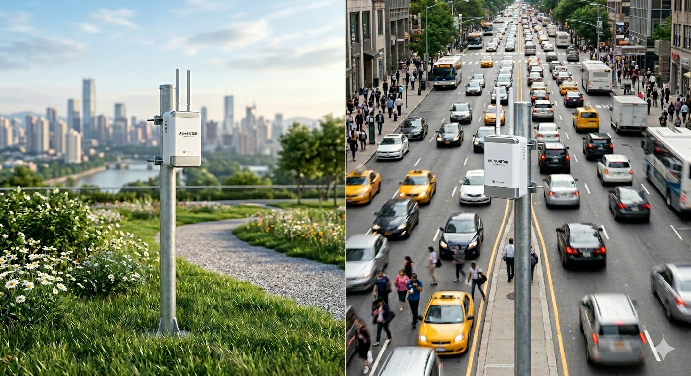
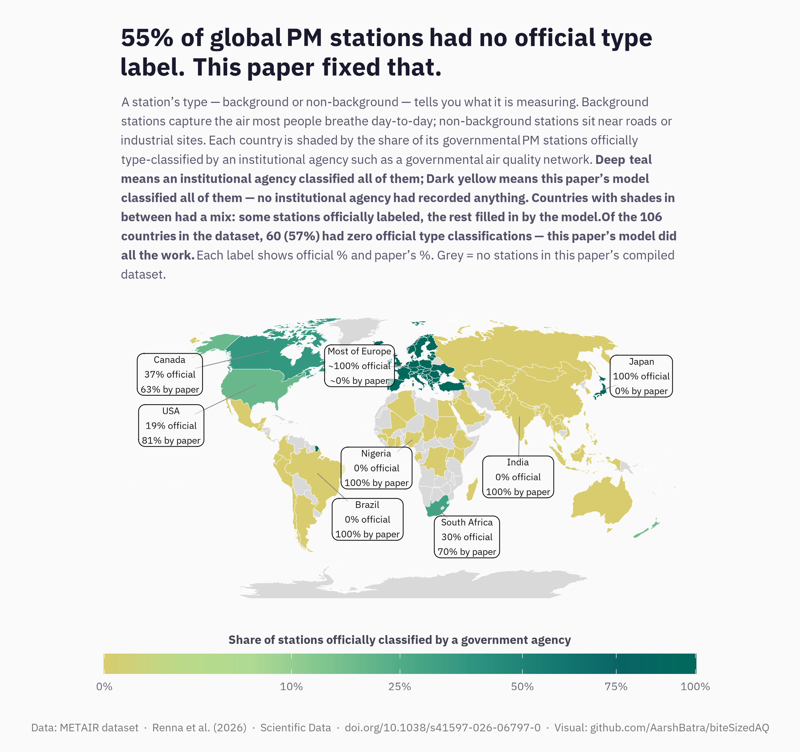
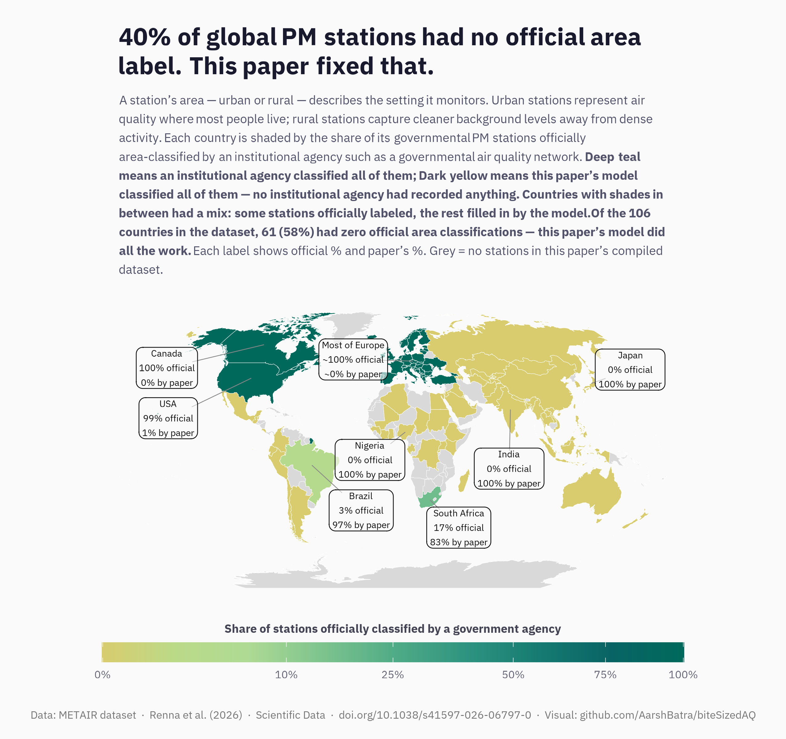

# **biteSizedVisual #6:** Tackling Air Pollution One Plot at a time

Welcome to the biteSizedVisuals Series: Tackling Air Pollution One Plot
at a Time!

In this series, I’ll break down air quality and pollution data into
easily digestible visualizations. Each post will highlight a key aspect
of air pollution, using simple yet powerful plots to uncover insights
and trends. Whether you're a data enthusiast, policy maker, or
environmental advocate, these bite-sized visuals will help you grasp
important air quality issues without the complexity.

Moreover, you are free to share this on social media, as all content
under biteSizedAQ is provided under Creative Commons Attribution 4.0
International (CC BY 4.0) license. If you do, the only request is to
please link back to the original post.

Let’s dive into the data—one plot at a time!

# A Metadata Gap in Global Air Quality Monitoring — and One Paper's Attempt to Fix It

A new dataset has compiled metadata on roughly **15,000 governmental air
quality monitoring stations** across **106 countries** — the largest
harmonized global record of its kind. These stations track particulate
matter — including fine, coarse, and total particulate mass. They sit on
rooftops, beside highways, in city parks, and in remote fields. They
take readings. They send data. And for decades, a surprising number of
them did so without ever being officially described.

Not described in the way you might think. Each station has a location.
But two of the most basic pieces of information — *what kind of
environment* the station sits in, and *what kind of air* it is actually
measuring — were never formally recorded by the agencies that built
them.

A new dataset, called **METAIR**, set out to fix that.

------------------------------------------------------------------------

## Why does it matter what "kind" of station a monitor is?

Imagine two air quality stations in the same city. One sits in a quiet
park, measuring the general background air that most residents breathe
throughout the day. The other sits at the edge of a busy motorway
interchange, directly downwind of exhaust fumes. Both record a PM
reading every hour. Both are in the same city. But they are measuring
fundamentally different things.

The first is what researchers call a **background station** — it
captures regional air quality, the pollution that hangs in the air
regardless of whether you are standing next to a road or not. The second
is a **non-background station** — it captures air that is directly
influenced by a nearby source, like traffic or industry.

If you try to compare these two readings without knowing which is which,
you will draw the wrong conclusions. You might think one neighbourhood
has cleaner air than it does, or dirtier air than it does. You might
wrongly compare two cities, or two countries, because their monitoring
networks are built differently.

The same problem applies to a station's **area classification** —
whether it sits in an **urban** setting (a city or town, where most
people live) or a **rural** one (the countryside, away from dense human
activity). Urban and rural stations capture different slices of the
population's exposure. Without that label, you cannot know whose air
quality a reading actually represents.

------------------------------------------------------------------------

## The gap

METAIR compiled metadata on **14,970 governmental PM monitoring
stations** from 106 countries. For each station, it checked whether the
operating agency had officially recorded its type (background or
non-background) and its area (urban or rural).

The results reveal a significant gap in official record-keeping.

For **station type (background, non-background)**, agencies had
officially classified just 6,777 of the 14,970 stations — meaning
**roughly 55% of stations globally had no official type
classification**. For **station area (urban, rural)**, agencies had
classified 8,945 stations, leaving **roughly 40% without an official
area classification**.

The maps below show this country by country. Each country is shaded by
the share of its governmental PM stations officially classified by an
institutional agency such as a governmental air quality network. Deep
teal means an institutional agency classified all of them. Dark Yellow
means this paper's model classified all of them — no institutional
agency had recorded anything. Grey countries have no stations in this
paper's compiled dataset.

**How to read the maps:** Take two countries as anchors. A deep teal
country — such as Germany or the United Kingdom — had its stations
officially classified by its own environmental agency; the paper's model
had little or nothing to add. A yellow country — such as Nigeria — had
no official classifications on record at all; every label in the dataset
for that country was estimated by the paper's model. Countries with
shades in between had a mix: some stations officially labeled, the rest
filled in by the model. The annotation boxes on each map show the exact
split for a selection of notable countries.

------------------------------------------------------------------------

### How well did agencies record "what" their monitors were measuring?

*Share of governmental PM stations with an agency-assigned type
classification (background or non-background), by country.*

### How well did agencies record "where" their monitors were located?

*Share of governmental PM stations with an agency-assigned area
classification (urban or rural), by country.*

------------------------------------------------------------------------

## What METAIR did about it

To fill this gap, the METAIR team built a machine learning model that
could look at each unclassified station and estimate both its area
(urban or rural) and its type (background or non-background).

The model works in two steps — and the order matters. It first
classifies each station's area, then uses that result to help classify
its type. The reason is logical: rural stations are almost always
background stations, since there are few roads or factories nearby.
Urban stations are more varied — some are background, some are close to
a busy road or industrial zone. So knowing whether a station sits in an
urban or rural setting gives the model useful context before it tries to
decide whether it is background or not.

**What the model looks at.** For each station, the model receives two
things: a satellite image and a set of numbers about the station's
surroundings.

The satellite image comes from the European Space Agency's WorldCover
programme. It shows a square patch of land roughly 2 kilometres on each
side, centred on the station. Each pixel in the image covers a 10-metre
square on the ground — roughly the footprint of a large room. At that
level of detail, the image is sharp enough to make out individual
buildings, major roads, factory rooftops, and patches of green space,
giving the model a clear picture of what kind of place the station
physically sits in.

The numbers give the model context that a photograph alone cannot
reveal. They include: whether large industrial plants are nearby (such
as coal mines, oil refineries, steel mills, or cement factories),
estimates of local air pollution and carbon monoxide concentrations, and
how densely populated the surrounding area is. Each of these is a clue.
Elevated carbon monoxide near a station, for instance, is a known marker
of heavy traffic. A coal plant within a few kilometres points toward an
industrial setting. Dense population suggests the station is in an urban
area rather than a rural one.

Together, the image and the numbers allow the model to make an informed
judgement about what the station is measuring and where it sits.

**Why urban or rural is the easier task.** Identifying whether a station
is urban or rural is relatively straightforward from a satellite image —
cities look different from countryside. The model achieved an accuracy
rate of around 93 out of 100 correct classifications on test data it had
not seen before.

**Why background or non-background is harder.** Classifying station type
is more difficult. In dense urban areas, pollution sources are diverse
and often overlap. A station sitting in a city park might still be
influenced by nearby traffic. The visual difference between a background
station and a non-background station in a city is subtle — the model has
to pick up on fine-grained cues such as the proximity of major roads or
industrial areas. The model achieved an accuracy rate of around 77 out
of 100 on this task.

**How it was trained.** Think of it like training a specialist rather
than starting from scratch with a novice. The researchers did not build
an image recognition system from the ground up. Instead, they started
with an existing model — one already trained by other researchers on a
large standard image dataset widely used in computer vision — that could
already understand basic visual patterns such as roads, buildings, open
land, and vegetation. They then specialised it for this task: they
showed it roughly 7,000 satellite images of air quality stations whose
classifications were already officially known — stations in Europe,
North America, Japan, South Africa, and Australia, where agencies had
already done the labelling work. By studying these examples, the model
learned to connect what the land around a station looks like to what
kind of station it is. It then applied that knowledge to estimate
classifications for over 8,000 additional stations where no official
label had ever been recorded.

The result: every station in the dataset (14,970 in total) now has both
a type and an area classification, either officially recorded by an
institutional agency or estimated by the model — with a clear flag
indicating which is which.

------------------------------------------------------------------------

## What this means

Before METAIR, a researcher wanting to compare background air pollution
across countries — or to assess how much of the population is monitored
by urban versus rural stations — would have had to either ignore
unclassified stations, make assumptions, or build their own
classification from scratch. The gap was real and it limited the kinds
of analyses that could be done.

It is the first dataset of its kind at global scale — a consistent,
openly available record of what these monitors are, and where they
stand.

------------------------------------------------------------------------

## Limitations

The authors are open about what the dataset cannot fully deliver.

Because air quality monitoring data is fragmented and unevenly
accessible across the world, some stations may be absent from the
dataset entirely. Others may carry imprecise coordinates, not due to
errors in the METAIR work itself, but because the original source data
was inaccurate. The authors note that these gaps will be addressed in
future releases as more station locations and metadata are recovered.

The model was also built to classify existing monitoring stations — not
to assign a classification to any arbitrary point on a map. Applying it
to every geographic coordinate would be computationally expensive and
unnecessary, given how few actual stations exist globally. That said,
the authors do not rule out future extensions entirely. A narrower
application focused on densely populated and urban areas — where the
concentration of monitoring needs is higher — would be feasible and
could support emerging uses such as low-cost sensor networks and citizen
science campaigns. These, however, remain outside the current scope of
this work.

------------------------------------------------------------------------

## References

-   ***Renna, S., Rodriguez-Pardo, C. & Aleluia Reis, L***. A dataset of
    harmonized global air quality monitoring metadata. *Sci
    Data* **13**, 466 (2026).
    <https://doi.org/10.1038/s41597-026-06797-0>

-   ***2 Map Visuals in this blog**:
    [github.com/AarshBatra/biteSizedAQ](https://github.com/AarshBatra/biteSizedAQ/)*

-   ***Initial AQ monitors split image***: Generated via Gemini

------------------------------------------------------------------------

## Code for the Maps

The Rmd file containing all analysis and code can be [found
here](https://github.com/AarshBatra/biteSizedAQ/blob/main/26.bite.sized.vis.6.aq.metadata.gap.filled.Rmd).
It is based on the data that can be found in [this
folder](https://github.com/AarshBatra/biteSizedAQ/tree/main/26.bite.sized.vis.6.aq.metadata.gap.filled/global_aq_mon_metadata/dataset)
(i.e. the dataset shared by this paper's authors: Renna et al.). I used
the data shared by the authors to generate these maps. For any data
related specific Qs, please reach out to the authors of the paper (see
References section above for more detail).

## Share these Visualizations

Here is a link which contains the high resolution versions of the above
plots and animations: Link.

Help raise awareness about the severity of air pollution in India by
sharing these and other visuals in the biteSizedVisuals series. By
spreading the message, we can collectively push for urgent actions to
address the crisis and create a healthier future for all.

Share these visuals with your network to highlight the air quality
challenges faced by millions across the country.

See License and Reuse section for further guidance on content sharing.

------------------------------------------------------------------------

## Support This Work: Give It a Star

Thank you for reading! If you found this project helpful or interesting,
please consider starring it on GitHub. Your stars help others discover
and benefit from this fully open and free repository. Click [here to
star the
repository](https://github.com/AarshBatra/biteSizedAQ/stargazers) and
join the growing community of folks who follow biteSizedAQ.

------------------------------------------------------------------------

## Get in touch

Get in touch about related topics/report any errors. Reach out to me at
bitesizedaq\@gmail.com.

------------------------------------------------------------------------

## License and Reuse

All content under **biteSizedAQ** is shared under the **Creative Commons
Attribution 4.0 International (CC BY 4.0) license**. You are welcome to
use this material in your reports or news stories—just remember to give
appropriate credit and include a link back to the original work.

Every effort is made to ensure that only original or appropriately
licensed material is shared. If any copyrighted content has been used
inadvertently, please note that this is unintentional, and I will
promptly address it upon notification.

Thank you for respecting these terms!
