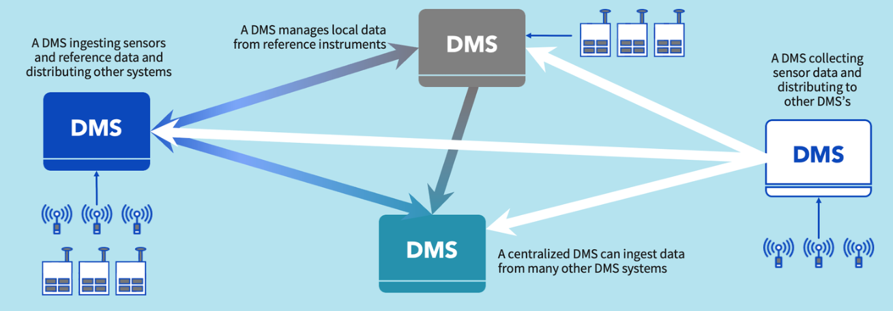
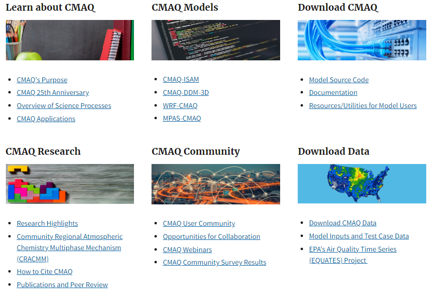

## Air Quality Data Management Systems Landscape: Navigating Challenges and Opportunities

#### Table of Contents

- [Introduction](#introduction)

- [History and Evolution of Air Quality Data Management
  Systems](#history-and-evolution-of-air-quality-data-management-systems)

  - [Early Beginnings](#early-beginnings)

  - [First Automated Systems](#first-automated-systems)

  - [Digital Revolution and the 2000s](#digital-revolution-2000s)

  - [Integration of IoT, Big Data, and Cloud
    Computing](#iot-intergration)

  - [Recent Trends](#recent-trends)

- [Current State of Air Quality Data Management
  Systems](#current-state-of-air-quality-data-management-systems)

  - [Diverse Data Sources](#diverse-data-sources)

  - [Data Formats and Standards](#data-formats-standards)

  - [Regulatory Frameworks](#regulatory-frameworks)

- [Considerations for Developing an Open-Source AQ
  DMS](#considerations-for-developing-an-open-source-aq-dms)

  - [Case Study 1: Collaborative Scoping Study for an Air Quality Data
    Management System (AQ DMS), Clean Air Fund and
    partners](#case-study-1-caf)

  - [How to establish a Community of Practice and why is it so
    important?](#how-to-establish-a-cop)

    - [Importance of a Community of Practice](#imp-of-builiding-cop)

    - [Building the Community](#building-the-community)

    - [Challenges and Solutions](#challenges-solutions)

  - [Case Study 2: The awesome OpenAQ Community!](#case-study-2-openaq)

  - [Case Study 3: Community Multiscale Air Quality (CMAQ)
    System](#case-study-3-cmaq)

- [Other Critical Steps](#other-critical-steps)

  - [Ensuring adequate sustained
    funding](#ensuring-adequate-sustained-funding)

  - [Addressing Bureaucratic and Regulatory
    Challenges](#addressing-beuracratic-reg-challenges)

  - [Customization and Flexibility](#customization-flexibility)

  - <a href="#harnessing-tech-innovations"
    data-heading="Customization and Flexibility">Harnessing Tech
    Innovations</a>

- [Conclusion](#conclusion)

- [References](#references)

- [Image Citations](#image-citations)

- [Rmd for this blog](#rmd-for-this-blog)

- [Get in Touch](#get-in-touch)

- [License and Reuse](#license-and-reuse)

## Introduction

 

 

.png)

  
Air quality (AQ) has become a critical concern for public health,
environmental sustainability, and policy-making worldwide. The need for
robust Air Quality Data Management Systems (AQ DMS) is more pressing
than ever, as these systems are essential for monitoring air pollution,
understanding its impacts, and devising effective mitigation strategies.

AQ DMS are, multi-faceted systems that collect data from a wide array of
sensors and devices, process and store this data, and provide analytical
tools for interpreting and disseminating the information. These systems
are used by government agencies, private companies, researchers, and the
general public to track air quality trends, forecast pollution events,
and ensure compliance with environmental regulations.

A significant challenge in the development and implementation of AQ DMS
is that every organization typically builds their own system from
scratch to suit their specific use case. There is no base template to
start with, leading to considerable variability in system design and
implementation. This approach results in substantial investment in
resources and time, often duplicated across different organizations. A
major portion of AQ funding within any organization goes into developing
a tailored AQ DMS, hiring personnel to build it, and investing in its
maintenance. An open-source AQ DMS could address this issue by providing
a standardized solution that organizations can adapt to their needs,
saving time and resources.

Moreover, an effective AQ DMS acts as a universal translator for air
quality data. Just as a language translator helps people understand
different languages, an AQ DMS standardizes and harmonizes data from
various sources and sensors. This ensures that no matter the system or
sensor used, the data is interpreted and presented consistently. This
standardization facilitates more reliable comparisons and analysis of
air quality across different regions and platforms, improving our
ability to manage and address air pollution effectively.

Over the decades, AQ DMSs developed by different user for different use
cases have evolved from simple, manual monitoring methods to
sophisticated, automated, and networked systems. Advances in digital
technology, the Internet of Things (IoT), big data, and cloud computing
have significantly enhanced these systems, enabling real-time data
collection, advanced analytics, and wide-scale data sharing.

Despite these advancements, numerous challenges remain. Data integration
and interoperability, data quality and validation, accessibility,
usability and open data initiatives are key areas that require ongoing
improvement. Additionally, the diverse needs of AQ data users, ranging
from government regulators to citizen scientists, and the various
devices and formats in use, complicate the development of universally
applicable AQ DMS.

## History and Evolution of Air Quality Data Management Systems

### Early Beginnings

Air quality monitoring began as a rudimentary process, driven by growing
concerns over urban pollution in the mid-20th century. Early efforts
were largely manual and sporadic, relying on simple chemical methods and
rudimentary instruments to measure concentrations of pollutants like
sulfur dioxide and particulate matter. These initial monitoring efforts
were primarily conducted by governmental agencies and academic
researchers.

### First Automated Systems

The development of automated monitoring systems in the 1970s and 1980s
marked a significant advancement. These systems employed continuous
monitoring techniques, utilizing more sophisticated instruments capable
of real-time data collection. Automated stations could continuously
measure pollutants such as ozone, nitrogen dioxide, and carbon monoxide,
providing a more comprehensive and accurate picture of air quality over
time.

**Example: The Clean Air Act in the United States:**  
The Clean Air Act, enacted in 1970, led to the establishment of the
National Ambient Air Quality Standards (NAAQS) and the creation of a
nationwide network of monitoring stations operated by the Environmental
Protection Agency (EPA). This initiative significantly advanced the
technology and infrastructure for AQ monitoring in the United States,
setting a precedent for similar efforts worldwide.

### Digital Revolution and the 2000s

The digital revolution of the 2000s brought about significant
enhancements in AQ DMS. The proliferation of the internet and
advancements in sensor technology facilitated the deployment of
extensive monitoring networks. Data could now be collected in real-time
and shared online, enabling better public access and more efficient
regulatory oversight.

Example: The European Environment Agency (EEA):  
The EEA established the AirBase database, a comprehensive repository of
air quality data from monitoring stations across Europe. This digital
platform allowed for the harmonization of data from different countries,
enabling comparative analysis and more effective policy-making at the EU
level.

### Integration of IoT, Big Data, and Cloud Computing

The 2010s witnessed the integration of IoT devices, big data analytics,
and cloud computing into AQ DMS. IoT sensors, being smaller and more
cost-effective, allowed for denser monitoring networks, including in
previously underserved areas. Big data analytics enabled the processing
of vast amounts of AQ data, uncovering patterns and trends that were
previously undetectable. Cloud computing provided scalable storage and
processing power, facilitating real-time data access and collaboration
across different stakeholders.

Example: IBM’s Green Horizons Initiative:  
IBM’s Green Horizons initiative leveraged IoT, AI, and big data
analytics to develop advanced AQ forecasting models. This project,
implemented in cities like Beijing, aimed to provide accurate pollution
forecasts and actionable insights to city planners and policymakers.

### Recent Trends

Over the past decade, several key trends have significantly shaped the
development of Air Quality Data Management Systems (AQ DMS):

- **Citizen Science and Crowdsourcing**: The democratization of air
  quality monitoring has been driven by the rise of low-cost sensors and
  mobile applications. Platforms like **PurpleAir** enable individuals
  to contribute real-time air quality data, creating a global network
  enriched with local insights. This grassroots approach helps fill data
  gaps and enhances public engagement in environmental monitoring.
  Another example is the **Air Quality Egg**, a community-driven project
  that uses low-cost sensors to monitor air quality and share data with
  the public.

- **Smart Cities Initiatives**: Integration of air quality data into
  broader urban management systems is becoming more common. Projects
  like **SmartSantander** in Spain and **NYC’s OpenData** initiative
  combine AQ data with other urban data streams to inform city planning
  and improve environmental quality. These smart city initiatives use AQ
  data to optimize traffic management, reduce pollution hotspots, and
  enhance overall urban livability.  
    
  Another example is ***The South Coast Air Quality Management District
  (SCAQMD)***. A key regional agency dedicated to improving air quality
  in Southern California’s South Coast Air Basin. Responsible for
  regulating emissions from a range of sources, SCAQMD enforces air
  quality standards and operates a comprehensive monitoring network to
  track pollution levels. Through various programs and initiatives,
  including clean air programs and public outreach, SCAQMD works to
  reduce pollution, protect public health, and promote environmental
  sustainability. The district’s efforts have significantly contributed
  to the reduction of air pollution in the region.

- **Open Data and Transparency**: A growing movement towards open data
  policies is making air quality information more accessible. Platforms
  like **OpenAQ** and the **Global Air Quality Initiative** provide free
  access to a vast array of AQ data from around the world. This
  transparency supports research, fosters innovation, and enables
  policymakers and the public to make more informed decisions.
  Similarly, the **Clean Air Fund** collaborates with various
  stakeholders to promote open data sharing and improve air quality
  monitoring standards globally.

- **Advanced Monitoring Solutions:** Companies like IQAir have developed
  sophisticated monitoring systems that offer comprehensive AQ data and
  analytics. **IQAir platform** provides real-time and historical air
  quality data from global monitoring networks, helping users make
  informed decisions about their environment. The platform integrates
  data from various sources, including satellite data and ground-based
  sensors, offering a detailed view of air quality conditions worldwide.
  **Breezometer** uses machine learning algorithms to aggregate data
  from multiple sources, providing real-time air quality information and
  health recommendations to users.

- **Integration with Health Data**: Combining air quality data with
  health impact information offers a comprehensive view of how pollution
  affects public health. The **Health Effects Institute’s Global Burden
  of Disease visualization tool** is an example of such integration. It
  allows users to explore the relationship between air quality and
  various health outcomes, such as respiratory and cardiovascular
  diseases, across different regions. This integration helps in
  understanding the broader health implications of air pollution,
  informing better public health strategies and interventions. By
  linking air quality measurements with health data, stakeholders can
  gain deeper insights into the effects of pollution on population
  health and develop more effective policies to mitigate its impact.
  Similarly, the **Air Quality Life Index (AQLI) tool** provides
  insights into how air pollution impacts life expectancy globally,
  highlighting and visualizing the potential health benefits of
  improving air quality.

- **Call for closing Local Air Quality monitoring data gaps:** The
  **Energy Policy Institute at the University of Chicago (EPIC)**
  emphasizes the importance of closing global air quality data gaps by
  engaging local actors. Their report advocates for increased investment
  in local air quality monitoring to improve data availability and drive
  better health and policy outcomes. By leveraging local expertise and
  resources, this approach aims to address air quality challenges more
  effectively and equitably. In line with this effort, EPIC has recently
  launched the **EPIC AQ Fund. This fund is a \$1.5 million initiative
  aimed at expanding access to air quality data to 1 billion people by
  2030.** The Fund supports long-term commitments to local actors,
  requiring awardees to share their data openly and on freely accessible
  platforms.

These trends reflect a growing emphasis on collaborative, transparent,
and technology-driven approaches to air quality monitoring and
management, aiming to create more robust and inclusive systems for
tracking and improving air quality worldwide.

## Current State of Air Quality Data Management Systems

### Diverse Data Sources

 

AQ DMS collect data from a variety of sources, each with its own
strengths and challenges:

- **Governmental Networks:** Government agencies operate extensive
  networks of high-accuracy monitoring stations. These stations provide
  reliable data but are often limited in number due to high costs.
  **Example: United States Environmental Protection Agency (EPA)
  AirNow.**
- **Private Sector:** Companies offer AQ monitoring services using
  proprietary sensors and platforms. These services can provide
  high-resolution data but may involve access restrictions or costs.
  **Example: BreezoMeter.**
- **Research Institutions:** Academic and research organizations deploy
  custom monitoring setups for specific studies, contributing valuable
  data and insights. **Example: European Environment Agency (EEA).**
- **Citizen Science:** Public participation through DIY sensors and
  mobile applications, contributing to large-scale data collection
  efforts. Platforms like Luftdaten allow citizens to contribute to air
  quality monitoring networks, increasing data density and coverage.

### Data Formats and Standards

Data collected from diverse sources often comes in different formats,
posing challenges for integration and analysis:

**Standardized Formats:** Organizations like the Open Geospatial
Consortium (OGC) and the World Meteorological Organization (WMO) work to
standardize data formats and protocols. Standards like the OGC
SensorThings API facilitate interoperability between different systems
and platforms. Examples of standardized formats include:

- **OGC SensorThings API:** This standard allows data from various
  sensors to be accessed and managed in a uniform way, making it easier
  to integrate and use the data across different platforms.

- **NetCDF (Network Common Data Form):** Used widely in atmospheric
  research, NetCDF is a standard format for array-oriented scientific
  data, including air quality data.

- **CSV (Comma-Separated Values):** A simple and common format for
  tabular data, often used for exporting and importing data between
  different systems.

- **GeoJSON:** A format for encoding a variety of geographic data
  structures using JavaScript Object Notation (JSON), widely used in
  web-based mapping and GIS applications.

- **HDF5 (Hierarchical Data Format version 5):** Another common format
  in scientific data, HDF5 is designed to store and organize large
  amounts of data, used in various research fields including meteorology
  and environmental science.

- **WMO BUFR (Binary Universal Form for the Representation of
  meteorological data):** A standard for encoding meteorological data,
  used globally by meteorological organizations.

**Proprietary Formats:** Many sensors and platforms still use
proprietary data formats, which can complicate integration efforts and
limit data usability. Examples of proprietary formats include:

- **Binary File Formats:** Some air quality sensors produce data in
  proprietary binary formats that require specific software or tools to
  decode.

- **Custom XML Formats:** Certain manufacturers design their own XML
  schemas for data output, which can be incompatible with other systems
  unless specific parsers are used.

- **Vendor-Specific APIs:** Some air quality monitoring devices provide
  data through APIs that are unique to the vendor, making it challenging
  to integrate with systems that are based on open standards.

- **Excel Spreadsheets:** While common and easy to use, Excel files
  (.xls or .xlsx) can contain complex formatting that is not always
  straightforward to parse programmatically.

- **Proprietary Database Formats:** Some systems use proprietary
  databases that require specialized software to access and query the
  data, which can hinder interoperability with other systems.

Efforts to encourage the adoption of open standards are ongoing, with
the goal of simplifying data integration and enhancing usability across
different platforms and applications. By adopting open standardized
formats, the AQ DMS can ensure better interoperability, easier data
sharing, and more efficient analysis.

### Regulatory Frameworks

Regulatory frameworks are crucial in guiding the development and
operation of an Air Quality Data Management System (AQ DMS). They ensure
that systems adhere to legal standards, protect public health, and
support international cooperation. Here’s a more detailed look at how
various regulatory elements impact AQ DMS:

**Government Regulations:** National and regional regulations establish
the legal standards for air quality monitoring and data reporting. These
regulations often specify the maximum allowable concentrations of
pollutants, the methods for measuring air quality, and the frequency of
reporting. For example:

- **European Union’s Ambient Air Quality Directives:** These directives
  provide detailed standards for monitoring air pollution levels across
  EU member states. They cover pollutants such as particulate matter
  (PM10 and PM2.5), nitrogen dioxide (NO2), and ozone (O3). The
  directives require member states to implement monitoring networks and
  make data publicly accessible.

- **U.S. Environmental Protection Agency (EPA) Standards:** The EPA sets
  National Ambient Air Quality Standards (NAAQS) for pollutants
  including sulfur dioxide (SO2), carbon monoxide (CO), and lead. These
  standards dictate how air quality should be monitored and reported in
  the U.S.

- **China’s Air Quality Standards:** China has established its own air
  quality standards, which include limits for pollutants like PM2.5 and
  PM10. These standards guide the operation of air quality monitoring
  networks across the country.

**International Agreements:** Global agreements and treaties play a
significant role in fostering international cooperation on air quality
issues. They often drive joint efforts to monitor air pollution, share
data, and implement mitigation strategies. Examples include:

- **The Paris Agreement:** While primarily focused on climate change,
  the Paris Agreement encourages countries to reduce greenhouse gas
  emissions, which also impacts air quality. It promotes international
  cooperation on environmental issues, including air pollution.

- **The Convention on Long-Range Transboundary Air Pollution (CLRTAP):**
  This international treaty aims to limit and reduce air pollution
  through collaborative efforts among its signatory countries. It
  facilitates data sharing and joint research on transboundary air
  pollution issues.

- **The World Health Organization (WHO) Guidelines:** WHO provides
  global air quality guidelines that help countries set standards and
  policies for improving air quality.

**Privacy and Data Security:** As AQ DMS handle a wide range of data,
including potentially sensitive information, privacy and data security
regulations are essential. These regulations ensure that personal and
environmental data is collected, stored, and shared in a way that
respects individual privacy and maintains data integrity. For instance:

- **General Data Protection Regulation (GDPR):** In the European Union,
  GDPR regulates how personal data should be handled. This includes
  ensuring that data collected through air quality monitoring systems
  that may include personal information is stored securely and used
  appropriately.

- **California Consumer Privacy Act (CCPA):** In the U.S., the CCPA
  provides guidelines on how personal information should be managed,
  including data collected through environmental monitoring systems.

- **Health Insurance Portability and Accountability Act (HIPAA):** While
  primarily focused on healthcare data, HIPAA principles can be applied
  to ensure that health-related air quality data is handled with
  appropriate privacy measures.

These regulatory frameworks collectively influence how AQ DMS are
designed, operated, and integrated into broader environmental and public
health systems. Adhering to these regulations helps ensure that air
quality monitoring systems are effective, reliable, and respectful of
individuals’ rights.

## Considerations for Developing an Open-Source AQ DMS

As the need for comprehensive and effective air quality monitoring
systems continues to grow, developing an open-source Air Quality Data
Management System (AQ DMS) has emerged as a promising solution.
Open-source systems offer numerous benefits, including cost savings,
enhanced collaboration, and greater transparency. However, the
development of such systems involves a range of considerations that must
be carefully addressed to ensure their success and sustainability.

This section explores the key factors involved in developing an
open-source AQ DMS, especially focusing on a scoping study performed by
Clean Air Fund and partners. It delves into the advantages and
challenges associated with this approach, including governance,
technical infrastructure, user needs, and long-term sustainability. By
examining these considerations, stakeholders can better understand how
to design and implement an open-source AQ DMS that meets the diverse
requirements of users and effectively addresses the complexities of air
quality management.

------------------------------------------------------------------------

> ### Case Study 1: Collaborative Scoping Study for an Air Quality Data Management System (AQ DMS), Clean Air Fund and partners
>
> ------------------------------------------------------------------------
>
> #### Background
>
> The AQ DMS scoping study, led by the Clean Air Fund in collaboration
> with TD Enviro, Valiant Solutions, and the University of
> Massachusetts, are leading efforts towards the end of making an open
> source AQ DMS.
>
> #### Key Participants
>
> - **TD Enviro**
> - **US EPA**
> - **Clean Air Fund**
> - **Valiant Solutions**
> - **University of Massachusetts**
>
> #### Objectives and Methodology
>
> The primary objectives of the scoping study were to survey the current
> landscape of AQ DMS, understand current and future needs, develop a
> blueprint for a standardized system, and report the findings.
>
> #### Key Findings and Insights
>
> #### Community of Practice (CoP)
>
> The study emphasized the importance of establishing a CoP before
> building the DMS. This approach ensures community buy-in and avoids
> the inefficiency of building a DMS without user input. The CoP should
> be transparent, open, and actively promoted.
>
> - **Current Challenges**:
>   - **Expanding Air Monitoring**: The rapid increase in air monitoring
>     activities has led to a significant rise in data volume, making
>     data management more resource and time-intensive.
>   - **Data Quality**: The quality of air quality data is decreasing
>     due to poor management practices, resulting in limited use of the
>     data.
>   - **Resource Duplication**: Organizations are often duplicating
>     efforts in terms of setting up a AQ DMS that works for them, but
>     in doing so they are using valuable resources inefficiently.
>   - **Need for Standardization**: There is a lack of standardized
>     systems, leading to growing variability and inefficiency.
> - **Survey Results**:
>   - **High Demand for DMS**: 70% of surveyed organizations in the
>     study, indicated a need for a DMS, highlighting the potential time
>     and cost savings.
>   - **Standard Features**: Essential DMS features demanded include
>     data harmonization, quality control, calibration tools, data
>     security, aggregation, and very basic visualization.
>
> #### Ideal DMS Characteristics
>
> - **DMS as a System of Systems**: A Data Management System (DMS)
>   envisioned as a “System of Systems” combines both decentralized and
>   centralized functionalities, offering flexibility to operate in
>   various environments.
>
>   **Decentralized Functionality:** In a decentralized DMS, individual
>   nodes or systems work independently but communicate with each other.
>   This setup is ideal for low-resource settings, as local sensors or
>   stations can collect and process data autonomously before sharing
>   it. For example, a network of air quality sensors in a rural area
>   can function independently, ensuring local data collection even
>   without a central hub. Decentralized systems are scalable, resilient
>   to failures, and adaptable to local needs.
>
>   **Centralized Functionality:** Conversely, a centralized DMS
>   aggregates data from multiple sources into a central repository.
>   This central hub enables unified data management and analysis. For
>   instance, data from various sensors across a city can be collected
>   and analyzed centrally, providing a comprehensive view of air
>   quality. Centralized systems standardize data formats and ensure
>   consistency, making it easier to integrate and compare data from
>   different sources.
>
>   Combining these approaches allows a DMS to be flexible and robust,
>   catering to both localized and broader data management needs.
>
>   Here is a infographic by [TD
>   Enviro](https://www.tdenviro.com/news/datamanagement-cleanairfund)
>   that visualizes it well:  
>     
>     
>
> - **Easy to use and Open Source**: The system should be easy to use
>   and open-source allowing for efficient community contributions and
>   enhancements.
>
> - **Data Harmonization**: Addressing the challenge of diverse data
>   formats is crucial. Harmonizing data involves standardizing how
>   various data formats are handled, how to ensure that naming is
>   consistent, ensuring that meta data has consistent formats, etc.
>
> - **Capacity and Training**: Training and capacity building are
>   essential in such DMS, especially in low-capacity environments such
>   as cities, academic institutions, and low-middle income countries. A
>   community of practice (CoP) is vital for ongoing support and
>   knowledge sharing.
>
> - **Sustainability**: A sustained effort in building this DMS with a
>   thriving CoP, supported by stable funding for a minimum of five
>   years (more the better), is critical for the success of this DMS. A
>   dedicated “champion” organization is needed to lead the effort and
>   promote active community engagement.
>
> #### Pathway Forward
>
> 1.  **Phase 1**:
>     - Secure 5+ years of funding.
>     - Identify a champion organization.
>     - Conduct initial workshops to refine needs and features, and
>       create an action plan.
>     - Develop and deploy a basic DMS in collaboration with the CoP.
> 2.  **Phase 2**:
>     - Promote and socialize the concept.
>     - Develop a 5-10 year expansion plan, including additional
>       features and funding needs.
>     - Proactively prepare for future challenges and opportunities.
>
> #### Conclusion
>
> The collaborative scoping study highlights the urgent need for a
> standardized, low-cost, simple to use and open-source AQ DMS. By
> establishing a community of practice and securing long-term funding,
> the AQ DMS can be developed to meet diverse needs, improve data
> quality, and enhance the efficiency of air quality management
> worldwide. The study’s findings and blueprint provide a clear pathway
> for achieving this vision.
>
> **Next Steps**
>
> Clean Air Fund launched a request for proposals developing an open
> source AQ DMS. More about that can be [read
> here](https://www.cleanairfund.org/wp-content/uploads/Clean-Air-Fund-Open-DMS-EOI-Final_19.06.24.pdf).

> ### ***“If you’re trying to stop the reinvent the wheel scenario, then you have to start with building a community rather than building a DMS without the community buy in”***
>
> ### ***- Clean Air Fund scoping study***

 

### How to establish a Community of Practice and why is it so important?

Establishing a community of practice (CoP) involving diverse consumers
from different regions and setups can ensure that the AQ DMS is broadly
applicable and requires minimal changes once built. This community can
provide valuable feedback, share best practices, and contribute to the
ongoing development and refinement of the system.

#### Importance of a Community of Practice

A community of practice is crucial for several reasons:

1.  **Diverse Perspectives**: By involving a wide range of stakeholders,
    including government agencies, private companies, researchers, and
    citizen scientists, the CoP can gather diverse perspectives on the
    needs and challenges of AQ data management. This diversity helps in
    creating a system that is flexible and adaptable to various
    requirements.

2.  **Feedback Loop**: Continuous feedback from the community ensures
    that the AQ DMS is responsive to the users’ needs. Regular
    interactions and discussions within the CoP allow for the
    identification of pain points and the development of solutions that
    are user-driven.

3.  **Best Practices**: Sharing best practices among members of the CoP
    can lead to the adoption of the most effective strategies and tools.
    Learning from successful implementations and avoiding common
    pitfalls can accelerate the development process and improve the
    overall quality of the AQ DMS.

4.  **Ongoing Development**: The CoP can play a pivotal role in the
    ongoing development and refinement of the AQ DMS. As new
    technologies and methodologies emerge, the community can evaluate
    and integrate these advancements, ensuring that the system remains
    state-of-the-art.

#### Building the Community

To build an effective community of practice, consider the following
steps:

1.  **Identify Stakeholders**: Start by identifying all relevant
    stakeholders who can contribute to and benefit from the AQ DMS. This
    includes government agencies, environmental organizations, private
    sector companies, academic institutions, and citizen groups.

2.  **Engage Stakeholders**: Actively engage these stakeholders through
    workshops, seminars, and online forums. Encourage participation by
    highlighting the benefits of a collaborative approach and the
    potential impact on public health and environmental sustainability.

3.  **Facilitate Collaboration**: Provide platforms and tools that
    facilitate collaboration and knowledge sharing. Online forums,
    collaborative workspaces, and regular meetings can help maintain
    active engagement and communication within the community.

4.  **Establish Governance**: Create a governance structure to manage
    the CoP. This includes defining roles and responsibilities, setting
    up committees or working groups, and establishing processes for
    decision-making and conflict resolution.

5.  **Provide Resources**: Ensure that the community has access to the
    necessary resources, such as long term funding, technical support,
    and training. Providing these resources can help sustain the
    community and enable members to contribute effectively.

#### Challenges and Solutions

Building and maintaining a CoP can present several challenges, but there
are strategies to address them:

1.  **Diverse Interests**: Stakeholders may have different priorities
    and interests. Addressing this requires clear communication of the
    shared goals and benefits of the AQ DMS. Regular dialogue and
    consensus-building activities can help align diverse interests.

2.  **Sustaining Engagement**: Keeping members actively engaged over
    time can be difficult. To sustain engagement, provide regular
    updates on progress, recognize contributions, and offer
    opportunities for members to take on leadership roles within the
    CoP.

3.  **Resource Allocation**: Ensuring adequate resources for the CoP is
    crucial. This includes securing funding for activities and providing
    technical support. Demonstrating the value of the CoP to potential
    funders and stakeholders can help in resource mobilization.

Next, let’s look at two great real life examples demonstrating
successful Community of Practice principles:

------------------------------------------------------------------------

> ### Case Study 2: The awesome OpenAQ Community!
>
> ------------------------------------------------------------------------
>
> The **OpenAQ community** is an excellent example of a successful
> Community of Practice (CoP) in the air quality domain. It brings
> together individuals and organizations from around the world to share
> open air quality data and collaborate on improving air quality
> monitoring, analysis, and dialogue.  
>
> 
>
> #### Collaborative Framework
>
> This platform is designed so that anyone concerned about air quality
> has unfettered access to the data they need to analyze, communicate,
> and advocate for clean air.
>
> The platform efforts fosters collaboration through various means,
> including an active Slack channel, regular workshops, and
> collaborative projects. The Slack channel allows members from around
> the world to share insights, troubleshoot issues, and discuss
> innovations in real-time. Workshops provide hands-on opportunities for
> participants to engage in data analysis, system improvements, and the
> development of best practices. Collaborative projects often emerge
> from these interactions, leveraging the collective expertise of the
> community to tackle specific air quality challenges.
>
> #### **Enhanced Data Comparability**
>
> The standardization of data formats and measurement methods has
> enhanced the comparability of air quality data across different
> regions and monitoring networks. This comparability is crucial for
> global air quality assessments and for understanding the impacts of
> pollution on health and the environment. As of 2024, OpenAQ has
> integrated data from over 17,000 locations, across 113 countries
> amounting to more than 1.2 billion data points coming from numerous
> varied file formats. This demonstrates the platform and the
> community’s dedication to expanding their reach and impact, leading
> the way in enhancing the interoperability of air quality data
> globally.
>
> #### Open data for empowered Citizens
>
> By making air quality data openly accessible, OpenAQ has empowered
> citizens to engage in advocacy and awareness efforts. Public access to
> data enables individuals to make informed decisions about their
> environment and health.
>
> These initiatives help in refining data standards, developing new
> tools, and promoting best practices in air quality management. More
> information can be found at [openaq.org](https://openaq.org).

   

------------------------------------------------------------------------

> ### Case Study 3: Community Multiscale Air Quality (CMAQ) System
>
> ------------------------------------------------------------------------
>
> The Community Multiscale Air Quality (CMAQ) System, developed by the
> U.S. Environmental Protection Agency (EPA), is a robust modeling tool
> designed to simulate air quality across various scales. CMAQ
> exemplifies a successful Community of Practice (CoP), bringing
> together scientists, researchers, and policymakers to collaborate on
> air quality modeling and data analysis.
>
> 
>
> #### **Collaborative Framework**
>
> CMAQ operates within a collaborative framework, with the EPA leading
> its development and maintenance. The system benefits from the
> collective expertise of a diverse user community, which contributes to
> its continuous improvement. Regular workshops, conferences, and
> training sessions facilitate knowledge exchange and foster a sense of
> community among users.
>
> #### **Applications and Impact**
>
> CMAQ is widely used for air quality assessment and policy evaluation.
> For instance, it has been instrumental in evaluating the effectiveness
> of the Clean Air Interstate Rule (CAIR) in reducing sulfur dioxide
> (SO2) and nitrogen oxides (NOx) emissions. By simulating different
> policy scenarios, CMAQ provides valuable insights into the most
> effective strategies for improving air quality.
>
> #### **Community Engagement**
>
> The success of CMAQ as a CoP lies in its active engagement with the
> community. Users are encouraged to share their findings and
> advancements, contributing to a shared knowledge base. This
> collaborative approach ensures that CMAQ remains a cutting-edge tool
> for air quality modeling and analysis.
>
> CMAQ stands as a testament to the power of a well-functioning
> Community of Practice. Through collaborative efforts, the system
> continues to evolve, providing critical support for air quality
> management and policy-making. By integrating diverse expertise and
> fostering a collaborative environment, CMAQ serves as a model for
> other environmental monitoring initiatives.

## Other critical steps

Over the next few years, building and sustaining a good community of
practice will go a long way in helping build the foundations of a robust
open source AQ DMS with a consensus amongst diverse stakeholders, on why
it should be used. It is probably one of the most important milestone in
building an open source AQ DMS. .

But, still there are other critical steps that need to be taken in
parallel while such a community of practice is being built:

### Ensuring adequate sustained funding

Developing a comprehensive AQ DMS involves significant financial
investment. To support this, it is essential to secure funding from
government agencies, private sector partners, and philanthropic
organizations for at least 5 or more years.

Clean Air Fund has recently budgeted 400,000 USD for developing such a
system over the course of next 1 to 2 years. More funding initiatives
like these are needed to help support this work.

Emphasizing the substantial public health benefits and the potential for
long-term cost savings associated with improved air quality can
strengthen the case for funding.

Additionally, by demonstrating how an open-source AQ DMS can reduce
duplication of efforts and overall costs, stakeholders can be more
persuaded of the system’s value and the return on investment.

We need to think of this as an investment in future, rather than a cost
in the present.

### Addressing Bureaucratic and Regulatory Challenges

Despite technological advancements and building a community of practice,
various bureaucratic hold-ups and regulatory challenges can prove to be
significant hurdles in adopting new standards. Navigating these
complexities requires close collaboration and communication with
regulatory bodies to ensure compliance and streamline approval
processes. Harmonizing regulations across different jurisdictions can
also help facilitate the adoption of a unified AQ DMS.

### Customization and Flexibility

The AQ DMS must meet the needs of the community, who may require
different things. However, this customization should not undermine the
system’s core objective of interoperability. To achieve this balance,
the AQ DMS and the discussion around it should keep in mind a
foundational base template of ideas and tech on which to build , while
still allowing for some degree of flexibility. This means that users can
make adjustments and extend functionality within reasonable predefined
parameters (which will be decided by the CoP), preserving the system’s
ability to integrate data across different decentralized sources.

For instance, consider the [Open Geospatial Consortium (OGC)
SensorThings API](https://www.ogc.org/standard/sensorthings/). Within
this framework, users might be able to add custom analytics modules or
visualization tools specific to their needs, such as advanced
forecasting models or specialized reporting features. This approach
ensures that while users have the freedom to tailor the system to their
requirements, the core data format and integration standards remain
consistent, thereby maintaining interoperability.

Such a design ensures that the system remains broadly applicable and
functional across different use cases, while still accommodating
specific needs without compromising the overall goal of data
harmonization.

### **Harnessing Technological Innovations**

Embracing the latest technological advancements is essential for
building an effective Air Quality Data Management System (AQ DMS). These
innovations not only streamline the development process but also enhance
the system’s usability and security. By integrating cutting-edge
technologies, we aim to create a system that is user-friendly and meets
the diverse needs of the community.

**A critical focus should be on ensuring that irrespective of the tech
used, the system is easy to train and build capacity for, while
remaining open source.** This approach will ensure that the system is
both accessible and adaptable, aligning with the core objectives of
simplicity and broad utility.

## Conclusion

> ### *“An Open Source AQ DMS is an investment in a future with cleaner air, rather than a cost in the present”*

 

 

The need for a robust, standardized, and open-source Air Quality Data
Management System (AQ DMS) is evident in today’s world, where air
quality monitoring is increasingly crucial for public health and
environmental sustainability. The scoping study led by the Clean Air
Fund, in collaboration with TD Enviro, Valiant Solutions, and the
University of Massachusetts, underscores the importance of developing an
AQ DMS that is both customizable and interoperable.

The duplication of efforts and resources as organizations typically
build their AQ DMS from scratch, tailored to their specific leads to
driving away the already scarce AQ funding from where it’s needed the
most.

An open-source AQ DMS can significantly reduce costs and resource
investments by providing a common framework that can be adapted with
minimal customization (at least to get the basic system running).

The findings highlights the necessity of a strong Community of Practice
(CoP) as a foundation for building the AQ DMS, i.e. a great and
sustainable AQ DMS will be built with the community and it’s going to be
built over a period of 5 years at least. This community can ensure the
system’s applicability across diverse regions and use cases by providing
continuous feedback, sharing best practices, and contributing to the
system’s development and refinement. Successful examples like the
Community Multiscale Air Quality System (CMAQ) and the OpenAQ community
demonstrate the effectiveness of well-supported CoPs in achieving
long-term success and widespread adoption.

Moving forward, a phased approach involving initial workshops, stable
long term funding for at least 5 years, and a dedicated champion
organization is essential. This strategy will catalyze interest, refine
system features, and build the capacity needed for sustainable AQ DMS
implementation.

The path to an ideal AQ DMS involves not only technological solutions
but also a concerted effort to build and sustain a supportive and
engaged community and happy stakeholders, willing to use such systems.

## References

- *Data Management Systems Report Out findings video, Clean Air Fund,
  TDEnviro \[[Link](https://www.youtube.com/watch?v=5Yk0iojj2NQ)\]*

- *Data management systems: Vital infrastructure needed to inform action
  on air quality, Clean Air Fund
  \[[Link](https://www.cleanairfund.org/news-item/data-management-systems/)\]*

- *What’s the future of data management?  A needs assessment and
  blueprint help guide potential next steps, TD Enviro
  \[[Link](https://www.tdenviro.com/news/datamanagement-cleanairfund)\]*

- *OpenAQ community: \[[Link](https://openaq.org/.)\]*

- *CMAQ: \[[Link](https://www.cmascenter.org/cmaq/)\]*

- *Valiant Solutions: \[[Link](https://www.valiantsolutions.com/)\]*

- *Purple Air: \[[Link](https://www2.purpleair.com/)\]*

- *Air Quality Egg: \[[Link](https://airqualityegg.com/home)\]*

- *NYC Open Data: \[[Link](https://opendata.cityofnewyork.us/)\]*

- *The South Coast Air Quality Management District (SCAQMD):
  \[[Link](https://www.aqmd.gov/aq-spec/aboutscaqmd)\]*

- *Smart Santander: \[[Link](https://smartsantander.eu/)\]*

- *IQ Air: \[[Link](https://www.iqair.com/world-air-quality)\]*

- *Health Effects Institute Global Burden of Disease viz tool:
  \[[Link](https://vizhub.healthdata.org/gbd-compare/)\]*

- *Air Quality Life Index map tool:
  \[[Link](https://aqli.epic.uchicago.edu/the-index/)\]*

- *The Case for Closing Global Air Quality Data Gaps with Local Actors:
  A Golden Opportunity for the Philanthropic Community, EPIC
  \[[Link](The%20Case%20for%20Closing%20Global%20Air%20Quality%20Data%20Gaps%20with%20Local%20Actors:%20A%20Golden%20Opportunity%20for%20the%20Philanthropic%20Community)\]*

- *EPIC Air Quality Fund:
  \[[Link](this%20fund%20is%20a%20$1.5%20million%20initiative%20aimed%20at%20expanding%20access%20to%20air%20quality%20data%20to%201%20billion%20people%20by%202030.%20The%20Fund%20supports%20long-term%20commitments%20to%20local%20actors,%20requiring%20awardees%20to%20share%20their%20data%20openly%20and%20on%20freely%20accessible%20platforms.)\]*

- *Breezometer:
  \[[Link](https://www.breezometer.com/air-quality-map/air-quality)\]*

- *Advancing the representation of atmospheric chemistry of dimethyl
  sulfide (DMS) in the Community Multiscale Air Quality (CMAQ) model, US
  EPA
  \[[Link](https://www.epa.gov/research-fellowships/advancing-representation-atmospheric-chemistry-dimethyl-sulfide-dms-community)\]*

- *Clean Air Fund, Request for Expressions of Interest for establishing
  an Open Source AQ DMS
  \[[Link](https://www.cleanairfund.org/wp-content/uploads/Clean-Air-Fund-Open-DMS-EOI-Final_19.06.24.pdf)\]*

## Image Citations

- *Image 1 & 2: openart.ai \[[Link](https://openart.ai/)\]*

- *Image 3: TD Enviro, AQ DMS as a system of systems
  \[[Link](https://www.tdenviro.com/news/datamanagement-cleanairfund)\]*

- *Image 4,* *openart.ai \[[Link](https://openart.ai/)\]*

- *Image 5, Open AQ \[[Link](https://openaq.org/why-open-data/)\]*

- *Image 6: CMAQ \[[Link](https://www.epa.gov/cmaq)\]*

- *Image 7,* *openart.ai \[[Link](https://openart.ai/)\]*

## Rmd for this blog

Underlying Rmd file can be found in the project’s respective folder and
here is [a quick link to access
it](https://github.com/AarshBatra/biteSizedAQ/blob/main/3.aq.dms/README.Rmd).

## Support This Work: Give It a Star

Thank you for reading! If you found this project helpful or interesting,
please consider starring it on GitHub. Your stars help others discover
and benefit from this fully open and free repository. Click [here to
star the
repository](https://github.com/AarshBatra/biteSizedAQ/stargazers).

## Get in touch

Get in touch about related topics. Reach out to me at
aarshbatra.in@gmail.com.

## License and Reuse

All content is shared under the Creative Commons Attribution 4.0
International (CC BY 4.0) license. You are welcome to use this material
in your reports or news stories. Just remember to give appropriate
credit and include a link back to the original work. Thank you for
respecting these terms!

For more details, see the LICENSE file.

If you use this in your work, please cite this repository as follows:

\[Aarsh Batra, 2024, biteSizedAQ,
<https://github.com/AarshBatra/biteSizedAQ>\]
