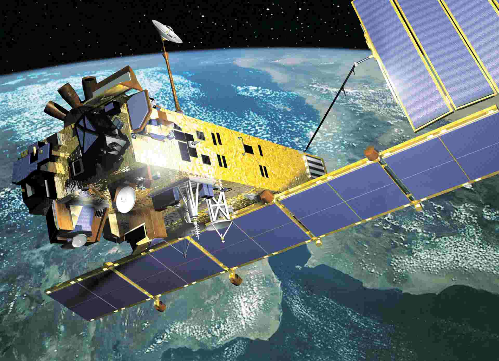

```{r setup, include=FALSE}
knitr::opts_chunk$set(
  collapse = TRUE,
  comment = "#>",
  fig.path = "man/figures/README-",
  out.width = "100%"
)
```

## Monitoring Air Quality: The Power of Satellite Based Remote Sensing

#### Table of Contents

-   [Introduction and Background]

-   [What is Remote Sensing?]

    -   [Optical Remote Sensing]

    -   [Radar Remote Sensing]

    -   [LIDAR (Light Detection and Ranging)](#lidar-light-detection-and-ranging)

-   [History of Remote Sensing: A Journey through Time]

-   [How Do Satellites Measure Air Quality?]

    -   [Data Collection]

    -   [Instruments Used]

    -   [Spectral Analysis]

    -   [Data Processing]

    -   [Data Interpretation and Visualization]

-   [Understanding Spatial Resolution in Remote Sensing]

-   [Satellite in Focus - Sentinel 5P]

-   [Satellite in Focus - Methane SAT]

-   [Satellite in Focus - TEMPO Satellite](#satellite-in-focus---tempo-satellite)

-   [Model in Focus: GEOS-Chem](#sec-model-in-focus-geos-chem)

-   [Company in Focus: First Street's Air Quality Model]

-   [From Complexity to Clarity: How Satellite Data Can Inform Air Quality Regulation]

-   [India’s Progress in Satellite Remote Sensing for Air Quality Monitoring](#indias-progress-in-satellite-remote-sensing-for-air-quality-monitoring)

-   [Explore biteSizedAQ Project 1: Deriving India's population weighted pollution data from 1998-2022]

-   [Conclusion: The Comprehensive Apporach to AQ monitoring]

-   [References](#references)

-   [Rmd for this blog]

-   [Get in Touch]

-   [License and Reuse](#license-and-reuse)

## Introduction and Background

<br>


| *Image 1: [openart.ai](https://openart.ai/home)*

<br>

Air pollution is a global crisis affecting nearly everyone, with people around the world exposed to polluted air daily. According to the World Health Organization, air pollution is responsible for an estimated 7 million deaths annually, making it one of the most significant environmental health risks. This statistic underscores the urgent need for effective air quality (AQ) monitoring at a global scale, especially in areas where people are at highest risk.

Air quality is typically measured using various methods, with ground-based monitoring stations being the most widely utilized. However, establishing and maintaining these stations presents several challenges, especially in regions with low monitoring coverage, which includes most of the Global South.

Financial constraints and the general lack of global philanthropic AQ funding often make it difficult for low-income countries (especially the Global South) to afford the high costs of equipment and maintenance. Technical expertise is another barrier, as many regions lack the trained personnel required to operate and maintain sophisticated monitoring systems. Additionally, inadequate infrastructure, such as unreliable electricity and poor road access, complicates the setup in rural or remote areas, as seen in parts of India. Political and regulatory challenges also play a role; in some regions, there may be a lack of political will or regulatory frameworks to support comprehensive monitoring efforts.

OpenAQ’s Open Air Quality Data Global Landscape 2022 report reveals that 39% of countries worldwide lack evidence of ground-based AQ monitoring, and among the 61% that do monitor, only 53% publicly share their data. Government led ground-based AQ monitoring is crucial to put a country on a clean air trajectory and furthermore open data sharing is essential for driving informed action.

But, not all is lost. The advent of low-cost sensors have empowered local AQ actors by making it more feasible to monitor air quality in underserved areas and respond to local pollution sources, raise awareness and put pressure on governments to act now in the interest of public health. Other techniques like, mobile vehicle-based monitoring, further enhances our understanding of air quality by collecting data from sensors mounted on moving vehicles, allowing for dynamic, real-time observations.

Furthermore, to complement the efforts of ground-based monitoring, advanced technologies such as satellite based remote sensing (the focus of this blog post) are becoming increasingly important in expanding global AQ coverage. Remote sensing involves collecting data from a distance without direct physical contact with the subject. This includes techniques such as satellite-based monitoring, which provides a broad and continuous view of atmospheric conditions. Satellite-based remote sensing is particularly valuable for offering extensive, large-scale coverage of air quality across the globe.

Each method contributes uniquely to the comprehensive assessment of air quality and has its strengths and limitations, with satellite-based remote sensing offering a global perspective and coverage that complements other monitoring approaches.

Due to the complexities of satellite-based remote sensing, it can be challenging for non-technical audiences to fully grasp its importance. This blog post aims to demystify this technology, addressing any doubts and questions to provide a clear understanding of its significance. With this enhanced insight, readers—including stakeholders, students, and professionals—will hopefully be better equipped to advocate for the use of satellite-based remote sensing. Future posts may explore other air quality monitoring methods.

<br>

> ### ***"We cannot solve what we can't measure"***

<br>

## What is Remote Sensing?

Remote sensing is like having a pair of super-powered eyes in the sky that can observe the Earth without ever touching it. Imagine you're standing on a hill with binoculars, looking down at a city. You can see the buildings, roads, and parks from a distance, but instead of just seeing what's visible to the naked eye, remote sensing can detect a wide range of electromagnetic radiation—like invisible rays of light—that is either reflected or emitted by the Earth's surface and atmosphere. This radiation includes not just visible light, but also infrared and ultraviolet light, which carry different kinds of information. By measuring this radiation, remote sensing systems, whether on aircraft or satellites, can reveal a wealth of details about the Earth's surface and atmosphere, such as land use, vegetation health, and importantly, air quality. Just as you can tell if a tree is healthy by its color and leaves, remote sensing can determine the concentration of pollutants in the air, helping scientists monitor environmental conditions from afar.

Remote sensing encompasses a range of techniques, including:

### Optical Remote Sensing

<br>


> *Image 2: Fire scars reflect strongly in Landsat’s Band 7, which acquires data in the shortwave infrared range. The fire scar is not visible in the left image, which is a standard true-color image. The fire scar stands out clearly in red in the right image, which is a false-color infrared image. Credit: NASA.*

<br>

**How It Works:** Optical remote sensing is like taking a highly specialized photograph of the Earth from space, but instead of just capturing visible light, it can see a range of wavelengths, including infrared and ultraviolet. Here’s a simplified breakdown:

-   **Illumination:** The sun acts as a giant flashlight, sending light to the Earth across various wavelengths. This includes visible light (which we see), as well as infrared and ultraviolet light (which are invisible to the naked eye).

-   **Reflection:** Different surfaces and objects on Earth reflect this light in different ways. For example, healthy vegetation reflects more near-infrared light, while water bodies reflect more visible light.

-   **Detection:** Satellites equipped with optical sensors capture this reflected light. These sensors record how much light is reflected at different wavelengths, creating detailed images that reveal various surface features.

**Capabilities and Advantages:**

-   **Pollutant Detection:** Optical remote sensing can detect pollutants in the atmosphere by analyzing how light is scattered and absorbed by these particles. For instance, it can identify areas with high levels of smog or particulate matter, providing a clear picture of air quality.

-   **Detailed Imaging:** This method creates vivid images of the Earth's surface, showing everything from vegetation and water bodies to changes caused by events like fires or industrial activity.

**Use Cases:**

-   **Air Quality Monitoring:** Optical sensors can track pollutants such as ozone and particulate matter. For example, NASA’s MODIS (Moderate Resolution Imaging Spectroradiometer) provides data that helps monitor air quality by detecting various pollutants.

-   **Environmental Monitoring:** It’s used for vegetation analysis, land use mapping, and observing changes in land cover.

-   **Disaster Assessment:** Detects changes due to natural disasters like fires and floods, highlighting affected areas.

**In the Image Above:**

-   **True-Color Image:** This standard image mimics what we see with our eyes. In the true-color image on the left, fire scars from a recent blaze are not visible because this image does not capture changes in the infrared spectrum.

-   **False-Color Infrared Image:** This image uses sensors that detect infrared light, which is invisible to us. In the false-color infrared image on the right, fire scars appear in bright red. This happens because infrared sensors can pick up changes in land caused by the fire, making the scars stand out clearly against the unaffected areas.

Here is another false color image of the coastline of Matang National Park in Perak, Malaysia. In dark orange are mangrove areas, with the yellow patches indicating clear cutting by villages where the land is dryer.


| *Image 3: Optical Remote Sensing image of the coastline of Matang National Park in Perak, Malaysia in false-color. Credit: Landsat image courtesy of the U.S. Geological Survey.*

<br>

Optical remote sensing offers a powerful way to monitor and analyze the Earth’s surface and atmosphere, including air quality. By capturing detailed images across different wavelengths, it provides valuable insights into both natural and human-made changes to our environment.

### Radar Remote Sensing

**How It Works:** Radar remote sensing is like using a radar gun to measure the speed of a car, but instead of cars, it measures Earth’s surface and atmosphere. Here’s a step-by-step look at how it works:

-   **Emitting Waves:** A radar system on a satellite or aircraft emits radio waves towards the Earth's surface.

-   **Reflection:** These waves bounce off objects, such as buildings, trees, or pollution plumes, and return to the radar sensor.

-   **Analyzing Data:** By measuring the time it takes for the waves to return and analyzing changes in their frequency, the radar system can create detailed 3D images and gather information about the surface and atmosphere.

**Capabilities and Advantages:**

-   **Penetrating Clouds:** Unlike optical sensors that need clear skies, radar can see through clouds, fog, and rain. This ability is crucial for continuous monitoring, regardless of weather conditions.

-   **Pollution Tracking:** Radar can detect and monitor pollution plumes even when they are obscured by weather. For example, it can track smoke from wildfires or emissions from industrial facilities, providing insights into their movement and impact.

**Use Cases:**

-   **Air Quality Monitoring:** Radar remote sensing is used to monitor pollutants like smoke and dust. It helps track pollution plumes, even in adverse weather, providing valuable data on their dispersion and concentration.

-   **Weather Monitoring:** It is essential for tracking weather patterns such as storms and rainfall, offering data that penetrates through clouds.

-   **Disaster Management:** Useful in assessing and managing natural disasters like floods and wildfires by providing critical data on their spread and impact.

-   **Environmental Analysis:** Radar aids in studying environmental changes in forests, urban areas, and other landscapes, offering continuous data despite weather conditions.

Interpreting imagery from radar sensors is less intuitive than for optical imagery because these sensors do not perceive color, but rather respond to surface geometry, texture, three-dimensional structure, and water content.

Here is the same area (Matang National Park coastline) as shown in the Optical Remote Sensing section, but here it is scoped via Radar remote sensing. In darker grey are mangrove areas, with the white patches indicating clear-cutting by villages where the land is dryer and lacks vertical complexity.


| *Image 4: Radar remote sensing image of the coastline of Matang National Park in Perak, Malaysia. Credit: JAXA*

<br>

*Radar*s are active sensors that produce their own microwave radiation and are capable of operating through clouds and at night. All imaging radar sensors used for remote sensing are Synthetic Aperture Radar (SAR), a form of radar that uses the motion of the radar antenna over a target region to provide finer spatial resolution (see: Understanding Spatial Resolution section below) than conventional stationary beam-scanning radars.

Radar remote sensing’s unique ability to see through weather obstacles and track pollution plumes makes it a vital tool for air quality monitoring and environmental management. It complements other remote sensing techniques, providing a comprehensive view of environmental and atmospheric conditions.

Here's a map showing the electromagnetic spectrum and it's use in satellite remote sensing (SRS)


| *Image 5: The electromagnetic spectrum (not to scale), and its use in satellite remote sensing (SRS). Credit: Pettorelli et al. 2018*

### LIDAR (Light Detection and Ranging) {#lidar-light-detection-and-ranging}

**How It Works:** LIDAR uses laser pulses to measure distances and create detailed 3D maps. Here's the process:

-   **Sending Pulses:** A LIDAR system emits rapid laser pulses towards the Earth's surface.

-   **Bouncing Back:** These pulses travel through the atmosphere and reflect off objects (such as vegetation or buildings) before returning to the sensor.

-   **Measuring Time:** The system calculates the time it takes for each pulse to return, determining the distance to the object.

-   **Creating Maps:** This information is used to create precise 3D maps of the surface and vertical profiles of the atmosphere.

**Point Clouds in LIDAR:**

-   **What They Are:** The data collected by LIDAR creates what is known as a "point cloud," which is a collection of data points in a 3D space. Each point represents a specific location where a laser pulse was reflected.

-   **Applications:** In traditional mapping, point clouds are used to model surfaces like buildings or terrain. For instance, the image below shows LIDAR point cloud image of forest canopy, Oregon, USA

    

| *Image 6: Lidar point cloud image of forest canopy, Oregon, USA. Credit: Forest and Rangeland Ecosystem Science Center*

<br>

***Con*****nection to Air Quality:**

-   **Vertical Profiles:** Just like point clouds can represent forests in 3D, they can also represent the distribution of pollutants in the atmosphere. Each point in an air quality point cloud represents a measurement of pollutants at a specific altitude.

-   **Pollutant Mapping:** By creating point clouds of air pollutants, LIDAR can show how these pollutants are layered and dispersed vertically through the atmosphere. This helps in understanding the distribution and movement of pollutants, similar to how point clouds show the structure of buildings.

**Use Cases:**

-   **Pollutant Tracking:** Monitors the vertical distribution and concentration of aerosols and greenhouse gases.

-   **Vertical Profiles:** Provides detailed vertical profiles of the atmosphere, showing layers of pollutants.

-   **Source Monitoring:** Helps track how pollutants disperse from specific sources, aiding in air quality monitoring.

LIDAR's ability to generate detailed point clouds for both surface features and atmospheric pollutants makes it a powerful tool for comprehensive air quality monitoring.

## History of Remote Sensing: A Journey through Time

Remote sensing technology has undergone a fascinating evolution, transforming from simple observations to sophisticated tools that offer deep insights into our planet. Let’s take a journey through its history:

**1960s: The Dawn of Satellite Eyes** Imagine the excitement of discovering a new way to "see" the Earth from afar. In the 1960s, the launch of NASA's TIROS (Television Infrared Observation Satellite) series marked a groundbreaking moment in satellite technology. These early pioneers were like space explorers with binoculars, capturing the first glimpses of our planet's weather patterns. TIROS allowed us to track storms and understand weather systems from space, much like the first snapshots from a new camera that reveal previously unseen details.


| *Image 7: First Weather Satellite: (TIROS). Credit: DARPA, NASA, NOAA*

<br>

**1970s: The Landsat Revolution** Fast forward to the 1970s, when the Landsat satellites came into play. Think of Landsat as the "photographer" of the Earth, taking high-resolution, continuous images of the planet’s surface. This decade was akin to upgrading from a basic camera to a high-definition one. Landsat provided a treasure trove of data on land use, vegetation, and urban sprawl, allowing scientists to monitor changes over time. Imagine being able to track the growth of a city or the deforestation of a rainforest with each click of a camera. Till date LANDSAT missions continue to provide invaluable remote sensing data.


| *Image 8: LANDSAT mission timeline. Credit: USGS*

**1980s: Sensors with Superpowers** The 1980s were like the era of superhero upgrades for remote sensing. Advances in sensor technology gave satellites the ability to measure not just images but detailed atmospheric compositions and pollution levels. Picture a superhero gaining x-ray vision—now satellites could "see" and measure pollutants and atmospheric gases with incredible precision. This decade saw the rise of satellites capable of analyzing air quality, tracking pollution plumes, and even detecting changes in atmospheric conditions.

**1990s: The Specialist Satellites** The 1990s marked a significant advancement in remote sensing with the introduction of specialized satellites. One notable example is the European Space Agency's ENVISAT, which greatly expanded our ability to monitor air quality and environmental conditions. ENVISAT was equipped with a suite of advanced sensors designed to address various environmental concerns. For instance, it could track ozone depletion, measure air pollution, and observe other atmospheric and surface changes. This era saw the transition from general observation to more focused and detailed environmental monitoring, thanks to these specialized tools.



| *Image 9: EnviSat. Credit: ESA*

<br>

**2000-2020: The Era of High-Definition Space Imaging and Advanced Data Integration** The early 2000s to 2020 marked the transition to ultra-high-definition space imaging and integrated data analysis. Satellites like NASA’s Sentinel series (see Sentinel-5P section later in this blog) and the European Space Agency’s Copernicus program provided unprecedented resolution and comprehensive data coverage. Imagine upgrading from a high-definition TV to an ultra-high-definition 8K screen with enhanced colors and clarity. These advancements allowed scientists to monitor air quality with unprecedented precision, analyze pollution trends, and assess environmental changes on a global scale. Tools like the Atmospheric Infrared Sounder (AIRS) on NASA’s Aqua satellite revolutionized our understanding of atmospheric gases and pollutants. Additionally, the integration of remote sensing data with ground-based observations and computer models led to more accurate environmental forecasts and better-informed policy decisions.

**2020s and Beyond: The Age of Real-Time Monitoring and growing AI Integration** As we entered the 2020s, remote sensing technology has entered an era characterized by real-time monitoring and ever growing integration of advanced artificial intelligence (which started in 2010's). Modern satellites, such as NASA’s Landsat 9 and the European Space Agency’s Sentinel-6, are equipped with advanced sensors and AI capabilities that provide near-instantaneous data and actionable insights. Imagine having a satellite that not only captures stunning high-resolution images but also processes and interprets data in real-time, much like a smart assistant that learns and adapts to your needs. AI algorithms now enhance the ability to detect pollution plumes, predict air quality trends, and even assess the impact of climate change with remarkable accuracy. This new era promises even greater advancements in monitoring environmental health and tackling global challenges, with real-time data and predictive analytics leading the way.

Each decade of remote sensing development has built upon the previous one, enhancing our ability to monitor and protect our environment. From the early days of simple weather observations to today’s sophisticated, real-time analytics, remote sensing continues to evolve, providing us with invaluable insights into the health of our planet.

## How Do Satellites Measure Air Quality?

Satellites have become powerful tools in monitoring air quality, employing a sophisticated array of instruments and techniques to capture and analyze atmospheric conditions. Here's a detailed look at how this process works, enhanced with examples and analogies to make it more engaging:

### Data Collection

Imagine a satellite as a high-tech camera that can see beyond the visible spectrum, capturing a wide range of light waves reflecting off the Earth's surface and atmosphere. These waves include visible light, infrared, and ultraviolet. The satellite's sensors act like sophisticated eyes, taking in all this information to gather data on various components of the atmosphere.

**Example:** When the satellite orbits Earth, it collects light data that includes everything from the green of forests to the invisible traces of pollutants in the air.

### Instruments Used

To make sense of all this light, satellites use instruments like spectrometers and radiometers. Think of a spectrometer as a tool that breaks down light into its component colors, much like how a prism splits white light into a rainbow. Radiometers, on the other hand, measure the intensity of this light, determining how much light is being absorbed or reflected.

**Example:** A spectrometer on a satellite can detect specific wavelengths of light that are absorbed by gases like ozone, while a radiometer measures how much light is bouncing back from the Earth's surface.

### Spectral Analysis

With the light data collected, scientists analyze which wavelengths are absorbed by different pollutants. This process is akin to using a special filter to see which colors of light are missing in a photograph due to the presence of certain substances. For instance, ozone absorbs ultraviolet light, so by looking at the specific wavelengths that are absorbed, scientists can estimate ozone concentrations.

**Example:** By examining the absorption patterns in ultraviolet light, satellites can determine the concentration of ozone in the atmosphere.

### Data Processing

The raw data collected from these sensors is processed using complex algorithms. These algorithms are like highly skilled chefs, mixing and analyzing the data to create a detailed recipe of the air quality. They convert the raw light measurements into useful information about pollutant levels and their distribution across the globe.

**Example:** The GEOS-Chem model is a powerful tool that processes satellite data to analyze atmospheric composition, helping scientists understand where pollutants are coming from and how they spread. See the Model in Focus section later in this blog post where we dive deep into How GEOS-Chem works.

### Data Interpretation and Visualization

<br>


> *Image 10: Wildfires billowing smoke across North America - July 17-24, 2024. Credit: NASA Earth Observatory*

<br>

Once the data is processed, it's interpreted to create detailed maps and models of air quality. This step is similar to putting together a puzzle, where each piece of information helps to complete the picture of air quality across different regions.

**Example:** The animation above highlights the concentration and movement of wildfire smoke from July 17–24, 2024. It shows [black carbon](https://www.ccacoalition.org/en/slcps/black-carbon) particles—commonly called soot—from Canadian fires sweeping broadly across North American skies during that period. Black carbon signatures from fires in Oregon and Washington are also prominent.

In essence, satellites provide a bird's-eye view of our atmosphere, capturing a wealth of data that, when analyzed and interpreted, offers valuable insights into the state of our air quality. This remote perspective is crucial for tracking changes, identifying pollution sources, and ultimately working towards cleaner air.

## Understanding Spatial Resolution in Remote Sensing

<br>


> *Image 11: What Spatial Resolution Do I Need? Credit: NASA*

<br>

Spatial resolution in remote sensing determines how detailed the satellite images can be. It’s like the sharpness of a photograph—the higher the resolution, the more detail you can see. This is measured in kilometers (km x km) or degrees (degrees x degrees).

### Degrees to Kilometers

To understand how spatial resolution translates to real-world distances, consider this:

-   **Latitude:** One degree of latitude is about 111 kilometers everywhere on Earth. Latitude lines are parallel, so this measurement remains constant from the North Pole to the South Pole.

-   **Longitude:** The distance of one degree of longitude varies depending on your latitude. At the equator, it is about 111 kilometers, but this distance decreases as you move towards the poles because longitude lines converge. Picture a globe: the lines of longitude are widest at the equator and come closer together towards the poles.

### Examples of Spatial Resolution

-   **1 km x 1 km:** This resolution provides a square area of 1 kilometer on each side. This level offers a finer-grained view compared to larger resolutions, allowing for detailed observations. For instance, it can help track pollution from specific industrial zones or busy traffic areas with a greater degree of precision.

-   **0.1 x 0.1 Degrees:** This resolution covers an area approximately 11.1 km x 11.1 km at the equator. Although it might sound detailed, in practice, it covers a broader area compared to 1 km x 1 km resolution. It’s suitable for monitoring broader environmental trends but provides less detail than the finer 1 km x 1 km resolution.

Higher resolution (smaller area per pixel) allows for more detailed analysis, helping to identify localized pollution sources more accurately. Lower resolution (larger area per pixel) offers a broader overview, useful for understanding wider environmental patterns.

In summary, spatial resolution helps balance between detailed local observations and broad, comprehensive coverage. The choice of resolution depends on the specific needs of the study and the scale of the analysis.

## Why Different Resolutions? {#sec-why-different-resolutions}

Think of spatial resolution as the lens through which we view our world from space. Just like choosing between a high-definition camera for capturing close-up details and a standard camera for wide-angle shots, different satellite resolutions serve distinct purposes and provide varying levels of detail.

### **The Need for Different Resolutions**

-   **High Resolution:** Imagine using a magnifying glass to look at a map. You can see every street and landmark in crisp detail. This is what high-resolution satellites do—they zoom in on specific areas with remarkable precision. For instance, they can detect small sources of pollution, such as emissions from a single factory or traffic congestion in a city. This level of detail is vital for addressing localized environmental issues and conducting detailed urban planning.

-   **Low Resolution:** Now picture looking at a large mural from a distance. You see the entire scene but can't make out the finer details up close. Low-resolution satellites offer a broader view of the Earth’s surface, covering larger areas in a single image. This broader perspective is valuable for observing large-scale environmental trends, like tracking deforestation over a country or monitoring large-scale air quality patterns across regions. While they might not capture the minutiae of smaller sources of pollution, they are excellent for a big-picture overview.

### **How Technology Impacts Resolution**

The resolution of a satellite image depends on the technology in its sensors and imaging systems:

-   **High-Resolution Satellites:** These use advanced optical systems and fine-tuned sensors, similar to a high-definition camera. They can resolve smaller features and provide detailed imagery. For example, NASA’s Landsat satellites, with their high-resolution sensors, can capture detailed images of urban areas and monitor specific pollution sources effectively.

-   **Lower Resolution Satellites:** These may use more general-purpose instruments, akin to a standard camera. While they may not capture fine details, they are designed to cover large areas efficiently. For instance, the European Space Agency’s Copernicus satellites provide broad-scale environmental monitoring, making them ideal for assessing global air quality and climate patterns.

In essence, the choice of resolution is about matching the right tool to the task at hand. High resolution is indispensable for detailed, localized studies, while lower resolution is perfect for broader assessments. Together, they offer a comprehensive view of our planet, enabling us to address both specific environmental challenges and global trends.

Next we'll go through a couple of real life case studies of deployed satellites, data simulation/processing models, awesome companies who are at the forefront of utilizing these technologies.

<br>

------------------------------------------------------------------------

> ## Satellite in Focus - Sentinel 5P
>
> ------------------------------------------------------------------------
>
> 
>
> | *Image 12: Sentinel 5P Satellite. Credit: ESA*
>
> <br>
>
> Sentinel-5P is a critical satellite dedicated to monitoring the Earth's atmosphere, specifically designed for tracking air quality and pollution. Here’s a detailed look at its features and capabilities:
>
> **Resolution: 7 km x 7 km**
>
> Sentinel-5P provides data at a resolution of 7 kilometers by 7 kilometers. This resolution is effective for observing atmospheric pollutants over large areas while still delivering sufficient detail for accurate air quality assessments.
>
> **Technology: TROPOspheric Monitoring Instrument (TROPOMI)**
>
> One of the core of Sentinel-5P’s capabilities is the TROPOspheric Monitoring Instrument (TROPOMI). TROPOMI is an advanced spectrometer that measures sunlight reflected off the Earth's surface and through the atmosphere to detect various atmospheric components. It is designed to capture a broad spectrum of pollutants:
>
> -   **Nitrogen Dioxide (NO2):** Tracks emissions from vehicle exhausts and industrial activities.
>
> -   **Ozone (O3):** Measures both stratospheric and tropospheric ozone, crucial for understanding air quality and ozone layer health.
>
> -   **Sulfur Dioxide (SO2):** Detects volcanic emissions and industrial pollution.
>
> A lot of other important instruments go into making this work, here is a diagram that captures it well:\
> \
> 
>
> | *Image 13: Fold-out illustration of the AstroBus-L elements. Image Credit: ESA*
>
> <br>
>
> **Altitude: Orbits at approximately 824 km above the Earth**
>
> Sentinel-5P orbits the Earth at an altitude of about 824 kilometers. This vantage point enables the satellite to consistently monitor atmospheric conditions across the globe.
>
> **Launch Date: October 13, 2017**
>
> Launched on October 13, 2017, Sentinel-5P has been operational for several years, contributing valuable data to global air quality monitoring efforts.
>
> **Expected Lifespan: Designed for a mission life of 7 years**
>
> The mission of Sentinel-5P is planned to last for at least 7 years, ensuring a continuous supply of data for studying and managing air pollution.
>
> **Cost: Estimated at around €200 million**
>
> The estimated cost of Sentinel-5P is approximately €200 million, reflecting the advanced technology and the extensive data collection capabilities of the satellite.
>
> **Applications:**
>
> Sentinel-5P’s data is crucial for assessing air quality, monitoring pollution trends, and supporting environmental policy decisions. Its comprehensive measurements of atmospheric pollutants provide insights that help address air quality challenges and improve public health.
>
> For more details, you can visit the Sentinel-5P mission page: <https://sentiwiki.copernicus.eu/web/s5p-mission>

<br>

Next up is a recently launched satellite that aims to revolutionize how we track Methane Emissions.

<br>

> ## Satellite in Focus - Methane SAT
>
> ------------------------------------------------------------------------
>
> 
>
> | *Image 14: MethaneSAT factsheet page 1. Image Credit: MethaneSAT*
>
> <br>
>
> Launched by the Environmental Defense Fund (EDF), MethaneSAT is a pioneering satellite dedicated to measuring methane emissions with unprecedented accuracy. As a key tool in the global effort to combat climate change, MethaneSAT offers advanced capabilities that set it apart from other methane-monitoring satellites. Here’s a breakdown of what it can do:
>
> ### **High-Resolution Emissions Heatmap**
>
> MethaneSAT can create detailed heatmaps of methane emissions over large areas. Specifically, it can produce heatmaps for regions that are 200 km by 200 km (about the size of New Jersey). These maps show emissions in fine detail, down to an area of 1 square kilometer (km²). Within these areas, MethaneSAT captures data at a native pixel size of 100 meters by 400 meters. This means each "pixel" on the map represents a 100m x 400m area on the ground, allowing for pinpoint accuracy in identifying methane sources.
>
> ### **Quantifying Regional Emissions**
>
> MethaneSAT isn’t just about mapping emissions; it also quantifies them across vast regions. It’s equipped to measure emissions from individual oil and gas fields or basins that are responsible for more than 80% of the world’s oil and gas production. This capability is crucial for understanding the impact of industrial activities on global methane levels. Essentially, MethaneSAT acts as a global auditor, measuring how much methane is being released from some of the largest industrial sources on Earth.
>
> ### **Automated Emission Rate Calculations**
>
> One of MethaneSAT’s standout features is its ability to automate the complex calculations required to measure emission rates. Traditionally, analyzing this data could take months, but MethaneSAT speeds up the process, delivering actionable data in just a few days. This rapid turnaround is possible because of advanced algorithms that process the raw data quickly, providing timely insights for environmental management.
>
> ### **Broad Area Coverage**
>
> MethaneSAT orbits the Earth in just 100 minutes, and during each orbit, it covers a swath width of 200 kilometers. This broad coverage allows it to monitor large areas of the planet's surface frequently, providing a continuous stream of data. This means that MethaneSAT can keep a close watch on methane emissions across the globe, ensuring that no major emission event goes unnoticed.
>
> ### **Point Source Attribution**
>
> MethaneSAT can trace larger single emission events back to their point of origin. This capability is akin to finding the needle in the haystack—it can identify specific sources of methane leaks, such as a particular facility or pipeline. This feature is vital for enforcement and regulation, as it enables targeted action to reduce emissions from specific sources.
>
> ### **Precision in Measuring Methane Concentrations**
>
> MethaneSAT is equipped with highly sensitive instruments that can detect excess methane at a concentration of just 3 parts per billion (ppb). This level of precision is unmatched by any other satellite currently in orbit. Detecting such small concentrations allows for a more accurate assessment of how much methane is in the atmosphere and where it’s coming from.
>
> ### **Transparency and Public Access**
>
> One of the goals of MethaneSAT is to promote transparency in environmental monitoring. The data collected by the satellite is made publicly accessible, allowing governments, researchers, and even the general public to view and use the information. This open-access approach supports global efforts to reduce methane emissions and combat climate change.
>
> ### **Comparing MethaneSAT with Other Satellites**
>
> 
>
> | *Image 15: MethaneSAT factsheet page 2. Image Credit: MethaneSAT*
>
> <br>
>
> MethaneSAT stands out among other methane-detecting satellites due to its unique combination of resolution, coverage, and sensitivity. **TROPOMI**, for example, offers broader coverage but with a coarser resolution, limiting its ability to detect smaller or more diffuse sources of methane. On the other hand, **GHGSat** provides ultra-high-resolution data, capable of detecting emissions from individual facilities, but it covers much smaller areas compared to MethaneSAT. What makes MethaneSAT particularly valuable is its ability to balance high-resolution data (100 meters x 400 meters) with extensive area coverage, enabling it to detect both localized leaks and widespread emissions with high sensitivity. This combination makes MethaneSAT a crucial tool in the global effort to monitor and reduce methane emissions.

<br>

Next we look at NASA's TEMPO satellite, which provides near real time air quality data across North America, with unprecedented precision!

<br>

------------------------------------------------------------------------

> ## Satellite in Focus - TEMPO Satellite {#satellite-in-focus---tempo-satellite}
>
> NASA's TEMPO (Tropospheric Emissions: Monitoring of Pollution) satellite is a groundbreaking mission designed to monitor air quality across North America with unprecedented precision. Imagine having a camera that takes ultra-detailed pictures of pollution across the entire continent, not just once a day, but hourly. That’s the kind of revolutionary capability TEMPO brings to the table, capturing the intricate dance of pollutants as they move and interact throughout the day.
>
> 
>
> | *Image 16: TEMPO instrument and entire spacecraft successfully passed pre-launch testing (look at the scale, compare to the person sitting next to it!). Image Credit: NASA TEMPO Gallery.*
>
> <br>
>
> ### **Resolution & Coverage**
>
> TEMPO’s resolution is akin to having a grid overlaying North America, with each grid square representing an area as small as 2.1 x 4.5 km. This high resolution allows TEMPO to track air quality in individual cities, suburbs, and even down to neighborhoods. Picture looking at a weather map and being able to see the exact concentration of pollutants in your local area—TEMPO makes this possible.
>
> ### **Technology**
>
> TEMPO operates from a geostationary orbit, 35,786 km above Earth, meaning it hovers over the same spot, watching North America continuously. Its core technology is an advanced spectrometer that can detect light in the ultraviolet and visible range. This might sound technical, but think of it as a sophisticated prism breaking down sunlight reflected off Earth into its component colors. By analyzing these colors, TEMPO can identify specific gases like nitrogen dioxide (NO₂), sulfur dioxide (SO₂), and formaldehyde (HCHO), which are key indicators of air pollution.
>
> ### **Instruments & Capabilities**
>
> TEMPO's instrument measures air quality by capturing the sunlight scattered back from Earth's atmosphere. Just like how a prism splits light into a rainbow, TEMPO’s spectrometer divides the sunlight into different wavelengths. Each gas absorbs light at specific wavelengths, allowing TEMPO to measure the amount of each pollutant present in the atmosphere. For instance, it can detect nitrogen dioxide, a byproduct of fossil fuel combustion, with exceptional accuracy.
>
> ### **Applications & Impact**
>
> The data collected by TEMPO is invaluable for understanding air pollution patterns, forecasting air quality, and even helping policymakers develop strategies to mitigate pollution. Imagine local authorities knowing the exact pollution levels across different parts of a city in real-time and using this data to issue health advisories or enforce pollution control measures.
>
> ### **Public Accessibility & Collaboration**
>
> One of the most exciting aspects of TEMPO is that its data is publicly available, empowering researchers, government agencies, and even curious individuals to explore air quality trends. This open-access approach can drive community-driven initiatives to address air quality issues at the grassroots level.
>
> ### **Why It Matters**
>
> TEMPO’s ability to provide near-real-time data on a continental scale is a game-changer. It’s like upgrading from a blurry snapshot to an ultra-high-definition video of air quality across North America, offering insights into the daily ebb and flow of pollutants. This level of detail can help us better understand the impact of traffic, industrial emissions, and even natural events like wildfires on air quality, ultimately contributing to healthier lives and a cleaner environment.
>
> By integrating data from TEMPO with other models and satellites, we can gain a more comprehensive understanding of how air quality is affected by various factors, including weather patterns and human activities. This knowledge is crucial for developing effective strategies to combat air pollution and protect public health.

<br>

There are a lot of other important satellites that help in monitoring AQ across the globe. If interested you can read more about it [here](https://sites.wustl.edu/acag/satellites/).

Earlier in this blog, we talked about GEOS-Chem model in the data processing section. Now, I'll take a deep dive into this model in the next section:

<br>

------------------------------------------------------------------------

> ## Model in Focus: GEOS-Chem {#sec-model-in-focus-geos-chem}
>
> ------------------------------------------------------------------------
>
> 
>
> | *Image 17: GEOS-Chem logo. Credit: Geos-Chem*
>
> <br>
>
> **GEOS-Chem** is like a powerful digital laboratory for studying the atmosphere. It simulates the atmosphere’s complex chemistry to help scientists understand how different gases and particles interact and impact our environment. Let’s dive into what makes GEOS-Chem such a valuable tool:
>
> ### Overview
>
> Imagine GEOS-Chem as a high-tech, global-scale simulator that uses data and science to model the atmosphere’s chemical makeup. Developed through collaboration, it combines NASA’s advanced Earth observing system with detailed chemical and transport models to provide a deep understanding of our atmosphere.
>
> ### Key Features
>
> **1. Comprehensive Atmospheric Chemistry:** GEOS-Chem is like a recipe book for the atmosphere. It models a wide range of chemicals, including greenhouse gases like carbon dioxide and methane, as well as aerosols and pollutants. This “recipe” helps scientists see how these substances interact, break down, and affect air quality and climate.
>
> **Example:** If there’s a sudden spike in nitrogen dioxide levels over a city, GEOS-Chem can help track how this pollution disperses, reacts with other chemicals, and affects air quality over time.
>
> **2. High-Resolution Capabilities:** Think of GEOS-Chem’s resolution like the zoom on a camera. It can zoom in to show detailed images of specific regions or zoom out for a broader view of the globe. Researchers can adjust the model’s settings to focus on a small city or a whole continent, depending on their needs.
>
> **Example:** A researcher might use high resolution to study air quality in a major urban area affected by traffic emissions, while a climate scientist might use lower resolution to observe global patterns of greenhouse gases.
>
> **3. Integrated Observations:** GEOS-Chem integrates real-world observations, much like adding real-time data to a simulation. It uses data from satellites, weather stations, and other sources to refine its predictions and ensure they match up with what’s happening in the real world.
>
> **Example:** If satellite data shows an increase in atmospheric methane, GEOS-Chem adjusts its model to reflect this change, improving the accuracy of its predictions and analyses.
>
> **4. Applications and Impact:**
>
> -   **Air Quality Forecasting:** GEOS-Chem helps predict pollution levels, much like a weather forecast predicts rain. This is crucial for issuing health advisories and helping people prepare for poor air quality days.
>
> -   **Climate Research:** The model helps scientists understand how different chemicals influence climate change. For example, it can show how aerosol particles affect cloud formation and global temperatures.
>
> -   **Policy Support:** By providing evidence on the impact of emissions and pollution control measures, GEOS-Chem supports the development of effective environmental policies and regulations.
>
> **5. Accessibility:** GEOS-Chem is available to the global research community, much like a public library filled with valuable resources. Scientists can access the model for their studies, contribute to its development, and share their findings with others.
>
> For a closer look at how GEOS-Chem operates and to explore its capabilities, visit the [GEOS-Chem Overview](https://geoschem.github.io/overview.html).

<br>

In this final focus section, we look at First Street, an organization that uses all of the above ideas, technologies and models to perfom accurate high resolution (property level) forecasts for a wide range of climate variables, including air quality:

<br>

------------------------------------------------------------------------

> ## Company in Focus: First Street's Air Quality Model
>
> ------------------------------------------------------------------------
>
> 
>
> | *Image 18: First Street Logo. Credit: First Street*
>
> <br>
>
> **First Street’s Air Quality Model** is an advanced tool designed to predict the future of air quality across the United States. By combining extensive data, scientific principles, and powerful computing, this model helps scientists, policymakers, and communities understand how air quality might change in the coming years, especially in response to climate change. First Street has developed a cutting-edge model to calculate climate-adjusted air quality data at the property level, offering a new perspective on how air pollution affects individual properties.
>
> #### Key Features
>
> **1. Climate-Driven Predictions:** The model predicts how changes in climate—such as rising temperatures and altered weather patterns—will affect air quality in different regions. For instance, as a city experiences warmer temperatures, the model can forecast how this might lead to higher levels of ozone pollution, which can have significant public health implications. This provides a more wholesome picture of AQ in interaction with other climate variables.
>
> **2. High-Resolution Mapping:** The model can provide detailed, high-resolution maps that show air quality conditions at a neighborhood level. This granular approach allows for a precise understanding of where pollution hotspots are likely to occur within a city, enabling targeted interventions.
>
> **3. Historical Data Integration:** By incorporating historical pollution data, the model can identify long-term trends and make more accurate predictions about future air quality. For example, if a region has seen increasing industrial activity over the years, the model can project how continued growth might impact future pollution levels.
>
> **4. Accessibility for Communities and Policymakers:** Designed to be user-friendly, the model makes complex air quality data accessible to a wide audience. Local governments might use it to plan urban development projects that minimize pollution, while residents can learn about potential changes in air quality in their area and take steps to protect their health.
>
> **5. Real-World Applications:**
>
> -   **Health Impact Assessments:** The model can predict how changes in air quality might affect public health, helping healthcare providers and public health officials prepare for future challenges.
>
> -   **Urban Planning:** City planners can use the model’s insights to design urban areas that reduce pollution exposure, such as by increasing green spaces or improving traffic management.
>
> -   **Environmental Justice:** The model can highlight areas where vulnerable populations are at greater risk from poor air quality, supporting efforts to address health disparities.
>
> **6. Transparent:** The methodology behind First Street’s model is transparent, meaning that the processes used to generate predictions are available for review. This openness ensures that the model’s predictions are trustworthy and can be scrutinized or built upon by researchers and policymakers.
>
> For more detailed information on First Street’s Air Quality Model and its methodology, visit the [First Street Research Library](https://firststreet.org/research-library/air-quality-model-methodology).

## From Complexity to Clarity: How Satellite Data Can Inform Air Quality Regulation

When it comes to air quality regulations, reference-grade monitors have traditionally been the gold standard. These monitors are highly accurate and reliable instruments, often stationed at ground level, that measure specific pollutants in the atmosphere with a high degree of precision. Due to their accuracy, the data from these monitors is used by governments and regulatory bodies to set and enforce air quality standards.

However, in recent years, satellite data has begun to play an increasingly important role in air quality monitoring and regulation. While satellite measurements may not always match the precision of reference-grade monitors, they offer broad, global coverage that ground-based monitors cannot. This is especially valuable in areas where ground monitoring is sparse or non-existent.

Real-life examples illustrate the growing influence of satellite data in air quality regulations:

1.  **United States**: The Environmental Protection Agency (EPA) uses satellite data alongside reference-grade monitors to enhance its understanding of air pollution trends. For example, satellite observations of NO2, a harmful pollutant, help the EPA assess regional air quality and guide regulatory actions, particularly in areas without sufficient ground monitoring.

2.  **India**: In response to severe air pollution, India has increasingly integrated satellite data into its air quality management practices. The National Clean Air Programme (NCAP) utilizes satellite observations to monitor PM2.5 and other pollutants, especially in rural and remote areas where ground-based data is limited. This data informs policy decisions aimed at reducing air pollution across the country.

3.  **European Union**: The European Space Agency's Sentinel satellites provide critical data that supports the European Union's air quality directives. For example, Sentinel-5P’s data on ozone, nitrogen dioxide, and other pollutants is used by the European Environment Agency (EEA) to complement data from ground-based monitors, ensuring comprehensive air quality assessments across member states.

Despite these advancements, one significant obstacle to broader adoption of satellite data in air quality regulation is the technical complexity of the field. Government officials and stakeholders may be skeptical of satellite data due to a lack of understanding of its methodologies and applications. This skepticism is not entirely their fault, as satellite remote sensing involves complex technologies and data analysis techniques.

This content seeks to make satellite-based air quality monitoring concepts easier for everyone to grasp. By breaking down the technical aspects and jargon, I aim to build trust and encourage the use of satellite data in air quality monitoring and management.

## India’s Progress in Satellite Remote Sensing for Air Quality Monitoring {#indias-progress-in-satellite-remote-sensing-for-air-quality-monitoring}

India has made significant strides in understanding and improving air quality through advanced satellite technology. A notable development is the Ocean Colour Monitor (OCM-3) Aerosol Optical Depth (AOD) product, created by ISRO and onboard the EOS-6 satellite, launched in November 2022. This technology represents a leap forward in air quality monitoring.


| *Image 19: Results from OCM-3 AOD measurments. Credit: ISRO*

<br>

Here’s a closer look at this advancement:

-   **Advanced Monitoring Capabilities:** The OCM-3 sensor on the EOS-6 satellite boasts a spatial resolution of 1 km, which enables detailed tracking of atmospheric aerosols across India. This high-resolution data provides valuable insights into aerosol concentrations and their effects on air quality, particularly over densely populated areas.

-   **Sophisticated Data Analysis:** Using the SAC AErosol Retrieval (SAER) algorithm, the OCM-3 AOD product helps in analyzing particulate matter (PM2.5/PM10). This capability allows researchers to study how these particles are distributed and transported, offering a clearer picture of air quality dynamics.

-   **Global and National Impact:** The data from OCM-3 is not only valuable for understanding air quality within India but also for global monitoring. It helps track aerosol influences from various sources, such as fires in South Asia and Canada, contributing to a broader understanding of global air quality patterns.

-   **Accessibility and Validation:** Researchers and students can access the OCM-3 data through the MOSDAC platform, following registration. This repository supports detailed exploration of air quality trends and serves as a benchmarking tool for air quality models. The data has been rigorously validated against ground measurements from AERONET stations, showing strong correlations and confirming its accuracy.

-   **Recent Observations:** The OCM-3 AOD data has revealed notable trends, such as increased aerosol levels over the Indo-Gangetic Plain after October 13, 2023, and high AOD values in Delhi during and after Diwali. These findings underscore the impact of seasonal pollution and fire activities on air quality.

This advancement reflects India's growing commitment to utilizing satellite technology for air quality monitoring. While the country currently relies heavily on ground-based measurements and international remote sensing missions, the introduction of the OCM-3 onboard EOS-6 marks a significant step forward. It paves the way for a future where India can confidently integrate satellite data into its air quality monitoring and policy-making processes, contributing to cleaner and healthier environments.

## Explore biteSizedAQ Project 1: Deriving India's population weighted pollution data from 1998-2022

<br>


| *Image 20: A map of India's Satellite Derived Annual Average PM2.5 data (2022). Credit: biteSizedAQ project 1*

<br>

In **Project 1** of the biteSizedAQ series, the focus is on deriving India's population-weighted pollution data using satellite-derived population and pollution data. This project provides a hands-on opportunity to apply the concepts discussed in this blog post, especially for those familiar with R.

For those proficient in R, this project offers a detailed guide on how to process and analyze the data, allowing you to recreate and rederive the results. The project is an excellent way to test your skills and deepen your understanding of how satellite data can be used in air quality studies.

For those coming from other programming language backgrounds, feel free to reproduce the results by transitioning the R code to your language of choice.

If you end up transitioning this pipeline to a different language, feel free to open a pull request to contribute your code back to this project. If you plan to do this, please ensure the following conditions are met: (a) the code is well documented, (b) written in a language that is free and open source (as biteSizedAQ supports and encourages use of open source tools over proprietary ones) and reproducible.

You can explore the project, access the code, and follow along with the methodology to gain practical experience in air quality data processing. Visit the [biteSizedAQ Project 1 page](https://github.com/AarshBatra/biteSizedAQ/tree/main/1.ind.block.pm2.5.sat.data.processing#introduction) to get started.

## Conclusion: The Comprehensive Apporach to AQ monitoring

Measuring air quality goes far beyond simply assessing pollution levels. It encompasses understanding a complex interplay of factors including temperature, wind patterns, and broader climate conditions. Each of these elements interacts with air pollutants, affecting their dispersion, concentration, and impact on human health and the environment. To capture this intricate picture, we need more than just ground-based data; we require a diverse toolkit that integrates various methods, including remote sensing technologies.

Remote sensing plays a crucial role in this comprehensive approach. Satellites like Sentinel-5P and MethaneSAT offer high-resolution data on air pollutants and their sources, providing a global perspective that complements localized measurements. For instance, Sentinel-5P's detailed observations of gases such as nitrogen dioxide and ozone, and MethaneSAT's precision in tracking methane emissions, contribute significantly to our understanding of air quality from space. These satellites enable us to monitor and model air pollution over vast areas, offering insights that ground-based sensors alone cannot provide.

Companies like First Street are leveraging remote sensing data alongside other methodologies to deliver a well-rounded view of air quality. By integrating satellite data with property-level models and local environmental factors, they offer comprehensive analyses that reflect the real-world complexities of air pollution. This holistic approach helps in crafting more effective policies and interventions, making the case for the indispensable nature of remote sensing in modern air quality monitoring.

When comparing remote sensing with other air quality measurement techniques, each method comes with its own set of advantages and limitations. Ground-based reference-grade monitors, for example, offer high accuracy and direct measurements of air pollutants but are limited in spatial coverage. Remote sensing, on the other hand, provides extensive coverage and the ability to capture large-scale trends but may lack the precision of localized measurements. The choice between these methods often hinges on the specific needs of a project or policy, such as the scale of monitoring or the type of pollutants of interest.

***Ultimately, these technologies should not be viewed as competitors but as complementary tools that, when combined, offer a more complete picture of air quality.*** Remote sensing enhances our ability to observe and analyze pollution on a broad scale, while ground-based measurements provide detailed, localized data.

***By integrating these diverse sources of information, we can achieve a more accurate and actionable understanding of air quality, leading to better-informed decisions and more effective environmental policies.***

This blog aims to bridge the gap between technical satellite data and its practical applications in air quality regulation. By making this field more accessible to the public and decision-makers, I hope to foster greater understanding and appreciation of the role that advanced technologies play in safeguarding our air and our health.

## References {#references}

-   *Open Air Quality Data: The Global Landscape 2022 report, OpenAQ [[Link](https://documents.openaq.org/reports/Open+Air+Quality+Data+Global+Landscape+2022.pdf)]*

-   *What is Remote Sensing?, NASA Earth Data [[Link](https://www.earthdata.nasa.gov/learn/backgrounders/remote-sensing)]*

-   *Optical and Radar Remote Sensing, Reef Resilience Network [[Link](https://reefresilience.org/management-strategies/remote-sensing-and-mapping/introduction-to-remote-sensing/optical-and-radar-remote-sensing/)]*

-   *LIDAR point cloud image of forest canopy, Oregon, USA, USGS [[Link](https://www.usgs.gov/media/images/lidar-point-cloud-image-forest-canopy-oregon-usa)]*

-   *Demystifying LiDAR Point Cloud Data: Comprehensive Guide, Medium [[Link](https://medium.com/@matt-sharon/lidar-point-cloud-data-guide-62c126101c08)]*

-   *First Weather Satellite: (TIROS), DARPA [[Link](https://www.darpa.mil/about-us/timeline/tiros)]*

-   *LANDSAT Satellite Missions, USGS [[Link](https://www.usgs.gov/landsat-missions/landsat-satellite-missions)]*

-   *LANDSAT Satellites, NASA [[Link](https://landsat.gsfc.nasa.gov/satellites/)]*

-   *ENVISAT Satellite Missions Catalog, eoPortal [[Link](https://www.eoportal.org/satellite-missions/envisat#eop-quick-facts-section)]*

-   *Overview of Sentinel-5P Mission [[Link](https://sentiwiki.copernicus.eu/web/s5p-mission)]*

-   *MethaneSAT [[Link](https://www.methanesat.org/)]*

-   *MethaneSAT factsheet [[Link](http://admin.methanesat.org/wp-content/uploads/2024/02/MethaneSATcomparison.pdf?_gl=1*khyejx*_ga*MTYwMTU0NDAxOS4xNzIyNDU5NDM2*_ga_Q5CTTQBJD8*MTcyMzgyODUyMy41LjEuMTcyMzgyODU1Ny4yNi4wLjA.*_ga_SXQYQWNJ8D*MTcyMzgyODUyNC41LjEuMTcyMzgyODU1Ny4yNy4wLjA.)]*

-   *The satellite helping slow climate change — right now, Methan SAT, Millie Chu Baird, TED [[Link](https://www.ted.com/talks/millie_chu_baird_the_satellite_helping_slow_climate_change_right_now?geo=hi&subtitle=en)]*

-   *TEMPO Satellite Overview, NASA [[Link](https://tempo.si.edu/)]*

-   *TEMPO Instrument Air Quality Data Now Publicly Available, NASA [[Link](https://www.cfa.harvard.edu/news/tempo-instrument-air-quality-data-now-publicly-available)]*

-   *TEMPO Gallery, NASA [[Link](https://tempo.si.edu/gallery.html)]*

-   *GEOS Chem [[Link](https://geoschem.github.io/index.html)]*

-   *First Street Air Quality Methodology, First Street [[Link](https://firststreet.org/research-library/air-quality-model-methodology)]*

-   *Precise Air Quality Monitoring with OCM-3 Aerosol Optical Depth Product from EOS-6 Satellite, ISRO [[Link](https://www.isro.gov.in/PreciseAirQualityMonitoring.html#:~:text=The%20satellite%20EOS%2D6%2C%20launched,concentrations%20across%20the%20Indian%20landmass.)]*

-   *Meteorological & Oceanographic Satellite Data Archival Centre, ISRO [[Link](https://www.mosdac.gov.in/)]*

-   *biteSizedAQ Project 1: Deriving India's population weighted pollution data from 1998-2022, biteSizedAQ [[Link](https://github.com/AarshBatra/biteSizedAQ/tree/main/1.ind.block.pm2.5.sat.data.processing)]*

-   *Smoky Skies Across North America, NASA Earth Observatory [[Link](https://earthobservatory.nasa.gov/images/153106/smoky-skies-across-north-america)]*

-   *Copernicus Sentinel Data Open Access Hub, Copernicus, ESA [[Link](https://scihub.copernicus.eu/)]*

-   *Copernicus Sentinel-5P Mapping Portal, ESA [[Link](https://maps.s5p-pal.com/so2-7km-nrt/)]*

-   *The European Space Agency, Photo library for Professionals [[Link](https://photolibrary.esa.int/asset/?uuid=ab61270e-c982-5819-92ed-7d69e3150000)]*

## Rmd for this blog {data-link="Rmd for this blog"}

Underlying Rmd file can be found in the project's respective folder and here is a [quick link](https://github.com/AarshBatra/biteSizedAQ/blob/main/4.aq.remote.sensing/README.Rmd) to access it.

## Support This Work: Give It a Star {data-link="Support This Repository: Give It a Star"}

Thank you for reading! If you found this project helpful or interesting, please consider starring it on GitHub. Your stars help others discover and benefit from this fully open and free repository. Click [here to star the repository](https://github.com/AarshBatra/biteSizedAQ/stargazers).

## Get in touch {data-link="Get in touch"}

Get in touch about related topics/report any errors. Reach out to me at aarshbatra.in\@gmail.com.

## License and Reuse {#license-and-reuse}

All content is shared under the Creative Commons Attribution 4.0 International (CC BY 4.0) license. You are welcome to use this material in your reports or news stories. Just remember to give appropriate credit and include a link back to the original work. Thank you for respecting these terms!

For more details, see the LICENSE file.

If you use this in your work, please cite this repository as follows:

[Aarsh Batra, 2024, biteSizedAQ, <https://github.com/AarshBatra/biteSizedAQ>]
