## Monitoring Air Quality: The Power of Satellite Based Remote Sensing

#### Table of Contents

- [Introduction and Background](#introduction-and-background)

- [What is Remote Sensing?](#what-is-remote-sensing)

  - [Optical Remote Sensing](#optical-remote-sensing)

  - [Radar Remote Sensing](#radar-remote-sensing)

  - [LIDAR (Light Detection and
    Ranging)](#lidar-light-detection-and-ranging)

- [History of Remote Sensing: A Journey through
  Time](#history-of-remote-sensing-a-journey-through-time)

- [How Do Satellites Measure Air
  Quality?](#how-do-satellites-measure-air-quality)

  - [Data Collection](#data-collection)

  - [Instruments Used](#instruments-used)

  - [Spectral Analysis](#spectral-analysis)

  - [Data Processing](#data-processing)

  - [Data Interpretation and
    Visualization](#data-interpretation-and-visualization)

- [Understanding Spatial Resolution in Remote
  Sensing](#understanding-spatial-resolution-in-remote-sensing)

- [Satellite in Focus - Sentinel 5P](#satellite-in-focus---sentinel-5p)

- [Satellite in Focus - Methane SAT](#satellite-in-focus---methane-sat)

- [Satellite in Focus - TEMPO
  Satellite](#satellite-in-focus---tempo-satellite)

- [Model in Focus: GEOS-Chem](#sec-model-in-focus-geos-chem)

- [Company in Focus: First Street’s Air Quality
  Model](#company-in-focus-first-streets-air-quality-model)

- [From Complexity to Clarity: How Satellite Data Can Inform Air Quality
  Regulation](#from-complexity-to-clarity-how-satellite-data-can-inform-air-quality-regulation)

- [India’s Progress in Satellite Remote Sensing for Air Quality
  Monitoring](#indias-progress-in-satellite-remote-sensing-for-air-quality-monitoring)

- [Explore biteSizedAQ Project 1: Deriving India’s population weighted
  pollution data from
  1998-2022](#explore-bitesizedaq-project-1-deriving-indias-population-weighted-pollution-data-from-1998-2022)

- [Conclusion: The Comprehensive Apporach to AQ
  management](#conclusion-the-comprehensive-apporach-to-aq-management)

- [References](#references)

- [Rmd for this blog](#rmd-for-this-blog)

- [Get in Touch](#get-in-touch)

- [License and Reuse](#license-and-reuse)

## Introduction and Background

 

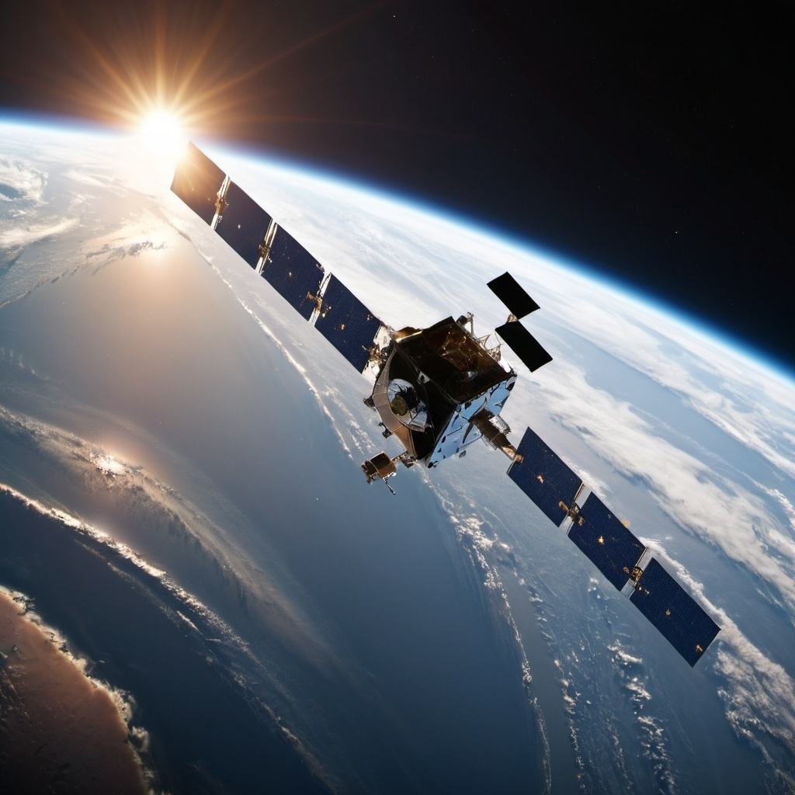

*Image 1: [openart.ai](https://openart.ai/home)*

 

Air pollution is a global crisis affecting nearly everyone, with people
around the world exposed to polluted air daily. According to the World
Health Organization, air pollution is responsible for an estimated 7
million deaths annually, making it one of the most significant
environmental health risks. This statistic underscores the urgent need
for effective air quality (AQ) monitoring at a global scale, especially
in areas where people are at highest risk.

Air quality is typically measured using various methods, with
ground-based monitoring stations being the most widely utilized.
However, establishing and maintaining these stations presents several
challenges, especially in regions with low monitoring coverage, which
includes most of the Global South.

Financial constraints and the general lack of global philanthropic AQ
funding often make it difficult for low-income countries (especially the
Global South) to afford the high costs of equipment and maintenance.
Technical expertise is another barrier, as many regions lack the trained
personnel required to operate and maintain sophisticated monitoring
systems. Additionally, inadequate infrastructure, such as unreliable
electricity and poor road access, complicates the setup in rural or
remote areas, as seen in parts of India. Political and regulatory
challenges also play a role; in some regions, there may be a lack of
political will or regulatory frameworks to support comprehensive
monitoring efforts.

OpenAQ’s Open Air Quality Data Global Landscape 2022 report reveals that
39% of countries worldwide lack evidence of ground-based AQ monitoring,
and among the 61% that do monitor, only 53% publicly share their data.
Government led ground-based AQ monitoring is crucial to put a country on
a clean air trajectory and furthermore open data sharing is essential
for driving informed action.

But, not all is lost. The advent of low-cost sensors have empowered
local AQ actors by making it more feasible to monitor air quality in
underserved areas and respond to local pollution sources, raise
awareness and put pressure on governments to act now in the interest of
public health. Other techniques like, mobile vehicle-based monitoring,
further enhances our understanding of air quality by collecting data
from sensors mounted on moving vehicles, allowing for dynamic, real-time
observations.

Furthermore, to complement the efforts of ground-based monitoring,
advanced technologies such as satellite based remote sensing (the focus
of this blog post) are becoming increasingly important in expanding
global AQ coverage. Remote sensing involves collecting data from a
distance without direct physical contact with the subject. This includes
techniques such as satellite-based monitoring, which provides a broad
and continuous view of atmospheric conditions. Satellite-based remote
sensing is particularly valuable for offering extensive, large-scale
coverage of air quality across the globe.

Each method contributes uniquely to the comprehensive assessment of air
quality and has its strengths and limitations, with satellite-based
remote sensing offering a global perspective and coverage that
complements other monitoring approaches.

Due to the complexities of satellite-based remote sensing, it can be
challenging for non-technical audiences to fully grasp its importance.
This blog post aims to demystify this technology, addressing any doubts
and questions to provide a clear understanding of its significance. With
this enhanced insight, readers—including stakeholders, students, and
professionals—will hopefully be better equipped to advocate for the use
of satellite-based remote sensing. Future posts may explore other air
quality monitoring methods.

 

> #### ***“We cannot solve what we can’t measure”***

 

## What is Remote Sensing?

Remote sensing is like having a pair of super-powered eyes in the sky
that can observe the Earth without ever touching it. Imagine you’re
standing on a hill with binoculars, looking down at a city. You can see
the buildings, roads, and parks from a distance, but instead of just
seeing what’s visible to the naked eye, remote sensing can detect a wide
range of electromagnetic radiation—like invisible rays of light—that is
either reflected or emitted by the Earth’s surface and atmosphere. This
radiation includes not just visible light, but also infrared and
ultraviolet light, which carry different kinds of information. By
measuring this radiation, remote sensing systems, whether on aircraft or
satellites, can reveal a wealth of details about the Earth’s surface and
atmosphere, such as land use, vegetation health, and importantly, air
quality. Just as you can tell if a tree is healthy by its color and
leaves, remote sensing can determine the concentration of pollutants in
the air, helping scientists monitor environmental conditions from afar.

Remote sensing encompasses a range of techniques, including:

### Optical Remote Sensing

 

> *Image 2: Fire scars reflect strongly in Landsat’s Band 7, which
> acquires data in the shortwave infrared range. The fire scar is not
> visible in the left image, which is a standard true-color image. The
> fire scar stands out clearly in red in the right image, which is a
> false-color infrared image. Credit: NASA.*

 

**How It Works:** Optical remote sensing is like taking a highly
specialized photograph of the Earth from space, but instead of just
capturing visible light, it can see a range of wavelengths, including
infrared and ultraviolet. Here’s a simplified breakdown:

- **Illumination:** The sun acts as a giant flashlight, sending light to
  the Earth across various wavelengths. This includes visible light
  (which we see), as well as infrared and ultraviolet light (which are
  invisible to the naked eye).

- **Reflection:** Different surfaces and objects on Earth reflect this
  light in different ways. For example, healthy vegetation reflects more
  near-infrared light, while water bodies reflect more visible light.

- **Detection:** Satellites equipped with optical sensors capture this
  reflected light. These sensors record how much light is reflected at
  different wavelengths, creating detailed images that reveal various
  surface features.

**Capabilities and Advantages:**

- **Pollutant Detection:** Optical remote sensing can detect pollutants
  in the atmosphere by analyzing how light is scattered and absorbed by
  these particles. For instance, it can identify areas with high levels
  of smog or particulate matter, providing a clear picture of air
  quality.

- **Detailed Imaging:** This method creates vivid images of the Earth’s
  surface, showing everything from vegetation and water bodies to
  changes caused by events like fires or industrial activity.

**Use Cases:**

- **Air Quality Monitoring:** Optical sensors can track pollutants such
  as ozone and particulate matter. For example, NASA’s MODIS (Moderate
  Resolution Imaging Spectroradiometer) provides data that helps monitor
  air quality by detecting various pollutants.

- **Environmental Monitoring:** It’s used for vegetation analysis, land
  use mapping, and observing changes in land cover.

- **Disaster Assessment:** Detects changes due to natural disasters like
  fires and floods, highlighting affected areas.

**In the Image Above:**

- **True-Color Image:** This standard image mimics what we see with our
  eyes. In the true-color image on the left, fire scars from a recent
  blaze are not visible because this image does not capture changes in
  the infrared spectrum.

- **False-Color Infrared Image:** This image uses sensors that detect
  infrared light, which is invisible to us. In the false-color infrared
  image on the right, fire scars appear in bright red. This happens
  because infrared sensors can pick up changes in land caused by the
  fire, making the scars stand out clearly against the unaffected areas.

Here is another false color image of the coastline of Matang National
Park in Perak, Malaysia. In dark orange are mangrove areas, with the
yellow patches indicating clear cutting by villages where the land is
dryer.

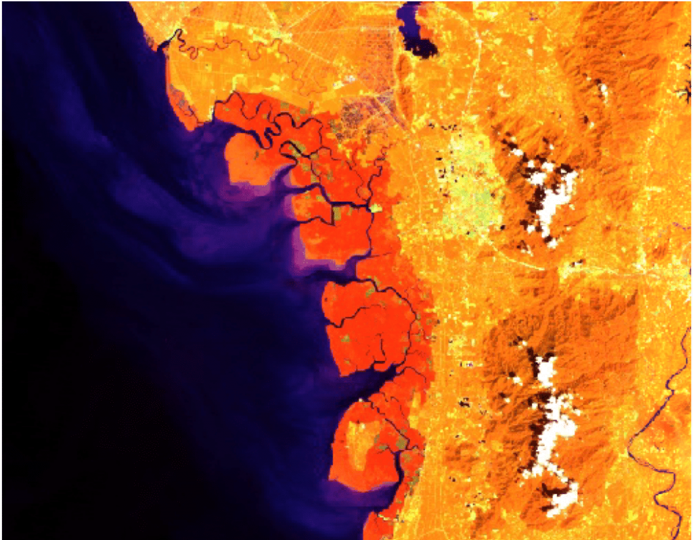

*Image 3: Optical Remote Sensing image of the coastline of Matang
National Park in Perak, Malaysia in false-color. Credit: Landsat image
courtesy of the U.S. Geological Survey.*

 

Optical remote sensing offers a powerful way to monitor and analyze the
Earth’s surface and atmosphere, including air quality. By capturing
detailed images across different wavelengths, it provides valuable
insights into both natural and human-made changes to our environment.

### Radar Remote Sensing

**How It Works:** Radar remote sensing is like using a radar gun to
measure the speed of a car, but instead of cars, it measures Earth’s
surface and atmosphere. Here’s a step-by-step look at how it works:

- **Emitting Waves:** A radar system on a satellite or aircraft emits
  radio waves towards the Earth’s surface.

- **Reflection:** These waves bounce off objects, such as buildings,
  trees, or pollution plumes, and return to the radar sensor.

- **Analyzing Data:** By measuring the time it takes for the waves to
  return and analyzing changes in their frequency, the radar system can
  create detailed 3D images and gather information about the surface and
  atmosphere.

**Capabilities and Advantages:**

- **Penetrating Clouds:** Unlike optical sensors that need clear skies,
  radar can see through clouds, fog, and rain. This ability is crucial
  for continuous monitoring, regardless of weather conditions.

- **Pollution Tracking:** Radar can detect and monitor pollution plumes
  even when they are obscured by weather. For example, it can track
  smoke from wildfires or emissions from industrial facilities,
  providing insights into their movement and impact.

**Use Cases:**

- **Air Quality Monitoring:** Radar remote sensing is used to monitor
  pollutants like smoke and dust. It helps track pollution plumes, even
  in adverse weather, providing valuable data on their dispersion and
  concentration.

- **Weather Monitoring:** It is essential for tracking weather patterns
  such as storms and rainfall, offering data that penetrates through
  clouds.

- **Disaster Management:** Useful in assessing and managing natural
  disasters like floods and wildfires by providing critical data on
  their spread and impact.

- **Environmental Analysis:** Radar aids in studying environmental
  changes in forests, urban areas, and other landscapes, offering
  continuous data despite weather conditions.

Interpreting imagery from radar sensors is less intuitive than for
optical imagery because these sensors do not perceive color, but rather
respond to surface geometry, texture, three-dimensional structure, and
water content.

Here is the same area (Matang National Park coastline) as shown in the
Optical Remote Sensing section, but here it is scoped via Radar remote
sensing. In darker grey are mangrove areas, with the white patches
indicating clear-cutting by villages where the land is dryer and lacks
vertical complexity.

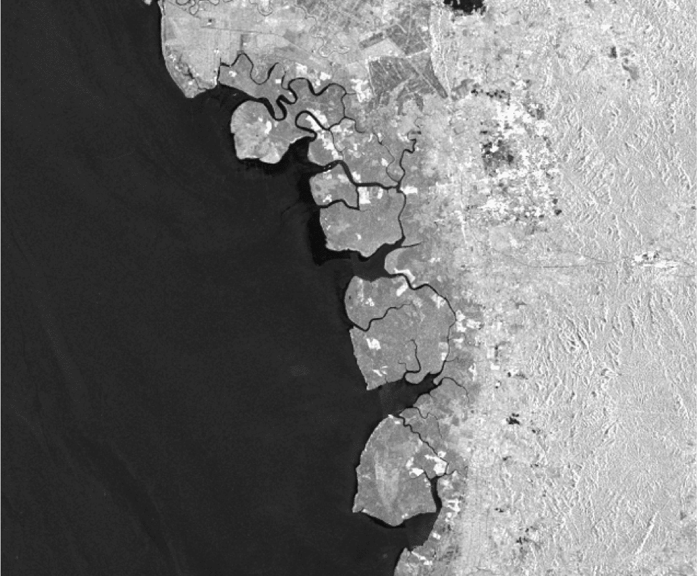

*Image 4: Radar remote sensing image of the coastline of Matang National
Park in Perak, Malaysia. Credit: JAXA*

 

*Radar*s are active sensors that produce their own microwave radiation
and are capable of operating through clouds and at night. All imaging
radar sensors used for remote sensing are Synthetic Aperture Radar
(SAR), a form of radar that uses the motion of the radar antenna over a
target region to provide finer spatial resolution (see: Understanding
Spatial Resolution section below) than conventional stationary
beam-scanning radars.

Radar remote sensing’s unique ability to see through weather obstacles
and track pollution plumes makes it a vital tool for air quality
monitoring and environmental management. It complements other remote
sensing techniques, providing a comprehensive view of environmental and
atmospheric conditions.

Here’s a map showing the electromagnetic spectrum and it’s use in
satellite remote sensing (SRS)

*Image 5: The electromagnetic spectrum (not to scale), and its use in
satellite remote sensing (SRS). Credit: Pettorelli et al. 2018*

### LIDAR (Light Detection and Ranging)

**How It Works:** LIDAR uses laser pulses to measure distances and
create detailed 3D maps. Here’s the process:

- **Sending Pulses:** A LIDAR system emits rapid laser pulses towards
  the Earth’s surface.

- **Bouncing Back:** These pulses travel through the atmosphere and
  reflect off objects (such as vegetation or buildings) before returning
  to the sensor.

- **Measuring Time:** The system calculates the time it takes for each
  pulse to return, determining the distance to the object.

- **Creating Maps:** This information is used to create precise 3D maps
  of the surface and vertical profiles of the atmosphere.

**Point Clouds in LIDAR:**

- **What They Are:** The data collected by LIDAR creates what is known
  as a “point cloud,” which is a collection of data points in a 3D
  space. Each point represents a specific location where a laser pulse
  was reflected.

- **Applications:** In traditional mapping, point clouds are used to
  model surfaces like buildings or terrain. For instance, the image
  below shows LIDAR point cloud image of forest canopy, Oregon, USA

  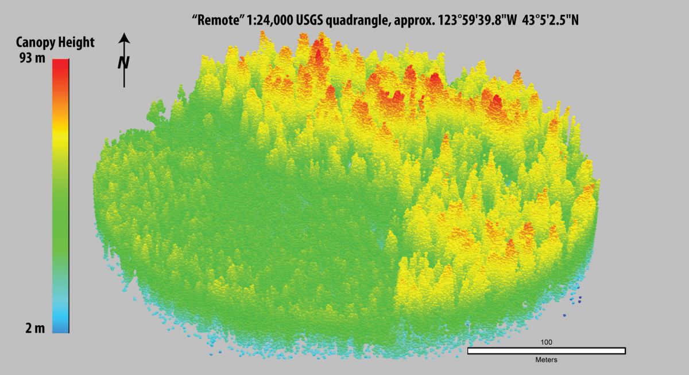

*Image 6: Lidar point cloud image of forest canopy, Oregon, USA. Credit:
Forest and Rangeland Ecosystem Science Center*

 

***Con*nection to Air Quality:**

- **Vertical Profiles:** Just like point clouds can represent forests in
  3D, they can also represent the distribution of pollutants in the
  atmosphere. Each point in an air quality point cloud represents a
  measurement of pollutants at a specific altitude.

- **Pollutant Mapping:** By creating point clouds of air pollutants,
  LIDAR can show how these pollutants are layered and dispersed
  vertically through the atmosphere. This helps in understanding the
  distribution and movement of pollutants, similar to how point clouds
  show the structure of buildings.

**Use Cases:**

- **Pollutant Tracking:** Monitors the vertical distribution and
  concentration of aerosols and greenhouse gases.

- **Vertical Profiles:** Provides detailed vertical profiles of the
  atmosphere, showing layers of pollutants.

- **Source Monitoring:** Helps track how pollutants disperse from
  specific sources, aiding in air quality management.

LIDAR’s ability to generate detailed point clouds for both surface
features and atmospheric pollutants makes it a powerful tool for
comprehensive air quality monitoring.

## History of Remote Sensing: A Journey through Time

Remote sensing technology has undergone a fascinating evolution,
transforming from simple observations to sophisticated tools that offer
deep insights into our planet. Let’s take a journey through its history:

**1960s: The Dawn of Satellite Eyes** Imagine the excitement of
discovering a new way to “see” the Earth from afar. In the 1960s, the
launch of NASA’s TIROS (Television Infrared Observation Satellite)
series marked a groundbreaking moment in satellite technology. These
early pioneers were like space explorers with binoculars, capturing the
first glimpses of our planet’s weather patterns. TIROS allowed us to
track storms and understand weather systems from space, much like the
first snapshots from a new camera that reveal previously unseen details.

*Image 7: First Weather Satellite: (TIROS). Credit: DARPA, NASA, NOAA*

 

**1970s: The Landsat Revolution** Fast forward to the 1970s, when the
Landsat satellites came into play. Think of Landsat as the
“photographer” of the Earth, taking high-resolution, continuous images
of the planet’s surface. This decade was akin to upgrading from a basic
camera to a high-definition one. Landsat provided a treasure trove of
data on land use, vegetation, and urban sprawl, allowing scientists to
monitor changes over time. Imagine being able to track the growth of a
city or the deforestation of a rainforest with each click of a camera.
Till date LANDSAT missions continue to provide invaluable remote sensing
data.

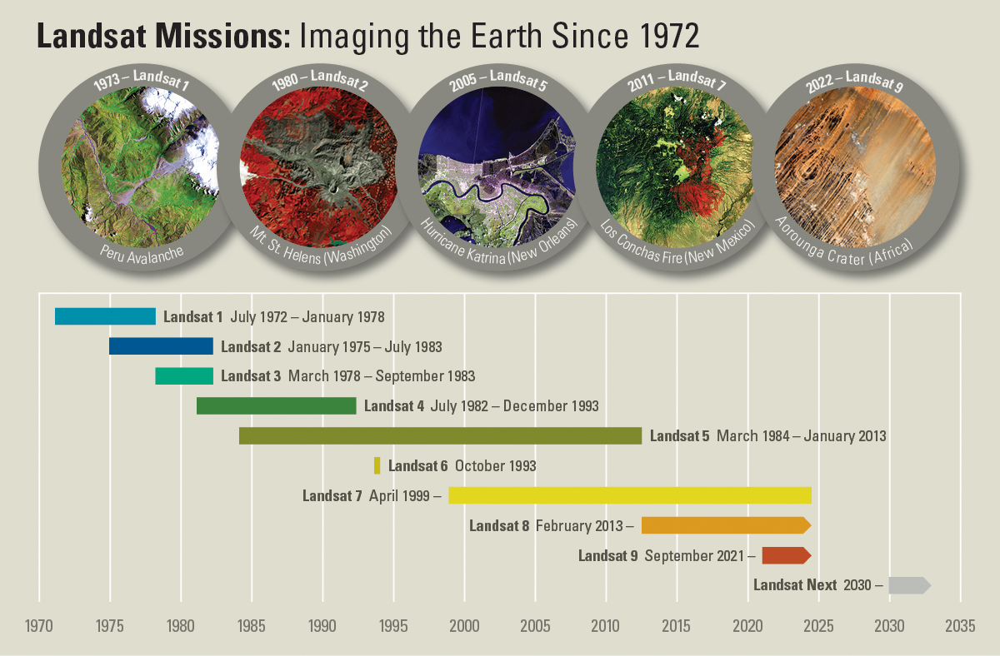

*Image 8: LANDSAT mission timeline. Credit: USGS*

**1980s: Sensors with Superpowers** The 1980s were like the era of
superhero upgrades for remote sensing. Advances in sensor technology
gave satellites the ability to measure not just images but detailed
atmospheric compositions and pollution levels. Picture a superhero
gaining x-ray vision—now satellites could “see” and measure pollutants
and atmospheric gases with incredible precision. This decade saw the
rise of satellites capable of analyzing air quality, tracking pollution
plumes, and even detecting changes in atmospheric conditions.

**1990s: The Specialist Satellites** The 1990s marked a significant
advancement in remote sensing with the introduction of specialized
satellites. One notable example is the European Space Agency’s ENVISAT,
which greatly expanded our ability to monitor air quality and
environmental conditions. ENVISAT was equipped with a suite of advanced
sensors designed to address various environmental concerns. For
instance, it could track ozone depletion, measure air pollution, and
observe other atmospheric and surface changes. This era saw the
transition from general observation to more focused and detailed
environmental monitoring, thanks to these specialized tools.

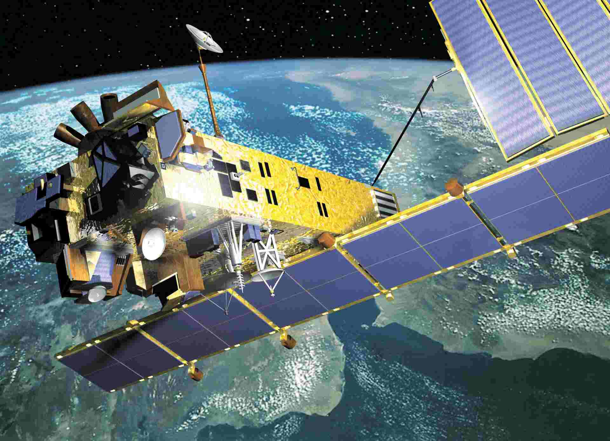

*Image 9: EnviSat. Credit: ESA*

 

**2000-2020: The Era of High-Definition Space Imaging and Advanced Data
Integration** The early 2000s to 2020 marked the transition to
ultra-high-definition space imaging and integrated data analysis.
Satellites like NASA’s Sentinel series (see Sentinel-5P section later in
this blog) and the European Space Agency’s Copernicus program provided
unprecedented resolution and comprehensive data coverage. Imagine
upgrading from a high-definition TV to an ultra-high-definition 8K
screen with enhanced colors and clarity. These advancements allowed
scientists to monitor air quality with unprecedented precision, analyze
pollution trends, and assess environmental changes on a global scale.
Tools like the Atmospheric Infrared Sounder (AIRS) on NASA’s Aqua
satellite revolutionized our understanding of atmospheric gases and
pollutants. Additionally, the integration of remote sensing data with
ground-based observations and computer models led to more accurate
environmental forecasts and better-informed policy decisions.

**2020s and Beyond: The Age of Real-Time Monitoring and growing AI
Integration** As we entered the 2020s, remote sensing technology has
entered an era characterized by real-time monitoring and ever growing
integration of advanced artificial intelligence (which started in
2010’s). Modern satellites, such as NASA’s Landsat 9 and the European
Space Agency’s Sentinel-6, are equipped with advanced sensors and AI
capabilities that provide near-instantaneous data and actionable
insights. Imagine having a satellite that not only captures stunning
high-resolution images but also processes and interprets data in
real-time, much like a smart assistant that learns and adapts to your
needs. AI algorithms now enhance the ability to detect pollution plumes,
predict air quality trends, and even assess the impact of climate change
with remarkable accuracy. This new era promises even greater
advancements in monitoring environmental health and tackling global
challenges, with real-time data and predictive analytics leading the
way.

Each decade of remote sensing development has built upon the previous
one, enhancing our ability to monitor and protect our environment. From
the early days of simple weather observations to today’s sophisticated,
real-time analytics, remote sensing continues to evolve, providing us
with invaluable insights into the health of our planet.

## How Do Satellites Measure Air Quality?

Satellites have become powerful tools in monitoring air quality,
employing a sophisticated array of instruments and techniques to capture
and analyze atmospheric conditions. Here’s a detailed look at how this
process works, enhanced with examples and analogies to make it more
engaging:

### Data Collection

Imagine a satellite as a high-tech camera that can see beyond the
visible spectrum, capturing a wide range of light waves reflecting off
the Earth’s surface and atmosphere. These waves include visible light,
infrared, and ultraviolet. The satellite’s sensors act like
sophisticated eyes, taking in all this information to gather data on
various components of the atmosphere.

**Example:** When the satellite orbits Earth, it collects light data
that includes everything from the green of forests to the invisible
traces of pollutants in the air.

### Instruments Used

To make sense of all this light, satellites use instruments like
spectrometers and radiometers. Think of a spectrometer as a tool that
breaks down light into its component colors, much like how a prism
splits white light into a rainbow. Radiometers, on the other hand,
measure the intensity of this light, determining how much light is being
absorbed or reflected.

**Example:** A spectrometer on a satellite can detect specific
wavelengths of light that are absorbed by gases like ozone, while a
radiometer measures how much light is bouncing back from the Earth’s
surface.

### Spectral Analysis

With the light data collected, scientists analyze which wavelengths are
absorbed by different pollutants. This process is akin to using a
special filter to see which colors of light are missing in a photograph
due to the presence of certain substances. For instance, ozone absorbs
ultraviolet light, so by looking at the specific wavelengths that are
absorbed, scientists can estimate ozone concentrations.

**Example:** By examining the absorption patterns in ultraviolet light,
satellites can determine the concentration of ozone in the atmosphere.

### Data Processing

The raw data collected from these sensors is processed using complex
algorithms. These algorithms are like highly skilled chefs, mixing and
analyzing the data to create a detailed recipe of the air quality. They
convert the raw light measurements into useful information about
pollutant levels and their distribution across the globe.

**Example:** The GEOS-Chem model is a powerful tool that processes
satellite data to analyze atmospheric composition, helping scientists
understand where pollutants are coming from and how they spread. See the
Model in Focus section later in this blog post where we dive deep into
How GEOS-Chem works.

### Data Interpretation and Visualization

 

> *Image 10: Wildfires billowing smoke across North America - July
> 17-24, 2024. Credit: NASA Earth Observatory*

 

Once the data is processed, it’s interpreted to create detailed maps and
models of air quality. This step is similar to putting together a
puzzle, where each piece of information helps to complete the picture of
air quality across different regions.

**Example:** The animation above highlights the concentration and
movement of wildfire smoke from July 17–24, 2024. It shows [black
carbon](https://www.ccacoalition.org/en/slcps/black-carbon) particles—commonly
called soot—from Canadian fires sweeping broadly across North American
skies during that period. Black carbon signatures from fires in Oregon
and Washington are also prominent.

In essence, satellites provide a bird’s-eye view of our atmosphere,
capturing a wealth of data that, when analyzed and interpreted, offers
valuable insights into the state of our air quality. This remote
perspective is crucial for tracking changes, identifying pollution
sources, and ultimately working towards cleaner air.

## Understanding Spatial Resolution in Remote Sensing

 

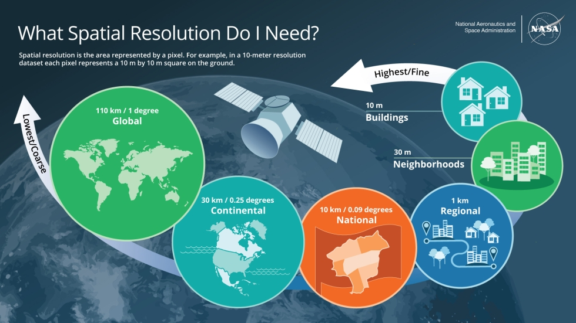

> *Image 11: What Spatial Resolution Do I Need? Credit: NASA*

 

Spatial resolution in remote sensing determines how detailed the
satellite images can be. It’s like the sharpness of a photograph—the
higher the resolution, the more detail you can see. This is measured in
kilometers (km x km) or degrees (degrees x degrees).

### Degrees to Kilometers

To understand how spatial resolution translates to real-world distances,
consider this:

- **Latitude:** One degree of latitude is about 111 kilometers
  everywhere on Earth. Latitude lines are parallel, so this measurement
  remains constant from the North Pole to the South Pole.

- **Longitude:** The distance of one degree of longitude varies
  depending on your latitude. At the equator, it is about 111
  kilometers, but this distance decreases as you move towards the poles
  because longitude lines converge. Picture a globe: the lines of
  longitude are widest at the equator and come closer together towards
  the poles.

### Examples of Spatial Resolution

- **1 km x 1 km:** This resolution provides a square area of 1 kilometer
  on each side. This level offers a finer-grained view compared to
  larger resolutions, allowing for detailed observations. For instance,
  it can help track pollution from specific industrial zones or busy
  traffic areas with a greater degree of precision.

- **0.1 x 0.1 Degrees:** This resolution covers an area approximately
  11.1 km x 11.1 km at the equator. Although it might sound detailed, in
  practice, it covers a broader area compared to 1 km x 1 km resolution.
  It’s suitable for monitoring broader environmental trends but provides
  less detail than the finer 1 km x 1 km resolution.

Higher resolution (smaller area per pixel) allows for more detailed
analysis, helping to identify localized pollution sources more
accurately. Lower resolution (larger area per pixel) offers a broader
overview, useful for understanding wider environmental patterns.

In summary, spatial resolution helps balance between detailed local
observations and broad, comprehensive coverage. The choice of resolution
depends on the specific needs of the study and the scale of the
analysis.

## Why Different Resolutions?

Think of spatial resolution as the lens through which we view our world
from space. Just like choosing between a high-definition camera for
capturing close-up details and a standard camera for wide-angle shots,
different satellite resolutions serve distinct purposes and provide
varying levels of detail.

### **The Need for Different Resolutions**

- **High Resolution:** Imagine using a magnifying glass to look at a
  map. You can see every street and landmark in crisp detail. This is
  what high-resolution satellites do—they zoom in on specific areas with
  remarkable precision. For instance, they can detect small sources of
  pollution, such as emissions from a single factory or traffic
  congestion in a city. This level of detail is vital for addressing
  localized environmental issues and conducting detailed urban planning.

- **Low Resolution:** Now picture looking at a large mural from a
  distance. You see the entire scene but can’t make out the finer
  details up close. Low-resolution satellites offer a broader view of
  the Earth’s surface, covering larger areas in a single image. This
  broader perspective is valuable for observing large-scale
  environmental trends, like tracking deforestation over a country or
  monitoring large-scale air quality patterns across regions. While they
  might not capture the minutiae of smaller sources of pollution, they
  are excellent for a big-picture overview.

### **How Technology Impacts Resolution**

The resolution of a satellite image depends on the technology in its
sensors and imaging systems:

- **High-Resolution Satellites:** These use advanced optical systems and
  fine-tuned sensors, similar to a high-definition camera. They can
  resolve smaller features and provide detailed imagery. For example,
  NASA’s Landsat satellites, with their high-resolution sensors, can
  capture detailed images of urban areas and monitor specific pollution
  sources effectively.

- **Lower Resolution Satellites:** These may use more general-purpose
  instruments, akin to a standard camera. While they may not capture
  fine details, they are designed to cover large areas efficiently. For
  instance, the European Space Agency’s Copernicus satellites provide
  broad-scale environmental monitoring, making them ideal for assessing
  global air quality and climate patterns.

In essence, the choice of resolution is about matching the right tool to
the task at hand. High resolution is indispensable for detailed,
localized studies, while lower resolution is perfect for broader
assessments. Together, they offer a comprehensive view of our planet,
enabling us to address both specific environmental challenges and global
trends.

Next we’ll go through a couple of real life case studies of deployed
satellites, data simulation/processing models, awesome companies who are
at the forefront of utilizing these technologies.

 

------------------------------------------------------------------------

> ## Satellite in Focus - Sentinel 5P
>
> ------------------------------------------------------------------------
>
> 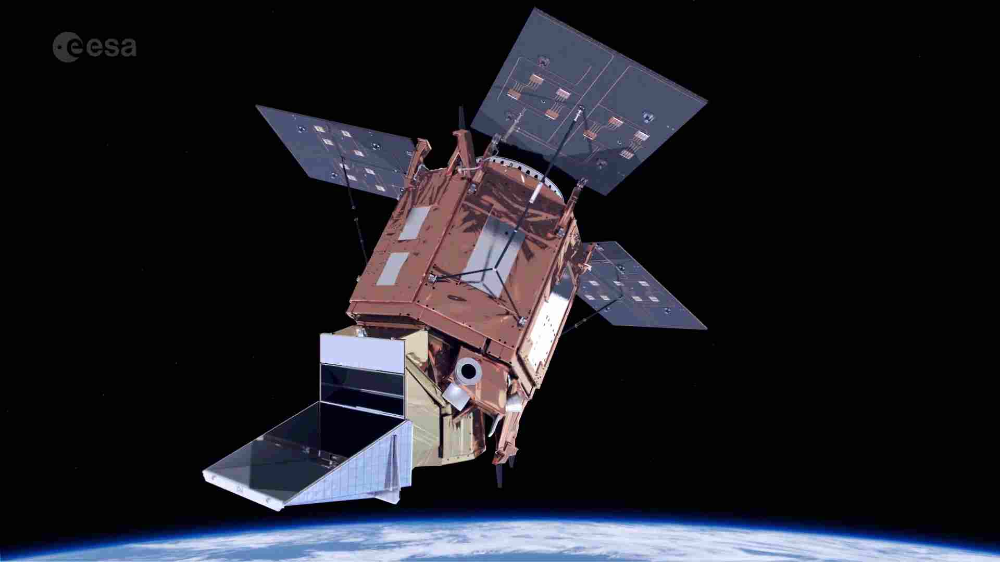
>
> *Image 12: Sentinel 5P Satellite. Credit: ESA*
>
>  
>
> Sentinel-5P is a critical satellite dedicated to monitoring the
> Earth’s atmosphere, specifically designed for tracking air quality and
> pollution. Here’s a detailed look at its features and capabilities:
>
> **Resolution: 7 km x 7 km**
>
> Sentinel-5P provides data at a resolution of 7 kilometers by 7
> kilometers. This resolution is effective for observing atmospheric
> pollutants over large areas while still delivering sufficient detail
> for accurate air quality assessments.
>
> **Technology: TROPOspheric Monitoring Instrument (TROPOMI)**
>
> One of the core of Sentinel-5P’s capabilities is the TROPOspheric
> Monitoring Instrument (TROPOMI). TROPOMI is an advanced spectrometer
> that measures sunlight reflected off the Earth’s surface and through
> the atmosphere to detect various atmospheric components. It is
> designed to capture a broad spectrum of pollutants:
>
> - **Nitrogen Dioxide (NO2):** Tracks emissions from vehicle exhausts
>   and industrial activities.
>
> - **Ozone (O3):** Measures both stratospheric and tropospheric ozone,
>   crucial for understanding air quality and ozone layer health.
>
> - **Sulfur Dioxide (SO2):** Detects volcanic emissions and industrial
>   pollution.
>
> A lot of other important instruments go into making this work, here is
> a diagram that captures it well:  
>   
> 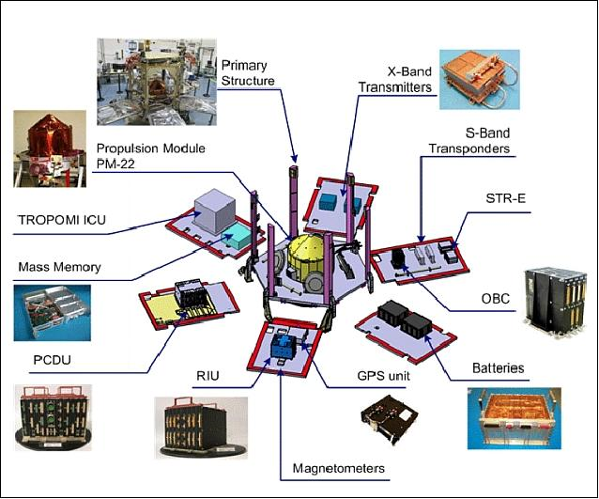
>
> *Image 13: Fold-out illustration of the AstroBus-L elements. Image
> Credit: ESA*
>
>  
>
> **Altitude: Orbits at approximately 824 km above the Earth**
>
> Sentinel-5P orbits the Earth at an altitude of about 824 kilometers.
> This vantage point enables the satellite to consistently monitor
> atmospheric conditions across the globe.
>
> **Launch Date: October 13, 2017**
>
> Launched on October 13, 2017, Sentinel-5P has been operational for
> several years, contributing valuable data to global air quality
> monitoring efforts.
>
> **Expected Lifespan: Designed for a mission life of 7 years**
>
> The mission of Sentinel-5P is planned to last for at least 7 years,
> ensuring a continuous supply of data for studying and managing air
> pollution.
>
> **Cost: Estimated at around €200 million**
>
> The estimated cost of Sentinel-5P is approximately €200 million,
> reflecting the advanced technology and the extensive data collection
> capabilities of the satellite.
>
> **Applications:**
>
> Sentinel-5P’s data is crucial for assessing air quality, monitoring
> pollution trends, and supporting environmental policy decisions. Its
> comprehensive measurements of atmospheric pollutants provide insights
> that help address air quality challenges and improve public health.
>
> For more details, you can visit the Sentinel-5P mission page:
> <https://sentiwiki.copernicus.eu/web/s5p-mission>

 

Next up is a recently launched satellite that aims to revolutionize how
we track Methane Emissions.

 

> ## Satellite in Focus - Methane SAT
>
> ------------------------------------------------------------------------
>
> 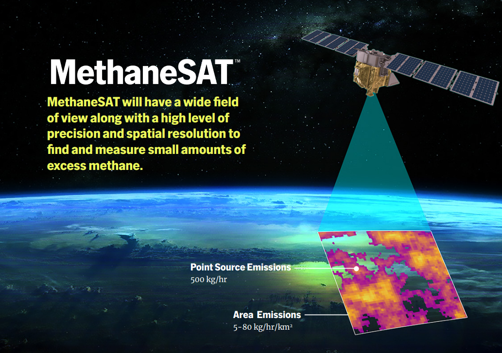
>
> *Image 14: MethaneSAT factsheet page 1. Image Credit: MethaneSAT*
>
>  
>
> Launched by the Environmental Defense Fund (EDF), MethaneSAT is a
> pioneering satellite dedicated to measuring methane emissions with
> unprecedented accuracy. As a key tool in the global effort to combat
> climate change, MethaneSAT offers advanced capabilities that set it
> apart from other methane-monitoring satellites. Here’s a breakdown of
> what it can do:
>
> ### **High-Resolution Emissions Heatmap**
>
> MethaneSAT can create detailed heatmaps of methane emissions over
> large areas. Specifically, it can produce heatmaps for regions that
> are 200 km by 200 km (about the size of New Jersey). These maps show
> emissions in fine detail, down to an area of 1 square kilometer (km²).
> Within these areas, MethaneSAT captures data at a native pixel size of
> 100 meters by 400 meters. This means each “pixel” on the map
> represents a 100m x 400m area on the ground, allowing for pinpoint
> accuracy in identifying methane sources.
>
> ### **Quantifying Regional Emissions**
>
> MethaneSAT isn’t just about mapping emissions; it also quantifies them
> across vast regions. It’s equipped to measure emissions from
> individual oil and gas fields or basins that are responsible for more
> than 80% of the world’s oil and gas production. This capability is
> crucial for understanding the impact of industrial activities on
> global methane levels. Essentially, MethaneSAT acts as a global
> auditor, measuring how much methane is being released from some of the
> largest industrial sources on Earth.
>
> ### **Automated Emission Rate Calculations**
>
> One of MethaneSAT’s standout features is its ability to automate the
> complex calculations required to measure emission rates.
> Traditionally, analyzing this data could take months, but MethaneSAT
> speeds up the process, delivering actionable data in just a few days.
> This rapid turnaround is possible because of advanced algorithms that
> process the raw data quickly, providing timely insights for
> environmental management.
>
> ### **Broad Area Coverage**
>
> MethaneSAT orbits the Earth in just 100 minutes, and during each
> orbit, it covers a swath width of 200 kilometers. This broad coverage
> allows it to monitor large areas of the planet’s surface frequently,
> providing a continuous stream of data. This means that MethaneSAT can
> keep a close watch on methane emissions across the globe, ensuring
> that no major emission event goes unnoticed.
>
> ### **Point Source Attribution**
>
> MethaneSAT can trace larger single emission events back to their point
> of origin. This capability is akin to finding the needle in the
> haystack—it can identify specific sources of methane leaks, such as a
> particular facility or pipeline. This feature is vital for enforcement
> and regulation, as it enables targeted action to reduce emissions from
> specific sources.
>
> ### **Precision in Measuring Methane Concentrations**
>
> MethaneSAT is equipped with highly sensitive instruments that can
> detect excess methane at a concentration of just 3 parts per billion
> (ppb). This level of precision is unmatched by any other satellite
> currently in orbit. Detecting such small concentrations allows for a
> more accurate assessment of how much methane is in the atmosphere and
> where it’s coming from.
>
> ### **Transparency and Public Access**
>
> One of the goals of MethaneSAT is to promote transparency in
> environmental monitoring. The data collected by the satellite is made
> publicly accessible, allowing governments, researchers, and even the
> general public to view and use the information. This open-access
> approach supports global efforts to reduce methane emissions and
> combat climate change.
>
> ### **Comparing MethaneSAT with Other Satellites**
>
> 
>
> *Image 15: MethaneSAT factsheet page 2. Image Credit: MethaneSAT*
>
>  
>
> MethaneSAT stands out among other methane-detecting satellites due to
> its unique combination of resolution, coverage, and sensitivity.
> **TROPOMI**, for example, offers broader coverage but with a coarser
> resolution, limiting its ability to detect smaller or more diffuse
> sources of methane. On the other hand, **GHGSat** provides
> ultra-high-resolution data, capable of detecting emissions from
> individual facilities, but it covers much smaller areas compared to
> MethaneSAT. What makes MethaneSAT particularly valuable is its ability
> to balance high-resolution data (100 meters x 400 meters) with
> extensive area coverage, enabling it to detect both localized leaks
> and widespread emissions with high sensitivity. This combination makes
> MethaneSAT a crucial tool in the global effort to monitor and reduce
> methane emissions.

 

Next we look at NASA’s TEMPO satellite, which provides near real time
air quality data across North America, with unprecedented precision!

 

------------------------------------------------------------------------

> ## Satellite in Focus - TEMPO Satellite
>
> NASA’s TEMPO (Tropospheric Emissions: Monitoring of Pollution)
> satellite is a groundbreaking mission designed to monitor air quality
> across North America with unprecedented precision. Imagine having a
> camera that takes ultra-detailed pictures of pollution across the
> entire continent, not just once a day, but hourly. That’s the kind of
> revolutionary capability TEMPO brings to the table, capturing the
> intricate dance of pollutants as they move and interact throughout the
> day.
>
> 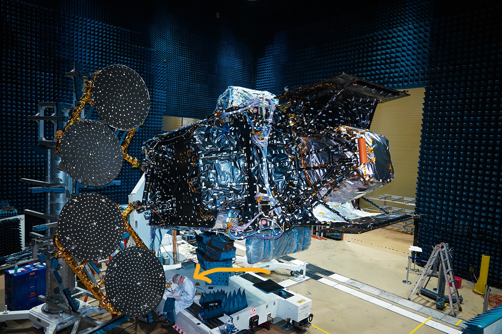
>
> *Image 16: TEMPO instrument and entire spacecraft successfully passed
> pre-launch testing (look at the scale, compare to the person sitting
> next to it!). Image Credit: NASA TEMPO Gallery.*
>
>  
>
> ### **Resolution & Coverage**
>
> TEMPO’s resolution is akin to having a grid overlaying North America,
> with each grid square representing an area as small as 2.1 x 4.5 km.
> This high resolution allows TEMPO to track air quality in individual
> cities, suburbs, and even down to neighborhoods. Picture looking at a
> weather map and being able to see the exact concentration of
> pollutants in your local area—TEMPO makes this possible.
>
> ### **Technology**
>
> TEMPO operates from a geostationary orbit, 35,786 km above Earth,
> meaning it hovers over the same spot, watching North America
> continuously. Its core technology is an advanced spectrometer that can
> detect light in the ultraviolet and visible range. This might sound
> technical, but think of it as a sophisticated prism breaking down
> sunlight reflected off Earth into its component colors. By analyzing
> these colors, TEMPO can identify specific gases like nitrogen dioxide
> (NO₂), sulfur dioxide (SO₂), and formaldehyde (HCHO), which are key
> indicators of air pollution.
>
> ### **Instruments & Capabilities**
>
> TEMPO’s instrument measures air quality by capturing the sunlight
> scattered back from Earth’s atmosphere. Just like how a prism splits
> light into a rainbow, TEMPO’s spectrometer divides the sunlight into
> different wavelengths. Each gas absorbs light at specific wavelengths,
> allowing TEMPO to measure the amount of each pollutant present in the
> atmosphere. For instance, it can detect nitrogen dioxide, a byproduct
> of fossil fuel combustion, with exceptional accuracy.
>
> ### **Applications & Impact**
>
> The data collected by TEMPO is invaluable for understanding air
> pollution patterns, forecasting air quality, and even helping
> policymakers develop strategies to mitigate pollution. Imagine local
> authorities knowing the exact pollution levels across different parts
> of a city in real-time and using this data to issue health advisories
> or enforce pollution control measures.
>
> ### **Public Accessibility & Collaboration**
>
> One of the most exciting aspects of TEMPO is that its data is publicly
> available, empowering researchers, government agencies, and even
> curious individuals to explore air quality trends. This open-access
> approach can drive community-driven initiatives to address air quality
> issues at the grassroots level.
>
> ### **Why It Matters**
>
> TEMPO’s ability to provide near-real-time data on a continental scale
> is a game-changer. It’s like upgrading from a blurry snapshot to an
> ultra-high-definition video of air quality across North America,
> offering insights into the daily ebb and flow of pollutants. This
> level of detail can help us better understand the impact of traffic,
> industrial emissions, and even natural events like wildfires on air
> quality, ultimately contributing to healthier lives and a cleaner
> environment.
>
> By integrating data from TEMPO with other models and satellites, we
> can gain a more comprehensive understanding of how air quality is
> affected by various factors, including weather patterns and human
> activities. This knowledge is crucial for developing effective
> strategies to combat air pollution and protect public health.

 

There are a lot of other important satellites that help in monitoring AQ
across the globe. If interested you can read more about it
[here](https://sites.wustl.edu/acag/satellites/).

Earlier in this blog, we talked about GEOS-Chem model in the data
processing section. Now, I’ll take a deep dive into this model in the
next section:

 

------------------------------------------------------------------------

> ## Model in Focus: GEOS-Chem
>
> ------------------------------------------------------------------------
>
> 
>
> *Image 17: GEOS-Chem logo. Credit: Geos-Chem*
>
>  
>
> **GEOS-Chem** is like a powerful digital laboratory for studying the
> atmosphere. It simulates the atmosphere’s complex chemistry to help
> scientists understand how different gases and particles interact and
> impact our environment. Let’s dive into what makes GEOS-Chem such a
> valuable tool:
>
> ### Overview
>
> Imagine GEOS-Chem as a high-tech, global-scale simulator that uses
> data and science to model the atmosphere’s chemical makeup. Developed
> through collaboration, it combines NASA’s advanced Earth observing
> system with detailed chemical and transport models to provide a deep
> understanding of our atmosphere.
>
> ### Key Features
>
> **1. Comprehensive Atmospheric Chemistry:** GEOS-Chem is like a recipe
> book for the atmosphere. It models a wide range of chemicals,
> including greenhouse gases like carbon dioxide and methane, as well as
> aerosols and pollutants. This “recipe” helps scientists see how these
> substances interact, break down, and affect air quality and climate.
>
> **Example:** If there’s a sudden spike in nitrogen dioxide levels over
> a city, GEOS-Chem can help track how this pollution disperses, reacts
> with other chemicals, and affects air quality over time.
>
> **2. High-Resolution Capabilities:** Think of GEOS-Chem’s resolution
> like the zoom on a camera. It can zoom in to show detailed images of
> specific regions or zoom out for a broader view of the globe.
> Researchers can adjust the model’s settings to focus on a small city
> or a whole continent, depending on their needs.
>
> **Example:** A researcher might use high resolution to study air
> quality in a major urban area affected by traffic emissions, while a
> climate scientist might use lower resolution to observe global
> patterns of greenhouse gases.
>
> **3. Integrated Observations:** GEOS-Chem integrates real-world
> observations, much like adding real-time data to a simulation. It uses
> data from satellites, weather stations, and other sources to refine
> its predictions and ensure they match up with what’s happening in the
> real world.
>
> **Example:** If satellite data shows an increase in atmospheric
> methane, GEOS-Chem adjusts its model to reflect this change, improving
> the accuracy of its predictions and analyses.
>
> **4. Applications and Impact:**
>
> - **Air Quality Forecasting:** GEOS-Chem helps predict pollution
>   levels, much like a weather forecast predicts rain. This is crucial
>   for issuing health advisories and helping people prepare for poor
>   air quality days.
>
> - **Climate Research:** The model helps scientists understand how
>   different chemicals influence climate change. For example, it can
>   show how aerosol particles affect cloud formation and global
>   temperatures.
>
> - **Policy Support:** By providing evidence on the impact of emissions
>   and pollution control measures, GEOS-Chem supports the development
>   of effective environmental policies and regulations.
>
> **5. Accessibility:** GEOS-Chem is available to the global research
> community, much like a public library filled with valuable resources.
> Scientists can access the model for their studies, contribute to its
> development, and share their findings with others.
>
> For a closer look at how GEOS-Chem operates and to explore its
> capabilities, visit the [GEOS-Chem
> Overview](https://geoschem.github.io/overview.html).

 

In this final focus section, we look at First Street, an organization
that uses all of the above ideas, technologies and models to perfom
accurate high resolution (property level) forecasts for a wide range of
climate variables, including air quality:

 

------------------------------------------------------------------------

> ## Company in Focus: First Street’s Air Quality Model
>
> ------------------------------------------------------------------------
>
> 
>
> *Image 18: First Street Logo. Credit: First Street*
>
>  
>
> **First Street’s Air Quality Model** is an advanced tool designed to
> predict the future of air quality across the United States. By
> combining extensive data, scientific principles, and powerful
> computing, this model helps scientists, policymakers, and communities
> understand how air quality might change in the coming years,
> especially in response to climate change. First Street has developed a
> cutting-edge model to calculate climate-adjusted air quality data at
> the property level, offering a new perspective on how air pollution
> affects individual properties.
>
> #### Key Features
>
> **1. Climate-Driven Predictions:** The model predicts how changes in
> climate—such as rising temperatures and altered weather patterns—will
> affect air quality in different regions. For instance, as a city
> experiences warmer temperatures, the model can forecast how this might
> lead to higher levels of ozone pollution, which can have significant
> public health implications. This provides a more wholesome picture of
> AQ in interaction with other climate variables.
>
> **2. High-Resolution Mapping:** The model can provide detailed,
> high-resolution maps that show air quality conditions at a
> neighborhood level. This granular approach allows for a precise
> understanding of where pollution hotspots are likely to occur within a
> city, enabling targeted interventions.
>
> **3. Historical Data Integration:** By incorporating historical
> pollution data, the model can identify long-term trends and make more
> accurate predictions about future air quality. For example, if a
> region has seen increasing industrial activity over the years, the
> model can project how continued growth might impact future pollution
> levels.
>
> **4. Accessibility for Communities and Policymakers:** Designed to be
> user-friendly, the model makes complex air quality data accessible to
> a wide audience. Local governments might use it to plan urban
> development projects that minimize pollution, while residents can
> learn about potential changes in air quality in their area and take
> steps to protect their health.
>
> **5. Real-World Applications:**
>
> - **Health Impact Assessments:** The model can predict how changes in
>   air quality might affect public health, helping healthcare providers
>   and public health officials prepare for future challenges.
>
> - **Urban Planning:** City planners can use the model’s insights to
>   design urban areas that reduce pollution exposure, such as by
>   increasing green spaces or improving traffic management.
>
> - **Environmental Justice:** The model can highlight areas where
>   vulnerable populations are at greater risk from poor air quality,
>   supporting efforts to address health disparities.
>
> **6. Transparent:** The methodology behind First Street’s model is
> transparent, meaning that the processes used to generate predictions
> are available for review. This openness ensures that the model’s
> predictions are trustworthy and can be scrutinized or built upon by
> researchers and policymakers.
>
> For more detailed information on First Street’s Air Quality Model and
> its methodology, visit the [First Street Research
> Library](https://firststreet.org/research-library/air-quality-model-methodology).

## From Complexity to Clarity: How Satellite Data Can Inform Air Quality Regulation

When it comes to air quality regulations, reference-grade monitors have
traditionally been the gold standard. These monitors are highly accurate
and reliable instruments, often stationed at ground level, that measure
specific pollutants in the atmosphere with a high degree of precision.
Due to their accuracy, the data from these monitors is used by
governments and regulatory bodies to set and enforce air quality
standards.

However, in recent years, satellite data has begun to play an
increasingly important role in air quality monitoring and regulation.
While satellite measurements may not always match the precision of
reference-grade monitors, they offer broad, global coverage that
ground-based monitors cannot. This is especially valuable in areas where
ground monitoring is sparse or non-existent.

Real-life examples illustrate the growing influence of satellite data in
air quality regulations:

1.  **United States**: The Environmental Protection Agency (EPA) uses
    satellite data alongside reference-grade monitors to enhance its
    understanding of air pollution trends. For example, satellite
    observations of NO2, a harmful pollutant, help the EPA assess
    regional air quality and guide regulatory actions, particularly in
    areas without sufficient ground monitoring.

2.  **India**: In response to severe air pollution, India has
    increasingly integrated satellite data into its air quality
    management practices. The National Clean Air Programme (NCAP)
    utilizes satellite observations to monitor PM2.5 and other
    pollutants, especially in rural and remote areas where ground-based
    data is limited. This data informs policy decisions aimed at
    reducing air pollution across the country.

3.  **European Union**: The European Space Agency’s Sentinel satellites
    provide critical data that supports the European Union’s air quality
    directives. For example, Sentinel-5P’s data on ozone, nitrogen
    dioxide, and other pollutants is used by the European Environment
    Agency (EEA) to complement data from ground-based monitors, ensuring
    comprehensive air quality assessments across member states.

Despite these advancements, one significant obstacle to broader adoption
of satellite data in air quality regulation is the technical complexity
of the field. Government officials and stakeholders may be skeptical of
satellite data due to a lack of understanding of its methodologies and
applications. This skepticism is not entirely their fault, as satellite
remote sensing involves complex technologies and data analysis
techniques.

This blog aims to bridge that gap by making the field of satellite-based
air quality monitoring more accessible and understandable to the general
audience. By simplifying the technical details and showcasing practical
examples, I hope to foster greater trust and integration of satellite
data into air quality management practices.

## India’s Progress in Satellite Remote Sensing for Air Quality Monitoring

India has made significant strides in understanding and improving air
quality through advanced satellite technology. A notable development is
the Ocean Colour Monitor (OCM-3) Aerosol Optical Depth (AOD) product,
created by ISRO and onboard the EOS-6 satellite, launched in November
2022. This technology represents a leap forward in air quality
monitoring.

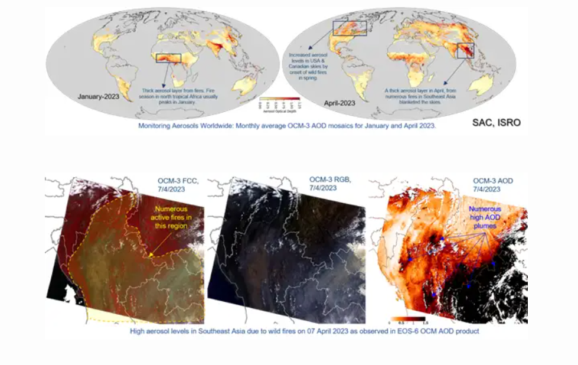

*Image 19: Results from OCM-3 AOD measurments. Credit: ISRO*

 

Here’s a closer look at this advancement:

- **Advanced Monitoring Capabilities:** The OCM-3 sensor on the EOS-6
  satellite boasts a spatial resolution of 1 km, which enables detailed
  tracking of atmospheric aerosols across India. This high-resolution
  data provides valuable insights into aerosol concentrations and their
  effects on air quality, particularly over densely populated areas.

- **Sophisticated Data Analysis:** Using the SAC AErosol Retrieval
  (SAER) algorithm, the OCM-3 AOD product helps in analyzing particulate
  matter (PM2.5/PM10). This capability allows researchers to study how
  these particles are distributed and transported, offering a clearer
  picture of air quality dynamics.

- **Global and National Impact:** The data from OCM-3 is not only
  valuable for understanding air quality within India but also for
  global monitoring. It helps track aerosol influences from various
  sources, such as fires in South Asia and Canada, contributing to a
  broader understanding of global air quality patterns.

- **Accessibility and Validation:** Researchers and students can access
  the OCM-3 data through the MOSDAC platform, following registration.
  This repository supports detailed exploration of air quality trends
  and serves as a benchmarking tool for air quality models. The data has
  been rigorously validated against ground measurements from AERONET
  stations, showing strong correlations and confirming its accuracy.

- **Recent Observations:** The OCM-3 AOD data has revealed notable
  trends, such as increased aerosol levels over the Indo-Gangetic Plain
  after October 13, 2023, and high AOD values in Delhi during and after
  Diwali. These findings underscore the impact of seasonal pollution and
  fire activities on air quality.

This advancement reflects India’s growing commitment to utilizing
satellite technology for air quality monitoring. While the country
currently relies heavily on ground-based measurements and international
remote sensing missions, the introduction of the OCM-3 onboard EOS-6
marks a significant step forward. It paves the way for a future where
India can confidently integrate satellite data into its air quality
monitoring and policy-making processes, contributing to cleaner and
healthier environments.

## Explore biteSizedAQ Project 1: Deriving India’s population weighted pollution data from 1998-2022

 

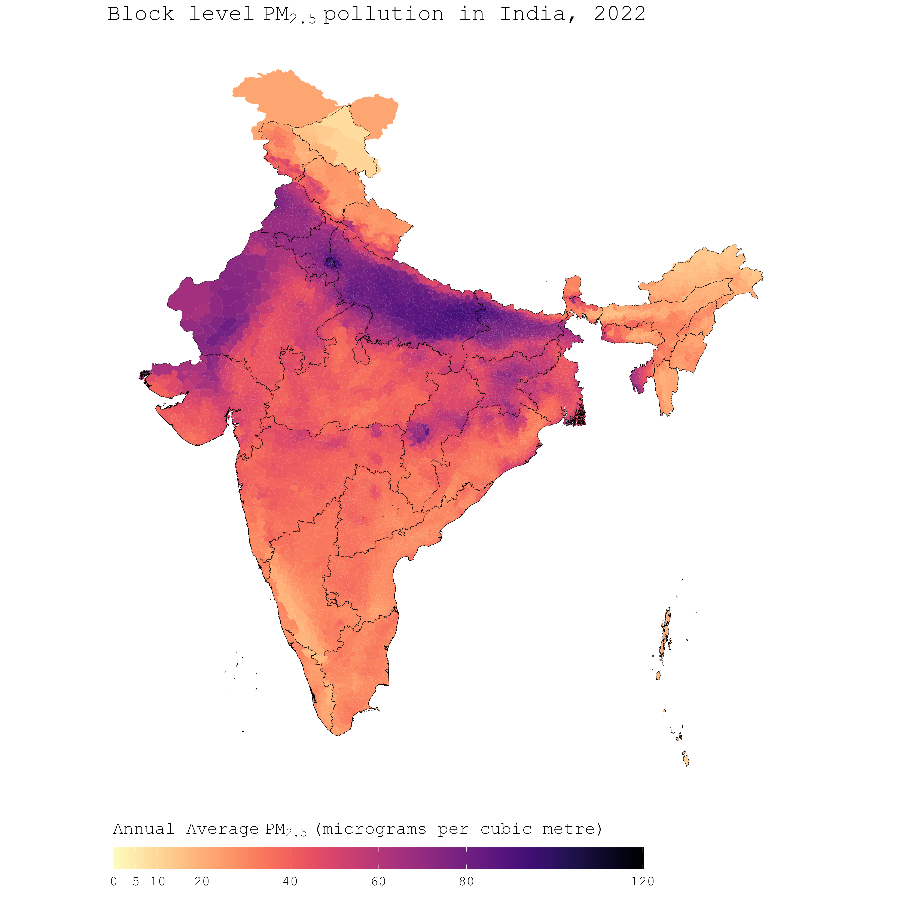

*Image 20: A map of India’s Satellite Derived Annual Average PM2.5 data
(2022). Credit: biteSizedAQ project 1*

 

In **Project 1** of the biteSizedAQ series, the focus is on deriving
India’s population-weighted pollution data using satellite-derived
population and pollution data. This project provides a hands-on
opportunity to apply the concepts discussed in this blog post,
especially for those familiar with R.

For those proficient in R, this project offers a detailed guide on how
to process and analyze the data, allowing you to recreate and rederive
the results. The project is an excellent way to test your skills and
deepen your understanding of how satellite data can be used in air
quality studies.

For those coming from other programming language backgrounds, feel free
to reproduce the results by transitioning the R code to your language of
choice.

If you end up transitioning this pipeline to a different language, feel
free to open a pull request to contribute your code back to this
project. If you plan to do this, please ensure the following conditions
are met: (a) the code is well documented, (b) written in a language that
is free and open source (as biteSizedAQ supports and encourages use of
open source tools over proprietary ones) and reproducible.

You can explore the project, access the code, and follow along with the
methodology to gain practical experience in air quality data processing.
Visit the [biteSizedAQ Project 1
page](https://github.com/AarshBatra/biteSizedAQ/tree/main/1.ind.block.pm2.5.sat.data.processing#introduction)
to get started.

## Conclusion: The Comprehensive Apporach to AQ management

Measuring air quality goes far beyond simply assessing pollution levels.
It encompasses understanding a complex interplay of factors including
temperature, wind patterns, and broader climate conditions. Each of
these elements interacts with air pollutants, affecting their
dispersion, concentration, and impact on human health and the
environment. To capture this intricate picture, we need more than just
ground-based data; we require a diverse toolkit that integrates various
methods, including remote sensing technologies.

Remote sensing plays a crucial role in this comprehensive approach.
Satellites like Sentinel-5P and MethaneSAT offer high-resolution data on
air pollutants and their sources, providing a global perspective that
complements localized measurements. For instance, Sentinel-5P’s detailed
observations of gases such as nitrogen dioxide and ozone, and
MethaneSAT’s precision in tracking methane emissions, contribute
significantly to our understanding of air quality from space. These
satellites enable us to monitor and model air pollution over vast areas,
offering insights that ground-based sensors alone cannot provide.

Companies like First Street are leveraging remote sensing data alongside
other methodologies to deliver a well-rounded view of air quality. By
integrating satellite data with property-level models and local
environmental factors, they offer comprehensive analyses that reflect
the real-world complexities of air pollution. This holistic approach
helps in crafting more effective policies and interventions, making the
case for the indispensable nature of remote sensing in modern air
quality management.

When comparing remote sensing with other air quality measurement
techniques, each method comes with its own set of advantages and
limitations. Ground-based reference-grade monitors, for example, offer
high accuracy and direct measurements of air pollutants but are limited
in spatial coverage. Remote sensing, on the other hand, provides
extensive coverage and the ability to capture large-scale trends but may
lack the precision of localized measurements. The choice between these
methods often hinges on the specific needs of a project or policy, such
as the scale of monitoring or the type of pollutants of interest.

***Ultimately, these technologies should not be viewed as competitors
but as complementary tools that, when combined, offer a more complete
picture of air quality.*** Remote sensing enhances our ability to
observe and analyze pollution on a broad scale, while ground-based
measurements provide detailed, localized data.

***By integrating these diverse sources of information, we can achieve a
more accurate and actionable understanding of air quality, leading to
better-informed decisions and more effective environmental policies.***

This blog aims to bridge the gap between technical satellite data and
its practical applications in air quality regulation. By making this
field more accessible to the public and decision-makers, I hope to
foster greater understanding and appreciation of the role that advanced
technologies play in safeguarding our air and our health.

## References

- *Open Air Quality Data: The Global Landscape 2022 report, OpenAQ
  \[[Link](https://documents.openaq.org/reports/Open+Air+Quality+Data+Global+Landscape+2022.pdf)\]*

- *What is Remote Sensing?, NASA Earth Data
  \[[Link](https://www.earthdata.nasa.gov/learn/backgrounders/remote-sensing)\]*

- *Optical and Radar Remote Sensing, Reef Resilience Network
  \[[Link](https://reefresilience.org/management-strategies/remote-sensing-and-mapping/introduction-to-remote-sensing/optical-and-radar-remote-sensing/)\]*

- *LIDAR point cloud image of forest canopy, Oregon, USA, USGS
  \[[Link](https://www.usgs.gov/media/images/lidar-point-cloud-image-forest-canopy-oregon-usa)\]*

- *Demystifying LiDAR Point Cloud Data: Comprehensive Guide, Medium
  \[[Link](https://medium.com/@matt-sharon/lidar-point-cloud-data-guide-62c126101c08)\]*

- *First Weather Satellite: (TIROS), DARPA
  \[[Link](https://www.darpa.mil/about-us/timeline/tiros)\]*

- *LANDSAT Satellite Missions, USGS
  \[[Link](https://www.usgs.gov/landsat-missions/landsat-satellite-missions)\]*

- *LANDSAT Satellites, NASA
  \[[Link](https://landsat.gsfc.nasa.gov/satellites/)\]*

- *ENVISAT Satellite Missions Catalog, eoPortal
  \[[Link](https://www.eoportal.org/satellite-missions/envisat#eop-quick-facts-section)\]*

- *Overview of Sentinel-5P Mission
  \[[Link](https://sentiwiki.copernicus.eu/web/s5p-mission)\]*

- *MethaneSAT \[[Link](https://www.methanesat.org/)\]*

- *MethaneSAT factsheet
  \[[Link](http://admin.methanesat.org/wp-content/uploads/2024/02/MethaneSATcomparison.pdf?_gl=1*khyejx*_ga*MTYwMTU0NDAxOS4xNzIyNDU5NDM2*_ga_Q5CTTQBJD8*MTcyMzgyODUyMy41LjEuMTcyMzgyODU1Ny4yNi4wLjA.*_ga_SXQYQWNJ8D*MTcyMzgyODUyNC41LjEuMTcyMzgyODU1Ny4yNy4wLjA.)\]*

- *The satellite helping slow climate change — right now, Methan SAT,
  Millie Chu Baird, TED
  \[[Link](https://www.ted.com/talks/millie_chu_baird_the_satellite_helping_slow_climate_change_right_now?geo=hi&subtitle=en)\]*

- *TEMPO Satellite Overview, NASA \[[Link](https://tempo.si.edu/)\]*

- *TEMPO Instrument Air Quality Data Now Publicly Available, NASA
  \[[Link](https://www.cfa.harvard.edu/news/tempo-instrument-air-quality-data-now-publicly-available)\]*

- *TEMPO Gallery, NASA \[[Link](https://tempo.si.edu/gallery.html)\]*

- *GEOS Chem \[[Link](https://geoschem.github.io/index.html)\]*

- *First Street Air Quality Methodology, First Street
  \[[Link](https://firststreet.org/research-library/air-quality-model-methodology)\]*

- *Precise Air Quality Monitoring with OCM-3 Aerosol Optical Depth
  Product from EOS-6 Satellite, ISRO
  \[[Link](https://www.isro.gov.in/PreciseAirQualityMonitoring.html#:~:text=The%20satellite%20EOS%2D6%2C%20launched,concentrations%20across%20the%20Indian%20landmass.)\]*

- *Meteorological & Oceanographic Satellite Data Archival Centre, ISRO
  \[[Link](https://www.mosdac.gov.in/)\]*

- *biteSizedAQ Project 1: Deriving India’s population weighted pollution
  data from 1998-2022, biteSizedAQ
  \[[Link](https://github.com/AarshBatra/biteSizedAQ/tree/main/1.ind.block.pm2.5.sat.data.processing)\]*

- *Smoky Skies Across North America, NASA Earth Observatory
  \[[Link](https://earthobservatory.nasa.gov/images/153106/smoky-skies-across-north-america)\]*

- *Copernicus Sentinel Data Open Access Hub, Copernicus, ESA
  \[[Link](https://scihub.copernicus.eu/)\]*

- *Copernicus Sentinel-5P Mapping Portal, ESA
  \[[Link](https://maps.s5p-pal.com/so2-7km-nrt/)\]*

- *The European Space Agency, Photo library for Professionals
  \[[Link](https://photolibrary.esa.int/asset/?uuid=ab61270e-c982-5819-92ed-7d69e3150000)\]*

## Rmd for this blog

Underlying Rmd file can be found in the project’s respective folder and
here is a quick link to access it.

## Support This Work: Give It a Star

Thank you for reading! If you found this project helpful or interesting,
please consider starring it on GitHub. Your stars help others discover
and benefit from this fully open and free repository. Click [here to
star the
repository](https://github.com/AarshBatra/biteSizedAQ/stargazers).

## Get in touch

Get in touch about related topics/report any errors. Reach out to me at
aarshbatra.in@gmail.com.

## License and Reuse

All content is shared under the Creative Commons Attribution 4.0
International (CC BY 4.0) license. You are welcome to use this material
in your reports or news stories. Just remember to give appropriate
credit and include a link back to the original work. Thank you for
respecting these terms!

For more details, see the LICENSE file.

If you use this in your work, please cite this repository as follows:

\[Aarsh Batra, 2024, biteSizedAQ,
<https://github.com/AarshBatra/biteSizedAQ>\]
