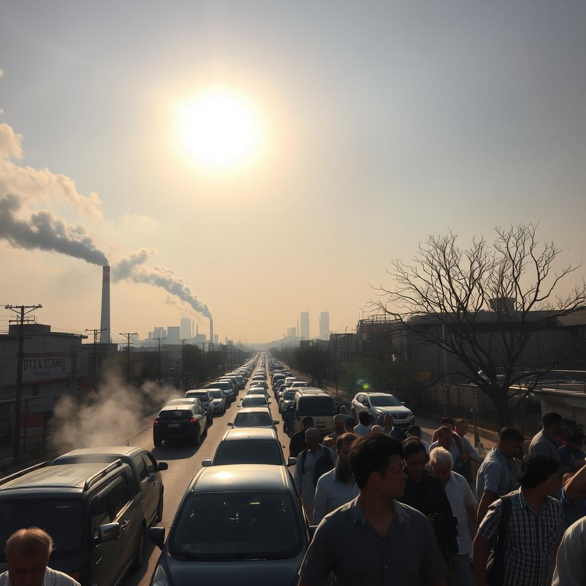
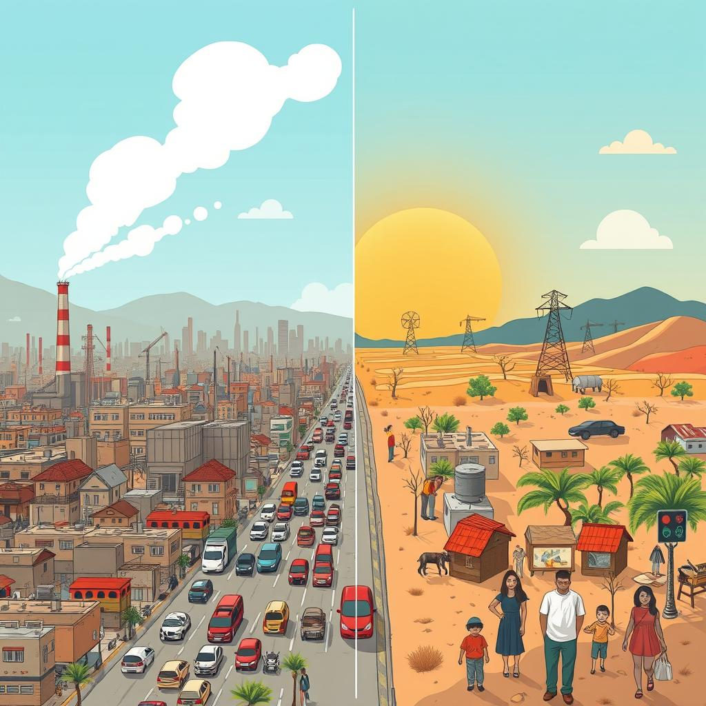
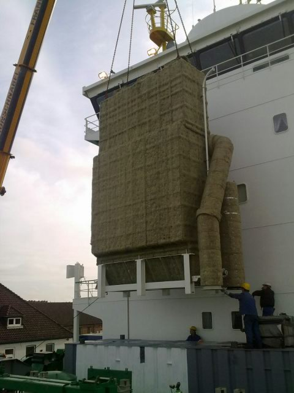
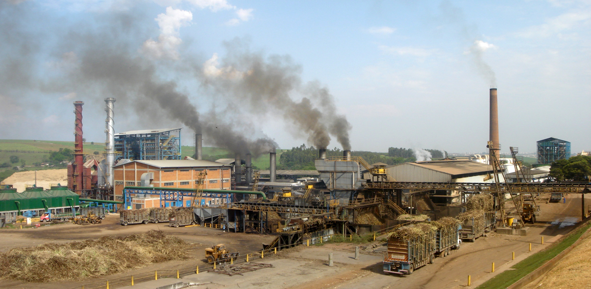
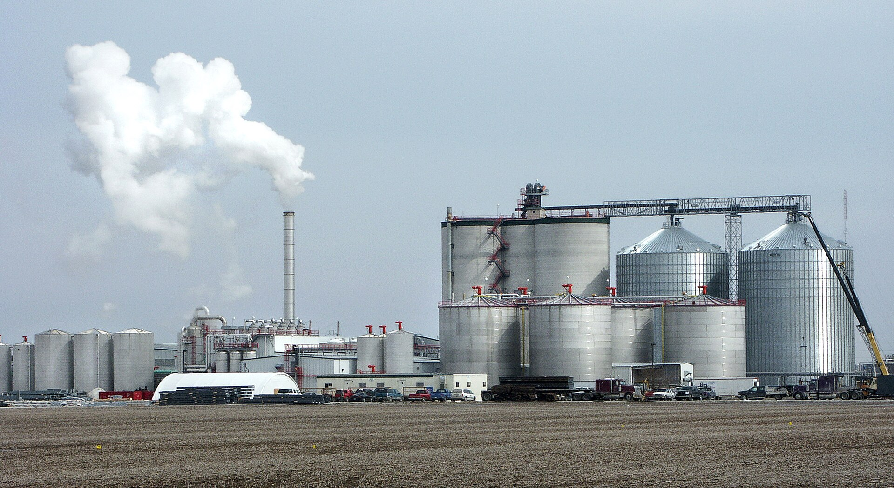
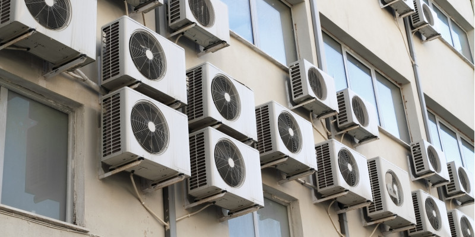
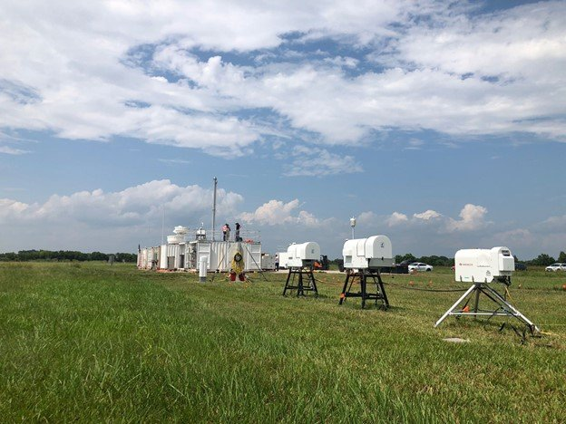

## Facing Two Fronts: The Intersection of Air Pollution and Climate Change

 

 

Air pollution and climate change are often discussed as if they’re
separate, isolated problems. Air pollution is something we experience
immediately—the smog that hangs over our cities, the smoke from
wildfires, or the haze from industrial emissions. Climate change, by
contrast, feels distant, its effects gradually unfolding through
shifting weather patterns, rising sea levels, and warming temperatures.
But in reality, these two crises are deeply intertwined, each amplifying
the other in ways that are shaping the future of our planet.

Imagine sitting in traffic, surrounded by exhaust fumes. The air
pollution from the vehicles is affecting your lungs right now, but the
carbon dioxide released is also contributing to global warming, which
will affect the climate for decades to come. This immediate impact of
air pollution and the long-term consequences of climate change are two
faces of the same crisis, demanding our urgent attention.

## **Understanding the Differences: Immediate vs. Long Term Threats**

 

***Image:** Generated using fluximageai.com*

 

Air pollution and climate change are closely linked, but they manifest
in different ways. Air pollution is like a punch to the lungs—immediate,
visible, and harmful in the here and now. It’s the dirty air you breathe
on a high-smog day, the irritation in your throat, and the haze that
obscures the skyline.

Climate change, however, operates on a much longer timeline. It’s akin
to a slow-acting poison. You might not feel its effects immediately, but
it’s steadily altering the environment in which we live. Over time, it
shifts weather patterns, causes glaciers to melt, and raises sea levels.
The full impact might not be felt for years or even decades, but when it
hits, the consequences are profound and far-reaching.

It’s important to recognize that the planet also experiences natural
warming and cooling cycles driven by factors like volcanic activity,
variations in solar radiation, and changes in Earth’s orbit. These
natural processes have been crucial in shaping the climate over
geological time scales and maintaining environmental balance. In the
absence of human influence, these natural cycles would still play a
significant role in the Earth’s climate system.

However, anthropogenic activities—such as burning fossil fuels and
deforestation—introduce excessive greenhouse gases like carbon dioxide
and methane into the atmosphere. This intensifies the natural warming
processes, leading to more rapid and pronounced climate changes than
would occur naturally. Human-induced warming accelerates the impacts,
causing shifts that outpace natural cycles and disrupt ecosystems.

In summary, while natural climate variations are a fundamental part of
Earth’s systems, human activities have supercharged these changes,
leading to accelerated and more severe impacts. Air pollution
contributes to immediate health issues and, over time, to climate
change, making it a key factor in both short-term harm and long-term
environmental shifts.

## **Interconnected Crises: How Air Pollution Fuels Climate Change (and Vice Versa)**

The connection between air pollution and climate change is more than
just shared sources of pollution; they amplify each other in dangerous
ways.

### **A Vicious Cycle: Pollution Drives Warming, and Warming Drives Pollution**

One of the clearest connections between air pollution and climate change
is the way they feed into each other. For example, when we burn fossil
fuels for energy, we release both air pollutants and greenhouse gases.
Particulate matter, especially black carbon, doesn’t just harm our
lungs—it also absorbs sunlight, warming the atmosphere and accelerating
the melting of snow and ice.

Imagine black carbon as a layer of soot on a snowy mountain. The soot
absorbs sunlight, heating up and melting the snow faster than clean snow
would, contributing to rising sea levels.

Climate change, in turn, exacerbates air pollution. As the planet warms,
we experience more heatwaves, which increase the formation of smog. This
is because higher temperatures accelerate the chemical reactions that
create ground-level ozone, a key component of smog. The result is a
feedback loop: pollution drives warming, and warming worsens pollution.

### **Wildfires: A Double-Edged Sword**

 

***Image:*** *People in downtown Kelowna watch the McDougall Creek
wildfire burning on Aug. 17, 2023. Credit: Winston Szeto/CBC.*

 

Wildfires vividly illustrate the destructive interplay between climate
change and air pollution. As climate change intensifies, many regions
are experiencing higher temperatures and prolonged droughts, creating
the perfect conditions for wildfires to thrive. These fires become not
just more frequent but increasingly intense, turning once lush
landscapes into fiery infernos.

Imagine a wildfire as a relentless furnace—its flames consuming
everything in their path, from trees and grasslands to entire
communities. This furnace doesn’t just cast a thick, choking blanket of
smoke across the sky, making the air barely breathable for those nearby.
It also sends vast plumes of carbon dioxide and other greenhouse gases
into the atmosphere, contributing to the very problem that exacerbates
the fire: global warming.

The immediate effects of wildfires are glaringly apparent. The smoke
released contains harmful pollutants that deteriorate air quality,
leading to health crises ranging from respiratory issues to
cardiovascular problems for people living in affected areas. But the
consequences stretch far beyond these immediate health impacts. Each
wildfire acts as a catalyst for climate change, releasing substantial
amounts of carbon dioxide stored in trees and vegetation. This
additional carbon dioxide fuels the greenhouse effect, trapping more
heat in the atmosphere and accelerating the warming of our planet.

Thus, wildfires create a vicious cycle: climate change leads to
conditions that spark more frequent and intense fires, which in turn
release pollutants that further drive global warming. It’s a cycle of
destruction where the immediate harm to air quality and the long-term
impact on the climate feed into each other, illustrating the urgent need
for coordinated efforts to address both issues simultaneously.

### **Urban Heat Islands: Cities Under Siege**

 

***Image:** Generated using fluximageai.com*

 

Cities are particularly vulnerable to the compounded effects of air
pollution and climate change, creating a challenging environment for
residents and city planners alike. The phenomenon known as the “urban
heat island” effect is a key factor in this vulnerability.

Urban areas are essentially vast, heat-absorbing sponges. The dense
concentration of buildings, roads, and vehicles creates a landscape that
absorbs and retains heat more efficiently than the surrounding rural
areas. Concrete, asphalt, and brick absorb solar energy during the day
and release it slowly at night, causing urban temperatures to remain
significantly higher than those in less developed regions.

Picture a cityscape on a summer day: the asphalt streets and dark
rooftops soak up the sun’s rays, causing the surface temperatures to
skyrocket. As night falls, this stored heat doesn’t dissipate quickly.
Instead, it continues to radiate, keeping city temperatures elevated
even after the sun has set. This “heat retention” effect results in
cities that are warmer, often by several degrees, compared to their
rural counterparts.

This elevated heat contributes to the formation of smog—a thick, hazy
layer of air pollution that forms when sunlight reacts with pollutants
like nitrogen oxides and volatile organic compounds (VOCs). In the heat
of the urban environment, these pollutants interact more aggressively,
leading to the creation of ground-level ozone, a key component of smog.
The warmer temperatures enhance the chemical reactions that produce
ozone, leading to higher concentrations of smog in cities.

The impact on air quality is significant. The persistent heat not only
exacerbates smog formation but also makes it more challenging to
disperse, leading to prolonged periods of poor air quality. Residents in
urban areas may find themselves breathing in higher levels of
pollutants, which can contribute to a range of health issues, including
respiratory problems, cardiovascular disease, and aggravated asthma.

Moreover, this heat exacerbates the overall effects of climate change.
The higher temperatures in cities contribute to increased energy
consumption, as more people rely on air conditioning to stay
comfortable. This additional energy demand often results in higher
emissions from power plants, further compounding the problem.

In essence, cities face a dual challenge: they are both contributors to
and victims of air pollution and climate change. The interplay between
the urban heat island effect and deteriorating air quality underscores
the need for innovative solutions that address both the immediate and
long-term impacts of these intertwined issues. By integrating strategies
that mitigate heat retention and reduce pollution sources, cities can
work towards a healthier, more sustainable future for their residents.

### **Short-Lived Climate Pollutants (SLCPs): The Hidden Culprits**

Short-Lived Climate Pollutants (SLCPs) such as methane and
hydrofluorocarbons (HFCs) are unique in their dual impact on both air
pollution and climate change, embodying a critical challenge for
environmental management.

**Methane** is a particularly potent greenhouse gas with a heat-trapping
ability that far exceeds that of carbon dioxide. Despite its shorter
atmospheric lifespan—typically about a decade compared to carbon
dioxide’s centuries-long persistence—methane’s immediate impact on
global warming is profound. To put it in perspective, over a 20-year
period, methane is over 80 times more effective at trapping heat than
carbon dioxide. This makes methane a crucial target for climate action.

***Image:** A researcher at the Baden-Württemberg Agricultural Centre in
Germany holds a detector that measures methane emissions in the exhaled
air of cows. Credit: Reuters/Thomas Warnack*

 

Methane originates from various sources, including livestock digestion,
landfills, and natural gas extraction. When released into the
atmosphere, it contributes to the greenhouse effect by absorbing and
re-radiating heat. This intensified warming effect can lead to
accelerated climate change, which in turn exacerbates the frequency and
severity of extreme weather events.

**Hydrofluorocarbons (HFCs)**, on the other hand, are synthetic
compounds used primarily in refrigeration and air conditioning. Although
HFCs have a shorter atmospheric lifespan than carbon dioxide, their
heat-trapping potential is even greater. They can be thousands of times
more effective at warming the planet per unit weight than carbon
dioxide. This potency makes them significant contributors to global
warming, despite their relatively recent introduction compared to other
greenhouse gases.

HFCs are often used as a replacement for ozone-depleting substances,
which initially seems beneficial for protecting the ozone layer.
However, while they don’t harm the ozone layer, their impact on climate
change is severe. Their high global warming potential (GWP) means that
even small amounts can have a substantial effect on global temperatures.

Despite their shorter atmospheric presence, the intense warming effects
of SLCPs make them critical targets for both air quality improvement and
climate change mitigation. Addressing these pollutants offers a dual
benefit: reducing their emissions can lead to immediate improvements in
air quality and also yield significant climate benefits. For instance,
cutting methane emissions can not only help slow the rate of global
warming but also reduce the formation of ground-level ozone, which is a
major component of smog and can cause respiratory problems.

In practical terms, reducing SLCPs often involves a range of strategies,
from improving waste management practices to advancing technology for
cleaner refrigeration. These efforts can help lower the concentrations
of these potent gases, thereby delivering quicker climate benefits and
improving air quality.

Thus, SLCPs represent a unique opportunity for impactful environmental
action. By targeting these pollutants, we can address both the immediate
health effects associated with air pollution and the broader,
longer-term challenges of climate change. This dual approach not only
tackles significant environmental issues but also helps create a more
sustainable and healthier future for all.

### Climate Change, Indoor Air Quality and Public Health

Climate change not only affects outdoor environments but also has
significant implications for indoor air quality. Rising levels of
outdoor pollutants, like ozone and particulate matter, can seep into
buildings through ventilation systems, open doors, and windows,
resulting in higher indoor exposures. These pollutants may worsen indoor
air quality, creating additional health risks for occupants.

Additionally, climate change-related factors such as increased
precipitation and storms can contribute to indoor air pollutants like
mold, dust mites, and bacteria. For instance, flood damage can lead to
damp indoor environments, fostering mold growth. Exposure to these
indoor pollutants has been associated with a range of health issues,
including heart disease, respiratory conditions like asthma, and even
cancer. As climate patterns shift, ensuring good indoor air quality
becomes a growing concern for public health.

## Unintended Consequences: When Solving One Problem Affects Another

Addressing air pollution and climate change often involves complex
trade-offs. Efforts to tackle one issue can sometimes unintentionally
worsen another. Here’s a detailed breakdown of how solving one problem
might impact another, with explanations of key terms and real-world
examples.

### **Scrubber Technologies in Power Plants**

 

***Image:** A scrubber during installation at the ship TIMBUS. Credit:
Wikipedia*

 

**Problem Addressed:** Scrubber systems are a critical technology used
in coal-fired power plants and other places to remove sulfur dioxide
(SO₂) from emissions. SO₂ is a harmful pollutant that contributes to
acid rain, which can cause significant environmental damage, including
harm to forests, lakes, and buildings. By removing this pollutant,
scrubbers play a vital role in reducing the immediate environmental and
public health impacts of air pollution.

**Benefits:** Scrubber technology has been successful in significantly
reducing sulfur dioxide emissions from power plants, helping to improve
air quality and mitigate the damaging effects of acid rain. Over the
years, scrubbers have contributed to cleaner skies, healthier
ecosystems, and less respiratory disease linked to air pollution. This
is especially important in regions heavily reliant on coal for energy
production, where air quality can be a serious issue.

**Unintended Consequence:** However, scrubber systems are not without
their challenges. Operating these systems requires substantial energy,
which, in coal-fired plants, often means burning additional coal. The
more coal that’s burned, the more carbon dioxide (CO₂) is released into
the atmosphere. While CO₂ does not have the same immediate health
effects as sulfur dioxide, it is a major greenhouse gas that traps heat
in the Earth’s atmosphere, exacerbating global warming and climate
change.

**Real-World Example:** In some U.S. power plants, for example, the
installation of scrubbers led to an increase in CO₂ emissions due to the
higher energy demand needed to run the scrubbers. This paradox creates a
situation where we reduce air pollution but at the cost of contributing
to long-term climate change through additional carbon emissions.

**Remedy:** The solution isn’t to abandon scrubbers but to innovate and
improve them. Advances in scrubber technology are already making them
more energy-efficient, reducing the amount of coal needed to operate
them. There’s also the opportunity to retrofit plants with cleaner
energy sources, such as renewable energy for auxiliary power, which can
run scrubbers without additional coal consumption. Additionally,
integrating carbon capture technology with scrubbers can further reduce
the CO₂ footprint of coal-fired power plants, making it possible to
address both sulfur dioxide and carbon dioxide emissions simultaneously.

In the long run, transitioning away from fossil fuels and investing in
renewable energy sources like wind, solar, and hydropower remains the
ultimate solution to tackling both air pollution and climate change.
However, as we move toward this future, improving existing technologies
like scrubbers can help bridge the gap, ensuring cleaner air and more
sustainable power generation in the interim.

### **Switching from Coal to Natural Gas**

 

***Image**: A natural-gas processing plant in Aderklaa, Austria. Credit:
Wikipedia*

**Problem Addressed:** Natural gas is often promoted as a cleaner
alternative to coal for generating electricity, primarily because it
produces about 50% less carbon dioxide (CO₂) when burned. As such,
switching from coal to natural gas is seen as a key strategy to reduce
the greenhouse gases that contribute to climate change. This transition
has helped lower overall CO₂ emissions in many regions.

**Benefits:** The shift from coal to natural gas has led to significant
reductions in sulfur dioxide (SO₂), nitrogen oxides (NOx), and
particulate matter, improving air quality and public health. Power
plants using natural gas are generally more efficient, and their lower
emissions contribute to cleaner, healthier communities, particularly in
areas previously reliant on coal.

**Unintended Consequence:** However, the benefits of natural gas are not
without caveats. During the extraction, transport, and use of natural
gas, methane—a greenhouse gas far more potent than CO₂—can leak into the
atmosphere. Methane is at least 25 times more effective at trapping heat
over a 100-year period, and even small leaks can significantly diminish
or even offset the climate benefits of switching from coal to natural
gas. Furthermore, the infrastructure required to extract, process, and
transport natural gas can contribute to localized air pollution and
environmental degradation.

**Real-World Example:** In Pennsylvania, for instance, methane leaks
from the state’s natural gas industry have been extensive enough to
undercut some of the climate benefits gained from reducing coal
consumption. While natural gas produces fewer direct emissions during
combustion, these methane leaks during the production and transport
phase highlight the need for careful management and regulation.

**Remedy:** To truly benefit from switching to natural gas, it’s
essential to address the methane leakage problem. This can be done
through the implementation of rigorous monitoring, maintenance, and
upgrading of natural gas infrastructure. Advanced technologies, such as
infrared cameras and sensors, can detect leaks early, allowing for
timely repairs. Additionally, strengthening regulations and enforcement
to limit methane emissions across the supply chain—particularly during
extraction and transport—will help maximize the climate benefits of
using natural gas. Reducing methane leaks not only makes natural gas a
more climate-friendly option but also contributes to improving local air
quality by cutting down on associated pollutants.

While natural gas can serve as a bridge fuel in the transition to
cleaner energy sources, further investment in renewable energy will
ultimately be necessary to achieve long-term climate goals.

### **Use of Certain Biofuels**

**Problem Addressed:** Biofuels, such as ethanol derived from plants,
are promoted as a renewable alternative to fossil fuels. The primary
goal is to reduce dependence on oil, lower greenhouse gas emissions, and
contribute to a more sustainable energy system. When produced from crops
like corn or sugarcane, biofuels can be carbon-neutral, as the CO₂
absorbed by the plants during growth offsets the CO₂ released when the
fuel is burned.

**Benefits:** In many regions, biofuels have successfully reduced
reliance on petroleum-based fuels, supporting rural economies and
lowering carbon footprints in sectors like transportation. For example,
in countries like Brazil, ethanol made from sugarcane has helped
significantly reduce the nation’s greenhouse gas emissions compared to
fossil fuel use.

***Image:** A Sugarcane based Ethanol plant in Brazil. Credit:
Wikipedia*

 

***Image:** A Corn based Ethanol plant in the US. Credit: Wikipedia*

 

**Unintended Consequence:** Despite their potential benefits, not all
biofuels are created equal. Burning certain types of biofuels,
especially those made from wood, crop residues, or waste materials, can
produce high levels of particulate matter (PM) and volatile organic
compounds (VOCs). These tiny particles and chemicals can contribute to
poor air quality, causing respiratory issues and increasing the risk of
diseases such as asthma. This trade-off means that, while biofuels can
reduce CO₂ emissions, they can worsen local air quality if not managed
carefully.

**Real-World Example:** In Brazil, where ethanol is widely used, studies
have shown that burning ethanol in vehicles can increase levels of
particulate matter and VOCs, which are precursors to smog. These
pollutants contribute to poor air quality in urban areas, particularly
during dry seasons, creating challenges for public health and air
quality management.

**Remedy:** To mitigate these negative effects, the focus should shift
toward cleaner biofuels and more advanced combustion technologies. For
instance, algae-based biofuels offer a promising alternative, as they
produce fewer particulates and VOCs compared to traditional biofuels
derived from crops. Additionally, using biofuels in combination with
improved engine technology and emission control systems can further
reduce harmful emissions. Investing in research and development of
next-generation biofuels—such as those made from waste or non-food
sources—can also help minimize the trade-offs between reducing
greenhouse gases and improving local air quality.

By carefully selecting the types of biofuels used and incorporating
cleaner technologies, we can continue to reduce our reliance on fossil
fuels while avoiding negative impacts on air quality.

### **Implementation of Diesel Filters**

 

***Image:** Diesel Particulate Filter of a School Bus. Credit:
Wikipedia*

 

**Problem Addressed:** Diesel particulate filters (DPFs) are an
important technology used in diesel engines to capture harmful
particulate matter (PM) emitted in exhaust gases. These particles, which
are small enough to penetrate deep into the lungs, can cause a range of
health problems, including respiratory issues and cardiovascular
diseases. DPFs play a crucial role in improving air quality,
particularly in urban areas where diesel vehicles are common.

**Benefits:** By significantly reducing PM emissions, DPFs have proven
to be effective in lowering the health risks associated with diesel
exhaust. This technology has been widely adopted in many regions,
leading to cleaner air and fewer cases of pollution-related health
issues.

**Unintended Consequence:** While DPFs reduce harmful particles, their
operation has a trade-off. To maintain effectiveness, DPFs need to
undergo a process called regeneration, where the trapped particles are
burned off to clean the filter. This process requires additional fuel,
which increases overall fuel consumption. As a result, vehicles with
DPFs may emit more CO₂, a key contributor to climate change. This
creates a situation where a solution to one environmental problem—air
pollution—leads to unintended consequences in another area—global
warming.

**Real-World Example:** In Europe, where diesel cars are common and DPFs
are required, studies have shown that some vehicles experience increased
fuel consumption due to the energy required for filter regeneration.
This added fuel consumption, in turn, increases CO₂ emissions, partially
offsetting the air quality benefits gained from reducing particulate
matter.

**Remedy:** To balance the benefits of DPFs with the need to lower CO₂
emissions, several approaches can be taken. First, improving DPF designs
to require less energy during regeneration can help reduce fuel
consumption. Newer technologies that optimize the regeneration process
or use alternative methods to clean the filters are being developed to
minimize this trade-off. Additionally, transitioning to more
fuel-efficient or hybrid vehicles can help counterbalance the increased
fuel use associated with DPFs, thereby reducing both particulate
emissions and CO₂ output. In the longer term, shifting to electric
vehicles or other alternative fuel options presents a more comprehensive
solution, as these technologies eliminate both PM and CO₂ emissions
entirely.

By improving existing DPF technology and adopting cleaner vehicle
alternatives, it’s possible to address both air pollution and climate
change without compromising one for the other.

### **Air Conditioning Usage**

 

***Image:** Air Conditioners, a major source of HFCs. Credit: kanvag /
Fotolia.com*

 

**Problem Addressed:** Air conditioning (AC) has become an essential
tool for staying cool and safe during increasingly frequent heatwaves, a
direct consequence of climate change. In many regions, AC usage is vital
for preventing heat-related illnesses and providing comfort in homes,
offices, and public spaces.

**Benefits:** Air conditioning has proven lifesaving during extreme
weather events by reducing the risk of heatstroke and other heat-related
health problems. It also allows for better productivity and comfort
during hot weather, which is becoming more prevalent due to global
warming.

**Unintended Consequence:** While AC helps manage the immediate effects
of climate change, its widespread use contributes to a feedback loop
that worsens the problem. Most air conditioners rely on electricity
generated from fossil fuels like coal, oil, or natural gas. This
increased electricity demand leads to higher CO₂ emissions, which in
turn contribute to further global warming. Additionally, many older AC
units use hydrofluorocarbons (HFCs) as refrigerants—extremely potent
greenhouse gases that can have hundreds to thousands of times the
heat-trapping potential of CO₂ if they leak into the atmosphere.

**Real-World Example:** In the United States, heatwaves during summer
months significantly increase the demand for air conditioning, which
often spikes the use of fossil fuel-generated electricity. As a result,
regions relying on non-renewable energy sources see a corresponding rise
in CO₂ emissions during these periods. Furthermore, in developing
countries where access to energy-efficient or modern AC units is
limited, older units still using harmful refrigerants continue to pose a
substantial risk to the environment.

**Remedy:** To reduce the negative climate impact of air conditioning
while still benefiting from its cooling effects, several strategies can
be implemented. First, improving the energy efficiency of AC units can
lower electricity consumption without sacrificing comfort. Modern air
conditioners are designed to use less energy and offer smarter cooling
features that minimize waste. Upgrading older units to newer,
energy-efficient models can greatly reduce electricity demand and lower
greenhouse gas emissions.

Another key solution is transitioning to electricity sourced from
renewables, such as solar, wind, or hydropower. By using cleaner energy,
the environmental cost of cooling homes and buildings can be mitigated,
allowing air conditioning to become part of a sustainable solution
rather than contributing to the problem. Additionally, upgrading to air
conditioners that use **hydrofluoroolefins (HFOs)**, an environmentally
friendly alternative to HFCs, can significantly reduce the release of
potent greenhouse gases. HFOs have a much lower global warming potential
(GWP) and break down much faster in the atmosphere, making them a safer
option for both cooling and the climate.

Governments and manufacturers are already working toward these goals
through global initiatives like the Kigali Amendment to the Montreal
Protocol, which targets the reduction of HFC usage worldwide. By
combining energy-efficient technology with renewable energy sources and
safer refrigerants like HFOs, we can cool our homes and cities without
worsening the global warming crisis that’s driving the demand for air
conditioning in the first place.

### **Planting Certain Tree Species in Urban Areas**

 

***Image:*** *Silver Birch Tree.* *Credit:* *Brenlissa Online Nursery*

 

**Problem Addressed:** Planting trees in urban areas offers multiple
environmental and public health benefits. Trees sequester CO₂, reducing
the concentration of this potent greenhouse gas in the atmosphere, and
provide significant cooling effects through shade and
evapotranspiration. This natural cooling can help counteract the “urban
heat island” effect, where cities tend to be significantly warmer than
surrounding rural areas due to the concentration of concrete and
asphalt. As cities look for sustainable solutions to combat climate
change, urban tree planting is often seen as a straightforward and
highly beneficial strategy.

**Unintended Consequence:** However, not all trees are created equal
when it comes to air quality. The chemicals trees give off, called
volatile organic compounds (VOCs), are already common in the atmosphere.
We tend to think of VOCs as an indoor air quality problem, being
released when people paint, clean, or spray pesticides, or as the
unhealthy smog that hangs over cities.

Yet scientists estimate that trees and plants emit about two-thirds of
the VOCs currently in the air. So if these compounds are already
prevalent, why are they a problem? The natural VOCs produced by trees
are not as toxic to human health as those emitted by paint and
pesticides, which can cause headaches and irritate our eyes and lungs.
However, once in the atmosphere, all VOCs react with other airborne
chemicals to form air pollution.

Some tree species emit biogenic volatile organic compounds (VOCs), which
can have unintended negative effects when they interact with pollutants
common in urban areas. VOCs, when exposed to nitrogen oxides (NOₓ) —
often released by vehicles, industrial activities, and power plants —
can form ground-level ozone (O₃), a major component of smog.
Ground-level ozone is a harmful pollutant that can irritate the
respiratory system, aggravate lung diseases like asthma, and even
decrease lung function in healthy individuals. In cities with high
levels of NOₓ, the choice of tree species becomes critical to avoid
exacerbating air pollution problems.

For example, **Silver Birch (Betula pendula)** is commonly found in
parks and residential areas across many cities. While these trees are
valued for their aesthetic appeal and ability to sequester CO₂, they
also emit VOCs such as isoprene and monoterpenes. When combined with
pollutants from vehicles or industrial sources, these emissions can
contribute to the formation of ground-level ozone, making them less
ideal for urban planting in polluted environments.

**Real-World Example:** The city of **Los Angeles** is a prime example
of how certain tree species can inadvertently contribute to poor air
quality. Los Angeles is already notorious for its smog, which is driven
by high levels of NOₓ from vehicular and industrial emissions. When
certain trees that emit VOCs are planted in large numbers, they can
increase ground-level ozone formation. Species such as **Eucalyptus
trees (Eucalyptus spp.)** emit compounds like eucalyptol and
alpha-pinene, which react with NOₓ to produce ozone. Similarly,
**California Bay Laurel (Umbellularia californica)** and **Pine trees
(Pinus spp.)** release VOCs such as eucalyptol, linalool, alpha-pinene,
and beta-pinene, all of which can contribute to urban air pollution if
planted in areas with high NOₓ levels.

The unintended consequence is that well-intentioned tree planting
efforts, meant to enhance sustainability and reduce the impacts of
climate change, can inadvertently worsen air pollution in cities with
high traffic and industrial activities.

**Remedy:** To minimize the negative impacts while still enjoying the
many benefits of urban trees, cities must be strategic in their tree
selection. Prioritizing tree species that emit lower levels of VOCs can
significantly reduce the risk of ground-level ozone formation. Species
such as **Ginkgo (Ginkgo biloba)**, **Magnolia (Magnolia spp.)**, and
**London Plane (Platanus × acerifolia)** tend to emit fewer VOCs and can
be more suitable choices for urban environments. These trees still
provide CO₂ sequestration and cooling benefits without the same risks of
contributing to air pollution.

Additionally, controlling sources of NOₓ is crucial in preventing
ground-level ozone formation. Cities can achieve this by investing in
cleaner transportation options, such as electric vehicles and public
transit, and by enforcing stricter regulations on industrial emissions.
By addressing both the choice of tree species and the urban pollution
landscape, cities can maximize the benefits of tree planting without the
unintended air quality drawbacks.

### Experimental Geo-engineering **Techniques**

 

***Image:*** *Clouds over the Department of Energy (DOE) Atmospheric
Radiation Measurement (ARM) mobile user facility in La Porte, Texas, as
researchers set up equipment for the TRacking Aerosol Convections
interactions ExpeRiment (TRACER). Credit: DOE ARM*

 

**Problem Addressed:** As the impacts of climate change intensify, some
scientists have proposed experimental **geoengineering techniques** as
potential solutions to mitigate global warming. One such method is
**stratospheric aerosol injection** (SAI), where tiny reflective
particles, or aerosols, are released into the stratosphere to reflect a
portion of the sun’s energy back into space. This technique mimics the
cooling effect observed after volcanic eruptions, which release natural
aerosols that temporarily lower global temperatures. The goal of SAI is
to artificially cool the Earth and slow down or even reverse some of the
impacts of climate change, particularly in regions already experiencing
severe warming.

However, while **stratospheric aerosol injection** could offer temporary
cooling benefits, it doesn’t tackle the **root cause** of climate
change— the accumulation of greenhouse gases like carbon dioxide (CO₂)
in the atmosphere. Reducing sunlight absorption would not eliminate
these gases, meaning that the underlying problem of heat-trapping
emissions remains unaddressed. Additionally, certain types of aerosols,
such as **black carbon** (soot), absorb sunlight rather than reflect it,
contributing to warming instead of cooling. This makes the choice of
aerosols critical to the success or failure of such a technique.

**Unintended Consequence:** While geoengineering methods like aerosol
injection sound promising in theory, they come with significant risks.
The large-scale injection of aerosols could lead to **unintended effects
on air quality and weather patterns**. For instance, these aerosols may
settle in the lower atmosphere or mix with other pollutants, worsening
local air quality. Increased concentrations of fine particulate matter
(PM2.5), for example, could exacerbate **respiratory and cardiovascular
health problems** in populations, particularly in urban areas already
suffering from high levels of air pollution.

Moreover, aerosols introduced into the atmosphere could potentially
alter global weather systems. Studies and computer models suggest that
widespread aerosol injection might **disrupt rainfall patterns**,
affecting agriculture, water resources, and ecosystems. Changes in
monsoon cycles, drought intensification in some regions, and excess
rainfall in others are all potential consequences of tampering with the
Earth’s climate system. This unpredictability raises concerns about the
long-term stability of such techniques, as well as the ethical
implications of potentially harming vulnerable populations who rely on
stable weather patterns for food and water security.

**Real-World Example:** Although no **large-scale geoengineering
projects** have been carried out to date, smaller-scale experiments and
models provide insights into the possible outcomes of aerosol injection.
For instance, after the eruption of **Mount Pinatubo** in 1991, which
released massive amounts of sulfur dioxide into the stratosphere, global
temperatures dropped for about two years. However, this natural event
also caused **unintended disruptions** in weather patterns, including
reduced precipitation in certain regions. This provides a real-world
parallel to what might happen if artificial aerosols were deliberately
injected on a large scale.

Similarly, climate models show that while **aerosol injection** might
lower temperatures, it could also lead to prolonged droughts in areas
like **Sub-Saharan Africa** and **South Asia**, regions already facing
water stress. These experiments underscore the need for caution, as even
well-intended interventions could create new problems.

**Remedy:** Before implementing any geoengineering technique, it is
crucial to **assess the potential side effects** through rigorous
experimentation and modeling. Public discourse and **global governance**
mechanisms are needed to ensure that such techniques are studied and
debated openly, with careful attention to their ethical, environmental,
and social impacts.

Rather than focusing exclusively on experimental geoengineering, **more
established and sustainable methods** for addressing climate change
should take priority. These include **reducing emissions from fossil
fuels**, accelerating the transition to **renewable energy** sources
such as wind, solar, and geothermal, and improving **energy efficiency**
in buildings and transportation. Additionally, enhancing **carbon
capture and storage (CCS)** technologies, reforestation, and natural
carbon sinks can help reduce atmospheric CO₂ in a safer and more
sustainable way.

By prioritizing these proven solutions, we can make significant strides
in mitigating climate change without the potentially dangerous
consequences of untested geoengineering techniques. However, ongoing
research and **global collaboration** are essential to ensure that any
future use of geoengineering is conducted with full awareness of its
risks and benefits.

### **Navigating these unintended consequences**

While the examples provided highlight some unintended consequences of
various strategies and technologies, it’s essential to recognize that
there are additional, less obvious risks with potentially lower
likelihood but still worth considering. These include concerns about the
long-term effects of certain technologies or practices that may not yet
be fully understood. As we implement new solutions—whether advanced
geoengineering methods or novel biofuels—their full impact might only
become apparent over time, revealing unforeseen interactions with
environmental systems. To manage these potential risks effectively,
ongoing research and long-term monitoring are crucial. By staying
vigilant and embracing a culture of continuous learning and adaptation,
we can better balance our efforts to address air pollution and climate
change, ensuring that we not only tackle immediate issues but also
remain prepared for future challenges. This proactive approach allows us
to revise and refine our strategies based on new findings, minimizing
adverse outcomes while making meaningful progress.

## **Conclusion: Leveraging Synergies for Effective Solutions**

Navigating the intertwined challenges of air pollution and climate
change can be daunting, especially with finite resources. Yet, a
strategic approach reveals that addressing one problem often brings
benefits to the other, offering a pathway to significant progress even
under constraints. Many measures designed to cut air pollution, such as
adopting cleaner energy sources and enhancing energy efficiency, also
contribute to climate change mitigation. For instance, transitioning
from fossil fuels to renewable energy not only reduces greenhouse gas
emissions but also lowers pollutants that degrade air quality.

While it’s true that some interventions may have unintended
consequences, these tend to be exceptions rather than the rule. By
focusing on integrated strategies that address both air quality and
climate change, we can optimize the use of our limited resources. This
dual benefit approach is essential given the urgency of the situation—we
are running out of time to tackle these critical issues. Thus, by
prioritizing actions that offer compounded benefits, we not only address
immediate environmental and health concerns but also advance our climate
goals. Adopting practical, synergistic solutions ensures that each
effort propels us forward on both fronts, enabling meaningful progress
amidst the pressing need for effective action.

## References

- *Climate and air pollution, Clean Air Fund
  \[[Link](https://www.cleanairfund.org/theme/climate/)\]*

- *Short-Lived Climate Pollutants, Climate and Clean Air Coalition
  \[[Link](https://www.ccacoalition.org/content/short-lived-climate-pollutants)\]*

- *World on Fire: 2023 is Canada’s worst wildfire season on record — and
  it’s not over yet, cbc.ca
  \[[Link](https://www.cbc.ca/radio/ideas/world-on-fire-canada-s-worst-wildfire-season-on-record-1.6946472)\]*

- *Wildfires Overview, WHO
  \[[Link](https://www.who.int/health-topics/wildfires#tab=tab_1)\]*

- *Heat Island Effect, US EPA
  \[[Link](https://www.epa.gov/heatislands/learn-about-heat-islands)\]*

- *Climate Change Impacts on Air Quality, US EPA
  \[[Link](https://www.epa.gov/climateimpacts/climate-change-impacts-air-quality)\]*

- *Diesel particulate filter, Wikipedia
  \[[Link](https://en.wikipedia.org/wiki/Diesel_particulate_filter#)\]*

- *Protecting Our Climate by Reducing Use of HFCs, US EPA
  \[[Link](https://www.epa.gov/climate-hfcs-reduction)\]*

- *Sugarcane based Ethanol, sugarcane.org
  \[[Link](https://www.sugarcane.org/sugarcane-products/ethanol/)\]*

- *Ethanol fuel by Country, Wikipedia
  \[[Link](https://en.wikipedia.org/wiki/Ethanol_fuel_by_country)\]*

- *Scrubber Systems, Wikipedia
  \[[Link](https://en.wikipedia.org/wiki/Scrubber#:~:text=Scrubbers%20are%20one%20of%20the,%2C%20PV%2C%20or%20LED%20processes.)\]*

- Volatile Trees, NASA Earth Dat*a
  \[[Link](https://www.earthdata.nasa.gov/learn/sensing-our-planet/volatile-trees)\]*

- *This methane-sniffing satellite will leave climate polluters nowhere
  to hide, Nature
  \[[Link](https://www.nature.com/articles/d41586-024-00600-z)\]*

- *More than 100 coal-fired plants have been replaced or converted to
  natural gas since 2011, US Energy Information Administration
  \[[Link](https://www.eia.gov/todayinenergy/detail.php?id=44636)\]*

- *DOE Explains…Clouds and Aerosols, Energy.gov
  \[[Link](https://www.energy.gov/science/doe-explainsclouds-and-aerosols#:~:text=Aerosol%20particles%20also%20shape%20the,causes%20the%20atmosphere%20to%20warm.)\]*

## Rmd for this blog

Underlying Rmd file can be found in the project’s respective folder and
here is a [quick
link](https://github.com/AarshBatra/biteSizedAQ/blob/main/5.aq.climate.change/README.Rmd)
to access it.

## Support This Work: Give It a Star

Thank you for reading! If you found this project helpful or interesting,
please consider starring it on GitHub. Your stars help others discover
and benefit from this fully open and free repository. Click [here to
star the
repository](https://github.com/AarshBatra/biteSizedAQ/stargazers).

## Get in touch

Get in touch about related topics/report any errors. Reach out to me at
aarshbatra.in@gmail.com.

## License and Reuse

All content is shared under the Creative Commons Attribution 4.0
International (CC BY 4.0) license. You are welcome to use this material
in your reports or news stories. Just remember to give appropriate
credit and include a link back to the original work. Thank you for
respecting these terms!

For more details, see the LICENSE file.

If you use this in your work, please cite this repository as follows:

\[Aarsh Batra, 2024, biteSizedAQ,
<https://github.com/AarshBatra/biteSizedAQ>\]
