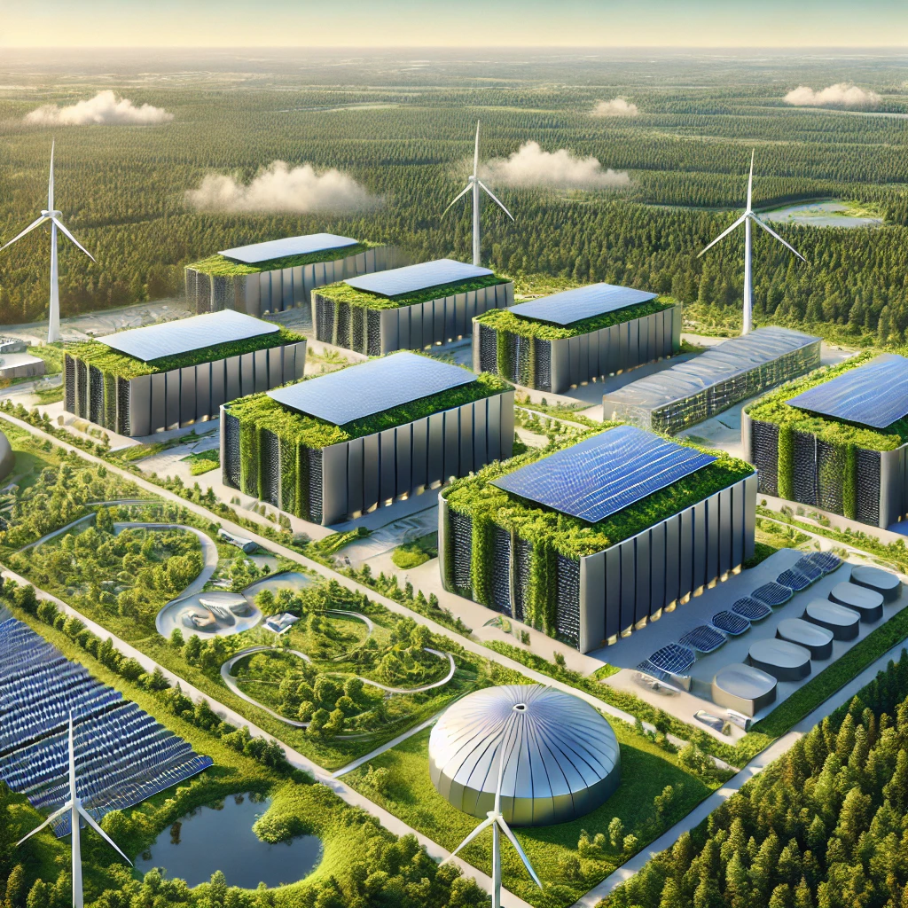
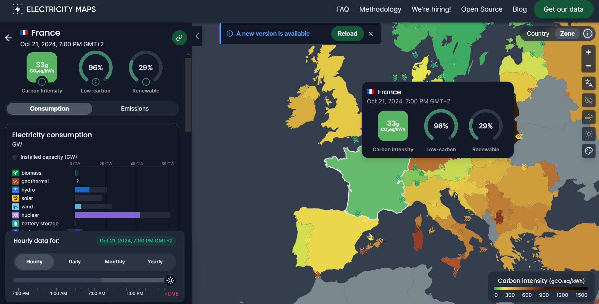
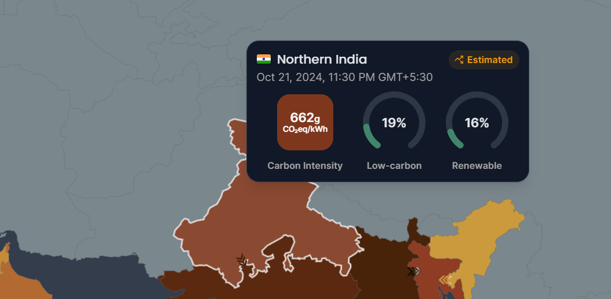
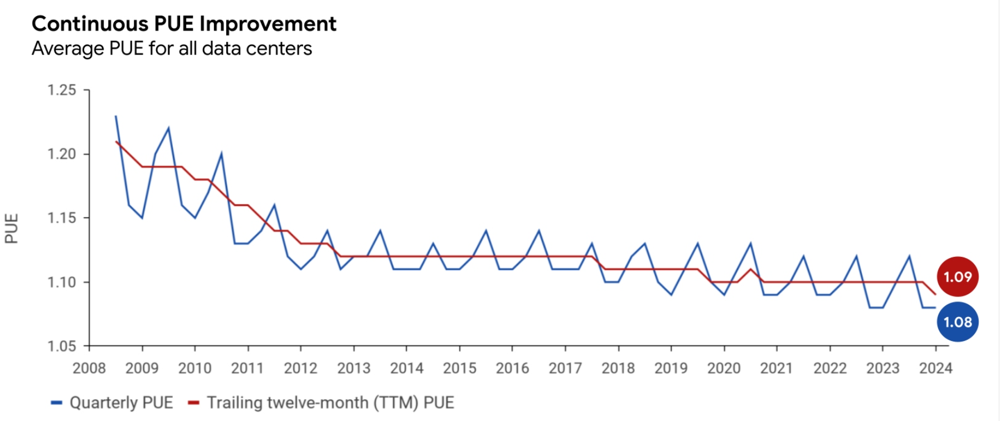
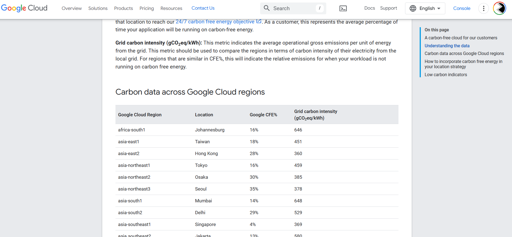
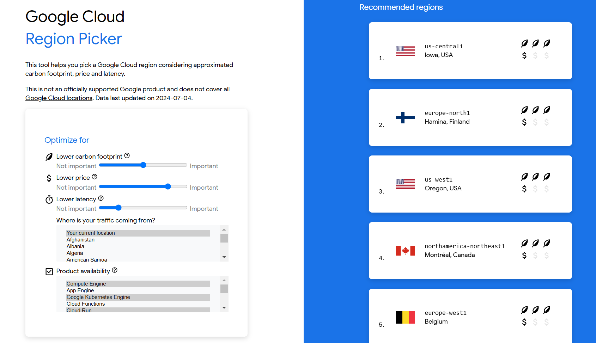
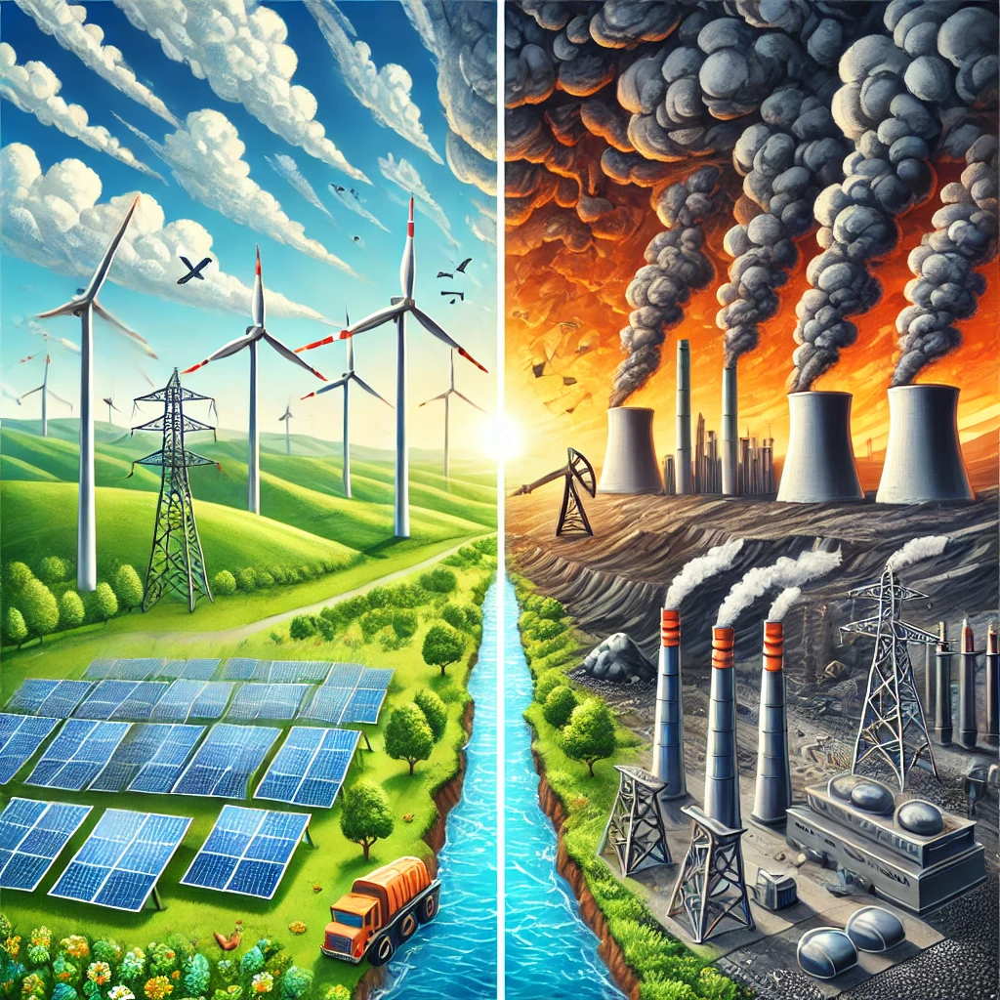
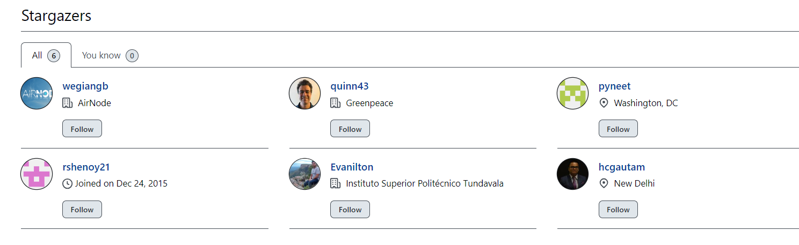

## Computing with Conscience: Evolving from Carbon Aware to Grid Aware for Truly Sustainable Computing

In today’s world, technology is evolving faster than ever before, and
while it brings numerous benefits, it also contributes significantly to
environmental problems. We might not realize it, but every time we use
the cloud, upload files, or even chat with AI like this one, we’re
indirectly consuming energy. The energy powering our technology,
especially in data centers, often comes from non-renewable sources,
adding to carbon emissions. The growing demand for cloud services, AI,
and other data-heavy operations is putting a strain on our planet.

Some estimates suggest these data centers use around 2% of the world’s
energy, and this number is rising as more people use cloud services, AI,
and streaming. By 2030, data centers could be responsible for 8-10% of
the world’s energy use. This surge in energy demand, especially when
fueled by non-renewable sources, leads to increased carbon emissions.

But what if we could be smarter about when and where we use computing
power, and in doing so, reduce the environmental damage? This is where
**Carbon Aware Computing** comes in — a concept that aims to make our
tech habits more eco-friendly. Let’s dive into how it works and why it’s
not always as simple as it usually sounds.

## Introduction: Carbon Aware and Grid Aware Computing

Imagine you have to charge your phone. If you plug it in during the day
when the sun is shining, and your electricity is coming from solar
panels, you’re using renewable energy. But if you charge it at night
when the grid is relying on coal or gas, you’re adding to carbon
emissions. Carbon Aware Computing is like this, but for big tasks like
running AI models, processing data, or streaming videos. The idea is to
run these tasks when the grid is using cleaner energy, such as solar or
wind power, instead of fossil fuels.

In simple terms, it’s about being mindful of the energy source used to
power our tech. By choosing the right time to run computing tasks,
companies and developers can reduce the carbon emissions caused by their
work.

A prime example is the use of Generative AI (GenAI). When developers run
algorithms for inference or training in the cloud, they often do so from
the comfort of their own rooms or offices, unaware of the emissions
produced in the process. But every time we run these heavy tasks,
massive data centers are working behind the scenes, consuming energy
that may come from fossil fuels. Since this energy usage is largely
invisible to us, it’s easy to lose track of our carbon footprint. Even
though we don’t physically see it, the environmental impact is real.
Carbon Aware Computing aims to make the invisible, visible by showing us
the benefits of running the computations to minimize are carbon
footprint.

However, the idea of **Carbon Aware Computing** — running tasks when and
where renewable energy is available — is not always the solution it
seems to be. We need to be mindful of common pitfalls in the process and
avoid being greenwashed.

Simply shifting compute jobs to “green” windows doesn’t automatically
reduce emissions; it may just relocate or even increase them. When too
many users time-shift their jobs to run when renewables are abundant,
they may unintentionally overload the grid, forcing energy providers to
tap into fossil fuels for backup.

Even **location-shifting**, where tasks are sent to areas with greener
energy grids, carries risks. If enough demand is concentrated in a place
like Lisbon, where renewable energy makes up a large percentage of the
grid, it could force the city to compensate by using fossil fuels to
meet the extra demand. This complexity underscores that being “carbon
aware” isn’t enough if it doesn’t account for the grid’s overall
stability and demand.

This intangibility of cloud computing’s environmental consequences
highlights the urgent need for understanding and evolving toward
something called **Grid Aware Computing** — a relatively recent idea and
a more holistic approach that not only considers carbon intensity but
also the stability and demand patterns of the electricity grids. It aims
at addressing the pitfalls of the current approach towards Carbon Aware
Computing.

Imagine the millions of developers across the globe leveraging cloud
resources—if each took just a few extra steps to carefully understand
and choose where and when to run their algorithms, the combined benefits
to the environment could be monumental. By optimizing their computing
choices and focusing on both carbon intensity and grid demand,
developers can contribute to a more sustainable future, avoiding the
pitfalls of mere carbon awareness and embracing a more responsible,
grid-conscious approach.

Let’s dive into these concepts.

## Motivation for this blog

I recently took a short course on [deeplearning.ai](deeplearning.ai)
called [Carbon Aware Computing for GenAI
developers](https://www.deeplearning.ai/short-courses/carbon-aware-computing-for-genai-developers/).
The course is taught by Nikita Namjoshi, a developer advocate at Google
Cloud. Although the course title has “GenAI” in it, I found that the
learnings from this course apply more generally to any cloud development
context.

While taking this course, I also came across a [detailed blog
post](https://hackernoon.com/carbon-aware-computing-next-green-breakthrough-or-new-greenwashing)
by Hackernoon that helped me truly appreciate the pitfalls of the
current approach to Carbon Aware Computing and introduced me to the
concept of Grid Aware Computing.

These two sources motivated this blog post in which I aim to provide a
holistic view of Carbon Aware Computing.

This blog post is meant to be high level overview of the most important
concepts (and current pitfalls) in carbon and grid aware computing. The
idea behind biteSizedAQ projects as always is to make technical and/or
non-technical content alike accessible for a broad range of audiences.

For more specific in depth Python code examples, I highly encourage you
to take the course offered by deeplearning.ai. It has detailed Jupyter
notebooks for practicing these concepts using Google Cloud. At the same
time, I also encourage you to dive into the Hackernoon article which
also provide more resources on Grid Aware computing.

## Current State of Carbon Aware Computing and what it Entails

I want start this section by focusing on the title. It says “Current
State …”, which means that this section will focus on the current
beliefs and practices around Carbon Aware computing. The important thing
to note is that the beliefs presented in this section may or may not
actually end up in curtailing emissions. This is because:

> ***Being “Carbon Aware” isn’t enough, we need to start becoming “Grid
> Aware”***

**Having said that, we’ll first explore the “Carbon Aware” part first
and then in the next section we’ll explore the “Grid Aware” part, which
will help us address the loopholes of the ideology in which one is just
“Carbon Aware”.**

Carbon Aware Computing involves clever scheduling. Let’s say you want to
process a huge dataset or run an AI model. Instead of doing it right
away, you could schedule the task to run when the grid is powered by
renewable energy — like during the day when solar power is strong or at
night in windy regions where wind power is abundant.

In the simplest terms, it’s about being mindful of when you run your
compute. This way, you can minimize the use of “dirty” energy like coal
or gas and maximize the use of clean energy. Some companies use advanced
tools to predict when renewable energy will be available and shift their
computing tasks accordingly.

### Embodied Carbon and Emissions from Compute

Even before we start coding, there is carbon emissions associated with
all the hardware we use to perform computation, e.g. CPUs, GPUs, TPUs,
servers, etc. Creating all this infrastructure requires extracting raw
materials, manufacturing, shipping, disposal, recycling and there are
environmental costs associated with each step. This is often known as
Embodied Carbon. These emissions are usually most difficult to estimate
in a machine learning or other computation lifecycle as they are
connected with complicated supply chains.

On the other hand, emissions from running and training machine learning
models, fine tuning them, providing inferences on the user end, or more
generally, emissions from pure computing are relatively easier to
estimate. All of this requires energy and each step has a carbon
footprint.

How conscientiously we run these models can have wide range of
implications for the corresponding carbon footprint we generate. For
e.g. a paper by Strubell et al at University of Amherst found that
training a transformer model with neural architecture search was
comparable to carbon emissions of 5 cars that were run over their useful
lifetimes. But, another paper from a team of Google researchers showed
that running the same transformer model was closer to 0.00004 car
emissions. That’s a big discrepancy and it further highlights how
optimizing training strategy, hardware and data center efficiency and
location can have a massive impact on the carbon emissions.

In this blog post, the focus will largely be on emissions from compute,
not embodied carbon. More specifically, we will focus on emissions from
training models. This area has seen the most research and is relatively
more straightforward to calculate compared to emissions from serving
(inference stage) the models to end users.

### Electricity Maps Web app and API

The [Electricity Maps](https://app.electricitymaps.com/map) tool is a
powerful tool that provides real-time data on electricity consumption
and generation, allowing users to visualize and analyze the carbon
intensity of electricity across different regions. This service helps
consumers and businesses make informed decisions about energy usage
based on the sources powering their local grids, such as fossil fuels,
renewables, and nuclear energy.

For example, the grid in Germany is increasingly powered by renewable
energy sources like wind and solar, resulting in lower carbon emissions
compared to a grid reliant on fossil fuels, such as the one in Poland,
which predominantly utilizes coal.

The varying energy mixes of electricity grids worldwide illustrate how
some regions are more carbon-efficient than others; for instance,
Iceland’s grid is almost entirely powered by geothermal and
hydroelectric sources, leading to extremely low carbon intensity.

By understanding the specific energy sources that power different grids,
individuals and organizations can be mindful of scheduling their
**computing** in a way that optimizes their energy consumption to align
with periods of low carbon intensity, and in doing so lowering their
carbon footprint.

On the interactive map in the web app, for the countries in which the
data is available, we can see that they have either one or more regional
grids and once you click on a particular regional grid, you get a lot of
useful information about that grid. For e.g. France has a single grid
and if you click on it, in the left panel you get various real time
stats, of which some of the most important ones include: carbon
intensity, breakdown of electricity consumption by source (e.g. biomass,
geothermal, hydro, solar, wind, etc). At the time of writing this blog
post, I can see that most of the electricity generated in france at the
time of writing this post was being generated from nuclear energy or
renewables with a very low fossil fuel mix.

More platforms like Electricity Maps are available to help you make
sustainable choices. For e.g. [WattTime](https://watttime.org/) provides
real-time data on grid emissions and helps users time their energy
consumption when it’s powered by cleaner energy sources.
[Ember](https://ember-energy.org/data/electricity-data-explorer/) is a
global energy think tank that provides open data on electricity
generation and its environmental impact and there are many more. I
recommend starting out with Electricity Maps API and then exploring
others. The deeplearning.ai course which motivated this blog uses
Electricity Maps API in its examples and Jupyter Notebooks so it will be
easier to pick up and learn.

### **Understanding Carbon Intensity and How It’s Measured**

Now that we know how to use tools like **Electricity Maps** to check the
mix of renewable and non-renewable energy sources powering a grid, the
next step is to understand **carbon intensity** — a key metric for
calculating the emissions associated with your computing tasks. This
metric is also reported in the Electricity Maps tool. For e.g. in the
map below, the Carbon Intensity for Northern India reported can be seen
once you hover over the North India region.

Let’s break it down.

**Carbon Intensity** is essentially a measure of how much carbon dioxide
(CO₂) or other greenhouse gases (like methane) are released per unit of
electricity generated. For example, hypothetically if the carbon
intensity of the grid in North Brazil is reported as **82 gCO₂eq/kWh**,
this means that for every kilowatt-hour (kWh) of electricity consumed,
82 grams of CO₂-equivalent gases are emitted ***at a particular time on
a given day. We say this, because the energy mix is variable across the
day.***

#### **What Does gCO₂eq/kWh Really Mean?**

The unit **gCO₂eq/kWh** stands for **grams of CO₂ equivalent per
kilowatt-hour**. This metric helps us compare emissions from different
gases based on their **global warming potential** (GWP). For example,
methane (CH₄) is a much more potent greenhouse gas than CO₂. Over a
20-year period, **1 ton of methane traps as much heat as 84 tons of
CO₂**. So when we talk about CO₂-equivalents (CO₂eq), we are normalizing
the impact of other gases (like methane) to their CO₂ equivalent to make
the numbers easier to understand.

This is why **“carbon”** is often used as a blanket term for all
greenhouse gases, even though CO₂ is just one of them.

Let’s look at an analogy: Imagine you’re comparing the weight of
different fruits by converting their mass into apples. Even if you have
oranges or bananas, you convert everything into “apple equivalents” so
it’s easier to compare. Similarly, converting methane and other gases
into CO₂-equivalents helps us understand their impact in a common unit.

#### **Understanding Kilowatt-Hours (kWh)**

Now, let’s talk about kilowatt-hours (kWh). Despite the “hour” part of
the unit, kilowatt-hours actually measure **energy**, not time. For
example, if you run a 1,000-watt (1-kilowatt) device for 1 hour, it
consumes 1 kWh of energy. This is how we calculate the energy used by
appliances, servers, or even a machine learning task.

### **Working Through an Example: Carbon Emissions for Machine Learning**

Let’s say you’re training a machine learning (ML) model, and you want to
figure out how much carbon this task releases into the atmosphere. To
calculate this, you need two key pieces of information:

1.  The **carbon intensity** of the grid where your task is running.

2.  The **energy consumption** of your ML training job.

Let’s break this down with an example.

#### **Step 1: Carbon Intensity of the Grid**

First, you check the carbon intensity of the electricity grid. Let’s say
you’re running your ML training task on a grid in North Brazil, where
the carbon intensity is reported as **82 gCO₂eq/kWh**. This means that
for every kilowatt-hour of electricity consumed, 82 grams of
CO₂-equivalent gases are emitted. Keep in mind, this number fluctuates
throughout the day based on factors like energy demand, weather
conditions, and availability of renewables.

#### **Step 2: Energy Consumption of Your Training Task**

Next, you need to calculate how much energy your ML training job
consumes. You can measure the energy consumption in kilowatt-hours (kWh)
using the following formula:

Energy Consumption (kWh) = Number of Processors × Average Power per
Processor × PUE

Here’s what this means:

- **Number of processors**: This could be CPUs, but for ML tasks, you’re
  likely using GPUs or TPUs, which are more powerful but also more
  energy-intensive.

- **Average power per processor**: The amount of power each processor
  uses, typically measured in kilowatts.

- **PUE (Power Usage Effectiveness)**: This measures how efficiently a
  data center uses energy. The PUE accounts for not just the power used
  by the processors but also the energy needed to cool the servers and
  run the data center’s infrastructure.

#### **What Is PUE?**

To put **PUE** into perspective, let’s use a simple analogy: Imagine
you’re watering a garden with a hose. The water that reaches the plants
is like the energy used by your processors. However, some of the water
leaks out of the hose or evaporates before reaching the plants — this is
the overhead energy used by the data center to keep everything running
smoothly. PUE accounts for this extra “leakage” in energy usage.

If the PUE of your data center is 1.5, it means that for every 100
kilowatt-hours of energy your processors use, 50 kilowatt-hours are used
for cooling, lighting, and other overhead. So, the total energy
consumption would be 150 kWh.

For e.g. Google regularly keeps track of its PUE across its data center
fleet with the objective of bringing the PUE as close to 1 as possible.
Here is [a visual](https://www.google.com/about/datacenters/efficiency/)
that tracks the Google Data Center PUE trend from 2008 to 2024.

You can read more about how Google manages and tracks its PUE
[here](https://www.google.com/about/datacenters/efficiency/). Similar to
this, if interested, you can dive into PUE management strategies for
other big tech companies and data center fleet owners to compare and
contrast it with the above.

### **Putting It All Together**

Now let’s say your ML training task takes 1 hour and uses **5 GPUs**,
each consuming an average of **0.5 kW** of power per hour. The data
center where you’re running the task has a PUE of **1.5**. Using the
formula, the total energy consumption for this task would be:

5 × 0.5kW/hr × 1 hour \* 1.5 = 3.75kWh

Next, you multiply this by the carbon intensity of the grid (82
gCO₂eq/kWh):

3.75kWh × 82gCO₂eq/kWh = 307.5gCO₂eq

So, the total carbon emissions for running this training task would be
**307.5 grams of CO₂-equivalent gases**.

### **Why Does Carbon Intensity Change?**

It’s important to note that carbon intensity isn’t static — it changes
throughout the day based on a variety of factors:

- **Energy demand**: When demand is low, grids often rely more on
  renewable energy sources. When demand is high, fossil fuel plants
  might kick in.

- **Weather conditions**: On sunny or windy days, renewable energy like
  solar and wind power is more readily available.

- **Grid management**: Utilities sometimes use “cleaner” energy sources
  during off-peak hours, or when supply exceeds demand.

The grid’s energy mix fluctuates, meaning the carbon intensity will vary
depending on when you run your task. Being mindful of these factors can
help you minimize your carbon footprint by running tasks when the grid
is greener.

By understanding how **carbon intensity** and **energy consumption**
work together, you can make more eco-friendly choices for your compute
jobs. Tools like **Electricity Maps** and others give you real-time data
so that you can be both **Carbon Aware** and, even better, **Grid
Aware**, ensuring that you’re not just shifting emissions but truly
reducing them.

### **Measuring Carbon Intensity for Large Computation Tasks: The NVIDIA V100 GPU Year**

When dealing with massive computational tasks like training large
language models (LLMs), measuring energy consumption in kilowatt-hours
might not be the most practical or intuitive method. Instead,
researchers have adopted a more convenient and relatable unit of
measurement: the [**NVIDIA
V100**](https://www.nvidia.com/en-in/data-center/v100/) **GPU year**.

But what does this mean? Let’s break it down.

An **NVIDIA V100 GPU year** refers to the amount of computation a single
NVIDIA V100 GPU can complete if it runs non-stop for a full year. This
helps simplify how we talk about massive projects like training AI
models, which require thousands of GPUs running in parallel. Instead of
counting individual kilowatt-hours, we can simply say how many GPU years
a task takes.

For example, training **GPT-3** — the model behind many AI applications
— in 2020 took **405 NVIDIA V100 GPU years**. To put that in simpler
terms: if you had just **one NVIDIA V100 GPU**, it would take you **405
years** to train the model! But, because hundreds of GPUs worked
together, this massive task was completed in months instead of
centuries.

Now, note that even though training these huge models uses a lot of
energy, but the good news is that you are not always training a model in
order to use it. In most cases, you might be using a pre-trained model.
But, even using a pre-trained model has an energy footprint associated
with it.

For e.g. in a paper named, [*Power Hungry Processing: Watts driving the
Cost of AI deployment*](https://arxiv.org/abs/2311.16863)*,* researchers
found that the stable-diffusion-x1-based-1.0 model (an image generation
mode) generated 1594 grams of CO2 per 1000 inferences. In simple words,
for every 1000 prompts you put in, it produces approx 1.5 kg of CO2
emissions. This is equivalent of 4 miles driven by a gasoline powered
car.

So, even if you are an end user, using a model like Stable Diffusion or
others, there is a carbon footprint associated with that. But, even if
you don’t train LLMs you can choose to use LLMs that are energy
efficient using the Hugging Face [LLM’s performance
leaderboard](https://huggingface.co/spaces/optimum/llm-perf-leaderboard)
which reports energy estimates and tokens per kilowatt hours. There’s
also the [ML energy
leaderboard](https://ml.energy/leaderboard/?__theme=light) which
compares various models by average GPU energy consumed by each of these
models.

### Current Strategies for Carbon Aware Machine Learning/Computing

There is a lot you can do to when it comes to being Carbon Aware. For
e.g.

- Use the Electricity Maps API to pick a regional grid where the average
  Carbon Intensity is low and the energy mix is mostly made of hydro,
  nuclear, wind or solar.

- Given that the energy mix that powers a grid, changes over the course
  of the day, you can use the API to run your training tasks at times of
  the day when the energy mix contains the least amount of
  non-renewables in it. This way you can use more real time data instead
  of relying on an average Carbon Intensity number.

- You can choose a cloud provider with a low PUE. For e.g. the average
  Google Data Center PUE is 1.1 and can be even as low as 1.06 in some
  cases. While according to the [Uptime Institute 2021 data center
  survey](https://uptimeinstitute.com/resources/research-and-reports/2021-data-center-industry-survey-results#:~:text=The%20number%20of%20outages%20has,density%20levels%20are%20creeping%20up.)
  the Global Average data center PUE is 1.57.

- Another strategy is to use more efficient hardware. According to the
  authors of the paper: [*The Carbon Footprint of Machine Learning
  Training Will Plateau, Then
  Shrink,*](https://ieeexplore.ieee.org/document/9810097) using
  processors optimized for ML training like TPUs or specialized GPUs
  like Nvidia V100s or A100 compared to general purpose processors can
  improve performance per watt by factors of 2 to 5. This benefit adds
  up as you run and train large models.

- Although we see these large models nowadays springing up, which are
  very useful. But, we should be mindful and ask the question: will a
  smaller model also work? In many cases, we might find that a smaller
  model might be just fine for our purposes and in doing so we save a
  bunch of carbon emissions.

Let’s look at some of these strategies in greater detail:

#### Setting Up a Practice Training Ground

The [**Carbon Aware Computing for GenAI
Developers**](https://learn.deeplearning.ai/courses/carbon-aware-computing-for-genai-developers/lesson/1/introduction)
short course by deeplearning.ai offers a hands-on way to practice the
skills introduced in this blog post. You’ll need to create an account in
order to freely audit the course. Through Jupyter notebooks, the course
provides practical exercises that complement the theoretical concepts
we’ve discussed. Since the course is free to audit, I highly recommend
enrolling and working through the notebooks to reinforce your learning.
Below, I’ll share a few tips to help you get a clearer understanding of
the process and key concepts involved.

The practice begins with setting up the **Electricity Maps API** and
obtaining your API token, which the Jupyter notebooks have
pre-configured for you to start experimenting right away. While the
course uses Google Vertex AI to demonstrate these concepts, the lessons
are broadly applicable to other platforms you might prefer to use.

If you’re new to **Google Cloud**, skip to the final section of the
course for a step-by-step guide to setting up your Google Cloud account.
Even if you don’t plan on using Google Cloud, you can still follow the
lessons and apply the concepts to your preferred cloud service provider.

#### Average Carbon Intensity vs. Real-Time Carbon Intensity

When it comes to carbon-aware computing, there are varying levels of
complexity you can engage with. Google Cloud regions provide an
**average carbon intensity** for each region, which you can find on
their [website
here](https://cloud.google.com/sustainability/region-carbon). Each
region corresponds to a physical location and lists whether it is
considered “low-carbon” based on this average.

While useful, this is just **average** data. To get **real-time carbon
intensity**, you can use the **Electricity Maps API**. For instance, if
you choose the Google Cloud region `us-central1` (Iowa), you can look up
Iowa’s latitude and longitude using Google Maps. Then, by using the
**real-time carbon intensity endpoint** from Electricity Maps, you can
retrieve current data for that region.

Once you have this setup, you can go a step further by iterating over
all Google Cloud regions to find the region with the **lowest real-time
carbon intensity** at the time you want to run your computation.

In addition to carbon intensity, you can also query the **energy mix
endpoint**, which will provide you with the breakdown of the energy
sources powering that Google Cloud region’s grid, such as solar, wind,
nuclear, coal, etc.

For long-running tasks, you can also retrieve **historical data** using
another endpoint to analyze how the energy mix or carbon intensity
changes over time while your task runs.

#### Understanding APIs and Endpoints

If you’re unfamiliar with APIs, here’s a simple explanation: Think of an
API as a way for your computer to request information from another
computer. You send a request through the **Application Programming
Interface** (API), and if everything is in order (credentials, request
format, etc.), you receive the information you need. The term
**“endpoints”** simply refers to the specific types of information you
are requesting from the API.

#### Calculating Your Google Cloud Footprint

While we’ve focused primarily on carbon emissions from compute, this is
only one part of what’s recommended to track under the [**Greenhouse Gas
Corporate Standard**](https://ghgprotocol.org/corporate-standard). The
standard breaks emissions into three categories, or “scopes”:

- **Scope 1**: Direct emissions from sources controlled by your
  organization, such as company vehicles or on-site fuel combustion.

- **Scope 2**: Indirect emissions from the purchase of electricity,
  heating, and cooling—this is what we’ve primarily discussed in this
  blog post.

- **Scope 3**: All other indirect emissions not controlled by your
  organization, such as those from suppliers, waste disposal, and
  business travel (e.g., emissions from a flight from London to New
  York).

To track your **Google Cloud carbon footprint**, you can export the
relevant data directly from the Google Cloud Console. Simply search for
“Carbon Footprint” in the console, scroll down, and export the data to
**BigQuery**. This export will include emissions data for all three
scopes—Scope 1, Scope 2, and Scope 3.

Once the data is in BigQuery, you can analyze it using a Jupyter
notebook. By querying the data with SQL, you’ll be able to assess your
carbon footprint on a project-by-project basis, gaining insights across
all three scopes. This gives you a comprehensive view of your
organization’s total cloud emissions.

Finally, you can use the [Google Cloud Region picker
tool](https://googlecloudplatform.github.io/region-picker/) which let’s
you optimize for carbon footprint, price, latency, traffic source, etc.
You can then choose the recommended regions accordingly.

## The Hidden Problem: Carbon Aware Isn’t Enough

Now, let’s get into the real twist. The idea of Carbon Aware Computing —
shifting tasks to times/places when/where renewable energy is available
— seems like a no-brainer, right? However, if taken only at its face
value, it has a major flaw: just because you’re timing tasks for when
renewable energy is abundant doesn’t mean you’re reducing emissions.

Here’s an analogy: Imagine a train where some carriages are “green” and
some are “dirty.” If everyone rushes to sit in the green carriages, it
doesn’t change the fact that the dirty carriages are still attached to
the train, contributing to pollution. In the same way, shifting your
computing tasks to a “green” window might just mean that someone else
uses fossil-fuel-based energy in another window. Worse, if too many
people shift to the same time, it could overwhelm the grid, forcing it
to rely on dirty energy to stabilize.

## Introducing Grid Aware Computing

In the introduction I briefly introduced the idea of Grid Aware
Computing and in the above sections we learnt about the current state
and practices surrounding Carbon Aware Computing.

Now we’ll put these two together and focus on how Grid Aware computing
and practices it advocates for is a more holistic and truly sustainable
way of thinking about the carbon emissions resulting from compute.

But, before we do that we need to understand how an Electricity Grid
functions. Understanding this will help us become more holistic thinkers
when it comes to managing one’s carbon footprint.

Being Grid Aware is crucial for bring Carbon Aware, as you’ll see in the
next few sections.

### **How Does an Electricity Grid Function in the Context of Grid Aware/Carbon Aware Computing?**

To understand how **Grid Aware** or **Carbon Aware Computing** fits into
the broader picture, it’s crucial to first grasp how an **electricity
grid** works. An electricity grid is a vast, interconnected system that
delivers power from various generation sources, like power plants, to
consumers, such as homes, businesses, and data centers. But in the
context of computing, not all electricity is created equally — and
that’s where **Grid Aware Computing** comes into play.

#### **How an Electricity Grid Works: A Balancing Act**

Think of the electricity grid as a tightrope walker, constantly
balancing **supply** and **demand**. Supply comes from power plants that
generate electricity, while demand is the amount of electricity
consumers are using. This balancing act happens in real-time because,
unlike water, electricity can’t be easily stored.

When more power is needed, like on a hot summer day when everyone turns
on their air conditioning, the grid has to increase supply, often by
using “quick-to-respond” power sources like **natural gas**. Conversely,
during low demand periods, like late at night, less power is required,
so supply must decrease. If the grid is unbalanced — either too much
supply or too much demand — it can lead to **brownouts** (reduced
voltage) or even **blackouts** (complete power loss).

#### **Supply Sources: Renewable vs. Fossil Fuel Energy**

Electricity on the grid can come from:

- **Fossil fuels** like coal, oil, and gas, which release carbon
  emissions.

- **Renewables** like wind, solar, or hydropower, which generate
  cleaner, greener energy but are often intermittent (solar energy
  depends on sunshine, wind power depends on wind).

Because renewable energy is not always available (the sun doesn’t shine
at night, and wind patterns vary), the grid has to make quick
adjustments by switching to fossil fuels when demand rises unexpectedly.
This is where carbon intensity — the amount of CO₂ released per unit of
electricity — comes into play.

#### **How Carbon and Grid Aware Computing Interacts with the Grid**

Now, enter **Grid Aware** and **Carbon Aware Computing**. These
approaches aim to time and locate computational tasks so that they’re
powered by cleaner, renewable energy. For example, you might want to run
a large machine learning task when the grid is using wind power at
night. However, it’s not always as straightforward as it seems.

A key issue is **timing**. Let’s say you time your computation to run
when there’s a high amount of renewable energy on the grid, like during
the day when solar power is abundant. While this sounds good in theory,
there’s a catch. As the HackerNoon article explains, the grid may
already have predicted this demand and supplied enough renewable energy.
By adding extra, unplanned demand at that time, you could force the grid
to tap into **fossil fuels** to keep up, unintentionally increasing
emissions​.

It’s like joining a crowded bus that’s almost full. While you’re happy
to find a seat, your weight pushes the bus over capacity, requiring an
extra bus to be added — one that may run on less efficient fuel.

#### **Peaks and Troughs: Why Timing and Location Matter**

The grid’s load fluctuates throughout the day:

- **Peak demand hours**: Usually during the day, when businesses,
  offices, and homes use the most power. This is when the grid is likely
  to use a mix of renewable and fossil fuels.

- **Off-peak hours**: Typically at night, when demand is lower, and it’s
  easier for the grid to rely on renewables like wind.

**Grid Aware Computing** encourages running computational tasks during
**off-peak hours**, when demand is lower and renewable energy is more
abundant. This reduces the likelihood of needing extra fossil fuel-based
energy, ensuring a more environmentally friendly compute job.

#### **What’s the Catch with Carbon Aware Computing?**

While **Carbon Aware Computing** aims to reduce emissions by running
tasks when clean energy is available, the HackerNoon article warns that
it’s not always as effective as it sounds. In some cases, it can even
backfire:

- **Time-shifting tasks**: Running compute tasks during a window of
  renewable energy sounds great, but if too many users shift their tasks
  to the same window, the grid may become overwhelmed, forcing the use
  of fossil fuels​.

- **Location-shifting**: Sending tasks to regions with greener grids
  (e.g., Lisbon with its 80% renewable energy) could stress that local
  grid. If too much demand is added, the grid may need to tap into
  fossil fuels to meet the extra load, leading to **displacement** of
  emissions, where the clean energy benefit is lost because other users
  elsewhere may get their power from dirtier sources​.

This is why **Grid Aware Computing** is crucial — it takes into account
not only the carbon intensity but also the stability of the grid,
ensuring that compute tasks are scheduled when the grid can handle them
without requiring backup fossil fuel power.

#### **Making Carbon Aware Computing Effective Through Grid Awareness**

Is Carbon Aware Computing flawed? Not inherently. The core idea is
valuable, but current approaches lack necessary caution. Often, time and
location-shifting patterns are assumed to be greener by default, when in
reality, they’re beneficial in limited circumstances, ineffective in
many, and potentially harmful in others. Without verification or risk
analysis, such assumptions risk greenwashing, especially when companies
promote time/location-shifting as a blanket “green” solution.

The real issue isn’t just optimizing energy sources but addressing the
**rising demand for energy** in computing. While we’ve become more
efficient per task, overall electricity use has skyrocketed due to the
sheer volume of computational tasks. Carbon Aware Computing’s focus on
reducing fossil fuel reliance is promising, yet these gains could easily
be offset if demand continues to grow unchecked.

We need to evolve Carbon Aware Computing into an approach that addresses
both energy optimization **and** demand management. Given the severity
of climate change, the tech sector, with its vast resources, has the
opportunity and responsibility to implement sustainable, impactful
solutions.

### **Proposals for Responsible Carbon-Aware Computing**

Below I summarize the proposals advocated in the Hackernoon Article. I
have also included hypothetical examples under each proposal for better
understanding:

#### **1. Prioritize Demand Intensity Over Carbon Intensity**

**Concept**: Shifting compute tasks to low-demand times, rather than
just low carbon-intensity times, helps stabilize the grid and maximizes
the use of renewable energy that might otherwise go to waste.

**Hypothetical Example**: Imagine a large tech company running a big
data processing job. If they schedule this task at 3 AM, a time when
energy demand is low, they’re more likely to use excess wind energy
generated at night. By doing this, they avoid peak hours when fossil
fuel plants may be needed to meet high demand. Conversely, if they
schedule this task at noon, when everyone’s using electricity, they risk
forcing the grid to rely on coal or gas to handle the extra load,
potentially increasing emissions instead of reducing them.

Unlike carbon intensity-based scheduling, which can sometimes increase
emissions by overloading the grid, a **demand-first approach** minimizes
the need for fossil fuel backup, making emission reductions more
reliable. While this approach is safer, it still requires risk
management to prevent issues if widely adopted.

#### 2. Run Compute on Truly Additive Renewable Energy

**Concept**: To effectively reduce carbon emissions, computing
operations should rely on truly additive renewable energy sources. This
means investing in new renewable energy projects specifically designed
to power computing facilities rather than simply purchasing Renewable
Energy Certificates (RECs) or claiming credits from existing renewable
energy sources.

**Hypothetical Example:** Power Purchase Agreements (PPAs) are
contractual agreements between energy buyers and sellers. When a tech
company enters into a PPA, it agrees to purchase a specified amount of
energy from a renewable source, such as a solar or wind farm, at a
predetermined price over a certain period. This financial commitment
helps to secure funding for the construction of new renewable energy
projects.

The key here is **emissionality**—the principle that emphasizes the need
for new renewable capacity to displace fossil fuels. For example, if a
data center purchases power from a new solar farm specifically built to
meet its energy needs, it adds new renewable energy to the grid. In
contrast, if a company simply buys RECs from an existing wind farm, it
does not increase renewable capacity; it only shifts existing green
energy credits around without contributing to overall emissions
reductions.

This distinction is critical because it ensures that the energy used by
data centers genuinely contributes to a reduction in fossil fuel
reliance. By directly financing new renewable projects through PPAs,
companies can play a pivotal role in promoting the growth of renewable
energy infrastructure and achieving meaningful carbon reductions.

#### **3. Promote Distributed Compute and Distributed Renewable Energy**

**Concept**: By linking distributed computing (such as small, local data
centers) to local renewable sources, compute tasks can operate off the
main grid, reducing dependency on centralized, high-emission energy
infrastructure. This approach makes efficient use of smaller, local
renewable projects and contributes to grid stability.

**Hypothetical Example**: Imagine a tech company’s small data center
located next to a solar farm in a sunny town. During the day, the data
center’s servers are powered directly by the solar farm, meaning they
don’t need to draw electricity from the grid. In colder regions, waste
heat from the servers could even be used to heat nearby buildings,
reducing overall energy demand. This contrasts with a larger,
centralized data center that draws power from a distant grid,
potentially straining the system and depending more heavily on fossil
fuel backups.

Distributed compute models can reduce the need for centralized power
plants, lower emissions, and improve grid resilience. With strategic
safeguards, this approach can shift data centers away from traditional,
centralized models and toward greener, locally powered operations.

#### 4. Shape Demand to Stay Within Resource Boundaries

**Concept**: While enhancing energy efficiency is vital, the tech
industry must also proactively manage its electricity demand. If left
unchecked, rising electricity needs driven by growing computing demands
can quickly outpace the benefits gained from carbon-aware measures,
resulting in unsustainable emission levels.

**Hypothetical Example:** It’s essential to clarify that shaping demand
doesn’t equate to halting growth; instead, it involves making thoughtful
decisions about how and when to utilize computing resources. For
instance, an AI company planning to launch a new, resource-intensive
language model can adopt strategies to manage its energy consumption
effectively.

Imagine this company spreading its data processing tasks across off-peak
hours when energy demand is lower, like during the night. By doing so,
they can reduce the load on the grid during peak hours when fossil fuel
plants are more likely to be activated. Additionally, the company can
identify and limit non-essential tasks that can be deferred or scheduled
for times when renewable energy is plentiful.

This demand-shaping approach allows organizations to grow sustainably
while minimizing their carbon footprint. By proactively managing when
and how computing tasks are performed, the tech industry can prevent
spikes in energy demand that could overwhelm the grid and increase
reliance on fossil fuels. Collaborating with policymakers, energy
providers, and other stakeholders will be crucial to implementing these
demand reduction strategies effectively.

### Practical Strategies for Developers Awaiting Grid-Aware Solutions

Grid Awareness is a relatively new idea, so if you try to find tools or
APIs that give you the Real time energy demand data for a grid, you’ll
likely won’t find much at this time. Tools specifically for predicting
or assessing grid demand in real-time, especially targeted toward
compute tasks, are still quite limited. Unlike carbon-intensity data,
grid load prediction is more complex and often regulated by utility
companies.

But, having said that, as people and organizations are getting on board
with this idea, more work is now being done in this direction.
Furthermore, there are ways you can be creative in terms of tapping into
that information by getting your hands dirty.

So, it wouldn’t make sense for developers to stop using carbon intensity
tools like Electricity Maps altogether, as these still offer valuable
insights for reducing emissions. Instead, there are practical strategies
developers can adopt to balance both carbon awareness and grid demand,
even while dedicated grid-aware tools are still catching up.

Here are a few approaches and emerging solutions that may help:

- **Combine Carbon Intensity Data with Local Peak Demand Times**: Many
  grid operators, like California ISO and PJM in the US, publish data on
  peak demand times. By scheduling compute tasks during low-demand times
  in addition to low-carbon times, developers can help avoid overloading
  greener grids when demand is high.

- **Distribute Workloads Across Multiple Grids**: Instead of sending a
  large batch of compute tasks to a single green grid, developers can
  spread workloads across multiple grids that are green at different
  times. This reduces the risk of overloading one grid and helps
  distribute demand more evenly, ensuring a balance between carbon
  awareness and load management.

- **Use Cloud Provider Tools that Optimize for Sustainability**: Cloud
  providers like Google and Microsoft are incorporating sustainability
  features that account for carbon intensity and regional load. Using
  these services can help developers be more mindful of grid impacts
  while staying carbon-aware, as the providers often have data about
  regional grid stress.

- **Experiment with Flexible Scheduling**: Instead of rigidly scheduling
  tasks at a specific green time, developers can introduce flexible time
  windows. For example, if a task can run anytime within an eight-hour
  period, they could use APIs to identify both low-carbon and low-demand
  periods within that window, reducing the chance of hitting a peak
  load.

- **Stay Updated on Emerging Tools and Standards**: Since the grid-aware
  field is developing, staying informed about new standards or APIs can
  help developers adapt quickly. Some organizations, like LF Energy, are
  working toward open-source tools that may integrate grid demand data
  in the future. Companies like WattTime and Electricity Maps, known for
  carbon-intensity APIs, are working on integrating grid load data to
  offer a more holistic view. Their efforts are still in development,
  but these tools could eventually include both carbon and demand
  forecasting to guide more informed compute decisions.

- **Academic and Open Source Projects**: Some academic projects and
  open-source initiatives focus on forecasting grid demand through
  machine learning models. These are often experimental but can provide
  predictive insights, especially when calibrated with historical grid
  data. You can tap into it and also contribute towards it.

> ***Developers - you don’t need to pause your carbon-aware efforts; you
> just need to be a bit more strategic. By balancing carbon intensity
> with local grid insights and flexible timing, you can still make
> environmentally conscious choices without putting undue strain on
> grids.***

## Other Concerns: Making AI less thirsty, the water footprint of AI

The carbon footprint of AI models, particularly large ones like GPT-3,
has attracted significant attention, but their substantial water
footprint remains largely overlooked.

For instance, based on the paper, “[***Making AI Less ”Thirsty”:
Uncovering and Addressing the Secret Water Footprint of AI
Models***](https://arxiv.org/abs/2304.03271)”, training GPT-3 in
advanced U.S. data centers can evaporate 700,000 liters of freshwater, a
fact that has largely been out of the public eye.

According to the paper, by 2027, global AI demand could lead to water
withdrawals of 4.2 to 6.6 billion cubic meters, surpassing the annual
withdrawals of several countries, including Denmark and half of the UK.

This is alarming given the escalating freshwater scarcity due to
population growth and deteriorating water infrastructure. To tackle
these challenges, AI models must acknowledge their water usage and
strive for social responsibility.

This paper proposes a methodology for estimating AI models’ water
footprints and examines their runtime water efficiency across different
contexts. It emphasizes the need to address both water and carbon
footprints to achieve truly sustainable AI.

Although, water footprint is not the focus for this blog post, it can be
expected to be a focus of a future blog post. In the meantime, I
encourage you to go through the paper if you want to learn more about
this crucial issue.

## Final Thoughts: Steer Clear of Greenwashing – A Comprehensive Vision for Carbon and Grid-Aware Computing

As the tech industry continues to grow, embracing carbon-aware computing
is essential for aligning technological advancement with global
sustainability goals. However, the accelerated adoption and marketing of
carbon-aware computing by Big Tech, often without acknowledging its
limitations and potential unintended consequences, can lead to
greenwashing.

While responsible carbon-aware computing can help reduce tech emissions,
it is essential to consider the associated risks, provide evidence of
mitigation steps, and include warning labels in marketing efforts. This
approach goes beyond short-term optimization of when and where to run
computations; it requires integrating renewable energy, proactive demand
management, and distributed computing models.

By prioritizing demand intensity over carbon intensity, organizations
can optimize energy usage while minimizing reliance on fossil fuel
plants. Utilizing truly additive renewable energy through Power Purchase
Agreements (PPAs) allows companies to actively support the development
of new green energy projects, aligning their operations with
sustainability goals.

Shaping demand while maintaining growth is vital for long-term
viability. Companies can make informed decisions about when to run
compute tasks to ensure their energy needs coincide with renewable
energy availability. This balance enables the tech industry to innovate
and expand without compromising the environment.

A collective commitment to grid-aware computing can transform how data
centers, AI, blockchain, and other compute-intensive sectors operate. It
is crucial to communicate the benefits of carbon-aware computing
transparently, highlighting potential pitfalls to avoid undermining
progress.

Moreover, carbon is only part of the sustainability equation; water
usage is another critical issue that requires our attention for holistic
sustainability.

While constraints and trade-offs will arise, an active discussion and
analysis of these factors are vital for achieving true sustainability.
We must critically assess our green efforts to avoid fixing one issue
while exacerbating another.

By adopting these strategies, the tech industry can significantly reduce
emissions, enhance grid stability, and mindfully manage scarce water
resources, paving the way for a genuinely sustainable future.

The time to act is now. Together, we can forge a path that meets our
computing needs while ensuring the planet remains healthy for future
generations.

## Rmd for this blog

Underlying Rmd file can be found in the project’s respective folder and
here is a [quick
link](https://github.com/AarshBatra/biteSizedAQ/blob/main/6.carbon.aware.computing/README.Rmd)
to access it.

## Support This Work: Give It a Star

Thank you for reading! If you found this project helpful or interesting,
please consider starring it on GitHub. Your stars help others discover
and benefit from this fully open and free repository. Click [here to
star the
repository](https://github.com/AarshBatra/biteSizedAQ/stargazers) and
join other folks who follow biteSizedAQ.

## Get in touch

Get in touch about related topics/report any errors. Reach out to me at
<aarshbatra.in@gmail.com>.

## License and Reuse

All content is shared under the Creative Commons Attribution 4.0
International (CC BY 4.0) license. You are welcome to use this material
in your reports or news stories. Just remember to give appropriate
credit and include a link back to the original work. Thank you for
respecting these terms!

For more details, see the LICENSE file.

If you use this in your work, please cite this repository as follows:  
*\[Aarsh Batra, 2024,
biteSizedAQ,<https://github.com/AarshBatra/biteSizedAQ>\]*
