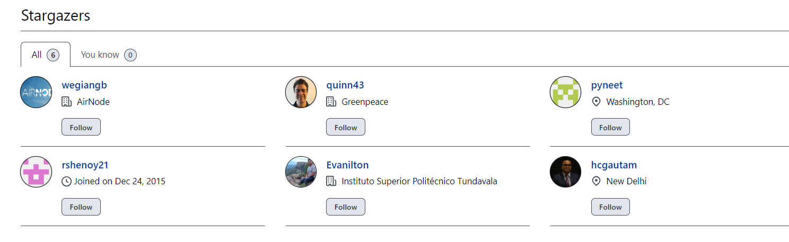

```{r setup, include=FALSE}
knitr::opts_chunk$set(
  collapse = TRUE,
  comment = "#>",
  fig.path = "man/figures/README-",
  out.width = "100%"
)
```

# biteSizedVisual Series: Tackling Air Pollution One Plot at a Time!

Welcome to the biteSizedVisual Series: Tackling Air Pollution One Plot
at a Time!

In this series, I’ll break down air quality and pollution data into
easily digestible compelling visualizations. Each post will highlight a
key aspect of air pollution, using simple yet powerful plots to uncover
insights and trends. Whether you're a data enthusiast, policy maker, or
environmental advocate, these bite-sized visuals will help you grasp
important air quality issues without the complexity.

Moreover, you are free to share this on social media, as all content
under biteSizedAQ is provided under Creative Commons Attribution 4.0
International (CC BY 4.0) license. If you do, the only request is to
please link back to the original post.

Let’s dive into the data—one plot at a time!

## biteSizedVisual #1: When the Air Chokes: Can India Break Free from Pollution’s Grip?

<br>

<br>


<br>

<br>

## **Overview of India’s Air Quality Crisis**

India’s air quality paints a worrying picture of environmental and
public health challenges. Using the latest available satellite-derived
PM2.5 data from 2022 for all Indian subdistricts (blocks), the annual
population-weighted average PM2.5 level was found to be 51.3 micrograms
per cubic meter.

This figure, which represents the average exposure of India’s
population, is ***10.3 times the World Health Organization’s (WHO)
guideline of 5 micrograms per cubic meter and 28.3% above India’s
national standard of 40 micrograms per cubic meter***. These numbers
reveal the severe extent of air pollution affecting millions of lives
across the country.

## **Nationwide Air Pollution Levels**

No region in India met the WHO’s guideline for safe air. ***Alarmingly,
100% of the population lived in areas where PM2.5 levels exceeded the
WHO limit, and 65.8% of the population resided in regions where
pollution also surpassed India’s more lenient national standard.***
These statistics highlight the seemingly inescapable nature of air
pollution in the country, with even relatively cleaner areas struggling
to meet global and national safety thresholds.

## Looking at extremes

In North East Delhi’s Shahdara subdistrict, the air quality is the worst
in India, with PM2.5 levels reaching 101.1 µg/m³—far exceeding both WHO
and Indian standards. This densely populated area of 4.7 sq. km is home
to over 300,000 people, averaging over 65,000 residents per sq. km,
intensifying health risks as more people are exposed to the hazardous
air. Unfortunately, Shahdara’s story reflects the reality in many other
regions across the country.

In stark contrast, Nubra, a high-altitude subdistrict in Ladakh,
recorded the cleanest air, with PM2.5 levels averaging 8.4 µg/m³.
Despite its low population density—approximately 40,000 people spread
across 17,000 sq. km (around 2 people per sq. km)—pollution levels here
still stand at 1.7 times the WHO’s safe limit. Even in a remote valley,
air pollution persists wherever humans are present.

## **State-Level Air Quality Variation**

At the state level, Delhi had the highest population-weighted PM2.5
average, at 95.9 micrograms per cubic meter, making it the most polluted
state in the country. On the other hand, the Andaman & Nicobar Islands
offered a stark contrast with a population-weighted average of 18.7
micrograms per cubic meter, showcasing the benefits of geographic
isolation and fewer pollution sources. Even so, these levels are still
3.7 times the WHO guideline.

## **Health Implications and the Urgent Need for Action**

The scale of India’s air pollution crisis cannot be overstated. With
over half the population exposed to levels exceeding even national
standards, the health implications are severe. Prolonged exposure to
high PM2.5 levels is linked to respiratory and cardiovascular diseases,
among other health concerns. Addressing this crisis requires urgent and
coordinated action. Transitioning to cleaner energy sources, enforcing
stricter regulations, and educating the public on mitigation measures
are critical steps toward a healthier future.

India’s air quality challenges are immense, but they are not
insurmountable. By recognizing the scale of the problem and prioritizing
solutions, there is hope for a future where clean air can become a
reality for all and not a select few.

## **Share This Visual!**

here is a link to download the PNG file for the above plot: Link.

Help raise awareness about the severity of air pollution in India by
sharing this visual. By spreading the message, we can collectively push
for urgent actions to address the crisis and create a healthier future
for all. Share this visual with your network to highlight the air
quality challenges faced by millions across the country.

## Resources and Notes

-   The underlying block level data (with all 5969 blocks) used to
    generate the map can be found in biteSizedAQ project number 1 here
    on this link. The data dictionary is present here.

-   The data processing pipeline (with full documentation) that converts
    the raw satellite derived PM2.5 data into the processed data was
    covered under project 1 of biteSizedAQ and can be found here.

-   Raw Satellite Derived PM2.5 Data refers to Annual Average PM2.5
    measured in micrograms per cubic meter and includes sea salt and
    dust.

-   The underlying India block level 2011 population census shapefile
    was downloaded from the SHRUG platform, developed by the Development
    Data Lab. Here is the link to access that. Look under "Open Polygons
    and Spatial Statistics".

## Rmd for this blog

This visualization was produced using R programming language. Code can
be found in the Rmd file. Here is a quick link to access it.

## Support This Work: Give It a Star

Thank you for reading! If you found this project helpful or interesting,
please consider starring it on GitHub. Your stars help others discover
and benefit from this fully open and free repository. Click [here to
star the
repository](https://github.com/AarshBatra/biteSizedAQ/stargazers) and
join other folks who follow biteSizedAQ.



## Get in touch

Get in touch about related topics/report any errors. Reach out to me at
[aarshbatra.in\@gmail.com](mailto:aarshbatra.in@gmail.com){.email}.

## License and Reuse

All content is shared under the Creative Commons Attribution 4.0
International (CC BY 4.0) license. You are welcome to use this material
in your reports or news stories. Just remember to give appropriate
credit and include a link back to the original work. Thank you for
respecting these terms!

For more details, see the LICENSE file.

If you use this in your work, please cite this repository as follows:\
*[Aarsh Batra, 2024,
biteSizedAQ,<https://github.com/AarshBatra/biteSizedAQ>]*
