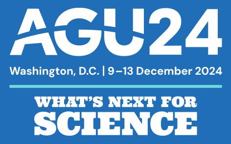
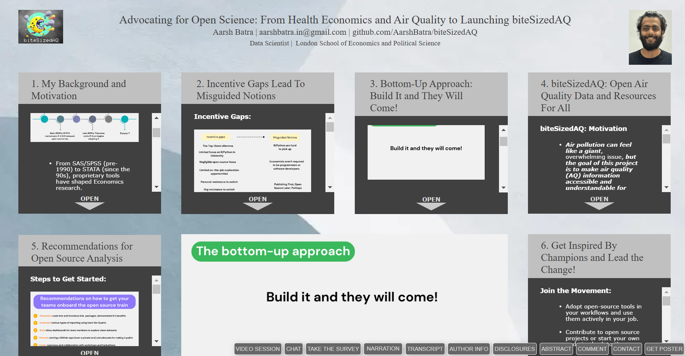
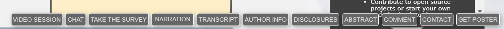
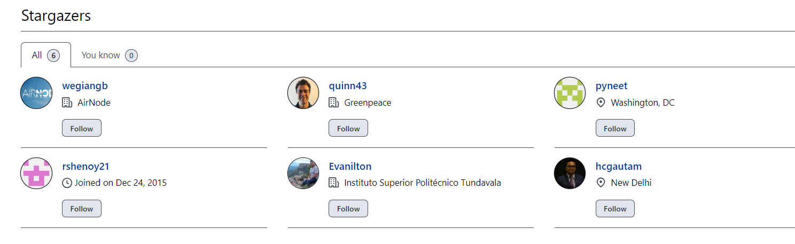

# biteSizedAQ will be presenting a virtual poster at AGU 2024 (Dec 09-13)!

<!-- badges: start -->
<!-- badges: end -->

  
  

## Why present at AGU 2024?

I last presented at AGU in 2022, in person, in Chicago while working on
the Air Quality Life Index project for EPIC UChicago. The experience was
transformative—meeting hundreds of people, exploring incredible
projects, and diving into cutting-edge advancements in Earth and Open
Sciences. Those jam-packed days inspired me deeply.

A key motivation behind creating biteSizedAQ stems from the ideals of
free and open source that I embraced during my time at EPIC and while
attending AGU in 2022. Since then, I’ve had the privilege of presenting
at FOSS4G Asia 2023 and useR! 2024 earlier this year, making AGU 2024
the natural next step. I’m thrilled to be back, even if it’s virtual
this time.

***This December, AGU24 returns to Washington, D.C. with the theme
“What’s Next for Science.” biteSizedAQ attempt to shed light on this
question through it’s tenets.***

## biteSizedAQ DREAM Tenets

To truly understand **biteSizedAQ**, it’s helpful to explore the
principles it’s built upon. I call them the ***DREAM tenets***:

- ***D**emocratize* access to air quality data through open-source tools
  and resources.

- ***R**eimagine* air pollution challenges as manageable, bite-sized
  tasks for impactful action.

- ***E**ducate* diverse audiences by simplifying complex air quality
  topics.

- ***A**mplify* collaboration by sharing projects openly under a CC BY
  4.0 license.

- ***M**aintain* growth by continuously adding new resources and tools
  to the repository

## What format is biteSizedAQ presenting?

This year, I’m participating through an **I-Poster presentation**. While
I’ll miss the in-person experience, the virtual format offers a rich,
interactive way to share my journey in building biteSizedAQ. Whether
you’re new to Open Source and Air Quality or a seasoned expert, there’s
something for everyone in this poster.

Here is the link to the I-Poster presentation, check it out:
<https://agu24.ipostersessions.com/?s=44-C2-EF-00-5E-C4-D9-49-C9-F1-E2-DD-3B-B0-99-E9>

## **How to interact with the I-Poster?**

Once you open the link, you’ll find six numbered text boxes and an
automatic slider. Explore the boxes in order by clicking on each to
expand the content. Visuals in the boxes can also be clicked to enlarge.
Press the **Esc** button to return to the main view.

## When is biteSizedAQ presenting?

**Chat sessions:**

- ***December 10, 2024***: 11:30 am - 12 pm (US/Eastern Time, GMT - 5)

- ***December 12, 2024***: 01:40 pm - 02:10 pm (US/Eastern Time, GMT -
  5)

**Video Sessions:**

- ***December 09, 2024***: 11:30 am - 12 pm (US/Eastern Time, GMT - 5)

- ***December 11, 2024***: 01:40 pm - 02:10 pm (US/Eastern Time, GMT -
  5)

- ***December 13, 2024***: 01:40 pm - 02:10 pm (US/Eastern Time, GMT -
  5)

## How to join biteSizedAQ Iposter presentation video and chat sessions?

- Visit the I-Poster link here:
  <https://agu24.ipostersessions.com/?s=44-C2-EF-00-5E-C4-D9-49-C9-F1-E2-DD-3B-B0-99-E9>

- At the bottom of the poster, look for Video Session and Chat Buttons.
  Click on them 5 minutes before the above scheduled times to avoid last
  minute surprises.

- Video sessions will be presented at this dedicated Google Meet link:
  <https://meet.google.com/saq-widy-ftf>

- Chat sessions will be text based discussions.

- All discussions will take place withing the I-Poster platform.

## **Unable to attend?**

Feel free to get in touch with me at aarshbatra.in@gmail.com, or get in
touch with the Contact button at the bottom of the I poster.

## Other features of the I-Poster

- **Abstract**: Read the core abstract for the poster.

<!-- -->

- **Narration**: A guided walkthrough as you explore.

- **Transcript**: Access the narration text.

- **Comments**: Share your thoughts via the Comments button.

- **Get Poster**: Download the poster directly.

- **Survey**: Don’t forget to take a 30-second survey at the end and
  share your feedback.

## Take the 30 seconds Survey at the end and give me feedback

Please take a 30 seconds survey at the end by clicking the “Take the
Survey” button at the bottom of the poster, once you are done exploring
the poster.

## See you there!

I’m excited to connect, even virtually. Let’s discuss how biteSizedAQ is
democratizing air quality data and making a difference, one bite-sized
task at a time!

## Support biteSizedAQ: Give It a Star :)

Thank you for reading! If you found the poster or other biteSizedAQ
projects helpful or interesting, consider giving the repository a star
on GitHub. Your support helps others discover and benefit from this
fully open and free resource. Click
[here](https://github.com/AarshBatra/biteSizedAQ/tree/main) to star the
repository and join the growing community of biteSizedAQ followers!  
  

## Get in touch

Get in touch about related topics/report any errors. Reach out to me at
<aarshbatra.in@gmail.com>.

## License and Reuse

All content is shared under the Creative Commons Attribution 4.0
International (CC BY 4.0) license. You are welcome to use this material
in your reports or news stories. Just remember to give appropriate
credit and include a link back to the original work. Thank you for
respecting these terms!

For more details, see the LICENSE file.

If you use this in your work, please cite this repository as follows:  
*\[Aarsh Batra, 2024, biteSizedAQ,
<https://github.com/AarshBatra/biteSizedAQ>\]*
