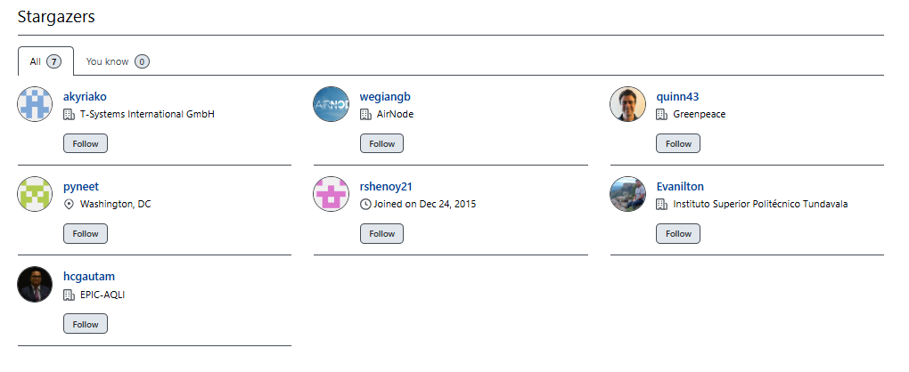

# biteSizedVisuals Series: Tackling Air Pollution One Plot at a Time!

Welcome to the biteSizedVisuals Series: Tackling Air Pollution One Plot
at a Time!

In this series, I’ll break down air quality and pollution data into
easily digestible compelling visualizations. Each post will highlight a
key aspect of air pollution, using simple yet powerful plots to uncover
insights and trends. Whether you’re a data enthusiast, policy maker, or
environmental advocate, these bite-sized visuals will help you grasp
important air quality issues without the complexity.

Moreover, you are free to share this on social media, as all content
under biteSizedAQ is provided under Creative Commons Attribution 4.0
International (CC BY 4.0) license. If you do, the only request is to
please link back to the original post.

Let’s dive into the data—one plot at a time!

## biteSizedVisual \#2: **Tracking 25 Years of PM2.5 pollution Across Indian States and UTs: A Story of Crisis and Contrast**

  
  
Over the past two decades, India’s air pollution levels have been under
intense scrutiny, with PM2.5 concentrations—the fine particulate matter
that poses severe health risks—serving as a critical metric. From the
staggering pollution in Delhi to the “relatively” cleaner skies over
Lakshadweep, the latest satellite derived PM2.5 data from 1998 to 2022
paints a vivid picture of stark contrasts, troubling trends, and
occasional glimpses of hope.

India’s PM2.5 levels not only exceed WHO air quality guidelines but also
reveal persistent regional disparities that demand attention. Let us
delve deeper into the trends, identify key outliers, and explore the
broader implications.

## **A Nation of Contrasts**

India’s diversity is mirrored in its air quality. On one end, Delhi
consistently reports some of the highest PM2.5 levels globally,
averaging **92.68 µg/m³** over the 25 year period—more than 18 times the
WHO’s **annual average PM2.5 guideline** of **5 µg/m³**. At its worst,
in 2016 Delhi’s air touched **116.54 µg/m³**, underscoring its dire
pollution crisis. The Indo-Gangetic Plain, including states like Uttar
Pradesh, Bihar, and Haryana, consistently grapples with alarmingly high
pollution levels, fueled by urban sprawl, vehicular pollution and
seasonal crop residue burning among other things.

In sharp contrast, island territories such as Lakshadweep and the
Andaman and Nicobar Islands have remained bastions of clean air. Over
the 25 year period, Lakshadweep reported an average PM2.5 level of
**18.60 µg/m³**, making it the least polluted region on average over
this period. While still exceeding the WHO guideline by more than two
times, it comfortably adheres to India’s lenient **national annual
average PM2.5 standard** of **40 µg/m³**.

## **A Worsening Crisis in the North**

The Indo-Gangetic Plain dominates the list of the most polluted regions,
with Northern states seeing a consistent rise in PM2.5 levels. Delhi’s
annual PM2.5 increased by **32.87 µg/m³, i.e. a 52% increase** from 1998
to 2022. This upward trajectory is mirrored by Punjab and Haryana, which
recorded similar surges of approximately **30 µg/m³** during the same
period. The pollution here is driven by a mix of vehicular emissions,
industrial activity, and the contentious practice of stubble burning
after harvests.

Adding to the crisis is the variability in air quality, with Delhi
exhibiting the most significant year-to-year fluctuations. Such
volatility further complicates planning and implementation of mitigation
measures, making it harder to achieve long-term improvements.

Momentary dips in pollution levels are often misinterpreted as sustained
improvements. Coupled with the political tendency to emphasize a
narrative of progress, this can distract from the broader, undeniable
health crisis facing Northern India—a crisis that demands urgent action.
Therefore, examining long-term pollution trends is essential, as they
provide a more accurate measure of our progress in addressing air
pollution.

## **“Relatively” Stable Skies in the Northeast and Islands**

Amid the bleak statistics, some regions offer some hope. Northeastern
states like Arunachal Pradesh and Mizoram, along with island
territories, have demonstrated remarkable stability in air quality over
the years. The Andaman and Nicobar Islands, for instance, saw PM2.5
levels rise marginally from **12.53 µg/m³** in 1998 to **18.70 µg/m³**
in 2022, a testament to their relative insulation from industrial and
urban pressures.

This stability highlights the role of geographic and climatic factors in
mitigating pollution. However, it also underscores the need to protect
these regions from encroaching industrialization to maintain their
“relative” clean air status.

## **The Problem of Compliance**

The comparison between WHO’s annual average PM2.5 guideline and India’s
national PM2.5 standard sheds light on the scale of the problem. Not a
single state or union territory met the WHO’s **annual PM2.5 guideline**
of **5 µg/m³** at any point during the 25-year period. Even India’s
**national standard** of **40 µg/m³** proved challenging, with states
like Delhi, Uttar Pradesh, Bihar and Haryana failing to comply in any
year in this 25 year period.

On the other hand, regions like Tamil Nadu, Kerala, Karnataka,
Puducherry, Lakshadweep and the Andaman and Nicobar Islands have
consistently adhered to India’s standard throughout this period.

This disparity underscores the urgent need for targeted interventions in
high-pollution zones while safeguarding of low-pollution regions.

## **Lessons and the Road Ahead**

The story of India’s air quality is one of sharp contrasts: between
polluted cities and pristine islands, between rising levels and stagnant
policy responses. However, the data also offers lessons and
opportunities for change.

1.  **Localized Interventions for Hotspots**: Northern India,
    particularly the Indo-Gangetic Plain, requires immediate and
    aggressive measures to curb emissions from vehicles, industries, and
    agriculture. Policies to manage crop residue burning and promote
    clean energy alternatives are critical.

2.  **Protecting Clean Regions**: The stability in the Northeast and
    island territories demonstrates what is possible. By prioritizing
    sustainable development and protecting natural ecosystems, these
    regions can serve as models for others.

3.  **Reevaluating Standards**: India’s **annual average PM2.5
    standard** of **40 µg/m³** is far more lenient than the WHO’s
    **guideline of 5 µg/m³**. Aligning national standards with global
    benchmarks, while challenging, would push for more meaningful
    progress in both high and low pollution states.

4.  **Monitoring and Awareness of Health Hazards**: Expanding the
    ground-level air quality monitoring network and fostering public
    awareness and engagement are crucial steps in combating pollution.
    Clear and active communication about the associated health hazards
    is especially important to drive meaningful action and interest in
    this issue.

## **A Call to Action**

India stands at a crossroads. With its economic ambitions and
developmental pressures, the challenge of balancing growth with
environmental health is immense. Yet, the contrast between its most
polluted and least polluted regions shows that improvement is possible.

The next decade must be one of decisive action—of enforcing stricter
regulations and standards, adopting innovative technologies, and
fostering collaboration across states. By learning from both its
successes and failures, India can aspire to a cleaner, healthier future.
The air we breathe is not just a marker of environmental health but a
testament to our collective priorities. Let’s ensure it reflects the
progress we truly seek.

## **Share This Visual!**

Here is a link to download the PNG file for the above plot: Link to PNG.

Help raise awareness about the severity of air pollution in India by
sharing this visual. By spreading the message, we can collectively push
for urgent actions to address the crisis and create a healthier future
for all. Share this visual with your network to highlight the air
quality challenges faced by millions across the country.

## Resources and Notes

- The state level data used to generate this plot can be found in
  biteSizedAQ repo under project 9 folder, here on [this
  link.](https://github.com/AarshBatra/biteSizedAQ/blob/main/9.bite.sized.vis.2.ind.st.pol.time.series/ind_st_lev_pol_1998_2020_final.csv)
  The data dictionary is [present
  here](https://github.com/AarshBatra/biteSizedAQ/blob/main/9.bite.sized.vis.2.ind.st.pol.time.series/data.dictionary.txt).
  The block level data used to produce state level results can be found
  [here](https://github.com/AarshBatra/biteSizedAQ/blob/main/7.bite.sized.vis.1.ind_bl_pol_dist/final_data.csv)
  (and it’s data dictionary
  [here](https://github.com/AarshBatra/biteSizedAQ/blob/main/7.bite.sized.vis.1.ind_bl_pol_dist/data.dictionary.txt)).

- The data processing pipeline (with full documentation) that converts
  the raw satellite derived PM2.5 data into the processed data was
  covered under project 1 of biteSizedAQ and can be [found
  here](https://github.com/AarshBatra/biteSizedAQ/tree/main/1.ind.block.pm2.5.sat.data.processing).

- Raw Satellite Derived PM2.5 Data refers to Annual Average PM2.5
  measured in micrograms per cubic meter and includes sea salt and dust.
  This gridded dataset can be [found
  here](https://sites.wustl.edu/acag/datasets/surface-pm2-5/#V6.GL.02).

## Rmd for this blog

This visualization was produced using R programming language. Code can
be found in the corresponding Rmd file. Here is a [quick
link](https://github.com/AarshBatra/biteSizedAQ/blob/main/9.bite.sized.vis.2.ind.st.pol.time.series.Rmd)
to access it. The underlying Rmd for this blog post can be [found
here](https://github.com/AarshBatra/biteSizedAQ/blob/main/9.bite.sized.vis.2.ind.st.pol.time.series/README.Rmd).

## Support This Work: Give It a Star

Thank you for reading! If you found this project helpful or interesting,
please consider starring it on GitHub. Your stars help others discover
and benefit from this fully open and free repository. Click [here to
star the
repository](https://github.com/AarshBatra/biteSizedAQ/stargazers) and
join other folks who follow biteSizedAQ.

## Get in touch

Get in touch about related topics/report any errors. Reach out to me at
<aarshbatra.in@gmail.com>.

## License and Reuse

All content is shared under the Creative Commons Attribution 4.0
International (CC BY 4.0) license. You are welcome to use this material
in your reports or news stories. Just remember to give appropriate
credit and include a link back to the original work. Thank you for
respecting these terms!

For more details, see the LICENSE file.

If you use this in your work, please cite this repository as follows:  
*\[Aarsh Batra, biteSizedAQ,
<https://github.com/AarshBatra/biteSizedAQ>\]*
