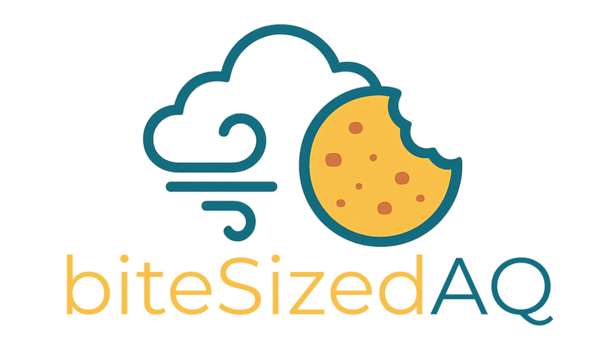
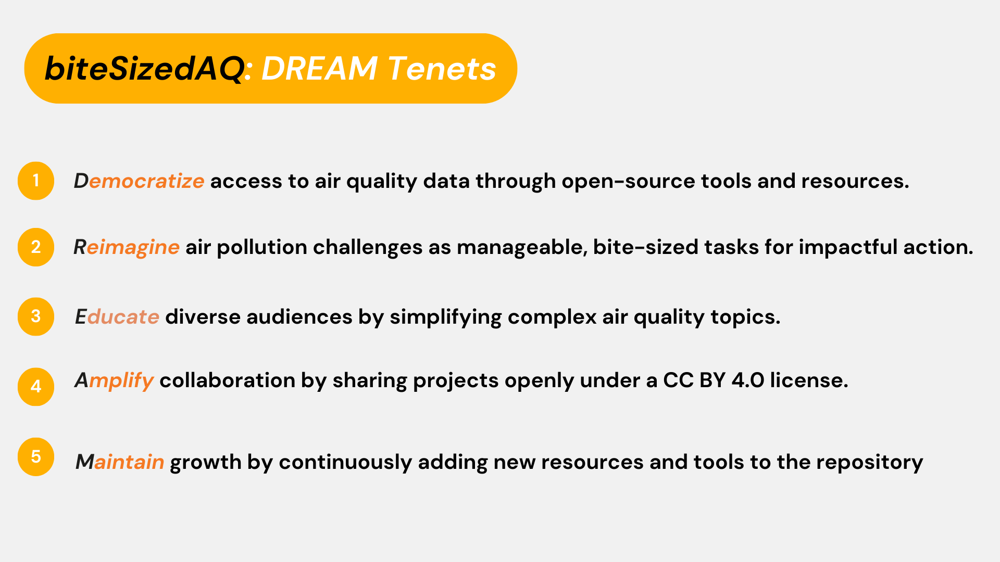

<!-- README.md is generated from README.Rmd. Please edit that file -->

```{r, include = FALSE}
knitr::opts_chunk$set(
  collapse = TRUE,
  comment = "#>",
  fig.path = "man/figures/README-",
  out.width = "100%"
)
```

# biteSizedAQ

<!-- badges: start -->

<!-- badges: end -->



## Background

Air pollution can feel like a giant, overwhelming issue, but the goal of this project is to make air quality (AQ) information accessible and understandable for everyone. The name 'biteSizedAQ' serves as a reminder that even the largest problems can be tackled with small, manageable steps. Instead of feeling overwhelmed, we can break down the air pollution challenge into smaller tasks, taking each one step at a time. By consistently taking these bite-sized, smart steps, we can collectively make significant progress in managing air pollution.

All projects under this repository are free and open, provided under the CC BY 4.0 International License. This ensures that anyone can use, share, and build upon the work, making air quality information more open and accessible for all.

This repository will continue to grow with new projects as and when I find time. To kick things off, check out the first few projects below!

## Dream Tenets



## General structure and how to navigate projects in this repo

-   The number prefix at the start of every project folder/Rmd name is the project id under this repo.

-   The latest project will show up top.

-   E.g. Project 1 has the id 1. It corresponds to a project folder named `1.ind.block.pm2.5.sat.data.processing` which contains the project's README file. In case of a project involving code and data an additional Rmd (with the same name as the project folder name) containing code can be found at the root of the biteSizedAQ repo.

-   The corresponding helper R script(s) for different projects can be found under `R/` subfolder. These scripts will be grouped in broad themes. E.g. all satellited derived data processing functions will be in the sat data helper script and the names are descriptive enough for it to be easily identifiable.\

------------------------------------------------------------------------

## Project 22: Block level Satellite derived population weighted Monthly PM2.5 dataset for India from 1998-2024

-   Read the blog post on [this link](https://github.com/AarshBatra/biteSizedAQ/tree/main/22.ind.block.pm2.5.sat.data.processing.1998.2024).

-   Download long and wide version of the processed monthly population weighted average pm2.5 India block level data from [this link](https://drive.google.com/drive/folders/12k87ckqgXW6A8B6OHNd9TtAmCndKLXE1?usp=sharing).

-   Data Dictionary for both long and wide version of the dataset can be found in 2 separated tabs of this [Google Sheet](https://docs.google.com/spreadsheets/d/1lOgxsfelqSX0SyIUICVwLmrHziW45pl5E8D6UQ5AYB8/edit?usp=sharing).

-   High resolution snapshots for all years, similar to the ones shown in the blog post can be found [in this folder of the repo](https://github.com/AarshBatra/biteSizedAQ/tree/main/22.ind.block.pm2.5.sat.data.processing.1998.2024/monthly.india.pm2.5.snapshot.all.yrs). Feel free to share this further for outreach or awareness purposes.

-   Data Processing pipeline Rmd file for this project can be found at the root of the biteSizedAQ repo. Here is a [quick link](https://github.com/AarshBatra/biteSizedAQ/blob/main/22.ind.block.mth.pm2.5.sat.data.processing.1998.2024.Rmd) to access the pipeline.

## Project 21: 💔 The Air is Burning Our Futures: Why Our Fight for Clean Air is Drowning in Silence

-   Read the full blog post here: [Link to Blog](https://github.com/AarshBatra/biteSizedAQ/tree/main/21.air.pol.comms.failing.rectification).
-   After reading the blog please visit and explore the [Community Solutions Repository (The Google Doc)](https://docs.google.com/document/d/1oe6AMwiSRmhZHvvU_88P34nT4EbBW6CCmzEjMEbZ028/edit?tab=t.0#heading=h.9agtkc3b30lh)**.**

## Project 20: The Often Overlooked Air Pollutant: Understanding Pollen and Its Impact

-   Read the full blog post here: [Link to Blog](https://github.com/AarshBatra/biteSizedAQ/tree/main/20.pollen.primer)

## Project 19: How to Unlock Earth’s Climate and Pollution Diary: From Million Year Old Sediment Cores to Modern Tree Rings

-   Read the full blog post here: [Link to Blog](https://github.com/AarshBatra/biteSizedAQ/tree/main/19.aq.hist.paleo.climatology)

## Project 18: biteSizedVisual #4: Air Quality Standards National Coverage for Criterial Pollutants Across the World

-   Read the full blog post here and read about the stories of all those who applied and also find about the winners of the give away: [Link to Blog](https://github.com/AarshBatra/biteSizedAQ/tree/main/18.bite.sized.vis.4.who.nat.aq.st.database.2025)

-   Link to raw WHO/Swiss TPH compiled national air quality standards database: [Link](https://github.com/AarshBatra/biteSizedAQ/blob/main/18.bite.sized.vis.4.who.nat.aq.st.database.2025/raw.data.csv). Source: [Link](https://www.who.int/tools/air-quality-standards).

-   Data Processing and Visualization pipeline Rmd file for this project is present at the root of the biteSizedAQ repo. Here is a [quick link](https://github.com/AarshBatra/biteSizedAQ/blob/main/18.bite.sized.vis.4.who.nat.aq.st.database.2025.Rmd) to access the pipeline.

-   Link to high res final plot for sharing: [Link](https://github.com/AarshBatra/biteSizedAQ/blob/main/18.bite.sized.vis.4.who.nat.aq.st.database.2025/high_res_plot.png)

## Project 17: 🎉 biteSizedAQ x AirGradient Monitors Giveaway Results!

-   Read the full blog post here and read about the stories of all those who applied and also find about the winners of the give away: [Link to Blog](https://github.com/AarshBatra/biteSizedAQ/tree/main/17.bite.sized.aq.monitor.give.away.results)

-   Thank you everyone who applied!

## Project 16: 🎉 biteSizedAQ Turns One! Celebrating with AirGradient Monitors Giveaway + New Logo Reveal

-   Read the full blog post here and checkout biteSizedAQ's new logo: [Link to Blog](https://github.com/AarshBatra/biteSizedAQ/tree/main/16.bite.sized.aq.turns.one.year.old)

-   Fill in the Survey for a chance to win an outdoor AirGradient AQ monitor: [Link to Survey](https://forms.gle/PMf3dH2iwoq7ebrBA)

    -   ***Deadline:*** June 22 (Sunday), 11:59 pm IST (Indian Standard Time, GMT+5:30)

    -   Winners will be announced soon after the deadline

## Project 15: Block level Satellite derived population weighted Monthly PM2.5 dataset for India from 1998-2023

-   Read the blog post on [this link](https://github.com/AarshBatra/biteSizedAQ/tree/main/15.ind.block.mth.pm2.5.sat.data.processing.1998.2023).

-   Download processed data from [this link](https://drive.google.com/drive/folders/1OPraUtyrL-WOhdfa_972D3l3RUFtalgy?usp=drive_link).

-   Data Dictionary for both long and wide version of the dataset can be found in 2 separated tabs of [this Google Sheet](https://docs.google.com/spreadsheets/d/1YyGe_gtmKB-FyWhD7XKY7cDpFcS23lcVWnQpbca2jr0/edit?gid=912722240#gid=912722240).

-   High resolution snapshots for all years, similar to the ones shown in the blog post can be found in [this folder of the repo](https://github.com/AarshBatra/biteSizedAQ/tree/main/15.ind.block.mth.pm2.5.sat.data.processing.1998.2023/monthly.india.pm2.5.snapshot.all.yrs). Feel free to share this further for outreach or awareness purposes.

-   Data Processing pipeline Rmd file for this project: Also, present at the root of the biteSizedAQ repo. Here is a [quick link](https://github.com/AarshBatra/biteSizedAQ/blob/main/15.ind.block.mth.pm2.5.sat.data.processing.1998.2023.Rmd) to access the pipeline.

## Project 14: Local Government Unit level Satellite derived population weighted PM2.5 dataset for Nepal from 1998-2023

-   Read the blog post on [this link](https://github.com/AarshBatra/biteSizedAQ/tree/main/14.nep.lgu.pm2.5.sat.data.processing.1998.2023).

-   Download processed data [from this link](https://drive.google.com/drive/folders/1zD2V5aGkY-YyRZMlVcPPNQMMMX7Ml2po?usp=drive_link).

-   Data Processing pipeline Rmd file for this project: Also, present at the root of the biteSizedAQ repo. Here is a [quick link](https://github.com/AarshBatra/biteSizedAQ/blob/main/14.nep.lgu.pm2.5.sat.data.processing.1998.2023.Rmd) to access the pipeline.

## Project 13: Block level satellite derived population weighted PM2.5 dataset for India from 1998-2023

-   Read the blog post on [this link](https://github.com/AarshBatra/biteSizedAQ/tree/main/13.ind.block.pm2.5.sat.data.processing.1998.2023).

-   Download processed data from [this link](https://drive.google.com/file/d/1F2fQZwvqDuQGWUDR7CbISQVN4GvPgzMW/view?usp=drive_link).

-   Data Processing pipeline Rmd file for this project: Also, present at the root of the biteSizedAQ repo. Here is a [quick link](https://github.com/AarshBatra/biteSizedAQ/blob/main/13.ind.block.pm2.5.sat.data.processing.1998.2023.Rmd) to access the pipeline.

## Project 12: Super Pollutants: The Deadly Link Between Air Pollution and Climate Change

-   Read the blog [here](https://github.com/AarshBatra/biteSizedAQ/tree/main/12.super.pollutants).

-   Rmd for the blog can be found in the project's respective folder number. Here is a [quick link](https://github.com/AarshBatra/biteSizedAQ/blob/main/12.super.pollutants/README.Rmd) to access it.

## Project 11: Different Approaches, Consistent Findings: How Researchers Measure Air Pollution’s Toll on Life

-   Read the blog [here](https://github.com/AarshBatra/biteSizedAQ/tree/main/11.air.pol.life.exp.calc.apte.other.methods).

-   Rmd for the blog can be found in the project's respective folder number. Here is a [quick link](https://github.com/AarshBatra/biteSizedAQ/blob/main/11.air.pol.life.exp.calc.apte.other.methods/README.Rmd) to access it.

## Project 10: biteSizedVisual #3 - Air Quality Data Deficit: 45% of Nations Either Don’t Monitor or Monitor but Don't Share Any Data

-   See the Visual and blog [here](https://github.com/AarshBatra/biteSizedAQ/tree/main/10.bite.sized.vis.3.openaq.gl.2024.report.summary).

-   Underlying README Rmd file with R code used to generate the visual can be found [here](https://github.com/AarshBatra/biteSizedAQ/blob/main/10.bite.sized.vis.3.openaq.gl.2024.report.summary.Rmd).

-   Rmd for the blog can be found in the project's respective folder number. Here is a [quick link](https://github.com/AarshBatra/biteSizedAQ/blob/main/10.bite.sized.vis.3.openaq.gl.2024.report.summary/README.Rmd) to access it.

-   Final processed data used to generate the visual: [Link](https://github.com/AarshBatra/biteSizedAQ/blob/main/10.bite.sized.vis.3.openaq.gl.2024.report.summary/final.plot.data.csv). This is the same as the 2024 [Open AQ Global Landscape Report Worksheet](https://docs.google.com/spreadsheets/d/1SVd5ODK2cCEmV0eIS7gn6gmWMvUufxIOfaCOX8Ukb2w/edit?gid=0#gid=0) with countries and their tags, with an added data_sharing_status column for plotting purposes.

-   Data Dictionary: [Link](https://github.com/AarshBatra/biteSizedAQ/blob/main/10.bite.sized.vis.3.openaq.gl.2024.report.summary/data_dictionary.txt)

-   High resolution PNG file for the Visual for quick sharing: [Link](https://github.com/AarshBatra/biteSizedAQ/blob/main/10.bite.sized.vis.3.openaq.gl.2024.report.summary/final.plt.png)

## Project 9: biteSizedVisual #2 - **India’s PM2.5 Pollution: A 25 year Story of Crisis and Contrast**

-   See the Visual and blog [here](https://github.com/AarshBatra/biteSizedAQ/tree/main/9.bite.sized.vis.2.ind.st.pol.time.series).

-   Underlying README Rmd file with R code used to generate the visual can be found [here](https://github.com/AarshBatra/biteSizedAQ/blob/main/9.bite.sized.vis.2.ind.st.pol.time.series.Rmd).

-   Rmd for the blog can be found in the project's respective folder number. Here is a [quick link](https://github.com/AarshBatra/biteSizedAQ/blob/main/9.bite.sized.vis.2.ind.st.pol.time.series/README.Rmd) to access it.

-   Final processed data used to generate the visual: [Link](https://github.com/AarshBatra/biteSizedAQ/blob/main/9.bite.sized.vis.2.ind.st.pol.time.series/ind_st_lev_pol_1998_2020_final.csv)

-   Data Dictionary: [Link](https://github.com/AarshBatra/biteSizedAQ/blob/main/9.bite.sized.vis.2.ind.st.pol.time.series/data.dictionary.txt)

-   High resolution PNG file for the Visual for quick sharing: [Link](https://github.com/AarshBatra/biteSizedAQ/blob/main/9.bite.sized.vis.2.ind.st.pol.time.series/final.plt.png)

## Project 8: biteSizedAQ is excited to present a virtual poster at the American Geophysical Union (AGU) 2024 Meeting!

-   Read all details about the presentation, how to attend and more [here](https://github.com/AarshBatra/biteSizedAQ/tree/main/8.bite.sized.aq.agu.2024).

-   View the Interactive Poster in AGU 2024 i poster gallery [here](https://agu24.ipostersessions.com/?s=44-C2-EF-00-5E-C4-D9-49-C9-F1-E2-DD-3B-B0-99-E9).

## Project 7: Introducing biteSizedVisuals Series: Tackling Air Pollution One Plot at a Time!

### biteSizedVisual #1: When the Air Chokes: Can India Break Free from Pollution’s Grip?

-   See the Visual and blog [here](https://github.com/AarshBatra/biteSizedAQ/tree/main/7.bite.sized.vis.1.ind_bl_pol_dist).

-   Underlying README Rmd file with R code used to generate the visual can be found [here](https://github.com/AarshBatra/biteSizedAQ/blob/main/7.bite.sized.vis.1.ind_bl_pol_dist.Rmd).

-   Rmd for the blog can be found in the project's respective folder number. Here is a [quick link](https://github.com/AarshBatra/biteSizedAQ/blob/main/7.bite.sized.vis.1.ind_bl_pol_dist/README.Rmd) to access it.

-   Final processed data used to generate the visual: [Link](https://github.com/AarshBatra/biteSizedAQ/blob/main/7.bite.sized.vis.1.ind_bl_pol_dist/final_data.csv)

-   Data Dictionary: [Link](https://github.com/AarshBatra/biteSizedAQ/blob/main/7.bite.sized.vis.1.ind_bl_pol_dist/data.dictionary.txt)

-   PNG file for the Visual for quick sharing: [Link](https://github.com/AarshBatra/biteSizedAQ/blob/main/7.bite.sized.vis.1.ind_bl_pol_dist/final.plot.png)

## Project 6: Computing with Conscience: Evolving from Carbon Aware to Grid Aware for Truly Sustainable Computing

-   Read the blog [here](https://github.com/AarshBatra/biteSizedAQ/tree/main/6.carbon.aware.computing).

-   Underlying README Rmd file can be found in the project's respective folder number and here is a [quick link](https://github.com/AarshBatra/biteSizedAQ/blob/main/6.carbon.aware.computing/README.Rmd) to access it.

## Project 5: Facing Two Fronts: The Intersection of Air Pollution and Climate Change

-   Read the blog [here.](https://github.com/AarshBatra/biteSizedAQ/tree/main/5.aq.climate.change)

-   Underlying README Rmd file can be found in the project's respective folder number and here is a [quick link to access it.](https://github.com/AarshBatra/biteSizedAQ/blob/main/5.aq.climate.change/README.Rmd)

## Project 4: Monitoring Air Quality: The Power of Satellite Based Remote Sensing

-   Read the blog [here.](https://github.com/AarshBatra/biteSizedAQ/tree/main/4.aq.remote.sensing)

-   Underlying README Rmd file can be found in the project's respective folder number and here is a [quick link to access it.](https://github.com/AarshBatra/biteSizedAQ/blob/main/4.aq.remote.sensing/README.Rmd)

## Project 3: Air Quality Data Management Systems Landscape: Navigating Challenges and Opportunities

-   Read the blog [here.](https://github.com/AarshBatra/biteSizedAQ/tree/main/3.aq.dms)

-   Underlying README Rmd file can be found in the project's respective folder number and here is a [quick link to access it.](https://github.com/AarshBatra/biteSizedAQ/blob/main/3.aq.dms/README.Rmd)

## Project 2: Deciphering Air Pollution Units: Essential Insights for Informed Action

-   Read the blog [here.](https://github.com/AarshBatra/biteSizedAQ/tree/main/2.air.pol.units.explainer)

-   Underlying README Rmd file can be found in the project's respective folder number and here is a [quick link to access it.](https://github.com/AarshBatra/biteSizedAQ/blob/main/2.air.pol.units.explainer/README.Rmd)

## Project 1: Block level satellite derived population weighted air pollution dataset for India from 1998-2022

-   Read more about this project and download processed data from [here](https://github.com/AarshBatra/biteSizedAQ/tree/main/1.ind.block.pm2.5.sat.data.processing). This folder is present at the root of the repo.

-   Data Processing pipeline Rmd file for this project: Also, present at the root of the biteSizedAQ repo. Here is a [quick link to access the pipeline.](https://github.com/AarshBatra/biteSizedAQ/blob/main/1.ind.block.pm2.5.sat.data.processing.Rmd)
